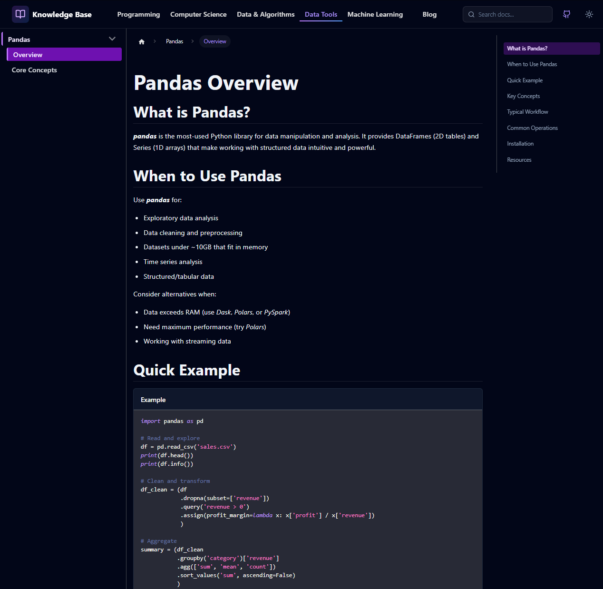

# Knowledge Base

This is my personal documentation site where I keep track of everything I'm learning about computer
science, programming, and software development. I built it because I needed a centralized place to
organize my notes, code examples, and technical explanations that I can reference anytime.

## Why I Made This

I wanted something that was:

- Easy to navigate and search through
- Well-organized with a clear structure
- Accessible from anywhere
- Nice to look at and pleasant to use

I chose Docusaurus because it handles documentation really well, supports both Markdown and React
components, and has great search functionality out of the box.

## Screenshots

| Home page                                    | Example page with documentation              |
|----------------------------------------------|----------------------------------------------|
|  |  |

## Getting Started

If you want to run this locally or use it as a template for your own knowledge base, here's what you
need to do.

### Requirements

You'll need Node.js installed on your machine. I'm using version 20 or higher, but anything recent
should work fine. You'll also need Yarn for package management.

If you don't have Yarn installed, you can get it with:

```bash
npm install -g yarn
```

### Installation

First, clone this repository to your local machine:

```bash
git clone https://github.com/AndriiSonsiadlo/knowledge-base.git
cd knowledge-base
```

Then install all the dependencies:

```bash
yarn install
```

### Running the Development Server

Once everything is installed, start the local development server:

```bash
yarn start
```

This will open your browser automatically at <http://localhost:3000>. The nice thing about the
development server is that most changes you make will show up immediately without needing to restart
anything.

### Building for Production

If you want to create a production-ready build:

```bash
yarn build
```

This generates static files in the `build` directory. You can then serve these files using any
static hosting service.

## How It's Organized

The documentation lives in the `docs` folder, organized into main categories. Each category has its
own folder with subcategories inside. For example:

- `docs/programming/` contains Python and C++ content
- `docs/computer-science/` covers OS, architecture, and memory management
- `docs/data-structures-algorithms/` has sorting and searching algorithms
- `docs/data-tools/` focuses on tools like Pandas
- `docs/machine-learning/` contains ML fundamentals and neural networks

The navigation is defined in `sidebars.ts`, which controls how everything appears in the sidebar
menu.

## Customization

The site uses a custom theme that I've tweaked to my preferences. The main styling is in
`src/css/custom.css`, and I've customized several components in the `src/theme` directory to get the
look and feel I wanted.

If you're using this as a starting point for your own knowledge base, you'll probably want to:

1. Update the site configuration in `docusaurus.config.ts` with your own information
2. Modify the homepage content in `src/pages/index.tsx`
3. Replace the documentation in the `docs` folder with your own content
4. Adjust the color scheme and styling in `src/css/custom.css` if you want

## Adding New Content

To add new documentation:

1. Create a new Markdown file in the appropriate folder under `docs/`
2. Add frontmatter at the top if needed (like tags or sidebar position)
3. Write your content using standard Markdown
4. Update `sidebars.ts` if you want it to appear in the navigation

The search functionality will automatically index your new content.

## Technology Stack

This site is built with:

- `Docusaurus` - fhe static site generator that powers everything
- `React` - for custom components
- `TypeScript` - for type safety in custom code
- `Tailwind CSS` - for styling
- `Lucide React` - for icons

I picked these tools because they work well together and make it easy to create and maintain
documentation.

## Notes

A few things to keep in mind:

- Not everything in here is complete or polished. Some sections are just placeholders that I'll fill
  in as I get to them.
- The explanations are written in a way that makes sense to me, so they might not match textbook
  definitions exactly.
- I update this regularly, so things might change or get reorganized as I learn better ways to
  structure the information.
- If you find any mistakes or have suggestions, feel free to open an issue or pull request.

## License

This project is licensed under the MIT License - see the [LICENSE](./LICENSE) file for details.
