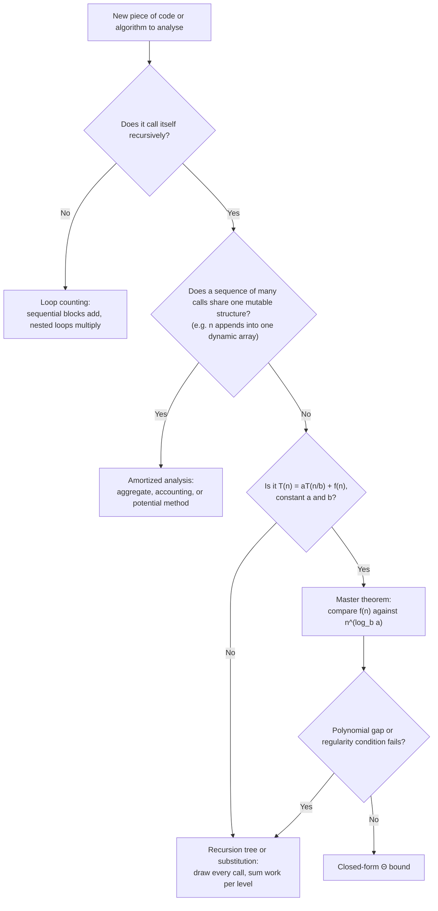

# Complexity Cheat Sheet

This page is a reference, not a tutorial — each numbered page in this section explains the reasoning
behind the table it summarises here.

## Growth-rate table

| Class | Name | Typical source |
|---|---|---|
| O(1) | Constant | Direct addressing, a fixed amount of work |
| O(log n) | Logarithmic | Halving the search space each step |
| O(n) | Linear | One pass over the input |
| O(n log n) | Linearithmic | Divide-and-conquer with a linear combine step |
| O(n²) | Quadratic | Every pair; nested passes |
| O(n³) | Cubic | Every triple |
| O(2ⁿ) | Exponential | Every subset |
| O(n!) | Factorial | Every ordering |

## "n = 10⁶ takes…" — at roughly 10⁸–10⁹ simple operations per second

| Complexity | Operations at n = 10⁶ | Roughly |
|---|---|---|
| O(log n) | ~20 | Instant |
| O(n) | 10⁶ | Under a millisecond to a few milliseconds |
| O(n log n) | ~2×10⁷ | Milliseconds |
| O(n²) | 10¹² | Minutes to tens of minutes |
| O(n³) | 10¹⁸ | Decades — not viable at this n |
| O(2ⁿ) | astronomically larger than atoms in the observable universe | Never |

The same table read the other way, "how large an n is affordable":

| Complexity | Comfortable n |
|---|---|
| O(n!) | ≤ 10 |
| O(2ⁿ) | ≤ 25 |
| O(n³) | ≤ 500 |
| O(n²) | ≤ 10,000 |
| O(n log n) | ≤ 10,000,000 |
| O(n) | limited by memory bandwidth, not CPU |

## Choosing an analysis method

Loop counting handles the common case directly. Recursive code that shares one structure across many
calls — not one recursive tree per call, but state that persists between top-level calls — is an
amortized-analysis question, not a recursion-tree one. Recursive code with the exact divide-and-conquer
shape gets the master theorem's O(1) shortcut; anything the theorem's conditions do not cover falls back
to a recursion tree, drawn by hand, or full substitution with induction.

## References

- Cormen, Leiserson, Rivest & Stein, *Introduction to Algorithms*, 4th ed. — Ch. 3 (asymptotics),
  Ch. 4 (divide-and-conquer and the master theorem), Ch. 17 (amortized analysis), Ch. 34
  (NP-completeness): the chapters each row on this page's decision flow points back to.
- Sedgewick & Wayne, *Algorithms*, 4th ed., §1.4 — the empirical-plus-theoretical treatment this
  section's individual pages expand on one method at a time.

## Related Pages

- [Big-O Notation](./big-o-notation.md) — what O, Ω and Θ formally assert.
- [Common Complexities](./common-complexities.md) — the growth classes above, with the problem shapes
  that produce each explained in full.
- [Amortized Analysis](./amortized-analysis.md) — the aggregate, accounting and potential methods this
  page's decision flow points to.
- [Recurrences & the Master Theorem](./recurrences-and-master-theorem.md) — the three cases and their
  exact conditions, worked on mergesort and Karatsuba.
- [Space Complexity](./space-complexity.md) — auxiliary space and the recursion-stack cost this page's
  table does not cover.
- [P, NP & Intractability](./p-np-and-intractability.md) — what to do once loop counting or a
  recurrence points to an exponential bound.

<Recall
  invariant="The four analysis methods in this section apply to different shapes of problem — loop counting for straight-line and nested loops, recursion trees and the master theorem for divide-and-conquer, amortized analysis for a sequence of operations on a shared structure."
  costs={[
    ["straight-line loop over n (worst)", "O(n) per nesting level"],
    ["halving/doubling each step (worst)", "O(log n)"],
    ["divide-and-conquer, balanced (worst)", "master theorem — see recurrences page"],
    ["sequence of n ops on a shared structure (amortized)", "amortized analysis — see amortized-analysis page"],
    ["problem confirmed NP-hard (best known, worst)", "exponential — see the P vs NP page"],
  ]}
  reachFor="A quick lookup while sizing up a new problem or reviewing someone else's complexity claim, rather than a first read."
  trap="Reaching for the master theorem on a recurrence with non-constant coefficients or unequal subproblem sizes — check the exact form before applying it, not after the answer looks wrong."
/>
