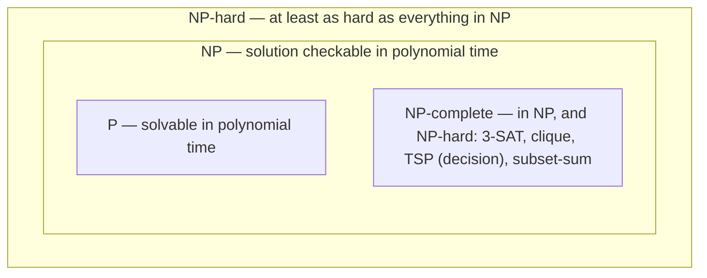

# P, NP & Intractability

<Recall
  invariant="P ⊆ NP is proven; whether P = NP is the open question — every NP-complete problem is simultaneously as easy as every other (all in P, or none are) because each reduces to any other in polynomial time."
  costs={[
    ["3-SAT, best known algorithm (worst)", "O(1.30ⁿ) — best known, not a proven lower bound"],
    ["clique / independent set, best known (worst)", "O(1.2ⁿ) roughly — best known"],
    ["travelling salesman, exact, best known (worst)", "O(n²·2ⁿ) (Held–Karp DP) — best known"],
    ["subset-sum, exact, best known (worst)", "O(2^(n/2)) (meet in the middle) — best known"],
    ["polynomial-time reduction, problem A to B", "O(poly(n)) transformation, run once"],
    ["2-SAT (in P, despite the name)", "O(n + m)"],
  ]}
  reachFor="Recognising that a problem you are about to brute-force is a known NP-hard problem in disguise, before spending engineering effort chasing a polynomial algorithm that (very likely) does not exist."
  trap="Treating 'NP' as meaning 'hard' — NP means efficiently *verifiable*, and P ⊆ NP, so every polynomial-time problem is also in NP; the interesting claim is NP-completeness, not membership in NP."
/>

Most complexity analysis on this site asks how fast a *known* algorithm runs. This page asks a
different question: whether a fast algorithm can exist at all. Some problems — sorting, shortest path,
matrix multiplication — have polynomial-time solutions and the only remaining question is which
polynomial. Others — Boolean satisfiability, the travelling salesman problem, graph colouring — have
resisted every attempt at a polynomial algorithm for over fifty years, across an enormous amount of
effort, and are believed (not proven) to have none.

**P** is the class of problems solvable in polynomial time. **NP** is the class of problems whose
*solutions* can be *verified* in polynomial time, whether or not they can be *found* that quickly — "NP"
stands for nondeterministic polynomial, not "not polynomial", and the distinction between finding and
checking is the entire content of the class. Every problem in P is trivially in NP, since being able to
solve something in polynomial time means being able to check a proposed solution just as fast: P ⊆ NP.
Whether that containment is strict — whether there exist problems that are easy to check but hard to
solve — is the P vs NP question, one of the seven Clay Millennium Prize problems and unresolved as of
2026.

**NP-hard** means "at least as hard as every problem in NP" — formally, every problem in NP reduces to
it in polynomial time — without requiring membership in NP itself. **NP-complete** is the intersection:
in NP *and* NP-hard. NP-complete problems are the hardest problems within NP, and they are all
equivalent in a precise sense: a polynomial algorithm for any one of them yields, via the chain of
reductions, a polynomial algorithm for every problem in NP, resolving P vs NP outright. That equivalence
is why proving a new problem NP-complete is useful even without solving it — it places the problem in a
well-understood equivalence class instead of leaving it unclassified.

## Core Concepts

| Term | Meaning |
|---|---|
| **P** | Solvable in polynomial time |
| **NP** | Solution *verifiable* in polynomial time (not necessarily findable that fast) |
| **NP-hard** | At least as hard as every problem in NP; may or may not itself be in NP |
| **NP-complete** | In NP, and NP-hard — the hardest problems that are still efficiently checkable |
| **Reduction** | A polynomial-time transformation from problem A's instances to problem B's, such that solving B solves A |
| **Decision vs optimisation** | "Is there a tour under length k?" (decision, in NP) vs "find the shortest tour" (optimisation, at least as hard) |

## Mechanism



The diagram simplifies one point for clarity: strictly, NP-hard is not a superset of NP — problems like
the halting problem are NP-hard but not in NP at all, since they are not even decidable, let alone
verifiable in polynomial time. NP-complete is what sits at the true overlap: in NP, and at least as hard
as everything else in NP.

### A reduction outlined: 3-SAT to Clique

A **reduction** from problem A to problem B is a polynomial-time procedure that turns any instance of A
into an instance of B such that the answer transfers unchanged — "yes for A" if and only if "yes for B".
Showing 3-SAT reduces to Clique is the standard textbook demonstration that Clique is at least as hard
as 3-SAT, which is itself known NP-complete (via Cook–Levin).

Cook–Levin is the anchor every other NP-completeness proof stands on: it shows *directly*, from the
definition of a nondeterministic Turing machine, that Boolean satisfiability (general CNF-SAT, and by a
further reduction 3-SAT) is NP-complete — the computation of any nondeterministic polynomial-time machine
on any input can be encoded as a Boolean formula whose satisfying assignments correspond exactly to
accepting computations, which supplies the NP-hardness half of the proof; membership in NP is the easy
half, since a proposed assignment is checked in polynomial time by substitution. Every other
NP-completeness result in the standard catalogue, including this page's 3-SAT-to-Clique argument, is a
reduction *from* 3-SAT rather than a repeat of that machine-encoding argument, which is why the technique
is called out as the base case for the entire method: prove one problem NP-complete from first
principles, then reduce everything else to it or from it.

Given a 3-CNF formula with `k` clauses, build a graph with one group of up to 3 nodes per clause — one
node per literal in that clause — and connect two nodes with an edge exactly when they come from
*different* clauses and are not negations of each other. The formula is satisfiable if and only if this
graph has a clique of size `k`: one node per clause (a literal set true in that clause), pairwise
connected because no two chosen literals contradict each other.

Trace it on two clauses, `C1 = (x1 ∨ x2 ∨ ¬x3)` and `C2 = (¬x1 ∨ ¬x2 ∨ x3)`:

```text
gadget nodes:
  group C1:  [x1]  [x2]  [¬x3]
  group C2:  [¬x1] [¬x2] [x3]

edges (cross-group, skip complementary pairs):
  x1 — ¬x2   (not complementary: edge)
  x1 — x3    (not complementary: edge)
  x2 — ¬x1   (not complementary: edge)
  x2 — x3    (not complementary: edge)
  ¬x3 — ¬x1  (not complementary: edge)
  ¬x3 — ¬x2  (not complementary: edge)
  x1 — ¬x1   SKIPPED — complementary literals, no edge
  x2 — ¬x2   SKIPPED — complementary literals, no edge
  ¬x3 — x3   SKIPPED — complementary literals, no edge

looking for a clique of size k = 2 (one node per clause group):
  pick x1 (from C1) and x3 (from C2) — edge exists, size-2 clique found

reading the assignment back off the clique:
  x1 = True, x3 = True  (x2 unconstrained by the clique, set True)
  check C1 = x1 ∨ x2 ∨ ¬x3 = True ∨ True ∨ False = True
  check C2 = ¬x1 ∨ ¬x2 ∨ x3 = False ∨ False ∨ True = True
  both clauses satisfied — the clique corresponds to a satisfying assignment
```

No edge ever exists *within* a group, because two literals from the same clause could both be false
simultaneously in some assignment and a clique would wrongly certify satisfaction from one clause alone;
excluding complementary pairs across groups is what prevents a clique from picking both a variable and
its negation as true. This construction runs in polynomial time in the size of the formula, which is
exactly the definition of a valid reduction — and because 3-SAT is already known NP-complete, this shows
Clique is NP-hard too (and, since a clique is easy to verify given the graph, NP-complete).

## Practical Usage

Recognising an intractable problem in the wild is mostly pattern-matching against a short list: exact
graph colouring, the travelling salesman problem, subset-sum / knapsack (in their decision forms),
Boolean satisfiability, and clique or independent-set search all show up disguised as scheduling,
routing, resource-allocation, or bin-packing problems. If a problem's shape is "choose a subset /
ordering / assignment satisfying many pairwise constraints, and there is no obvious way to build up a
solution from smaller pieces without trying combinations," it is worth spending ten minutes checking
whether it is a known NP-hard problem before spending a week trying to find a polynomial algorithm for
it.

What to do once a problem is confirmed intractable:

- **Approximation algorithms.** Accept a solution provably within some factor of optimal — a 2-approximation
  for vertex cover runs in polynomial time and never returns a cover more than twice the minimum size.
- **Heuristics.** Simulated annealing, genetic algorithms, and local search give no guarantee but
  perform well in practice on typical instances, which is often all that is needed.
- **Parameterised tractability.** Some NP-hard problems are polynomial once a specific parameter is
  bounded — vertex cover is solvable in O(2^k · n) where `k` is the cover size, fast whenever `k` is
  small even if `n` is large. This is fixed-parameter tractability.
- **Exponential-but-small-n.** When the instance itself is small (n ≤ 20–30), an exponential algorithm
  such as Held–Karp's O(n²·2ⁿ) dynamic program for TSP is entirely practical, and simpler to trust than
  a heuristic with no correctness guarantee.

## Edge Cases & Pitfalls

- **"NP" read as "not polynomial."** NP problems can absolutely be in P — every P problem is in NP.
  The interesting distinction is NP-*complete*, not membership in NP by itself.
- **Confusing NP-hard with NP-complete.** NP-hard alone says nothing about verifiability — the
  optimisation version of TSP ("find the shortest tour") is NP-hard but not in NP, because there is no
  polynomial-time way to *verify* a tour is the shortest without effectively re-solving the problem; only
  its decision version ("is there a tour under length k?") is NP-complete.
- **Assuming a small tweak keeps a problem NP-hard.** 2-SAT is solvable in linear time despite looking
  like a trivial restriction of 3-SAT; the jump from 2 to 3 literals per clause is the entire source of
  hardness, not an incidental detail.
- **Treating "best known" running times as proven lower bounds.** Every complexity figure in this
  page's Recall card is the best *known* algorithm, not a proven floor — nobody has proven no
  polynomial algorithm for 3-SAT exists, only that none has been found despite decades of effort.

## Comparisons

| | In P | NP-complete | NP-hard, not in NP |
|---|---|---|---|
| Solvable in poly time (known) | Yes | No (believed) | No |
| Verifiable in poly time | Yes | Yes | Not necessarily |
| Example | Shortest path, sorting | 3-SAT, Clique, subset-sum (decision) | TSP (optimisation form), halting problem |
| What a polynomial algorithm would prove | Nothing new | P = NP | Nothing about P vs NP alone |

## References

- Cormen, Leiserson, Rivest & Stein, *Introduction to Algorithms*, 4th ed., Ch. 34 — "NP-Completeness",
  including the Cook–Levin theorem and the 3-SAT-to-Clique reduction worked through here.
- Sedgewick & Wayne, *Algorithms*, 4th ed., Ch. 6 "Context" — the closing chapter's discussion of
  intractability, a practitioner-oriented introduction to recognising NP-hard problems.
- Garey, M. R. & Johnson, D. S., *Computers and Intractability* (1979) — the classic reference catalogue
  of NP-complete problems, still the standard "is my problem on this list" lookup.
- Clay Mathematics Institute, "P vs NP Problem" — the official Millennium Prize problem statement,
  confirming the question remains open.

## Related Pages

- [Common Complexities](./common-complexities.md) — where O(2ⁿ) and O(n!) sit among the growth classes
  intractable problems fall into.
- [Recurrences & the Master Theorem](./recurrences-and-master-theorem.md) — for bounding the algorithms
  used *within* an exponential-but-small-n or fixed-parameter approach.
- [Graph Algorithms](../graph-algorithms/intro.md) — vertex cover, clique and colouring as graph
  problems, several of which this page's reduction touches directly.
- [Cheat Sheet](./cheat-sheet.md) — where recognising intractability fits among the section's other
  analysis methods.
