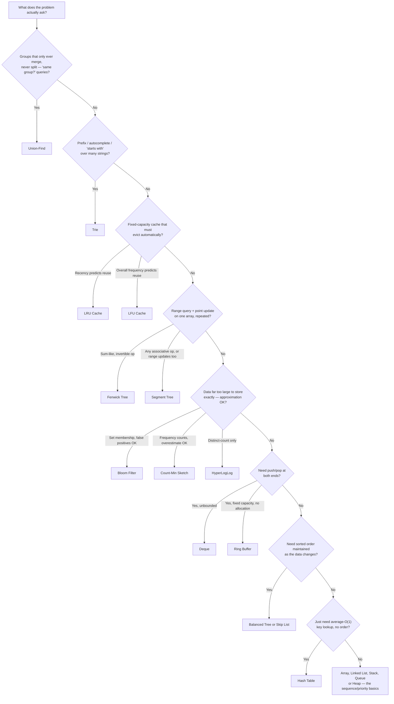

# Data Structures Cheat Sheet

This page is a reference, not a tutorial — each page in this section explains the reasoning behind the
row it gets here. Every complexity below names its case (best / average / amortized / worst); the full
argument for each lives on that structure's own page.

## Operation-cost matrix

| Structure | Search / access | Insert | Delete | Memory overhead |
|---|---|---|---|---|
| [Static array](./arrays.md) | $O(1)$ index (worst) | $O(n)$ worst — shift | $O(n)$ worst — shift | None beyond the elements |
| [Dynamic array](./arrays.md) | $O(1)$ index (worst) | $O(1)$ amortized at the back; $O(n)$ worst elsewhere | $O(n)$ worst | Unused capacity past current size |
| [Singly linked list](./linked-lists.md) | $O(n)$ worst | $O(1)$ worst given the node/position | $O(1)$ worst given the previous node | One `next` pointer per node |
| [Doubly linked list](./linked-lists.md) | $O(n)$ worst | $O(1)$ worst given the node | $O(1)$ worst given the node | Two pointers per node |
| [Stack](./stacks-and-queues.md) (array-backed) | $O(n)$ worst — not built for search | $O(1)$ amortized push | $O(1)$ worst pop | Same as its backing array |
| [Queue](./stacks-and-queues.md) (ring-buffer-backed) | $O(n)$ worst | $O(1)$ worst enqueue | $O(1)$ worst dequeue | Fixed array, no per-slot overhead |
| [Hash table](./hash-tables.md) | $O(1)$ average, $O(n)$ worst | $O(1)$ amortized average | $O(1)$ average | Load-factor slack: unused slots below the resize threshold |
| [BST](./trees.md) (unbalanced) | $O(\log n)$ average, $O(n)$ worst | $O(\log n)$ average, $O(n)$ worst | $O(\log n)$ average, $O(n)$ worst | Two child pointers per node |
| [Balanced tree](./balanced-trees.md) (AVL / red-black) | $O(\log n)$ worst, guaranteed | $O(\log n)$ worst | $O(\log n)$ worst | Two child pointers plus balance metadata (height or colour) per node |
| [Binary heap](./heaps.md) | $O(1)$ peek extreme (worst); $O(n)$ worst for an arbitrary value | $O(\log n)$ worst | $O(\log n)$ worst extract | Contiguous array, no per-node overhead |
| [Graph, adjacency list](./graphs.md) | $O(\deg(u))$ worst — "is there an edge u→v?" | $O(1)$ worst — add edge | $O(\deg(u))$ worst — remove edge | $O(V + E)$ total |
| [Union-Find](./union-find.md) | $O(\alpha(n))$ amortized — "same set?" | n/a (merge only) | Not supported | One or two `int` arrays |
| [Trie](./tries.md) | $O(L)$ average, $L$ = key length | $O(L)$ average | $O(L)$ average, with ancestor pruning | Per-node overhead × branching factor (array) or × children present (hash map) |
| [Segment tree](./segment-trees-and-fenwick.md) | $O(\log n)$ worst — range query | $O(\log n)$ worst — point update | n/a — fixed size | $\approx 4n$ node slots as commonly implemented |
| [Fenwick tree](./segment-trees-and-fenwick.md) | $O(\log n)$ worst — prefix query | $O(\log n)$ worst — point update | n/a — fixed size | Exactly one array of $n + 1$ ints |
| [Deque](./deques-and-ring-buffers.md), block-based | $O(1)$ at either end; $O(n)$ middle (`collections.deque`) or $O(1)$ middle (`std::deque`) | $O(1)$ amortized at either end | $O(1)$ amortized at either end | One block-pointer directory, plus partially-full end blocks |
| [Ring buffer](./deques-and-ring-buffers.md) | $O(1)$ index | $O(1)$ worst push | $O(1)$ worst pop | None beyond the fixed array |
| [Bloom filter](./probabilistic-structures.md) | $O(k)$ query — "possibly present" only | $O(k)$ insert | Not supported (plain form) | $m$ bits, fixed regardless of how full |
| [Count-min sketch](./probabilistic-structures.md) | $O(d)$ estimate — overestimate only | $O(d)$ add | Not supported | $d \times w$ counters, fixed |
| [HyperLogLog](./probabilistic-structures.md) | $O(1)$ amortized estimate, ~2% error | $O(1)$ amortized add | Not supported | A few KB, independent of cardinality |
| [Skip list](./probabilistic-structures.md) | $O(\log n)$ expected | $O(\log n)$ expected | $O(\log n)$ expected | ~2 pointers/node expected (geometric level distribution) |
| [LRU cache](./lru-and-lfu-caches.md) | $O(1)$ worst — `get` | $O(1)$ worst — `put`, including eviction | $O(1)$ worst — eviction | Hash map + one doubly linked list |
| [LFU cache](./lru-and-lfu-caches.md) | $O(1)$ worst — `get` | $O(1)$ worst — `put`, including eviction | $O(1)$ worst — eviction | Hash map + frequency map + one doubly linked list per frequency |

## "My input looks like this → reach for…"

Two notes on reading this flow: it asks about the *query*, not the data's storage format, because the
same array of numbers is a job for a hash table, a segment tree, or a plain sorted array depending
entirely on which operation runs the most; and several branches are not mutually exclusive in a real
system — a production LRU cache in front of a database is itself often backed by a hash table for
lookup, so "reach for the LRU cache" is a decision about *policy*, not a replacement for the hash
table underneath it.

## Recall

<Recall
  invariant="Every structure in this folder buys a fast case for one specific operation by giving up something else — search time for insert time, exactness for memory, or generality for a narrower query. The matrix above is that trade, spelled out per row."
  costs={[
    ["hash table get/put (average)", "O(1)"],
    ["balanced tree search/insert/delete (worst)", "O(log n)"],
    ["union-find find/union with both optimisations (amortized)", "O(α(n))"],
    ["Bloom filter query (worst)", "O(k), never a false negative"],
    ["LRU/LFU cache get/put (worst)", "O(1)"],
  ]}
  reachFor="A quick lookup while choosing between structures for a new problem, or checking a claimed complexity, rather than a first read on any one structure."
  trap="Picking a structure by what the data 'is' (a sequence, a set of strings) rather than by which operation the workload actually repeats — the same strings are a job for a hash set, a trie, or a Bloom filter depending entirely on whether the real query is exact membership, prefix search, or membership at massive scale."
/>

## References

- Cormen, Leiserson, Rivest & Stein, *Introduction to Algorithms*, 4th ed. — Ch. 10 (elementary
  structures), Ch. 11 (hash tables), Ch. 12–14 (search trees), Ch. 19 (union-find), Ch. 21 (graph
  representations): the chapters this page's rows summarise.
- Sedgewick & Wayne, *Algorithms*, 4th ed., §3.5 "Applications" and §1.3 "Bags, Queues, and Stacks" —
  the symbol-table framing this cheat sheet's "what does the query need" framing follows.

## Related Pages

- [Data Structures — Overview](./intro.md) — the section's starting point, for the reasoning behind
  why this folder is organised the way it is.
- [Hash Tables](./hash-tables.md) — the single most common answer on the decision flow above, and the
  baseline every other row is compared against.
- [Complexity Cheat Sheet](../complexity/cheat-sheet.md) — the growth-rate table and "how large an n is
  affordable" reference this page's Big-O notation assumes.
- [Trees & Binary Search Trees](./trees.md) — the shared vocabulary (node, root, height) that segment
  trees, tries, and balanced trees all specialise differently.
