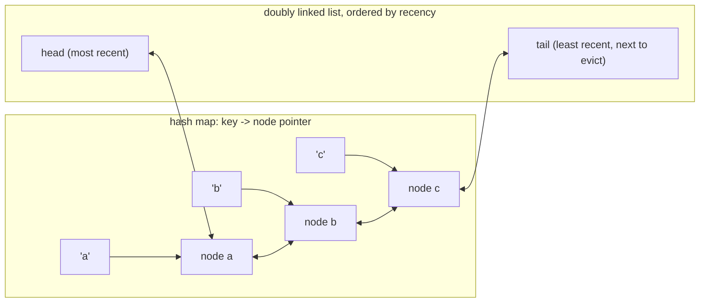

# LRU & LFU Caches

A cache with unlimited capacity is just a [hash table](./hash-tables.md). The interesting problem
starts the moment capacity is fixed: something has to be evicted on every insert past that limit, and
*which* something is evicted is a policy decision with real consequences — evict the wrong entry and
the next request for it is a cache miss that didn't have to happen. **Least Recently Used (LRU)** and
**Least Frequently Used (LFU)** are two different bets about which entries are least likely to be
needed again: LRU bets on *recency* (an entry not touched in a while probably won't be touched soon),
LFU bets on *frequency* (an entry rarely touched overall probably won't be touched soon, regardless of
how recently).

Both need every operation — get, put, evict — in $O(1)$, or the cache itself becomes the bottleneck it
was meant to remove. That requirement is what forces the specific structure: a hash map alone gives
$O(1)$ lookup but no way to find "the least recently used entry" without scanning everything, and a
plain ordered structure (a list sorted by recency) gives that ordering but not $O(1)$ lookup by key.
The fix, for both LRU and LFU, is to keep the hash map *and* an ordering structure, cross-linked so
that a `get` or `put` updates both in $O(1)$ — never one instead of the other.

## Core Concepts

| Term | Meaning |
|---|---|
| **Capacity** | The fixed maximum number of entries; the eighth `put` past it forces one eviction |
| **Hit / miss** | `get` finds the key (hit) or doesn't (miss) |
| **Eviction** | Removing an entry to make room, chosen by the policy (LRU: least recent; LFU: least frequent) |
| **Doubly linked list** | The ordering structure: $O(1)$ removal of an arbitrary node given a pointer to it |
| **Sentinel nodes** | Dummy head/tail nodes so every real node has both neighbours, removing edge-case branches |
| **Frequency bucket (LFU)** | A doubly linked list of all keys currently at frequency count $f$ |

## Mechanism

### The structure: a hash map into a doubly linked list



The hash map's value is not the cached data — it is a pointer straight to that key's node in the
linked list. `get(key)` looks the pointer up in $O(1)$, then unlinks and re-inserts that exact node at
the head in $O(1)$ (no traversal, because the pointer is already in hand). `put` past capacity reads
the tail's key in $O(1)$, removes it from both the map and the list, and inserts the new entry at the
head. Every step is a pointer operation on a node already located by the hash map — nothing here ever
scans the list.

### The O(1) argument, per operation

- **`get(key)` — O(1).** Hash map lookup is $O(1)$ average (amortized rehashing per the language's own
  hash-table guarantee). Once the node pointer is in hand, moving it to the head of a doubly linked
  list needs only its two neighbours' pointers rewritten — no traversal, because unlinking a node you
  already hold a pointer to never requires walking from the head to find it.
- **`put(key, value)` — O(1).** Same map lookup or insert, same $O(1)$ splice into a doubly linked
  list. Eviction (when at capacity) reads the tail neighbour's pointer directly — sentinel nodes (below)
  make this branch-free.
- **Eviction — O(1).** The tail sentinel's real neighbour *is* the least-recently-used node by
  construction — no search is needed to find what to evict, only to remove it.

The doubly linked list is load-bearing specifically because removal-given-a-node-pointer is $O(1)$ —
a *singly* linked list cannot delete a node in $O(1)$ without also holding a pointer to its
predecessor, which the hash map does not give.

### Sentinel nodes

Using real head/tail sentinel nodes (empty nodes that are never evicted and never returned) means every
real node always has two real neighbours to link against — no `if node is head` branch when removing
the current head, no `if node is tail` branch when appending. This is the same simplification
[linked lists](./linked-lists.md) get from a sentinel: fewer edge cases in the same code, not a
different algorithm.

Traced on a capacity-3 LRU cache, `put(1) put(2) put(3) get(1) put(4)`:

```text
capacity = 3, list ordered head (most recent) -> tail (least recent)

put(1):  list: [1]                       map: {1}
put(2):  list: [2, 1]                    map: {1, 2}
put(3):  list: [3, 2, 1]                 map: {1, 2, 3}   (at capacity)
get(1):  1 moves to head -> list: [1, 3, 2]   map unchanged, value returned
put(4):  at capacity (3 entries) -> evict tail (2, the least recently used)
         list: [4, 1, 3]                 map: {1, 3, 4}   (2 evicted)
```

`2` is evicted, not `1` or `3` — `get(1)` moved it to the head just before `put(4)`, so at the moment
of eviction `2` was the only entry untouched since `put(2)`.

<Tabs groupId="code-lang">
<TabItem value="python" label="Python">

```python showLineNumbers
class Node:
    __slots__ = ("key", "value", "prev", "next")

    def __init__(self, key=None, value=None):
        self.key, self.value, self.prev, self.next = key, value, None, None


class LRUCache:
    def __init__(self, capacity):
        self.capacity = capacity
        self.map = {}
        self.head, self.tail = Node(), Node()          # sentinels
        self.head.next, self.tail.prev = self.tail, self.head

    def _remove(self, node):
        node.prev.next, node.next.prev = node.next, node.prev

    def _add_front(self, node):
        node.next, node.prev = self.head.next, self.head
        self.head.next.prev = node
        self.head.next = node

    def get(self, key):
        if key not in self.map:
            return -1
        node = self.map[key]
        self._remove(node)
        self._add_front(node)                            # O(1): mark most recently used
        return node.value

    def put(self, key, value):
        if key in self.map:
            self._remove(self.map[key])
        elif len(self.map) >= self.capacity:
            lru = self.tail.prev                          # O(1): the real tail neighbour
            self._remove(lru)
            del self.map[lru.key]
        node = Node(key, value)
        self.map[key] = node
        self._add_front(node)
```

</TabItem>
<TabItem value="cpp" label="C++">

```cpp showLineNumbers
#include <list>
#include <unordered_map>

class LRUCache {
public:
    explicit LRUCache(int capacity) : capacity_(capacity) {}

    int get(int key) {
        auto it = map_.find(key);
        if (it == map_.end()) return -1;
        order_.splice(order_.begin(), order_, it->second);   // O(1): move node to front
        return it->second->second;
    }

    void put(int key, int value) {
        auto it = map_.find(key);
        if (it != map_.end()) {
            order_.splice(order_.begin(), order_, it->second);
            it->second->second = value;
            return;
        }
        if (static_cast<int>(map_.size()) >= capacity_) {
            auto lru = order_.back();                          // O(1): real tail entry
            map_.erase(lru.first);
            order_.pop_back();
        }
        order_.emplace_front(key, value);
        map_[key] = order_.begin();
    }

private:
    int capacity_;
    std::list<std::pair<int, int>> order_;                     // front = most recent
    std::unordered_map<int, std::list<std::pair<int, int>>::iterator> map_;
};
```

</TabItem>
</Tabs>

### LFU: frequency buckets instead of one ordered list

LFU needs two structures beyond the key→value map: a `key -> frequency` map, and a
`frequency -> doubly linked list of keys at that frequency` map, plus a tracked `min_frequency`.
`get(key)` bumps that key's frequency by 1, which means removing it from its current frequency's
bucket and appending it to the next frequency's bucket — both $O(1)$ list operations, since each
bucket is itself a doubly linked list. Eviction removes from the bucket at `min_frequency` (tracked
incrementally, never searched for), and ties within a bucket are broken by recency — new entries and
freshly bumped entries go to the back of their bucket, so the front is always both the least frequent
and, among those, the least recent.

## Practical Usage

```python showLineNumbers
cache = LRUCache(3)
cache.put(1, "a")
cache.put(2, "b")
cache.put(3, "c")
assert cache.get(1) == "a"           # 1 moves to the front
cache.put(4, "d")                    # evicts 2 — matches the traced sequence
assert 2 not in cache.map
assert set(cache.map.keys()) == {1, 3, 4}
assert cache.get(2) == -1            # confirmed gone
```

- **`functools.lru_cache`.** Python's standard-library memoization decorator is an LRU cache over a
  function's arguments (Python docs,
  [`functools.lru_cache`](https://docs.python.org/3/library/functools.html#functools.lru_cache)).
  Two details the docs call out directly matter in practice: `maxsize=None` "disables the LRU features
  and the cache can grow without bound" — it stops being an LRU cache at all and becomes a plain memo
  table — and the cache is safe for concurrent calls in the sense that a single call is atomic under
  the GIL, but the docs do not promise safety across separate cache *instances* accessed without
  synchronization from multiple threads sharing mutable arguments; treat a shared `lru_cache`-wrapped
  function as any other shared mutable state under threading, not as a lock-free primitive.
- **CDN and database buffer-pool eviction.** Real caches rarely use pure LRU or pure LFU — Redis's
  `maxmemory-policy allkeys-lru` approximates LRU with random sampling rather than an exact list, and
  PostgreSQL's buffer manager uses a clock-sweep approximation of LRU, because maintaining an *exact*
  doubly linked list under heavy concurrent access has more lock contention than an approximation
  most workloads cannot tell apart from the real thing.
- **`collections.OrderedDict`.** Before `dict` preserved insertion order (CPython 3.7+),
  `OrderedDict.move_to_end` and `popitem(last=False)` were the standard way to hand-roll an LRU cache
  in a few lines; `functools.lru_cache` has made this largely unnecessary for the common case.

## Edge Cases & Pitfalls

- **Updating a key's value without moving it to the front.** `put` on an already-present key must
  count as a "use" for recency purposes — skipping the move-to-front step on update means the entry
  never gets credit for being touched, and can be evicted despite being written moments ago.
  `get` on a missing key returning something other than a clear miss (like `-1` or raising, chosen
  consistently, not returning stale/default data) is the same class of bug.
- **Evicting before checking whether the key already exists.** `put` for a key already in the cache
  must not trigger eviction — it is an update, not a new entry taking the (n+1)-th slot. Checking
  membership before checking capacity is the fix.
- **Forgetting to remove the evicted key from the hash map.** Removing a node from the linked list
  without deleting the matching hash-map entry leaves a dangling pointer: the map still reports the
  evicted key as present, and following its pointer touches a node no longer linked into the ordering
  structure.
- **LFU frequency-bucket underflow on `min_frequency`.** If eviction removes the last key at
  `min_frequency`, that variable must be recomputed (usually just incremented by 1, since frequencies
  only ever increase by exactly 1 per `get`) — a stale `min_frequency` points at an empty bucket and
  the next eviction reads nothing.
- **`functools.lru_cache` on a method.** Decorating an instance method caches on `(self, *args)`, which
  keeps every decorated instance alive as long as the cache holds a reference to it — a well-known
  memory-leak pattern the CPython docs warn about directly for exactly this reason.

## Comparisons

| | LRU | LFU | Random / no policy |
|---|---|---|---|
| Eviction basis | Least recently used | Least frequently used (ties by recency) | Arbitrary |
| get / put (worst) | $O(1)$ | $O(1)$ | $O(1)$ |
| Structures needed | Hash map + one doubly linked list | Hash map + frequency map + per-frequency doubly linked lists | Hash map only |
| Handles a "recency spike" of one-off accesses | Poorly — a burst of one-time reads evicts genuinely hot entries | Well — one-off reads stay at frequency 1, evicted first | N/A |
| Handles a shifting access pattern (old favourite goes cold) | Well — recency adapts immediately | Poorly — high historical frequency keeps a now-cold entry alive | N/A |
| Implementation complexity | Moderate | Higher — one more layer of buckets | Trivial |

Neither policy dominates the other — they are two different bets about what "will be needed again"
means, and real systems often blend them (LFU with decay, or LRU with a frequency-based
admission filter) rather than picking one in isolation.

## Recall

<Recall
  invariant="A hash map gives O(1) lookup by key; a doubly linked list (LRU) or per-frequency doubly linked lists (LFU) give O(1) removal of an arbitrary already-located node. Neither alone gives both — the cross-linked pair is what makes every operation O(1)."
  costs={[
    ["LRU get / put (worst)", "O(1)"],
    ["LFU get / put (worst)", "O(1)"],
    ["Eviction, either policy (worst)", "O(1) — the entry to remove is never searched for"],
    ["Naive 'scan for least-used entry' eviction (worst)", "O(n)"],
    ["functools.lru_cache lookup (average)", "O(1), hashing the call's arguments"],
  ]}
  reachFor="A cache with a hard capacity limit where eviction has to happen automatically and cheaply — LRU when recency predicts reuse, LFU when overall frequency does."
  trap="Updating an existing key's value in put() without moving it to the front (LRU) or bumping its bucket (LFU) — the entry silently keeps stale eviction priority despite being freshly written."
/>

## References

- Cormen, Leiserson, Rivest & Stein, *Introduction to Algorithms*, 4th ed., §10.2 "Linked lists" —
  the doubly linked list operations (splice, O(1) removal given a node pointer) this page's O(1)
  argument depends on.
- Python documentation, [`functools.lru_cache`](https://docs.python.org/3/library/functools.html#functools.lru_cache) —
  the `maxsize=None` unbounded-cache behaviour and per-call thread-safety notes cited above.
- cppreference, [`std::list`](https://en.cppreference.com/w/cpp/container/list) — the
  $O(1)$ `splice` operation the C++ implementation above relies on for move-to-front without
  reallocating or copying.
- Sedgewick & Wayne, *Algorithms*, 4th ed., §3.5 "Applications" — cache-oriented data structure design
  discussed as an application of the symbol-table abstraction this section builds on.

## Related Pages

- [Hash Tables](./hash-tables.md) — the O(1)-average lookup structure both policies build on.
- [Linked Lists](./linked-lists.md) — the doubly linked list and sentinel-node technique used directly
  above.
- [Deques & Ring Buffers](./deques-and-ring-buffers.md) — another structure that needs O(1) operations
  at both ends, solved with a related but distinct block/index design.
- [Cheat Sheet](./cheat-sheet.md) — the full operation-cost matrix across every structure in this
  folder.
