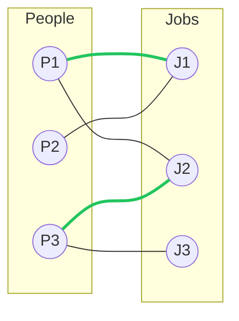

# Bipartite Graphs & 2-Coloring

A graph is **bipartite** when its vertices split into two groups such that every edge runs between
the groups and never within one. That single structural fact is unusually productive: once a graph is
known to be bipartite, an entire family of otherwise hard problems — matching, coloring, some flow
questions — collapses to something solvable in polynomial time. People-to-jobs, students-to-projects,
left-shoes-to-right-shoes: any relation where the two sides are fundamentally different kinds of thing
is a candidate for a bipartite model, whether or not the input arrives pre-labeled as "left" and
"right".

Two questions follow immediately. First, *is* a given graph bipartite at all — and the answer turns
out to be a simple 2-coloring exercise, not a search over exponentially many partitions. Second, given
that it is, what is the largest set of edges that share no endpoint — a **matching** — since that is
usually the actual question underneath "who should be paired with whom".

:::info[Prerequisites]
Comfortable with [BFS](./traversal.md) as a level-by-level exploration and with the [graph
traversal](./traversal.md) vocabulary (visited sets, frontiers).
:::

## Core Concepts

| Term | Meaning |
|---|---|
| **Bipartite** | Vertices split into two sets `X`, `Y` such that every edge has one endpoint in each |
| **2-coloring** | Assigning each vertex one of two colors so that no edge joins two same-colored vertices — exactly the bipartite certificate |
| **Odd cycle** | A cycle with an odd number of edges — the single obstruction to bipartiteness |
| **Matching** | A set of edges no two of which share an endpoint |
| **Augmenting path** | A path that starts and ends at unmatched vertices and alternates unmatched/matched edges — flipping it grows the matching by one |
| **Maximum matching** | A matching of largest possible size; not always *perfect* (covering every vertex) |

## Mechanism

### Testing bipartiteness: 2-color by BFS

Pick any uncolored vertex, color it, then BFS outward coloring every neighbor the *opposite* color of
the vertex that discovered it. If an edge is ever found connecting two vertices already colored the
*same*, the graph is not bipartite. If BFS finishes with no such conflict — for every connected
component — the two color classes are a valid bipartition.



The two columns are the two color classes; the thick green edges are the maximum matching found below.

Trace input — a 6-vertex graph, edges given as `P1-J1, P1-J2, P2-J1, P3-J2, P3-J3` (a tree, so no cycle
exists yet to test, but the coloring procedure is identical whether or not one is present):

```text
adjacency: P1:{J1,J2}  P2:{J1}  P3:{J2,J3}  J1:{P1,P2}  J2:{P1,P3}  J3:{P3}

BFS from P1, color 0/1 alternating by level:

  level  vertex   color   discovered via
  0      P1       0       start
  1      J1       1       edge P1-J1
  1      J2       1       edge P1-J2
  2      P2       0       edge J1-P2 (P2 uncolored, colored opposite J1)
  2      P3       0       edge J2-P3 (P3 uncolored, colored opposite J2)
  3      J3       1       edge P3-J3

no edge ever joins two same-colored vertices -> bipartite
classes: {P1, P2, P3} = color 0,  {J1, J2, J3} = color 1
```

Every edge in the input does cross between the two color classes (`P1-J1`, `P1-J2`, `P2-J1`, `P3-J2`,
`P3-J3` all run color-0-to-color-1), so the coloring is consistent and the graph is confirmed bipartite.

### Bipartite ⟺ no odd cycle

A graph is bipartite **if and only if** it contains no odd-length cycle. One direction is immediate:
walking around any cycle in a bipartite graph alternates color classes, so returning to the start after
an odd number of steps would require the start vertex to equal its own opposite color — a
contradiction, so every cycle in a bipartite graph is even. The converse is what the BFS coloring
procedure above actually proves constructively: if BFS ever detects two same-colored vertices joined by
an edge, the tree-path from their nearest common ancestor to each of them, plus that edge, forms a
cycle whose length is forced odd (both tree-paths have matching parity to the ancestor, since they are
BFS levels, so the two paths plus the closing edge sum to an odd total) — so a same-color conflict
*is* an odd cycle, exhibited on the spot, not merely inferred to exist (CLRS 4th ed., Ch. 22 exercises
develop this as the standard bipartiteness test).

### Maximum matching by augmenting paths

Greedily matching each left vertex to any free right neighbor can get stuck short of the true maximum:
a later vertex may only reach neighbors already claimed. The fix is Kuhn's algorithm — try to extend
the matching from each unmatched left vertex by depth-first search, and if the search reaches an
already-matched right vertex, recurse through *its* partner to look for a different free vertex
downstream. If the recursion succeeds, flip every edge on the discovered alternating path: matched
edges become unmatched and unmatched edges become matched. That flip is always a net gain of exactly
one matched edge — the definition of an augmenting path.

```text
process left vertices in order P1, P2, P3; each vertex tries its neighbors in listed order

P1: neighbors [J1, J2]. J1 is free -> match P1-J1.               M = {P1-J1}
P2: neighbors [J1]. J1 is taken (by P1).
    recurse into P1's other neighbor: J2 is free -> match P1-J2.
    augmenting path found: P2-J1-P1-J2. flip it:
      unmatch P1-J1, match P2-J1, match P1-J2.                    M = {P2-J1, P1-J2}
P3: neighbors [J2, J3]. J2 is taken (by P1).
    recurse into P1's other neighbor: J1 is taken (by P2).
      recurse into P2's other neighbors: none left -> dead end.
    back out, try J3: free -> match P3-J3.                        M = {P2-J1, P1-J2, P3-J3}

3 edges matched = min(|People|, |Jobs|): a perfect matching, no augmenting path needed after this
```

One real augmenting path was needed (for `P2`); `P1` and `P3` each matched a still-free neighbor
directly, which is the degenerate case of an augmenting path of length one.

<Tabs groupId="code-lang">
<TabItem value="python" label="Python">

```python showLineNumbers
def bipartite_coloring(adj, vertices):
    """adj: {v: [neighbours]}. Returns {v: 0 or 1}, or None if not bipartite."""
    color = {}
    for start in vertices:
        if start in color:
            continue
        color[start] = 0
        queue = [start]
        while queue:
            u = queue.pop(0)
            for v in adj[u]:
                if v not in color:
                    color[v] = 1 - color[u]
                    queue.append(v)
                elif color[v] == color[u]:
                    return None                  # same-color edge: an odd cycle exists
    return color


def max_bipartite_matching(left_adj, left_vertices):
    """left_adj: {u: [v, ...]} from left vertices to right vertices. Kuhn's algorithm."""
    match_right = {}                              # right vertex -> matched left vertex

    def try_match(u, visited):
        for v in left_adj[u]:
            if v in visited:
                continue
            visited.add(v)
            if v not in match_right or try_match(match_right[v], visited):
                match_right[v] = u
                return True
        return False

    matched = 0
    for u in left_vertices:
        if try_match(u, set()):
            matched += 1
    return match_right, matched
```

</TabItem>
<TabItem value="cpp" label="C++">

```cpp showLineNumbers
#include <cassert>
#include <map>
#include <queue>
#include <set>
#include <string>
#include <vector>

using Adj = std::map<std::string, std::vector<std::string>>;

std::map<std::string, int> bipartite_coloring(const Adj& adj, const std::vector<std::string>& vertices) {
    std::map<std::string, int> color;
    for (const auto& start : vertices) {
        if (color.count(start)) continue;
        color[start] = 0;
        std::queue<std::string> q;
        q.push(start);
        while (!q.empty()) {
            std::string u = q.front(); q.pop();
            for (const auto& v : adj.at(u)) {
                if (!color.count(v)) { color[v] = 1 - color[u]; q.push(v); }
                else if (color[v] == color[u]) return {};   // conflict: not bipartite
            }
        }
    }
    return color;
}

bool try_match(const std::string& u, const Adj& left_adj,
               std::map<std::string, std::string>& match_right, std::set<std::string>& visited) {
    for (const auto& v : left_adj.at(u)) {
        if (visited.count(v)) continue;
        visited.insert(v);
        auto it = match_right.find(v);
        if (it == match_right.end() || try_match(it->second, left_adj, match_right, visited)) {
            match_right[v] = u;
            return true;
        }
    }
    return false;
}

int max_bipartite_matching(const Adj& left_adj, const std::vector<std::string>& left_vertices,
                            std::map<std::string, std::string>& match_right) {
    int matched = 0;
    for (const auto& u : left_vertices) {
        std::set<std::string> visited;
        if (try_match(u, left_adj, match_right, visited)) ++matched;
    }
    return matched;
}
```

</TabItem>
</Tabs>

## Practical Usage

- **`networkx.algorithms.bipartite`** exposes `is_bipartite`, `sets` (the two-coloring), and
  `hopcroft_karp_matching` — see the
  [NetworkX bipartite module documentation](https://networkx.org/documentation/stable/reference/algorithms/bipartite.html).
  It is the practical answer to "does this problem even reduce to bipartite matching" before writing
  Kuhn's algorithm by hand.
- **Hopcroft–Karp.** Kuhn's algorithm above runs one BFS/DFS augmentation at a time, giving O(V · E)
  worst case (E augmentations bounded by V, each an O(E) search). **Hopcroft–Karp** finds *multiple*
  vertex-disjoint shortest augmenting paths per phase, cutting the number of phases to O(sqrt(V)) and the
  total time to **O(E · sqrt(V))** — named here with its bound, not derived; see the original paper for the
  phase structure.
- **Assignment problems** are bipartite matching with a twist: every edge has a cost or a value, and
  the goal is the *maximum-weight* matching, not merely the largest one. The unweighted case above is
  the special case where every edge has weight 1. The weighted version is solved by the Hungarian
  algorithm (Kuhn–Munkres), which is outside this page's scope but built on the same augmenting-path
  idea, with weights guiding which augmentation to prefer.
- **Bipartite-ness as a precondition.** Two-coloring a graph is also how a scheduler checks "can these
  tasks alternate between exactly two machines with no two conflicting tasks on the same machine" —
  the same test, framed as a constraint rather than a matching.

```python showLineNumbers
adj = {"P1": ["J1", "J2"], "P2": ["J1"], "P3": ["J2", "J3"],
       "J1": ["P1", "P2"], "J2": ["P1", "P3"], "J3": ["P3"]}
color = bipartite_coloring(adj, ["P1", "P2", "P3", "J1", "J2", "J3"])
assert color is not None
assert {v for v, c in color.items() if c == 0} == {"P1", "P2", "P3"}

left_adj = {"P1": ["J1", "J2"], "P2": ["J1"], "P3": ["J2", "J3"]}
match_right, matched = max_bipartite_matching(left_adj, ["P1", "P2", "P3"])
assert matched == 3                                  # perfect matching
assert match_right == {"J1": "P2", "J2": "P1", "J3": "P3"}

odd_cycle_adj = {"A": ["B", "C"], "B": ["A", "C"], "C": ["A", "B"]}   # a triangle
assert bipartite_coloring(odd_cycle_adj, ["A", "B", "C"]) is None
```

## Edge Cases & Pitfalls

- **Disconnected graphs.** BFS from one vertex only colors its component; the outer loop over every
  vertex is required, or an isolated component silently reports "bipartite" without ever being checked.
- **Self-loops.** A vertex with an edge to itself is never bipartite — it would need two different
  colors simultaneously. Most implementations should reject self-loops outright rather than let the
  coloring check quietly mis-flag the whole graph.
- **Matching greedily instead of with augmenting paths** produces a *maximal* matching (no edge can be
  added without removing one) which is not necessarily *maximum* — greedily matching `P1-J1` first in a
  graph shaped so that only `P1` reaches `J1` can strand a later vertex that had no other option.
  Maximal and maximum coincide only by luck, never by guarantee.
- **Confusing "matching" with "vertex cover".** By König's theorem, the maximum matching size equals
  the minimum vertex cover size in a bipartite graph — true only for bipartite graphs, not graphs in
  general, where the two can differ substantially.
- **Recursion depth in `try_match`.** The DFS recursion in Kuhn's algorithm can go as deep as the
  number of left vertices; for graphs with more than a few thousand vertices, convert to an explicit
  stack or raise Python's recursion limit deliberately rather than let it fail mid-search.

## Comparisons

| | Time (worst) | Finds |
|---|---|---|
| BFS 2-coloring | $O(V + E)$ | Whether the graph is bipartite, plus a witness odd cycle if not |
| Kuhn's algorithm (matching) | $O(V \cdot E)$ | A maximum matching, one augmentation at a time |
| **Hopcroft–Karp** | $O(E\sqrt{V})$ | Same maximum matching, multiple augmenting paths per phase |
| Max-flow reduction | $O(E\sqrt{V})$ with unit-capacity scaling | Same answer, via the [network flow](./network-flow.md) formulation below |

Bipartite matching is exactly max-flow on a graph built by adding a super-source connected to every
left vertex and a super-sink from every right vertex, all capacities 1 — see
[network flow](./network-flow.md) for the general technique this specializes.

## Recall

<Recall
  invariant="A graph is bipartite exactly when a BFS 2-coloring never colors both endpoints of an edge the same — equivalently, exactly when it has no odd-length cycle."
  costs={[
    ["2-coloring / bipartiteness test (worst)", "O(V + E)"],
    ["maximum matching, Kuhn's algorithm (worst)", "O(V · E)"],
    ["maximum matching, Hopcroft–Karp (worst)", "O(E · sqrt(V))"],
  ]}
  reachFor="Two distinguishable groups where every relationship crosses between them — assignment, scheduling onto two resources, or any 'pair these up' question with a natural two-sided structure."
  trap="Matching greedily (first-come, first-served) instead of via augmenting paths returns a maximal matching, not a maximum one — it can be strictly smaller with no warning that a better pairing existed."
/>

## References

- Cormen, Leiserson, Rivest & Stein, *Introduction to Algorithms*, 4th ed., Ch. 22 (BFS and the
  2-coloring bipartiteness test) and §26.3 (maximum bipartite matching via network flow).
- Sedgewick & Wayne, *Algorithms*, 4th ed., §4.1 — BFS as the basis for two-coloring and connectivity
  queries.
- J. E. Hopcroft & R. M. Karp, "An n^5/2 Algorithm for Maximum Matchings in Bipartite Graphs", *SIAM
  J. Computing* 2(4), 1973 — the O(E · sqrt(V)) algorithm, named above but not derived.
- D. König, "Gráfok és mátrixok" (1931) — the theorem equating maximum matching and minimum vertex
  cover in bipartite graphs, referenced in the pitfalls above.
- [NetworkX bipartite algorithms documentation](https://networkx.org/documentation/stable/reference/algorithms/bipartite.html)
  — the library-level `is_bipartite` and `hopcroft_karp_matching` used in practice.

## Related Pages

- [Traversal: BFS & DFS](./traversal.md) — the level-by-level exploration the 2-coloring test reuses directly.
- [Network Flow](./network-flow.md) — bipartite matching restated as a unit-capacity max-flow problem.
- [Cycle Detection](./cycle-detection.md) — a same-color BFS conflict *is* the odd cycle this page's equivalence names.
- [Union-Find](../data-structures/union-find.md) — an alternative structure for tracking components while 2-coloring a graph incrementally.
