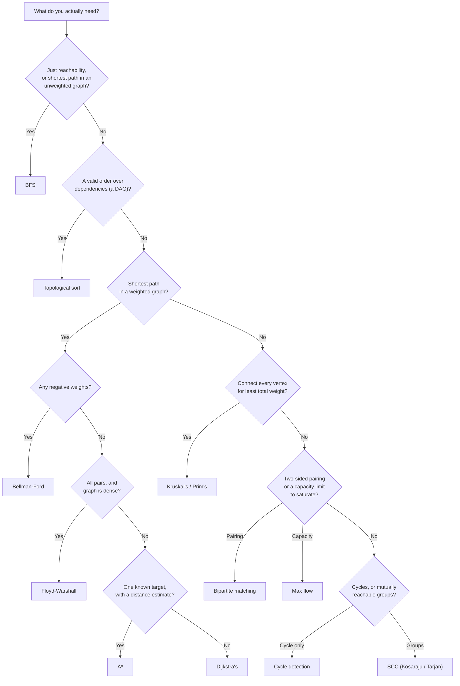

# Graph Algorithms Cheat Sheet

This page is a reference, not a tutorial — see [Graph Algorithms Overview](./intro.md) for a first
read through the folder. Every complexity below names its case (best / average / amortized / worst);
the full argument for each lives on that algorithm's own page, alongside its worked trace.

## Representation cost

| Representation | Space | Edge lookup `(u,v)?` | Iterate `u`'s neighbours |
|---|---|---|---|
| Adjacency list | $O(V + E)$ | $O(\deg(u))$ worst case | $O(\deg(u))$ |
| Adjacency matrix | $O(V^2)$ | $O(1)$ | $O(V)$ — every column must be checked |
| Edge list | $O(E)$ | $O(E)$ — a full scan | $O(E)$ — a full scan, no per-vertex index |

Adjacency lists win whenever the graph is sparse ($E \ll V^2$), which is the common case — most of the
algorithms on this page's table assume one. Matrices win only when edge-existence queries dominate and
the graph is dense enough that $O(V^2)$ space is not itself the problem (Kruskal's sort or an edge-list
input format is the exception that wants an edge list directly, to avoid rebuilding one). See CLRS 4th
ed., §22.1, for the same comparison stated formally.

## "The question is X" → run Y

| Question | Algorithm | Page |
|---|---|---|
| Visit every reachable vertex, or find shortest paths in an *unweighted* graph | BFS | [Traversal: BFS & DFS](./traversal.md) |
| Detect a cycle, or compute finish times / a valid ordering probe | DFS | [Traversal: BFS & DFS](./traversal.md) |
| Order tasks so every dependency precedes its dependents | Kahn's or DFS-based topological sort | [Topological Sort](./topological-sort.md) |
| Is there a cycle, and where | Three-colour DFS (directed) or union-find (undirected) | [Cycle Detection](./cycle-detection.md) |
| Shortest path, one source, non-negative weights | Dijkstra's | [Shortest Paths](./shortest-paths.md) |
| Shortest path, one source, negative weights allowed | Bellman–Ford | [Shortest Paths](./shortest-paths.md) |
| Shortest path, all pairs, dense graph | Floyd–Warshall | [Shortest Paths](./shortest-paths.md) |
| Shortest path to *one* known target, with a distance hint available | A\* | [A\* & Heuristic Search](./a-star-and-heuristic-search.md) |
| Connect every vertex for least total edge weight | Kruskal's or Prim's | [Minimum Spanning Trees](./minimum-spanning-trees.md) |
| Which vertices can all reach each other (directed graph) | Kosaraju's or Tarjan's | [Strongly Connected Components](./strongly-connected-components.md) |
| Split into two groups with every relationship crossing between them | BFS 2-colouring | [Bipartite Graphs & 2-Coloring](./bipartite-graphs-and-coloring.md) |
| Pair up two sides for the largest possible matching | Augmenting paths / Hopcroft–Karp | [Bipartite Graphs & 2-Coloring](./bipartite-graphs-and-coloring.md) |
| Maximum throughput from a source to a sink under capacities | Ford-Fulkerson / Edmonds-Karp | [Network Flow](./network-flow.md) |
| A combinatorial problem (selection, scheduling) with a source/sink shape | Model it as flow, then Edmonds-Karp | [Network Flow](./network-flow.md) |

## Decision flow

The first three questions — reachability, ordering, shortest path — cover most of what a real system
asks a graph. Weighted-vs-unweighted and negative-vs-non-negative are the two branches that most often
get skipped by habit (reaching for Dijkstra's on a graph that turns out to have a negative edge is the
single most common mistake this flow is meant to prevent — see the Dijkstra danger box on
[Shortest Paths](./shortest-paths.md)).

## Complexity matrix

| Algorithm | Time (worst) | Space | Notes |
|---|---|---|---|
| BFS / DFS | $O(V + E)$ | $O(V)$ | The primitive everything else on this page builds from |
| Topological sort (Kahn's or DFS) | $O(V + E)$ | $O(V)$ | Undefined / errors on a cyclic graph |
| Cycle detection | $O(V + E)$ | $O(V)$ | Three-colour DFS (directed) or union-find (undirected) |
| Dijkstra's (binary heap) | $O((V+E)\log V)$ | $O(V)$ | Wrong, silently, on any negative edge |
| Bellman–Ford | $O(V \cdot E)$ | $O(V)$ | The only one of these that also detects negative cycles |
| Floyd–Warshall | $O(V^3)$ | $O(V^2)$ | All-pairs; simple to implement, poor on sparse graphs |
| A\*, admissible heuristic | $O((V+E)\log V)$ | $O(V)$ | Same worst case as Dijkstra's; usually far fewer expansions |
| Kruskal's | $O(E \log E)$ | $O(V)$ | Dominated by the one sort; needs union-find |
| Prim's (binary heap) | $O(E \log V)$ | $O(V)$ | Better than Kruskal's on dense, adjacency-list graphs |
| Kosaraju's / Tarjan's (SCC) | $O(V + E)$ | $O(V)$ | Two DFS passes vs. one with a lowlink array |
| Bipartite 2-colouring | $O(V + E)$ | $O(V)$ | Also the odd-cycle witness when it fails |
| Bipartite matching, Kuhn's | $O(V \cdot E)$ | $O(V)$ | Hopcroft–Karp improves this to $O(E\sqrt{V})$ |
| Edmonds-Karp max flow | $O(VE^2)$ | $O(V + E)$ | BFS-selected augmenting paths is what earns this bound |

## Recall

<Recall
  invariant="Every algorithm in this folder is answering one of three questions about a graph — can I reach it, what order must it happen in, or what is the cheapest way to connect/cross it — and the representation (list vs. matrix) and the weight structure (none/non-negative/negative/capacitied) determine which specific algorithm answers it correctly."
  costs={[
    ["BFS / DFS / topological sort / cycle detection (worst)", "O(V + E)"],
    ["Dijkstra's, binary heap (worst)", "O((V+E) log V)"],
    ["Bellman-Ford (worst)", "O(V · E)"],
    ["Kruskal's (worst)", "O(E log E)"],
    ["Edmonds-Karp max flow (worst)", "O(VE²)"],
    ["bipartite matching, Hopcroft-Karp (worst)", "O(E√V)"],
  ]}
  reachFor="A quick lookup while choosing an algorithm for a new graph problem, or checking a claimed complexity, rather than a first read on any one algorithm."
  trap="Reaching for Dijkstra's out of habit on a graph that turns out to have a negative edge — it will run, and it will return a wrong answer with no error."
/>

## References

- Cormen, Leiserson, Rivest & Stein, *Introduction to Algorithms*, 4th ed., §22.1 (representations),
  Ch. 20-22 (traversal, topological sort), Ch. 24-26 (shortest paths, MST, flow) — the chapters this
  page's matrices summarise.
- Sedgewick & Wayne, *Algorithms*, 4th ed., Ch. 4 — the same algorithms with an empirical,
  implementation-first treatment.

## Related Pages

- [Graph Algorithms Overview](./intro.md) — the folder's first read, with the shared vocabulary this
  cheat sheet assumes.
- [Traversal: BFS & DFS](./traversal.md) — the primitive every other algorithm on this page builds on.
- [Shortest Paths](./shortest-paths.md) — Dijkstra's, Bellman-Ford, and Floyd-Warshall, compared directly.
- [Network Flow](./network-flow.md) — the max-flow row, and the modelling trick behind the last two rows of the question table.
- [Complexity Cheat Sheet](../complexity/cheat-sheet.md) — the growth-rate table this page's Big-O notation assumes.
