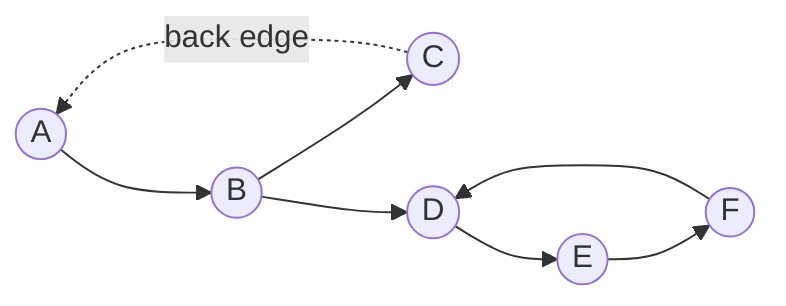

# Cycle Detection

A cycle is a path that leaves a vertex and, by following edges, returns to it. That definition reads
the same for directed and undirected graphs, but detecting one is a different algorithm in each case,
because the two kinds of edge behave differently during a traversal. An undirected edge is available
in both directions the instant it is used, so "the neighbor I just came from" must be excluded on
purpose. A directed edge only goes one way, so seeing an already-visited vertex again is sometimes a
cycle and sometimes just two paths converging — which one it is depends on *where* that vertex
currently sits in the traversal, not merely whether it has been seen.

That distinction is why directed cycle detection needs three states per vertex, not two. A finished
vertex — everything reachable from it already explored — can be reached again by a different path
with no cycle implied; that is an ordinary DAG merge point. A vertex still *open*, still on the
current root-to-here call stack, is different: reaching it again is the cycle.

The same recursive shape solves a structurally different problem. A **functional graph** — one
outgoing edge per vertex, no more, no less — is what a linked list's `next` pointer, a permutation's
`i -> p[i]` mapping, or a PRNG's `state -> next_state` step all are. Out-degree exactly 1 turns "does
iterating this function forever repeat" into a cycle-detection question with an O(1)-space answer.

:::info[Prerequisites]
This page assumes the DFS mechanics from [Traversal: BFS & DFS](./traversal.md) — the colour states
below are a refinement of DFS's visited/unvisited split, not a new traversal.
:::

## Core Concepts

| Term | Meaning |
|---|---|
| **White / grey / black** | Unvisited / currently on the DFS call stack / fully finished (CLRS's own colour scheme, §22.3) |
| **Back edge** | An edge to a **grey** vertex — an ancestor still open on the stack. This is what a directed cycle *is* |
| **Forward / cross edge** | An edge to a **black** vertex — a merge point, not a cycle, in a directed graph |
| **Parent edge** | The single undirected edge just used to arrive at the current vertex; must be excluded from "already visited" checks |
| **Functional graph** | A graph where every vertex has out-degree exactly 1 — linked lists, permutations, PRNG steps |

## Mechanism

### Directed graphs: three-colour DFS



`A`, `B` and `C` are still grey — open on the stack — when the traversal walks `C`'s only edge back to
`A`. That back edge is the whole detection; nothing further needs to run once it is found.

```text
graph: A->B, B->C, C->A, B->D, D->E, E->F, F->D
DFS starts at A, edges tried in listed order

  step   action                          A      B      C      D      E      F
  0      start                           white  white  white  white  white  white
  1      visit A                         grey   white  white  white  white  white
  2      A->B: visit B                   grey   grey   white  white  white  white
  3      B->C: visit C                   grey   grey   grey   white  white  white
  4      C->A: A is grey -> BACK EDGE, cycle found
```

The traversal never reaches `D`, `E` or `F` — the cycle is found on the third edge tried, and stops
there. `colour[u] = GREY` on entry, `BLACK` on exit, is the entire mechanism added to plain DFS.

<Tabs groupId="code-lang">
<TabItem value="python" label="Python">

```python showLineNumbers
def has_cycle_directed(graph):
    """graph: {vertex: [out-neighbours]}. True iff a directed cycle exists."""
    WHITE, GREY, BLACK = 0, 1, 2
    colour = {v: WHITE for v in graph}

    def visit(u):
        colour[u] = GREY
        for v in graph[u]:
            if colour[v] == GREY:
                return True                 # back edge: v is an open ancestor
            if colour[v] == WHITE and visit(v):
                return True
        colour[u] = BLACK
        return False

    return any(colour[v] == WHITE and visit(v) for v in graph)
```

</TabItem>
<TabItem value="cpp" label="C++">

```cpp showLineNumbers
#include <cassert>
#include <unordered_map>
#include <unordered_set>
#include <vector>

using Graph = std::unordered_map<char, std::vector<char>>;
enum Colour { WHITE, GREY, BLACK };

bool has_cycle_directed(const Graph& graph) {
    std::unordered_map<char, Colour> colour;
    for (const auto& [v, outs] : graph) colour[v] = WHITE;

    auto visit = [&](char u, auto&& self) -> bool {
        colour[u] = GREY;
        for (char v : graph.at(u)) {
            if (colour[v] == GREY) return true;             // back edge
            if (colour[v] == WHITE && self(v, self)) return true;
        }
        colour[u] = BLACK;
        return false;
    };

    for (const auto& [v, outs] : graph)
        if (colour[v] == WHITE && visit(v, visit)) return true;
    return false;
}
```

</TabItem>
</Tabs>

### Undirected graphs: union-find

On an undirected graph the question restated is "does this edge connect two vertices already
connected by earlier edges?" — precisely what [union-find](../data-structures/union-find.md) answers
per edge in near-constant amortized time, without building a spanning tree by hand:

<Tabs groupId="code-lang">
<TabItem value="python" label="Python">

```python showLineNumbers
def has_cycle_undirected(n, edges):
    """edges: [(u, v), ...] over vertices 0..n-1. True iff any edge closes a cycle."""
    parent = list(range(n))

    def find(x):
        while parent[x] != x:
            parent[x] = parent[parent[x]]      # path halving
            x = parent[x]
        return x

    for u, v in edges:
        ru, rv = find(u), find(v)
        if ru == rv:
            return True                        # u, v already connected: this edge is a cycle
        parent[ru] = rv
    return False
```

</TabItem>
<TabItem value="cpp" label="C++">

```cpp showLineNumbers
#include <numeric>

bool has_cycle_undirected(int n, const std::vector<std::pair<int, int>>& edges) {
    std::vector<int> parent(n);
    std::iota(parent.begin(), parent.end(), 0);

    auto find = [&](int x) {
        while (parent[x] != x) { parent[x] = parent[parent[x]]; x = parent[x]; }
        return x;
    };

    for (auto [u, v] : edges) {
        int ru = find(u), rv = find(v);
        if (ru == rv) return true;             // already connected: this edge is a cycle
        parent[ru] = rv;
    }
    return false;
}
```

</TabItem>
</Tabs>

On the shared graph's edges in listed order (A-B, A-C, B-C, ...), the first two union `{A,B}` then
merge in `C`; the third, `B-C`, finds `find(B) == find(C)` already and reports the cycle immediately —
the same triangle Kruskal's algorithm later rejects an edge from, for the identical reason (see
[Minimum Spanning Trees](./minimum-spanning-trees.md)).

### The parent-check shortcut, and why it needs an edge, not just a vertex

A DFS can answer the same undirected question without union-find: track the vertex each recursive
call arrived *from*, and treat "visited, but not where I came from" as a cycle.

```python showLineNumbers
def has_cycle_undirected_dfs(graph):
    """DFS with a parent check. Correct on a simple graph; see the multigraph trap below."""
    visited = set()

    def visit(u, parent):
        visited.add(u)
        for v in graph[u]:
            if v not in visited:
                if visit(v, u):
                    return True
            elif v != parent:
                return True
        return False

    return any(u not in visited and visit(u, None) for u in graph)
```

This is correct exactly as long as **at most one edge connects any pair of vertices** — "the neighbour
equal to my parent is the edge I came in on" silently assumes there is only one candidate edge to
mean that. The assumption breaks on a multigraph: build the adjacency structure with Python `set`s (a
common shortcut, since simple graphs never need duplicate entries) and a second parallel edge between
the same two vertices collapses into the existing set entry — the data is gone before the check ever
runs, so it reports "no cycle" about a graph it was never actually shown. Two parallel edges between
the same pair of vertices *are* a cycle (out on one, back on the other); only a representation that
keeps them distinguishable — a list/multiset, or the raw edge list union-find reads directly — sees it.
Building `adjacency_as_sets` from `edges = [(0, 1), (0, 1)]` leaves both `0` and `1` with a single
neighbour each, so `has_cycle_undirected_dfs` reports `False` on a graph that is, by definition, a
2-cycle; `has_cycle_undirected(2, edges)`, reading the edge list directly, correctly reports `True`.

### Functional graphs

A linked list's `next`, a permutation's index mapping, and a PRNG's state-transition function share
one shape: every vertex has **exactly one** outgoing edge. That fact makes an O(1)-space algorithm
possible where general graphs need O(V) of visited-marking: Floyd's tortoise-and-hare advances one
pointer by one step and another by two, and their gap shrinks by one step per iteration once both
are inside the cycle, so they must eventually land on the same vertex.

```python showLineNumbers
def has_cycle_functional(next_of, start):
    """Floyd's cycle detection over a one-out-edge-per-vertex graph. O(1) extra space."""
    slow = fast = start
    while True:
        slow = next_of(slow)
        fast = next_of(next_of(fast)) if next_of(fast) is not None else None
        if fast is None or slow is None:
            return False                    # ran off the end: no cycle
        if slow == fast:
            return True
```

The same loop, once a meeting point is found, extends to locate the cycle's *start*: reset one pointer
to `start` and advance both one step at a time — they meet again exactly there (CLRS 4th ed., problem
22-4). C++ translates it directly with `std::optional<int>` in place of Python's `None`.

## Practical Usage

- **Python has no built-in cycle detector**; the three functions above are all that is needed, since
  the graph is almost always plain `dict`s/`list`s. `networkx.find_cycle` (third-party) runs the same
  three-colour DFS and additionally names the offending edges.
- **C++ `<forward_list>` and raw pointer-based lists** carry no cycle protection — traversing a
  corrupted list with a cycle is an infinite loop, not an exception. Floyd's algorithm is the defence.
- **Build systems and package managers** use directed cycle detection directly: `pip`'s resolver and
  `make`'s recursive-prerequisite check both fail with "circular dependency" — the same back edge,
  translated into vertex names.

```python showLineNumbers
assert has_cycle_directed({"A": ["B"], "B": ["C", "D"], "C": ["A"], "D": ["E"], "E": ["F"], "F": ["D"]})
assert not has_cycle_directed({"A": ["B"], "B": ["C"], "C": []})            # a DAG

# shared undirected graph, vertices as 0..5 = A..F, edges in listed order
edges = [(0, 1), (0, 2), (1, 2), (1, 3), (2, 3), (2, 4), (3, 4), (3, 5), (4, 5)]
assert has_cycle_undirected(6, edges)                                       # A-B-C triangle
assert not has_cycle_undirected(4, [(0, 1), (1, 2), (2, 3)])                # a path, no cycle

next_map = {0: 1, 1: 2, 2: 3, 3: 1}                                         # 1 -> 2 -> 3 -> 1
assert has_cycle_functional(lambda x: next_map.get(x), 0)
acyclic_map = {0: 1, 1: 2, 2: 3, 3: None}
assert not has_cycle_functional(lambda x: acyclic_map.get(x), 0)
```

## Edge Cases & Pitfalls

- **Self-loops.** A vertex with an edge to itself is a length-one cycle either way. The three-colour
  DFS catches it for free (the vertex is grey when its own edge is examined); the parent-check does
  too, since `parent` is never equal to the vertex itself.
- **Disconnected graphs.** Both DFS-based checks loop over every vertex as a potential unvisited
  start — skip that loop and cycles are found only in the component containing the first vertex tried.
- **Forward and cross edges look like bugs but are not.** An edge to a **black** vertex in a directed
  graph is normal (a DAG diamond, two paths converging) and must not be flagged — only **grey** does.
- **Multigraphs and the parent check.** Covered above: verify the adjacency representation preserves
  parallel edges before trusting a "no cycle" answer from `has_cycle_undirected_dfs`.
- **Recursion depth.** Both DFS-based checks recurse to O(V) in the worst case; switch to an iterative
  stack once V exceeds the language's default limit (CPython's is 1000, via
  [`sys.setrecursionlimit`](https://docs.python.org/3/library/sys.html#sys.setrecursionlimit)).

## Comparisons

| | Handles | Extra space (worst) | Per-edge cost (worst) | Notes |
|---|---|---|---|---|
| Three-colour DFS | Directed | O(V) | O(1) amortized | Also yields *which* edges are the cycle |
| Union-find | Undirected | O(V) | O(α(V)) amortized | Processes edges independently of traversal order |
| DFS parent-check | Undirected, simple graphs | O(V) | O(1) amortized | Breaks silently if parallel edges are deduplicated away |
| Floyd's tortoise-and-hare | Functional graphs only | **O(1)** | O(1) per step | Needs out-degree exactly 1; does not generalise |

Union-find and the DFS parent-check cost the same asymptotically; union-find is preferred when edges
already arrive as a flat list (as for Kruskal's algorithm), since it needs no adjacency structure at
all. Floyd's algorithm trades generality for O(1) space — the only reason to reach for it.

## Recall

<Recall
  invariant="A directed cycle exists iff DFS ever finds an edge to a GREY vertex — one still open on the current call stack, not merely visited. An undirected cycle exists iff some edge connects two vertices already in the same component."
  costs={[
    ["directed: three-colour DFS (worst)", "O(V + E)"],
    ["undirected: union-find over all edges (worst)", "O(E · α(V))"],
    ["undirected: DFS parent-check (worst)", "O(V + E)"],
    ["functional graph: Floyd's algorithm (worst)", "O(V) time, O(1) space"],
  ]}
  reachFor="Any 'is there a loop' question — circular dependencies, a corrupted linked list, a permutation's cycle structure — before running an algorithm (topological sort, a linked-list walk) that assumes there is none."
  trap="A DFS parent-check assumes at most one edge between any two vertices. Building the adjacency structure with sets instead of lists silently deduplicates a real parallel edge, and the check then reports 'acyclic' about a multigraph it was never actually shown."
/>

## References

- Cormen, Leiserson, Rivest & Stein, *Introduction to Algorithms*, 4th ed., §22.3 — DFS, the
  white/grey/black colouring, and the classification of edges into tree, back, forward and cross.
- Cormen, Leiserson, Rivest & Stein, *Introduction to Algorithms*, 4th ed., problem 22-4 — Floyd's
  tortoise-and-hare for linked-list cycle detection, with the correctness argument.
- Sedgewick & Wayne, *Algorithms*, 4th ed., §4.1 "Undirected Graphs" and §1.5 "Case Study: Union-Find".
- R. W. Floyd, "Nondeterministic Algorithms", *JACM* 14(4), 1967 — the tortoise-and-hare's origin.

## Related Pages

- [Traversal: BFS & DFS](./traversal.md) — the DFS this page's colouring scheme refines.
- [Union-Find](../data-structures/union-find.md) — the near-linear undirected cycle test, and the
  structure Kruskal's algorithm builds on.
- [Topological Sort](./topological-sort.md) — needs the *absence* of a cycle to exist at all, and
  detects one the same way, via a grey vertex revisited.
- [Minimum Spanning Trees](./minimum-spanning-trees.md) — Kruskal's algorithm is this page's
  union-find cycle test, run once per candidate edge in weight order.
