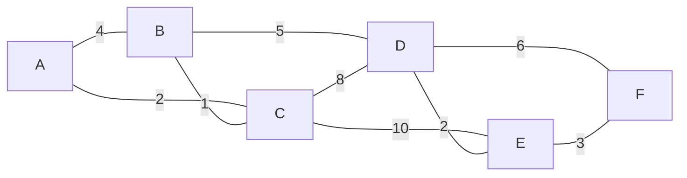
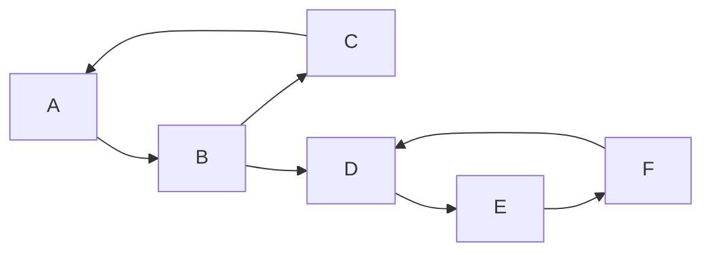

# Graph Algorithms — Overview

Once a problem is expressed as a [graph](../data-structures/graphs.md), a small set of algorithms
answers most of the questions worth asking about it: what is reachable, what is closest, and in what
order can things be done. Recognising that a problem *is* a graph problem is usually harder than
running the algorithm afterwards.

## In This Section

- **[Traversal: BFS & DFS](./traversal.md)** — the two ways to visit every reachable vertex, and why
  the choice of queue or stack changes everything downstream.
- **[Shortest Paths](./shortest-paths.md)** — BFS for unweighted graphs, Dijkstra's for non-negative
  weights, Bellman–Ford and Floyd–Warshall once weights can be negative or every pair matters.
- **[Topological Sort](./topological-sort.md)** — ordering a DAG so every dependency comes first,
  with a cycle as the diagnostic failure mode rather than a crash.
- **[Cycle Detection](./cycle-detection.md)** — three-colour DFS for directed graphs, the
  parent-edge trap for undirected ones, and functional graphs as a special case.
- **[Minimum Spanning Trees](./minimum-spanning-trees.md)** — Kruskal's and Prim's, and the single
  cut property that makes both of them correct.
- **[Strongly Connected Components](./strongly-connected-components.md)** — Kosaraju's two passes
  and Tarjan's one, and the condensation DAG they both agree on.
- **[Bipartite Graphs & Coloring](./bipartite-graphs-and-coloring.md)** — two-colouring by BFS, and
  what it means for a matching to exist at all.
- **[Network Flow](./network-flow.md)** — Ford–Fulkerson, augmenting paths, and the max-flow
  min-cut theorem that ties flow back to a cut.
- **[A\* & Heuristic Search](./a-star-and-heuristic-search.md)** — Dijkstra's with a hint, and what
  admissibility buys you.
- **[Cheat Sheet](./cheat-sheet.md)** — every algorithm above on one page, by complexity and
  use case.

## Choosing an Algorithm

| Question | Algorithm | Complexity |
|---|---|---|
| Is B reachable from A? | BFS or DFS | O(V + E) |
| Fewest **edges** from A to B? | BFS | O(V + E) |
| Cheapest path, non-negative weights? | Dijkstra's | O((V + E) log V) |
| Cheapest path, negative weights allowed? | Bellman–Ford | O(V·E) |
| Cheapest paths between *all* pairs? | Floyd–Warshall | O(V³) |
| A valid order respecting dependencies? | Topological sort | O(V + E) |
| Does the graph contain a cycle? | DFS, or a failed topological sort | O(V + E) |
| Which vertices form connected groups? | BFS or DFS from each unvisited vertex | O(V + E) |
| Least total edge weight connecting every vertex? | Kruskal's or Prim's | O(E log V) |
| Which vertices can reach each other, both ways? | Kosaraju's or Tarjan's SCC | O(V + E) |

:::warning[Use BFS, not Dijkstra's, on unweighted graphs]
When every edge costs the same, BFS already finds shortest paths — in O(V + E), with no priority
queue. Reaching for Dijkstra's adds a log factor and considerable machinery for no benefit. Treat
"all weights equal" as a special case worth checking for.
:::

## The Shared Example Graphs

Two small graphs recur across this section's worked traces, so that tracing a second algorithm on
the *same* input is a comparison rather than a fresh memorisation exercise. They are introduced once,
here, and every other page in this section refers back to this one.

**Undirected, weighted** — six vertices, used for traversal, shortest paths, and minimum spanning
trees:



```text
edges: A-B 4, A-C 2, B-C 1, B-D 5, C-D 8, C-E 10, D-E 2, D-F 6, E-F 3
```

Two things are visible before running any algorithm on it: `A-C` (2) is cheaper than the direct
`A-B` (4), so a shortest path or a spanning tree touching both `A` and `B` may prefer the detour
through `C` — [Shortest Paths](./shortest-paths.md) and
[Minimum Spanning Trees](./minimum-spanning-trees.md) both confirm this. And the graph is dense
enough (9 edges over 6 vertices) that no vertex is more than three hops from any other, which is why
[Traversal: BFS & DFS](./traversal.md) finishes both searches in six pops.

**Directed** — six vertices, used for topological sort, cycle detection, and strongly connected
components:



```text
edges: A->B, B->C, C->A, B->D, D->E, E->F, F->D
```

This graph is **not** a DAG: `C->A` closes the cycle `A->B->C->A`, and `F->D` independently closes
`B->D->E->F->D`. [Cycle Detection](./cycle-detection.md) finds both, and
[Strongly Connected Components](./strongly-connected-components.md) shows they correspond to exactly
two SCCs, `{A,B,C}` and `{D,E,F}`, joined by the single one-way edge `B->D`.
[Topological Sort](./topological-sort.md) needs both back edges removed before an ordering exists at
all.

## The Shared Skeleton

Nearly every algorithm here is the same loop with a different container and a different bookkeeping
rule:

<Tabs groupId="code-lang">
<TabItem value="python" label="Python">

```python showLineNumbers
# doc:no-run
# illustrative skeleton — `container`/`process` are placeholders, not real names
def traverse(graph, start):
    frontier = container([start])       # stack → DFS, queue → BFS, heap → Dijkstra's
    visited = {start}
    while frontier:
        node = frontier.take()          # pop / popleft / heappop
        process(node)
        for neighbour in graph[node]:
            if neighbour not in visited:
                visited.add(neighbour)
                frontier.add(neighbour)
```

</TabItem>
<TabItem value="cpp" label="C++">

```cpp showLineNumbers
// doc:no-run
// illustrative skeleton — Graph/Container/process are placeholders, not real names
void traverse(const Graph& graph, int start) {
    Container frontier{start};          // stack → DFS, queue → BFS, heap → Dijkstra's
    std::unordered_set<int> visited{start};
    while (!frontier.empty()) {
        int node = frontier.take();     // pop_back / pop_front / pop the minimum
        process(node);
        for (int neighbour : graph.at(node)) {
            if (!visited.count(neighbour)) {
                visited.insert(neighbour);
                frontier.add(neighbour);
            }
        }
    }
}
```

</TabItem>
</Tabs>

Swapping a stack for a queue turns depth-first into breadth-first. Swapping the queue for a
[priority queue](../data-structures/heaps.md) keyed by distance turns BFS into Dijkstra's. The
differences between these algorithms are smaller than their reputations suggest.

## Recall

<Recall
  invariant="Almost every algorithm in this section is the shared-skeleton loop above with one container swapped for another and one bookkeeping rule added — a graph algorithm's identity is in when it marks a vertex done and what it does at that moment, not in a different overall shape."
  costs={[
    ["BFS / DFS, adjacency list", "O(V + E)"],
    ["Dijkstra's, binary heap", "O((V + E) log V)"],
    ["Bellman-Ford", "O(V * E)"],
    ["Floyd-Warshall, all pairs", "O(V^3)"],
    ["Kruskal's / Prim's, MST", "O(E log V)"],
  ]}
  reachFor="The problem is phrased in terms of vertices and edges — reachability, ordering, cost, or connectivity — rather than needing an answer computed directly."
  trap="Reaching for Dijkstra's on an unweighted graph, or for a weighted algorithm when BFS already answers the question in O(V + E) with no heap at all."
/>

## References

- Cormen, Leiserson, Rivest & Stein, *Introduction to Algorithms*, 4th ed., Ch. 20–22 — graph
  representations, BFS, DFS, and the vocabulary (back edge, forward edge, cross edge) every later
  page in this section builds on.
- Sedgewick & Wayne, *Algorithms*, 4th ed., Ch. 4 — the same material with a strong emphasis on
  measured performance over asymptotic bounds alone.
- [VisuAlgo — Graph Data Structures](https://visualgo.net/en/graphds) — build a graph interactively
  and watch several of these algorithms run on it.

## Related Pages

- [Graphs](../data-structures/graphs.md) — representations, and the terminology used throughout.
- [Stacks & Queues](../data-structures/stacks-and-queues.md) — the containers that decide the traversal order.
- [Heaps & Priority Queues](../data-structures/heaps.md) — the structure Dijkstra's and Prim's both pop from.
- [Network Layer & Routing](../../computer-networks/network-layer-and-routing.md) — shortest-path algorithms running on the actual internet.
