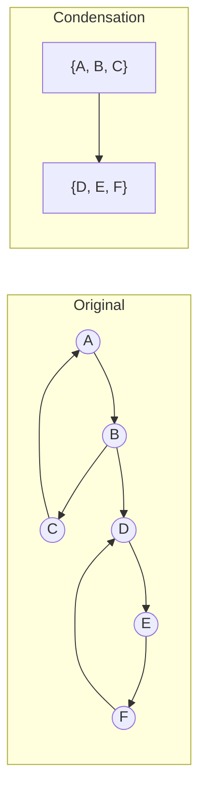

# Strongly Connected Components

In a directed graph, two vertices are **strongly connected** if each can reach the other — a path
exists in both directions, not necessarily the same edges. This relation partitions every vertex into
exactly one **strongly connected component (SCC)**: a maximal set where every pair strongly connects.
A DAG is the extreme where every SCC has size one; one cycle through every vertex is the other.

Finding SCCs answers "which parts of this graph are mutually entangled" in one pass, which matters
whenever a directed edge means a dependency, an implication, or a possible transition: a build
system's targets, a boolean formula's clauses, a state machine's states. Two vertices in the same SCC
cannot be scheduled or assigned independent truth values — reaching one means the whole is reachable.

Two classical algorithms compute the same partition differently. **Kosaraju's algorithm** runs DFS
twice — once for an ordering, once on the *reversed* graph in that order — needing nothing beyond DFS.
**Tarjan's algorithm** does it in one pass, tracking the earliest-discovered vertex reachable from each
vertex — more intricate, half the traversals.

## Core Concepts

| Term | Meaning |
|---|---|
| **Strongly connected** | `u` and `v` where a directed path exists `u -> v` *and* `v -> u` |
| **SCC** | A maximal set of mutually strongly connected vertices — every vertex belongs to exactly one |
| **Condensation** | The graph formed by collapsing each SCC to a single node — always a DAG |
| **Finish order** | The order DFS *completes* vertices in (post-order), central to Kosaraju's correctness |
| **Lowlink** | Tarjan's per-vertex value: the smallest discovery index reachable via tree edges and at most one back edge |

## Mechanism

### Kosaraju's two-pass algorithm

The idea: run DFS on the original graph, recording each vertex's **finish time**. The vertex finishing
*last* is guaranteed to sit in a "source" SCC of the condensation (nothing points into it once other
SCCs are collapsed). DFS again on the **reversed** graph, started in decreasing finish order, cannot
leave that first SCC — the reversal removed every edge that could — so each tree found is one SCC.



```text
first pass: DFS on the original graph, vertices tried in order A,B,C,D,E,F, recording finish order

  A -> B -> C -> (C->A already open, no new visit) -- C finishes first:  [C]
     -> B -> D -> E -> F -> (F->D already open)     -- F finishes:       [C, F]
                          -- E finishes:             [C, F, E]
                    -- D finishes:                   [C, F, E, D]
             -- B finishes:                          [C, F, E, D, B]
  -- A finishes:                                     [C, F, E, D, B, A]

second pass: process in DECREASING finish order (A, B, D, E, F, C) over the REVERSED graph
reversed edges: B->A, C->B, A->C, D->B, E->D, F->E, D->F

  start A (unvisited): A -> C -> B -> (A already visited, stop)   component 1 closes: {A, C, B}
  start B: already visited, skip
  start D (unvisited): D -> B(visited, skip) -> F -> E -> (D already visited, stop)
                                                                    component 2 closes: {D, F, E}
  start E, F, C: already visited, skip
```

Two components, `{A, B, C}` and `{D, E, F}` — matching the graph's two literal cycles exactly, with
one condensation edge `{A,B,C} -> {D,E,F}` (from the original `B -> D`).

<Tabs groupId="code-lang">
<TabItem value="python" label="Python">

```python showLineNumbers
def kosaraju_scc(graph):
    """graph: {vertex: [out-neighbours]}. Returns a list of SCCs, each a list of vertices."""
    finish_order = []
    visited = set()

    def dfs1(u):
        visited.add(u)
        for v in graph[u]:
            if v not in visited:
                dfs1(v)
        finish_order.append(u)                  # post-order: appended after all descendants

    for v in graph:
        if v not in visited:
            dfs1(v)

    reverse = {v: [] for v in graph}
    for u in graph:
        for v in graph[u]:
            reverse[v].append(u)

    visited.clear()
    components = []

    def dfs2(u, component):
        visited.add(u)
        component.append(u)
        for v in reverse[u]:
            if v not in visited:
                dfs2(v, component)

    for v in reversed(finish_order):            # decreasing finish time
        if v not in visited:
            component = []
            dfs2(v, component)
            components.append(component)
    return components
```

</TabItem>
<TabItem value="cpp" label="C++">

```cpp showLineNumbers
#include <algorithm>
#include <unordered_map>
#include <unordered_set>
#include <vector>

using Graph = std::unordered_map<char, std::vector<char>>;

std::vector<std::vector<char>> kosaraju_scc(const Graph& graph) {
    std::vector<char> finish_order;
    std::unordered_set<char> visited;

    auto dfs1 = [&](char u, auto&& self) -> void {
        visited.insert(u);
        for (char v : graph.at(u))
            if (!visited.count(v)) self(v, self);
        finish_order.push_back(u);
    };
    for (const auto& [v, outs] : graph)
        if (!visited.count(v)) dfs1(v, dfs1);

    Graph reverse;
    for (const auto& [u, outs] : graph)
        for (char v : outs) reverse[v].push_back(u);

    visited.clear();
    std::vector<std::vector<char>> components;
    auto dfs2 = [&](char u, std::vector<char>& component, auto&& self) -> void {
        visited.insert(u);
        component.push_back(u);
        for (char v : reverse[u])
            if (!visited.count(v)) self(v, component, self);
    };
    for (auto it = finish_order.rbegin(); it != finish_order.rend(); ++it)
        if (!visited.count(*it)) {
            std::vector<char> component;
            dfs2(*it, component, dfs2);
            components.push_back(component);
        }
    return components;
}
```

</TabItem>
</Tabs>

### Tarjan's one-pass algorithm

Tarjan's algorithm avoids the reversal and second pass by tracking, per vertex, `low[u]` — the
smallest discovery index reachable from `u` via tree edges plus at most one back edge — alongside a
stack of "in progress" vertices. A vertex is the **root** of its SCC exactly when `low[u] == disc[u]`;
then every vertex above it on the stack down to `u` pops off as one completed component.

<Tabs groupId="code-lang">
<TabItem value="python" label="Python">

```python showLineNumbers
def tarjan_scc(graph):
    """graph: {vertex: [out-neighbours]}. Returns a list of SCCs, each a list of vertices."""
    index_counter = [0]
    disc, low = {}, {}
    on_stack, stack = set(), []
    components = []

    def strongconnect(u):
        disc[u] = low[u] = index_counter[0]
        index_counter[0] += 1
        stack.append(u)
        on_stack.add(u)

        for v in graph[u]:
            if v not in disc:
                strongconnect(v)
                low[u] = min(low[u], low[v])
            elif v in on_stack:                 # back edge to an open ancestor
                low[u] = min(low[u], disc[v])

        if low[u] == disc[u]:                   # u is the root of its SCC
            component = []
            while True:
                v = stack.pop()
                on_stack.discard(v)
                component.append(v)
                if v == u:
                    break
            components.append(component)

    for v in graph:
        if v not in disc:
            strongconnect(v)
    return components
```

</TabItem>
<TabItem value="cpp" label="C++">

```cpp showLineNumbers
int scc_index = 0;
std::unordered_map<char, int> disc, low;
std::unordered_set<char> on_stack;
std::vector<char> stack;
std::vector<std::vector<char>> tarjan_components;

void strongconnect(char u, const Graph& graph) {
    disc[u] = low[u] = scc_index++;
    stack.push_back(u);
    on_stack.insert(u);

    for (char v : graph.at(u)) {
        if (!disc.count(v)) {
            strongconnect(v, graph);
            low[u] = std::min(low[u], low[v]);
        } else if (on_stack.count(v)) {
            low[u] = std::min(low[u], disc[v]);
        }
    }

    if (low[u] == disc[u]) {
        std::vector<char> component;
        char v;
        do {
            v = stack.back();
            stack.pop_back();
            on_stack.erase(v);
            component.push_back(v);
        } while (v != u);
        tarjan_components.push_back(component);
    }
}
```

</TabItem>
</Tabs>

## Practical Usage

- **`networkx.strongly_connected_components`** (Python) runs Tarjan's algorithm, returning the
  components as an iterator of sets, in no particular order. **Boost Graph Library's
  `boost::strong_components`** (C++) does the same over a `boost::adjacency_list`.
- **2-SAT.** Build an implication graph (`x -> y` for every clause consequence, plus its
  contrapositive); the formula is satisfiable exactly when no variable and its negation share an SCC —
  SCC computation *is* the 2-SAT solving algorithm, not merely a helper for it.
- **Circular dependency detection in build systems.** Any SCC larger than one vertex is a group that
  cannot be built in any linear order — the same fact [topological sort](./topological-sort.md) needs
  to hold at all, surfaced as a named group instead of a single "cycle found" flag.

```python showLineNumbers
graph = {"A": ["B"], "B": ["C", "D"], "C": ["A"], "D": ["E"], "E": ["F"], "F": ["D"]}
k = {frozenset(c) for c in kosaraju_scc(graph)}
t = {frozenset(c) for c in tarjan_scc(graph)}
assert k == t == {frozenset("ABC"), frozenset("DEF")}   # both algorithms agree

dag = {"A": ["B"], "B": ["C"], "C": []}
assert {frozenset(c) for c in kosaraju_scc(dag)} == {frozenset("A"), frozenset("B"), frozenset("C")}
```

## Edge Cases & Pitfalls

- **A DAG's SCCs are all singletons.** No back edges exist, so every vertex is its own component.
- **Kosaraju's order is easy to get backwards.** The second pass must run in *decreasing* finish time;
  increasing order, or forgetting to reverse the list, merges unrelated components.
- **`low[u] == disc[u]` is a strict identity check.** Swapping `disc[v]`/`low[v]` between the back- and tree-edge update breaks root detection for the whole subtree.
- **The condensation is a DAG only after collapsing every SCC** — an intermediate, partially-collapsed
  graph can still contain cycles between not-yet-merged components.
- **Recursion depth** is O(V) for both on a long chain; Tarjan's explicit stack complicates an
  iterative rewrite more than Kosaraju's two plain DFS passes.

## Comparisons

| | Passes | Extra structure | Time (worst) | Notes |
|---|---|---|---|---|
| **Kosaraju** | 2 (+ 1 graph reversal) | Finish-order list, reversed adjacency | O(V + E) | Easier to prove correct; needs the graph twice |
| **Tarjan** | 1 | Disc/low arrays, an explicit stack | O(V + E) | No reversal; components emerge as the DFS unwinds |

Both are worst-case linear; the choice is about implementation shape. Kosaraju reuses an existing DFS
with no new bookkeeping; Tarjan suits a single affordable traversal, or incremental discovery.

## Recall

<Recall
  invariant="Kosaraju: the vertex finishing last in a DFS on G lies in a source SCC of the condensation, so decreasing-finish-order DFS on G-reversed cannot leave that SCC. Tarjan: low[u] == disc[u] marks u as the root of a fully-discovered SCC."
  costs={[
    ["Kosaraju, two DFS passes (worst)", "O(V + E)"],
    ["Tarjan, one DFS pass (worst)", "O(V + E)"],
    ["Building the reversed graph (worst)", "O(V + E)"],
    ["2-SAT via implication-graph SCCs (worst)", "O(V + E)"],
  ]}
  reachFor="Which vertices are mutually reachable in a directed graph — circular build dependencies as a named group, or 2-SAT satisfiability via 'x and not-x in the same SCC'."
  trap="Running Kosaraju's second pass in increasing finish order instead of decreasing. The direction is not a style choice — it is the entire reason the second pass cannot walk out of the SCC it started in."
/>

## References

- Cormen, Leiserson, Rivest & Stein, *Introduction to Algorithms*, 4th ed., §22.5 — Kosaraju's
  algorithm via the finish-time theorem, full correctness proof.
- Sedgewick & Wayne, *Algorithms*, 4th ed., §4.2 "Directed Graphs" — Kosaraju-Sharir with the
  condensation-DAG framing.
- R. E. Tarjan, "Depth-First Search and Linear Graph Algorithms", *SIAM J. Computing* 1(2), 1972 —
  the original one-pass algorithm, disc/low included.
- B. Aspvall, M. F. Plass & R. E. Tarjan, "A Linear-Time Algorithm for Testing the Truth of Certain
  Quantified Boolean Formulas", *Info. Processing Letters* 8(3), 1979 — 2-SAT via SCCs.

## Related Pages

- [Traversal: BFS & DFS](./traversal.md) — the DFS both algorithms here are built from.
- [Topological Sort](./topological-sort.md) — the condensation DAG is exactly what it can then order.
- [Cycle Detection](./cycle-detection.md) — an SCC larger than one vertex *is* a cycle; this page finds
  every one and groups their vertices, instead of stopping at the first.
- [Union-Find](../data-structures/union-find.md) — a weaker "connected", with no edge direction, for
  contrast with strong connectivity.
