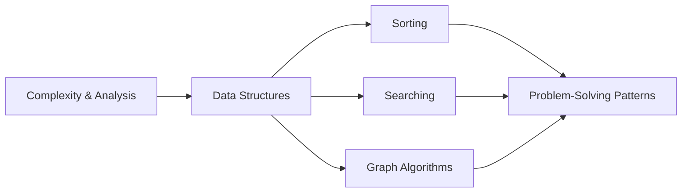

# Algorithms & Data Structures

Everything below this point in the knowledge base is about *what the machine can do*. This section is
about *what to ask it to do*. The distinction matters because the gap between a good algorithm and a
bad one is not a constant factor you can buy your way out of with faster hardware — a quadratic
algorithm on a million items loses to a linearithmic one by roughly fifty thousand times, and no CPU
upgrade in history has ever been worth fifty thousand times.

:::info[How this section is organised]
**[Complexity & Analysis](./complexity/intro.md)** first, because it is the vocabulary every other
page uses. Then **[Data Structures](./data-structures/intro.md)**, because the choice of structure
usually determines which algorithms are even available to you. Then the classic algorithm families —
**[Sorting](./sorting/intro.md)**, **[Searching](./searching/intro.md)**,
**[Graph Algorithms](./graph-algorithms/intro.md)** — and finally
**[Problem-Solving Patterns](./problem-solving-patterns/intro.md)**, the recurring shapes that show
up across all of them.
:::

## Sections

|   | Section | What it covers |
|---|---------|----------------|
| <Icon icon="lucide:sigma" inline /> | [Complexity & Analysis](./complexity/intro.md) | Big-O and friends, growth rates, amortized and space complexity |
| <Icon icon="lucide:boxes" inline /> | [Data Structures](./data-structures/intro.md) | Arrays, linked lists, stacks/queues, hash tables, trees, heaps, graphs |
| <Icon icon="lucide:arrow-down-narrow-wide" inline /> | [Sorting Algorithms](./sorting/intro.md) | Bubble, selection, insertion, merge, quick, heap — and how to choose |
| <Icon icon="lucide:search" inline /> | [Searching Algorithms](./searching/intro.md) | Linear and binary search, and what each one costs you up front |
| <Icon icon="lucide:git-fork" inline /> | [Graph Algorithms](./graph-algorithms/intro.md) | BFS/DFS traversal, shortest paths, topological sorting |
| <Icon icon="lucide:puzzle" inline /> | [Problem-Solving Patterns](./problem-solving-patterns/intro.md) | Two pointers, sliding window, divide & conquer, greedy, DP, backtracking |

## Why this sits inside Computer Science

The rest of this knowledge base explains the machine that runs these algorithms, and the connection
is not decorative. Several results here only make sense in light of it:

- **Binary search beats linear search asymptotically but not always in practice** on small arrays,
  because linear search is [cache-friendly](../memory-hierarchy/cpu-caches.md) and binary search
  jumps around.
- **Hash tables are $O(1)$ on paper** and can still be slow, for the same reason — see the load-factor
  curves on the [hash tables](./data-structures/hash-tables.md) page.
- **B-trees exist instead of binary trees** in databases purely because of
  [storage](../storage/intro.md) access granularity, not because of anything algorithmic.
- **Quicksort usually beats mergesort** despite identical average complexity, largely because it
  sorts in place and touches memory sequentially.

An algorithm's complexity class tells you how it scales. The machine underneath tells you what it
costs. You need both.

## Suggested Reading Path

- <Icon icon="lucide:rocket" inline /> **New to the topic:** [Complexity & Analysis](./complexity/intro.md) → [Data Structures](./data-structures/intro.md) → [Sorting](./sorting/intro.md).
- <Icon icon="lucide:briefcase" inline /> **Interview preparation:** [Complexity](./complexity/big-o-notation.md) → [Hash Tables](./data-structures/hash-tables.md) → [Problem-Solving Patterns](./problem-solving-patterns/intro.md) → [Graph Algorithms](./graph-algorithms/intro.md).
- <Icon icon="lucide:gauge" inline /> **Performance work:** [Common Complexities](./complexity/common-complexities.md) → [Arrays](./data-structures/arrays.md) → [CPU Caches](../memory-hierarchy/cpu-caches.md).

## References

- Cormen, Leiserson, Rivest & Stein, *Introduction to Algorithms* (CLRS) — the standard reference; rigorous, and the source most other treatments are derived from.
- Sedgewick & Wayne, *Algorithms*, 4th ed. — more approachable, with excellent visualisations.
- [GeeksForGeeks — Data Structures and Algorithms](https://www.geeksforgeeks.org/dsa/dsa/) — broad catalogue of individual algorithms with implementations.

### Books & Videos

- Sedgewick & Wayne, [Algorithms, Part I](https://www.coursera.org/learn/algorithms-part1) — the companion course to the book, free to audit.
- [VisuAlgo](https://visualgo.net/) — interactive, step-by-step animations of most structures and algorithms on these pages.

## Related Pages

- [Memory Hierarchy & RAM](../memory-hierarchy/intro.md) — why constant factors and access patterns matter as much as complexity class.
- [Databases](../databases/intro.md) — B-trees, LSM-trees and query planning are algorithm choices under commercial pressure.
