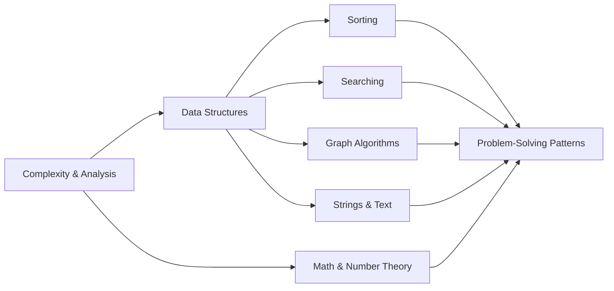

# Algorithms & Data Structures

Everything below this point in the knowledge base is about *what the machine can do*. This section is
about *what to ask it to do*. The distinction matters because the gap between a good algorithm and a
bad one is not a constant factor you can buy your way out of with faster hardware — a quadratic
algorithm on a million items loses to a linearithmic one by roughly fifty thousand times, and no CPU
upgrade in history has ever been worth fifty thousand times.

:::info[How this section is organised]
**[Complexity & Analysis](./complexity/intro.md)** first, because it is the vocabulary every other
page uses. Then **[Data Structures](./data-structures/intro.md)**, because the choice of structure
usually determines which algorithms are even available to you. Then the classic algorithm families —
**[Sorting](./sorting/intro.md)**, **[Searching](./searching/intro.md)**,
**[Graph Algorithms](./graph-algorithms/intro.md)**, **[Strings & Text](./strings-and-text/intro.md)**,
**[Math & Number Theory](./math-and-number-theory/intro.md)** — and finally
**[Problem-Solving Patterns](./problem-solving-patterns/intro.md)**, the recurring shapes that show
up across all of them.
:::

## Sections

|   | Section | What it covers |
|---|---------|----------------|
| <Icon icon="lucide:sigma" inline /> | [Complexity & Analysis](./complexity/intro.md) | Big-O and friends, growth rates, recurrences and the master theorem, amortized and space complexity, P vs NP |
| <Icon icon="lucide:boxes" inline /> | [Data Structures](./data-structures/intro.md) | Arrays, linked lists, stacks/queues, deques & ring buffers, hash tables, trees, balanced trees, tries, heaps, graphs, union-find, segment trees & Fenwick trees, LRU/LFU caches, probabilistic structures |
| <Icon icon="lucide:arrow-down-narrow-wide" inline /> | [Sorting Algorithms](./sorting/intro.md) | Bubble, selection, insertion, merge, quick, heap, counting/radix/bucket sort, quickselect, external & parallel sorting — and how to choose |
| <Icon icon="lucide:search" inline /> | [Searching Algorithms](./searching/intro.md) | Linear and binary search, binary search on the answer, exponential and ternary search |
| <Icon icon="lucide:git-fork" inline /> | [Graph Algorithms](./graph-algorithms/intro.md) | BFS/DFS traversal, shortest paths, minimum spanning trees, topological sorting, cycle detection, strongly connected components, bipartite graphs, A*, network flow |
| <Icon icon="lucide:type" inline /> | [Strings & Text](./strings-and-text/intro.md) | String fundamentals, naive matching and Rabin-Karp, KMP and the Z-algorithm, suffix structures and autocomplete |
| <Icon icon="lucide:calculator" inline /> | [Math & Number Theory](./math-and-number-theory/intro.md) | GCD and modular arithmetic, primes and sieves, combinatorics and counting, randomized algorithms and sampling |
| <Icon icon="lucide:puzzle" inline /> | [Problem-Solving Patterns](./problem-solving-patterns/intro.md) | Two pointers, sliding window, fast/slow pointers, prefix sums & difference arrays, monotonic stack/queue, intervals & sweep line, divide & conquer, greedy, DP, recursion/memoization/tabulation, backtracking, top-k & streaming |

## Why this sits inside Computer Science

The rest of this knowledge base explains the machine that runs these algorithms, and the connection
is not decorative. Several results here only make sense in light of it:

- **Binary search beats linear search asymptotically but not always in practice** on small arrays,
  because linear search is [cache-friendly](../memory-hierarchy/cpu-caches.md) and binary search
  jumps around.
- **Hash tables are $O(1)$ on paper** and can still be slow, for the same reason — see the load-factor
  curves on the [hash tables](./data-structures/hash-tables.md) page.
- **B-trees exist instead of binary trees** in databases purely because of
  [storage](../storage/intro.md) access granularity, not because of anything algorithmic.
- **Quicksort usually beats mergesort** despite identical average complexity, largely because it
  sorts in place and touches memory sequentially.

An algorithm's complexity class tells you how it scales. The machine underneath tells you what it
costs. You need both.

## Same Input, Three Angles

Three pages in this section trace the same four numbers, `[5, 1, 8, 3]`, deliberately — not because the
example is special, but because reusing it turns three unrelated pages into a comparison device. Once
you have watched `[5, 1, 8, 3]` get sorted, you recognise it instantly when it shows up again being
searched or heapified, and you can compare *what changes* rather than re-reading a new input from
scratch:

```text
[Insertion Sort]   [5, 1, 8, 3] --shift 5 right--> [1, 5, 8, 3] --shift 8,5 right--> [1, 3, 5, 8]
[Linear Search]    [5, 1, 8, 3] --scan for 8-->     hit at index 2, after 3 comparisons
[Heaps]            [5, 1, 8, 3] --heapify (min)-->  [1, 3, 8, 5]   (every parent <= its children)
```

- [Insertion Sort](./sorting/insertion-sort.md) shifts `5` and `8` one slot right as `1` and `3` find
  their place, ending sorted.
- [Linear Search](./searching/linear-search.md) scans the same four values left to right looking for
  `8`, finding it on the third comparison — no reordering, just a scan.
- [Heaps](./data-structures/heaps.md) reorganises the same values into heap order, not sorted order:
  `[1, 3, 8, 5]` satisfies "every parent is smaller than its children" without being fully sorted.

Three different operations, one shared starting point — the differences in what happens to the array
are the point, not the array itself.

## Suggested Reading Path


```mermaid
flowchart LR
    C[Complexity & Analysis] --> DS[Data Structures]
    DS --> SO[Sorting]
    DS --> SE[Searching]
    DS --> G[Graph Algorithms]
    DS --> ST[Strings & Text]
    C --> M[Math & Number Theory]
    SO --> P[Problem-Solving Patterns]
    SE --> P
    G --> P
    ST --> P
    M --> P
```

Two edges are new: **Strings & Text** grows out of Data Structures because its core structures — tries,
suffix structures — are just more specialised trees, and **Math & Number Theory** grows out of
Complexity because its results (what a modulus buys you, what a sieve costs) are complexity arguments
applied to numbers instead of arrays. Both feed into Problem-Solving Patterns, the same as everything
else — a string-matching problem and a number-theory problem are still two-pointers or divide-and-conquer
under the hood more often than not.

- <Icon icon="lucide:rocket" inline /> **New to the topic:** [Complexity & Analysis](./complexity/intro.md) → [Data Structures](./data-structures/intro.md) → [Sorting](./sorting/intro.md).
- <Icon icon="lucide:refresh-cw" inline /> **Reviewing the fundamentals:** [Complexity cheat sheet](./complexity/cheat-sheet.md) → [Data Structures cheat sheet](./data-structures/cheat-sheet.md) → [Sorting cheat sheet](./sorting/cheat-sheet.md) → [Graph Algorithms cheat sheet](./graph-algorithms/cheat-sheet.md) → [Problem-Solving Patterns cheat sheet](./problem-solving-patterns/cheat-sheet.md).
- <Icon icon="lucide:gauge" inline /> **Performance work:** [Common Complexities](./complexity/common-complexities.md) → [Arrays](./data-structures/arrays.md) → [CPU Caches](../memory-hierarchy/cpu-caches.md).

## Reference Layer

Two things on this page (and on every page below it) are not meant to be read first: the Recall card
at the bottom of each page is a five-line summary for someone who has already read the page once
and wants to jog their memory before a code review or a design discussion — it is not a
substitute for the mental model in the body, and reading it cold will not teach you the algorithm. The
five cheat sheets listed above serve a different, narrower purpose: fast lookup of a decision
("which sort do I reach for here?", "which graph algorithm handles negative weights?") when you already
understand the trade-offs and just need the table. Searching, Strings & Text, and Math & Number Theory do
not have cheat sheets — each folder is small enough, and each page specific enough, that a summary table
would duplicate the page rather than compress it.

## Recall

<Recall
  invariant="An algorithm's complexity class tells you how it scales as the input grows; the machine underneath — caches, branch prediction, memory bandwidth — tells you what each step actually costs. Neither one alone predicts real running time."
  costs={[
    ["O(1) at n = 10^6", "still instant"],
    ["O(log n) at n = 10^6", "~20 steps, instant"],
    ["O(n) at n = 10^6", "~1 ms"],
    ["O(n log n) at n = 10^6", "~20 ms"],
    ["O(n^2) at n = 10^6", "~17 minutes"],
  ]}
  reachFor="Coming to this section at all: you have a concrete problem whose brute-force solution is too slow, or you need the vocabulary (complexity, the right data structure, a named pattern) to describe why."
  trap="Optimising the constant factor of the wrong complexity class — hand-tuning an O(n^2) inner loop when an O(n log n) algorithm exists is wasted effort no matter how tight the loop gets."
/>

## References

- Cormen, Leiserson, Rivest & Stein, *Introduction to Algorithms* (CLRS) — the standard reference; rigorous, and the source most other treatments are derived from.
- Sedgewick & Wayne, *Algorithms*, 4th ed. — more approachable, with excellent visualisations.
- [GeeksForGeeks — Data Structures and Algorithms](https://www.geeksforgeeks.org/dsa/dsa/) — broad catalogue of individual algorithms with implementations.

### Books & Videos

- Sedgewick & Wayne, [Algorithms, Part I](https://www.coursera.org/learn/algorithms-part1) — the companion course to the book, free to audit.
- [VisuAlgo](https://visualgo.net/) — interactive, step-by-step animations of most structures and algorithms on these pages.

## Related Pages

- [Memory Hierarchy & RAM](../memory-hierarchy/intro.md) — why constant factors and access patterns matter as much as complexity class.
- [Databases](../databases/intro.md) — B-trees, LSM-trees and query planning are algorithm choices under commercial pressure.
