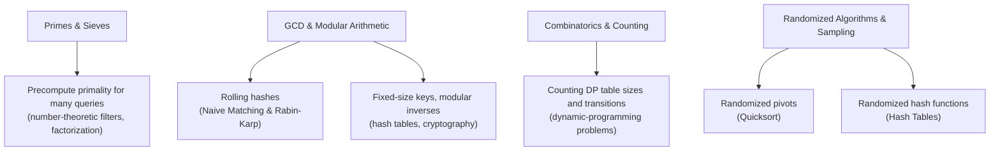

# Math & Number Theory

Every algorithm folder so far has assumed arithmetic just works: a hash function combines numbers,
a randomized pivot picks an index, a DP table counts something. This folder is about the arithmetic
itself — not as an application in its own right, but as the small set of operations that keep
showing up *inside* other algorithms, usually unremarked, until one of them is wrong and the bug
looks nothing like a math bug. A rolling hash is a modular multiply. A cryptographic key exchange is
fast exponentiation. A combinatorial DP table is Pascal's triangle. A randomized pivot is a Fisher-
Yates shuffle wearing a different hat. None of these are new algorithms so much as new names for
material this folder derives once, so every other page can cite it instead of re-deriving it.

The four pages here split cleanly by what they defend against. Primality and sieving defend against
recomputing "is n prime" from scratch inside a loop that runs it thousands of times. GCD and modular
arithmetic defend against overflow, wrong inverses, and exponentiation loops that are needlessly
linear. Combinatorics and counting defend against counting a set of outcomes by generating and
tallying every one, when a formula or a recurrence gets the same number in a fraction of the work.
Randomization defends against the one input an adversary — or bad luck — can construct to make a
deterministic algorithm's worst case the *typical* case.



Trace input — this folder shares one running example across its own pages, `gcd(252, 198)` and
`3^13 mod 7`, so that Euclid's algorithm and fast exponentiation are traced on the exact same
numbers a reader can re-derive by hand.

## Core Concepts

| Term | Meaning |
|---|---|
| **Modular arithmetic** | Arithmetic performed "mod m" — every result is reduced into `[0, m)`, which keeps numbers bounded no matter how many operations are chained |
| **GCD** | Greatest common divisor: the largest integer dividing both operands with no remainder |
| **Modular inverse** | The value `x` such that `a * x ≡ 1 (mod m)`; exists only when `gcd(a, m) = 1` |
| **Combinatorial counting** | Computing the *size* of a set of outcomes without enumerating the outcomes themselves |
| **Las Vegas / Monte Carlo** | The two families of randomized algorithm — always-correct-but-variable-time, versus fixed-time-but-probably-correct |

## Mechanism

The map above names *where* each page's arithmetic surfaces elsewhere; the concrete case is a
modular multiply inside a rolling hash. [Naive Matching & Rabin-Karp](../strings-and-text/naive-matching-and-rabin-karp.md)
slides a window across a text and, on every step, updates a hash with exactly one line:

```text
window = (window * BASE + ord(text[i + m - 1])) % MOD
```

That line is doing three things this folder names precisely. `window * BASE` is one step of treating
the string as digits of a base-`BASE` number — the polynomial-hash construction this folder's GCD
page revisits when it explains fast exponentiation's `pow(BASE, m - 1, MOD)` a few lines earlier on
the same page. `+ ord(text[i + m - 1])` folds in the new digit. `% MOD` is the modular-arithmetic
step that keeps `window` inside `[0, MOD)` forever, regardless of how many characters the text has —
without it, `window` would grow without bound and every later comparison would cost more than the
last. Rabin-Karp never explains *why* the modulo step is safe to insert in the middle of an
arithmetic expression and still produce the right final residue; that is exactly the modular-
arithmetic identity `(a * b) mod m = ((a mod m) * (b mod m)) mod m` this folder's second page derives
and this folder's `gcd-and-modular-arithmetic.md` page names as the reason fast exponentiation can
reduce after every squaring instead of only at the very end.

```text
folder reading order (each page assumes nothing from a later one):

  primes-and-sieves.md              -- when N is fixed and prime tests repeat
  gcd-and-modular-arithmetic.md     -- the arithmetic every other page's hashing and
                                        cryptography examples borrow
  combinatorics-and-counting.md     -- counting without enumerating
  randomized-algorithms-and-sampling.md -- why randomness defeats adversarial input
```

## Practical Usage

- **Hashing.** Every rolling hash (Rabin-Karp) and every hash table's hash function reduces its
  running value modulo a fixed size — the exact identity this folder's second page names.
- **Cryptography.** RSA and Diffie-Hellman are fast exponentiation modulo a large number, plus a
  modular inverse for RSA's private key — both derived on `gcd-and-modular-arithmetic.md`.
- **Combinatorial DP.** Counting DP states (subset sums, partition counts, binomial-coefficient
  tables) is Pascal's-triangle arithmetic wearing the shape of a dynamic-programming table.
- **Randomized pivots and hashing.** [Quicksort](../sorting/quicksort.md)'s randomized-pivot variant
  and a hash table's randomized hash seed both exist to defeat an adversary who knows the
  deterministic algorithm and can therefore construct its worst case.

## Edge Cases & Pitfalls

- **Treating modular reduction as optional until "the number gets big".** Deferring `% MOD` until
  the end of a chain of multiplications overflows a fixed-width integer long before the final
  reduction happens — see `gcd-and-modular-arithmetic.md`'s overflow section.
- **Reusing a prime-checking loop inside a hot path.** Trial division per query is fine once; inside
  a loop that asks it thousands of times it is the exact "recompute instead of precompute" mistake
  [Prefix Sums & Difference Arrays](../problem-solving-patterns/prefix-sums-and-difference-arrays.md)
  warns about for range sums — see `primes-and-sieves.md`.
- **Enumerating outcomes to count them.** Generating every permutation to report how many there are
  is correct and needlessly exponential when a formula answers the same question in $O(1)$.

## Comparisons

| | What it precomputes | What it defends against | Owning page |
|---|---|---|---|
| Sieve of Eratosthenes | Primality up to N | Repeated trial division per query | `primes-and-sieves.md` |
| Fast exponentiation | Nothing — restructures the multiply loop | $O(exponent)$ sequential multiplication | `gcd-and-modular-arithmetic.md` |
| Pascal's triangle DP | Every `C(n, k)` up to some bound | Recomputing factorials per query | `combinatorics-and-counting.md` |
| Randomized pivot / hash seed | Nothing — restructures the input assumption | An adversary who knows the deterministic choice | `randomized-algorithms-and-sampling.md` |

The pattern across all four rows is the same one this whole plan keeps returning to: pay a fixed
cost once (a table, a restructured loop, a random seed) so that every later use of the result is
cheaper, or safer against an adversary, than repeating the naive approach from scratch.

## Recall

<Recall
  invariant="The arithmetic in this folder is not new algorithms -- it is the operations (modular reduction, GCD, counting formulas, randomness) that other algorithms in this section already lean on, named and derived once so later pages can cite them instead of re-deriving them."
  costs={[
    ["trial division primality check (worst)", "O(sqrt n)"],
    ["Euclid's algorithm, gcd(a, b) (worst)", "O(log min(a, b))"],
    ["fast exponentiation, a^b mod m (worst)", "O(log b)"],
    ["computing C(n, k) via Pascal's triangle DP (worst)", "O(n * k)"],
    ["Fisher-Yates shuffle of n elements (worst)", "O(n)"],
  ]}
  reachFor="Any point where another algorithm's correctness or performance quietly depends on modular arithmetic, a GCD, a combinatorial count, or a source of randomness -- rather than treating that arithmetic as a black box."
  trap="Assuming arithmetic 'just works' the way it does on paper -- fixed-width overflow, a missing modular reduction, or a biased shuffle are correctness bugs that look nothing like a math bug when they surface downstream."
/>

## References

- Cormen, Leiserson, Rivest & Stein, *Introduction to Algorithms*, 4th ed., Ch. 31 — "Number-Theoretic
  Algorithms", the chapter this folder's GCD and primality material is drawn from.
- Sedgewick & Wayne, *Algorithms*, 4th ed., §1.1 "Basic Programming Model" and the exercises on
  arithmetic algorithms — the same material with an emphasis on measured performance.
- D. Knuth, *The Art of Computer Programming, Vol. 2: Seminumerical Algorithms* — the standard deep
  reference for the arithmetic and randomization material this folder only introduces.

## Related Pages

- [Naive Matching & Rabin-Karp](../strings-and-text/naive-matching-and-rabin-karp.md) — the rolling
  hash whose modular multiply this page traces line by line.
- [Quicksort](../sorting/quicksort.md) — the randomized pivot that this folder's last page explains.
- [Hash Tables](../data-structures/hash-tables.md) — where a randomized hash function defeats an
  adversary who knows the deterministic one.
- [Complexity](../complexity/intro.md) — the cost vocabulary (worst / average / amortized) every
  claim in this folder uses.
