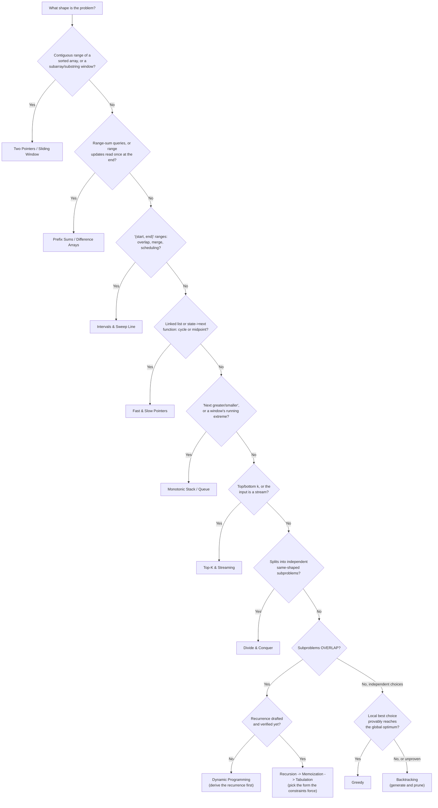

# Problem-Solving Patterns Cheat Sheet

This page is a reference, not a tutorial — see [Problem-Solving Patterns Overview](./intro.md) for a
first read through the folder. Every complexity below names its case (best / average / worst); the
full argument for each lives on that pattern's own page, alongside its worked trace.

## "What does the input and the question look like?" → reach for…

| Signal in the input or question | Pattern | Page |
|---|---|---|
| Sorted array, or "find a pair/triplet meeting a condition" | Two Pointers | [Two Pointers & Sliding Window](./two-pointers-and-sliding-window.md) |
| "Longest/shortest contiguous subarray or substring satisfying…" | Sliding Window | [Two Pointers & Sliding Window](./two-pointers-and-sliding-window.md) |
| A problem splits cleanly into same-shaped, **independent** halves | Divide & Conquer | [Divide & Conquer](./divide-and-conquer.md) |
| Local best-choice-now is claimed (or provable) to reach the global optimum | Greedy | [Greedy Algorithms](./greedy-algorithms.md) |
| "Count the ways to…" / "minimum/maximum way to…", with **overlapping** subproblems | Dynamic Programming | [Dynamic Programming](./dynamic-programming.md) |
| One DP recurrence needs to go from a first draft to a fast, space-tight implementation | Recursion → Memoization → Tabulation | [Recursion, Memoization & Tabulation](./recursion-memoization-tabulation.md) |
| "Generate all…" / "find every arrangement/subset satisfying a constraint" | Backtracking | [Backtracking](./backtracking.md) |
| Many range-sum queries over data that does not change, or many range updates read once at the end | Prefix Sums / Difference Arrays | [Prefix Sums & Difference Arrays](./prefix-sums-and-difference-arrays.md) |
| "Next greater/smaller element", or "largest rectangle/window extreme" | Monotonic Stack / Queue | [Monotonic Stack & Queue](./monotonic-stack-and-queue.md) |
| A list of `(start, end)` ranges: overlap count, merging, or free-room scheduling | Intervals & Sweep Line | [Intervals & Sweep Line](./intervals-and-sweep-line.md) |
| A linked list or `state -> next_state` function, cycle detection or midpoint with $O(1)$ space | Fast & Slow Pointers | [Fast & Slow Pointers](./fast-and-slow-pointers.md) |
| "Top/bottom k of…", or the input is a stream too large or too long to hold in full | Top-K & Streaming | [Top-K & Streaming](./top-k-and-streaming.md) |

## Complexity per pattern

| Pattern | Typical time | Extra space | Case named |
|---|---|---|---|
| Two Pointers | $O(n)$ | $O(1)$ | worst |
| Sliding Window | $O(n)$ | $O(1)$ or $O(k)$ with a window structure | amortized |
| Divide & Conquer | $O(n \log n)$ typical (Master Theorem case-dependent) | $O(\log n)$ call stack | worst |
| Greedy | $O(n \log n)$, dominated by a sort | $O(1)$ beyond the sort | worst |
| Dynamic Programming | $O(states x transitions)$ | $O(states)$, or $O(1 row)$ rolling | worst |
| Recursion → Memoization → Tabulation | $O(2^{n})$ naive -> $O(states)$ memoized/tabulated | $O(states)$ -> $O(1 row)$ rolling | worst, see the page's four-form table |
| Backtracking | Exponential, pruned in practice | $O(depth)$ call stack | worst |
| Prefix Sums / Difference Arrays | $O(n)$ build, $O(1)$ query | $O(n)$ | worst |
| Monotonic Stack / Queue | $O(n)$ amortized (each element pushed/popped once) | $O(n)$ | amortized |
| Intervals & Sweep Line | $O(n \log n)$, dominated by sorting endpoints | $O(n)$ | worst |
| Fast & Slow Pointers | $O(n)$ | $O(1)$ | worst |
| Top-K & Streaming | $O(n \log k)$ heap, $O(n)$ reservoir sampling | $O(k)$ | worst |

## Template-code index

Each pattern's page carries a `## Mechanism` section with the worked trace and the `<Tabs>` skeleton
code. Where a page splits the mechanism into named subsections, the skeleton to copy lives in the one
named below rather than at the top of `## Mechanism` itself.

| Pattern | Section carrying the skeleton |
|---|---|
| Two Pointers & Sliding Window | [`### Two pointers on sorted data`](./two-pointers-and-sliding-window.md#two-pointers-on-sorted-data) and [`### Sliding window`](./two-pointers-and-sliding-window.md#sliding-window) |
| Divide & Conquer | [`## Mechanism`](./divide-and-conquer.md#mechanism) |
| Greedy Algorithms | [`### Where greedy works: interval scheduling`](./greedy-algorithms.md#where-greedy-works-interval-scheduling) |
| Dynamic Programming | [`### The workflow, on a real problem`](./dynamic-programming.md#the-workflow-on-a-real-problem) |
| Recursion, Memoization & Tabulation | [`## Mechanism`](./recursion-memoization-tabulation.md#mechanism) — all four forms, in one place |
| Backtracking | [`### N-queens`](./backtracking.md#n-queens) |
| Prefix Sums & Difference Arrays | [`## Mechanism`](./prefix-sums-and-difference-arrays.md#mechanism) |
| Monotonic Stack & Queue | [`## Mechanism`](./monotonic-stack-and-queue.md#mechanism) |
| Intervals & Sweep Line | [`### Counting overlaps by sorting endpoints, not intervals`](./intervals-and-sweep-line.md#counting-overlaps-by-sorting-endpoints-not-intervals) |
| Fast & Slow Pointers | [`## Mechanism`](./fast-and-slow-pointers.md#mechanism) |
| Top-K & Streaming | [`## Mechanism`](./top-k-and-streaming.md#mechanism) |

## Decision flow

The two questions worth double-checking before committing to an answer: "do the subproblems actually
overlap" (the line between Divide & Conquer and Dynamic Programming), and "is the greedy choice
*provably* optimal, or just plausible" (the line between Greedy and Backtracking) — see
[Greedy Algorithms](./greedy-algorithms.md#where-greedy-fails-making-change) for a worked case where a
plausible-looking greedy choice is provably wrong.

## Recall

<Recall
  invariant="Every pattern in this folder answers a question about *shape* — independent vs. overlapping subproblems, a moving contiguous window, a fixed set of ranges, a bounded amount of memory — and the shape, not the problem's domain, determines which pattern applies."
  costs={[
    ["two pointers / sliding window / fast-slow pointers (worst)", "O(n)"],
    ["divide & conquer, typical case (worst)", "O(n log n)"],
    ["greedy, dominated by a sort (worst)", "O(n log n)"],
    ["dynamic programming, states x transitions (worst)", "O(states x transitions)"],
    ["monotonic stack/queue, each element pushed/popped once (amortized)", "O(n)"],
    ["top-k via a size-k heap (worst)", "O(n log k)"],
  ]}
  reachFor="A quick lookup while shaping a new problem, or confirming which pattern's page to read next, rather than a first read on any one pattern."
  trap="Reaching for Dynamic Programming before checking that the subproblems actually overlap — if they are independent, it is Divide & Conquer, and the memo table only adds overhead nothing ever reuses."
/>

## References

- Cormen, Leiserson, Rivest & Stein, *Introduction to Algorithms*, 4th ed., Ch. 4 (divide and
  conquer), Ch. 14 (dynamic programming), Ch. 15 (greedy) — the chapters this page's table summarises.

## Related Pages

- [Problem-Solving Patterns Overview](./intro.md) — the folder's first read, with the shared vocabulary
  this cheat sheet assumes.
- [Dynamic Programming](./dynamic-programming.md) — the pattern most often confused with Divide &
  Conquer, and the one this cheat sheet's trap warns about.
- [Recursion, Memoization & Tabulation](./recursion-memoization-tabulation.md) — the four-form
  progression for turning a DP recurrence into a fast, space-tight implementation.
- [Top-K & Streaming](./top-k-and-streaming.md) — the pattern to reach for when bounded memory, not
  overlapping subproblems, is the binding constraint.
- [Complexity Cheat Sheet](../complexity/cheat-sheet.md) — the growth-rate table this page's Big-O
  notation assumes.
