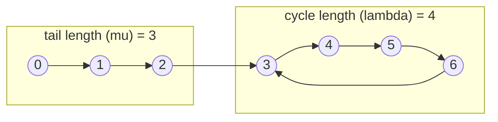

# Fast & Slow Pointers

A singly-linked list, or anything shaped like one — a permutation's `i -> p[i]` mapping, a
pseudo-random generator's `state -> next_state` step, the digit-square-sum function behind "happy
numbers" — offers no way to look ahead. There is no index, no length known in advance, and if the
structure loops back on itself, walking it with one pointer never terminates and never tells you why.

Two pointers moving at different speeds fix this without any extra memory. Advance one by one step and
another by two; if the structure is a straight line, the fast one simply reaches the end first. If it
loops, both pointers are eventually walking inside the same cycle, and the gap between them — measured
in steps around the cycle — shrinks by exactly one every iteration, because the fast pointer gains one
step of relative distance per round while the slow one gains none. A shrinking gap on a finite loop
must eventually reach zero, so the two pointers **must** meet; there is no case where a real cycle
exists and they do not.

The same asymmetric-speed idea answers a second, unrelated-looking question: where is the middle of a
list you can only walk once? Advance the fast pointer twice for every one step of the slow pointer, and
the moment the fast one falls off the end, the slow one is sitting exactly at the midpoint — without
ever having counted the length first.

:::info[Prerequisites]
This page assumes the cycle-detection mechanics from [Cycle Detection](../graph-algorithms/cycle-detection.md)
— the same tortoise-and-hare loop, applied here specifically to linked lists and functional graphs.
:::

## Core Concepts

| Term | Meaning |
|---|---|
| **Slow / fast pointer** | Advance by 1 step and by 2 steps per iteration, respectively; also called tortoise and hare |
| **Functional graph** | A structure where every node has exactly one outgoing edge — a linked list's `next`, or any `f(x)` iterated |
| **Tail length (μ)** | Steps from the start to the first node that is part of the cycle |
| **Cycle length (λ)** | Number of nodes in the cycle itself |
| **Meeting point** | Where slow and fast first coincide — somewhere inside the cycle, not necessarily at its start |
| **Cycle-start proof** | Resetting one pointer to the head and advancing both by 1 makes them meet exactly at the cycle's first node |

## Mechanism



```text
next: 0 -> 1 -> 2 -> 3 -> 4 -> 5 -> 6 -> 3     (tail: 0, 1, 2 ; cycle: 3, 4, 5, 6)

Phase 1 -- find a meeting point (slow += 1 step, fast += 2 steps, per iteration)
  step   slow   fast
  0      0      0
  1      1      2
  2      2      4
  3      3      6
  4      4      4      <- meet, inside the cycle

Phase 2 -- find the cycle start (p1 = head, p2 = meeting point; both += 1 step)
  step   p1     p2
  0      0      4
  1      1      5
  2      2      6
  3      3      3      <- cycle starts at node 3
```

Why phase 2 works: by the time they meet, slow has travelled `mu + k` steps for some `k < lambda`, and
fast has travelled exactly twice that, having also gone around the cycle some whole number of extra
times. Working through the arithmetic, the distance remaining from the meeting point back around to the
cycle start equals `mu` — the same distance from the head to the cycle start. Advancing both by one
step from those two starting points therefore lands them together, at the cycle's first node.

<Tabs groupId="code-lang">
<TabItem value="python" label="Python">

```python showLineNumbers
NEXT = [1, 2, 3, 4, 5, 6, 3]        # node i -> NEXT[i]; node 6 -> 3 closes the cycle


def floyd_meeting(next_of, start=0):
    """Advance slow by 1 step, fast by 2. They must meet if a cycle exists. O(n) worst case."""
    slow = fast = start
    while True:
        slow = next_of[slow]
        fast = next_of[next_of[fast]]
        if slow == fast:
            return slow


def cycle_start(next_of, start=0):
    """After slow and fast meet, resetting one to `start` and advancing both by 1 finds the cycle start."""
    meeting = floyd_meeting(next_of, start)
    p1, p2 = start, meeting
    while p1 != p2:
        p1 = next_of[p1]
        p2 = next_of[p2]
    return p1


assert floyd_meeting(NEXT) == 4
assert cycle_start(NEXT) == 3
```

</TabItem>
<TabItem value="cpp" label="C++">

```cpp showLineNumbers
#include <cassert>
#include <vector>

int floyd_meeting(const std::vector<int>& next_of, int start = 0) {
    int slow = start, fast = start;
    while (true) {
        slow = next_of[slow];
        fast = next_of[next_of[fast]];
        if (slow == fast) return slow;
    }
}

int cycle_start(const std::vector<int>& next_of, int start = 0) {
    int meeting = floyd_meeting(next_of, start);
    int p1 = start, p2 = meeting;
    while (p1 != p2) {
        p1 = next_of[p1];
        p2 = next_of[p2];
    }
    return p1;
}
```

</TabItem>
</Tabs>

### Midpoint finding

The same speed asymmetry, applied to a list with no cycle, locates the middle in one pass — useful as
the split step of a merge sort over a [linked list](../data-structures/linked-lists.md), which has no
$O(1)$ random access to find the midpoint by arithmetic the way an array would.

```python showLineNumbers
def middle_value(values):
    """Middle element via fast/slow pointers: when fast reaches the end, slow is at the middle."""
    slow = fast = 0
    while fast + 1 < len(values):
        slow += 1
        fast += 2
    return values[slow]


assert middle_value([10, 20, 30, 40, 50, 60, 70]) == 40      # 7 elements: index 3 is the middle
```

### Functional graphs: happy numbers

"Iterate the digit-square-sum function; does it reach 1, or does it fall into a cycle instead?" is the
same tortoise-and-hare shape applied to `f(x)` rather than a `next` pointer — no list is ever built.

```python showLineNumbers
def is_happy(n):
    """True if iterating digit-square-sum reaches 1; unhappy numbers fall into a cycle instead."""
    def step(x):
        return sum(int(d) ** 2 for d in str(x))

    slow = fast = n
    while True:
        slow = step(slow)
        fast = step(step(fast))
        if slow == fast:
            return slow == 1


assert is_happy(19) is True     # 19 -> 82 -> 68 -> 100 -> 1
assert is_happy(2) is False     # 2 -> 4 -> 16 -> ... -> 4, a cycle that never reaches 1
```

## Practical Usage

- **No language ships this as a library call** — it is always a few lines of pointer bookkeeping
  written by hand, over whatever `next`-shaped structure the problem provides.
- **C++ raw or `std::forward_list` nodes** carry no built-in cycle protection; a corrupted list with a
  cycle turns any ordinary traversal into an infinite loop rather than an exception, which is exactly
  what makes an $O(1)$-space detector worth having in production code, not just in an algorithms class.
- Real call sites: detecting a corrupted or maliciously-constructed linked structure, finding a
  pseudo-random generator's period without storing every state seen, and the merge-sort-on-a-linked-list
  split step mentioned above.

## Edge Cases & Pitfalls

- **Not checking for the end before the second `next`.** Advancing `fast` two full steps requires
  confirming the *first* step did not run off the end before dereferencing a second time — skipping
  that check turns "no cycle" into a null-pointer dereference instead of a clean `False`.
- **Resetting the wrong pointer in phase 2.** The proof requires one pointer to restart at the head and
  the other to *stay* at the meeting point — restarting both, or restarting neither, does not produce
  the cycle start; it produces nothing meaningful at all.
- **Off-by-one at the midpoint.** For an even-length list, `fast` reaching the end lands `slow` on
  either the left-middle or right-middle node depending on the exact loop condition — decide which one
  the problem wants before trusting the answer.
- **Treating "they never meet" as impossible.** They never meet only when there genuinely is no cycle —
  the loop must also check for `fast` (or `next_of[fast]`) running off the end, or an acyclic input
  hangs the search instead of returning `False`.

## Comparisons

| | Floyd's tortoise-and-hare | Hash-set of visited nodes |
|---|---|---|
| Extra space (worst) | **$O(1)$** | $O(n)$ |
| Time to find a cycle (worst) | $O(n)$ | $O(n)$ |
| Finds the cycle's start | Yes, via the phase-2 reset | Yes — the first node seen twice |
| Needs the nodes to be hashable | No | Yes |

The hash-set approach is easier to convince yourself is correct at a glance; Floyd's algorithm is
preferred specifically for the $O(1)$ space, and because it works even when the nodes are not hashable
(raw pointers into memory you do not control, say).

## Recall

<Recall
  invariant="Advancing one pointer by 1 step and another by 2 shrinks their gap by 1 every step once both are inside the cycle, so they must meet; resetting one pointer to the head afterward and advancing both by 1 lands them together exactly at the cycle's start."
  costs={[
    ["cycle detection, meeting point (worst)", "O(n) time, O(1) space"],
    ["cycle start, phase 2 (worst)", "O(n) time, O(1) space"],
    ["midpoint of an n-node list (worst)", "O(n) time, O(1) space"],
    ["hash-set of visited nodes (worst)", "O(n) time, O(n) space"],
  ]}
  reachFor="A singly-linked structure, or an iterated function, where you need to find a cycle, its start, or a list's midpoint without O(n) extra memory."
  trap="Advancing the fast pointer two full steps without checking for the end after the first — an acyclic input then dereferences past the last node instead of just finishing the search."
/>

## References

- Cormen, Leiserson, Rivest & Stein, *Introduction to Algorithms*, 4th ed., problem 20-4 — Floyd's
  tortoise-and-hare for linked-list cycle detection, with the correctness argument for both phases.
- R. W. Floyd, "Nondeterministic Algorithms," *JACM* 14(4), 1967 — the tortoise-and-hare's origin.
- Sedgewick & Wayne, *Algorithms*, 4th ed., §1.3 "Bags, Queues, and Stacks" — the linked-list
  representation this technique walks.

## Related Pages

- [Cycle Detection](../graph-algorithms/cycle-detection.md) — the general algorithm across directed,
  undirected and functional graphs; this page is the functional-graph and linked-list case in depth.
- [Linked Lists](../data-structures/linked-lists.md) — the structure this technique is most often
  applied to.
- [Two Pointers & Sliding Window](./two-pointers-and-sliding-window.md) — the sibling two-pointer
  technique for arrays, where both pointers move over an index instead of a `next` pointer.
- [Problem-Solving Patterns](./intro.md) — where this pattern sits among the others.
