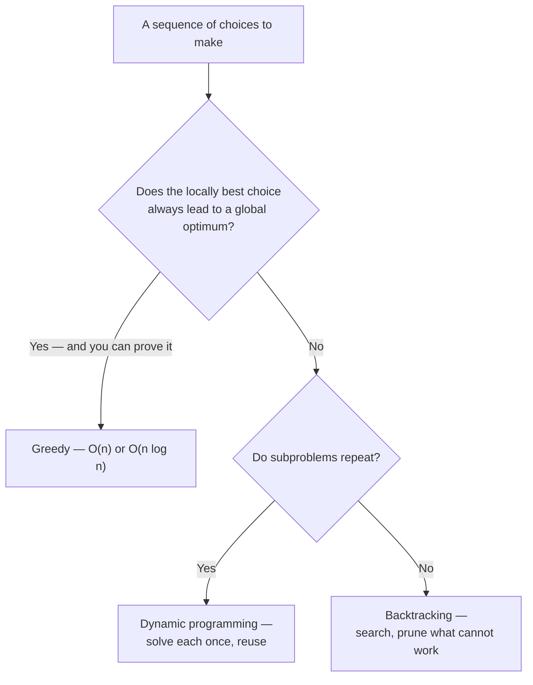

# Problem-Solving Patterns — Overview

The named algorithms in the earlier sections are instances of a smaller number of recurring
**strategies**. Recognising the strategy is what lets you solve a problem you have never seen, and it
is the difference between memorising algorithms and understanding them.

Every pattern here is a way of avoiding work that brute force would do: by exploiting structure the
input already has, by reusing subresults, or by proving that whole branches of the search cannot
contain the answer.

## In This Section

- **[Two Pointers & Sliding Window](./two-pointers-and-sliding-window.md)** — exploit sortedness or
  contiguity to replace a nested loop with a single pass.
- **[Divide & Conquer](./divide-and-conquer.md)** — split, solve independently, combine.
- **[Greedy Algorithms](./greedy-algorithms.md)** — take the locally best option, when that provably
  suffices.
- **[Dynamic Programming](./dynamic-programming.md)** — solve overlapping subproblems once and reuse
  the answers.
- **[Backtracking](./backtracking.md)** — search systematically, abandoning branches that cannot work.

## Recognising Which One

| Signal in the problem | Likely pattern |
|---|---|
| Sorted array; "find a pair/triple summing to…" | [Two pointers](./two-pointers-and-sliding-window.md) |
| "Contiguous subarray/substring with…" | [Sliding window](./two-pointers-and-sliding-window.md) |
| "Sort", "search", or a naturally halving structure | [Divide & conquer](./divide-and-conquer.md) |
| "Maximum/minimum number of…" with an obvious local choice | [Greedy](./greedy-algorithms.md) — then *prove* it |
| "Count the ways", "optimal value", overlapping subproblems | [Dynamic programming](./dynamic-programming.md) |
| "All permutations/combinations/valid configurations" | [Backtracking](./backtracking.md) |
| "Shortest path", "reachable", "order of dependencies" | [Graph algorithms](../graph-algorithms/intro.md) |
| "Top k", "k-th largest", "next event" | [Heap](../data-structures/heaps.md) |
| "Have I seen this before", "count occurrences" | [Hash table](../data-structures/hash-tables.md) |

## Greedy, DP and Backtracking Are the Same Question

All three explore a space of choices; they differ in how much of it they can safely skip.

The progression is one of decreasing confidence and increasing cost. Greedy commits immediately and
is fastest. DP considers every option but never recomputes anything. Backtracking explores properly
and relies on pruning to stay tractable.

:::warning[The greedy trap]
Greedy algorithms are easy to write and easy to believe. The failure mode is that they produce
plausible, slightly wrong answers on inputs you did not test — and unlike a crash, nothing announces
it. A greedy solution needs an argument for why the local choice is safe, not merely a few passing
examples. See [Greedy Algorithms](./greedy-algorithms.md) for what such an argument looks like.
:::

## Related Pages

- [Complexity & Analysis](../complexity/intro.md) — for judging whether a pattern's cost is acceptable.
- [Data Structures](../data-structures/intro.md) — the structures these patterns lean on.
