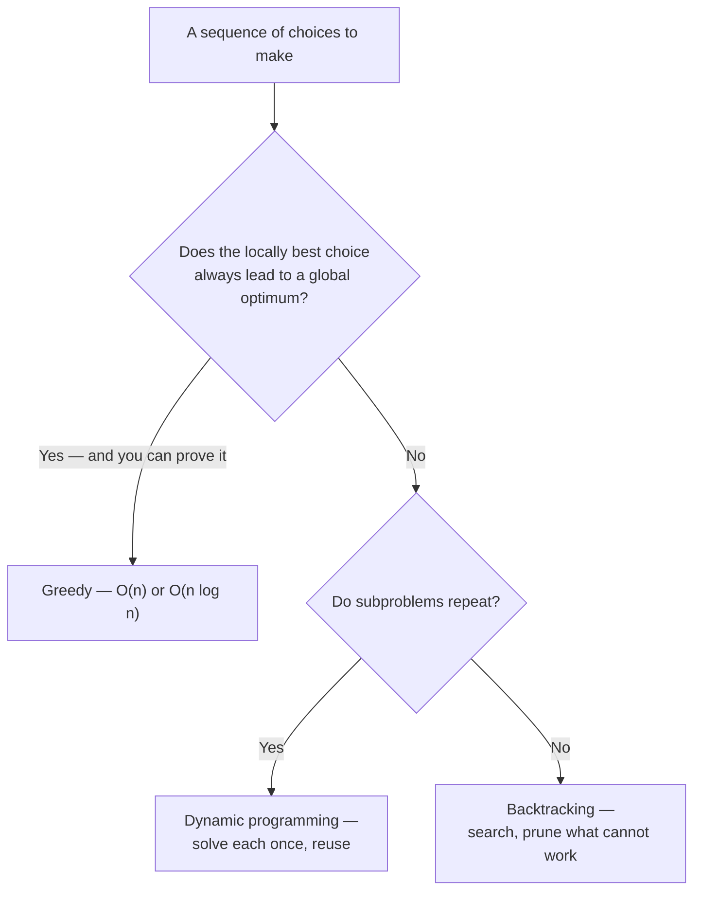

# Problem-Solving Patterns — Overview

The named algorithms in the earlier sections are instances of a smaller number of recurring
**strategies**. Recognising the strategy is what lets you solve a problem you have never seen, and it
is the difference between memorising algorithms and understanding them.

Every pattern here is a way of avoiding work that brute force would do: by exploiting structure the
input already has, by reusing subresults, or by proving that whole branches of the search cannot
contain the answer. None of them are algorithms in their own right — each is a shape that a real
algorithm (mergesort, Dijkstra's, a DP table) fills in.

Broadly, the patterns split into two families. The first — two pointers, prefix sums, monotonic
stacks, fast/slow pointers — turns a single pass into the whole answer by never re-examining what an
earlier position already settled. The second — greedy, dynamic programming, backtracking — searches a
space of choices, and differs only in how confidently it can skip parts of that space without ever
visiting them. Recognising which family a problem belongs to is most of the work; picking the exact
pattern within it is comparatively mechanical.

## In This Section

- **[Two Pointers & Sliding Window](./two-pointers-and-sliding-window.md)** — exploit sortedness or
  contiguity to replace a nested loop with a single pass.
- **[Divide & Conquer](./divide-and-conquer.md)** — split, solve independently, combine.
- **[Greedy Algorithms](./greedy-algorithms.md)** — take the locally best option, when that provably
  suffices.
- **[Dynamic Programming](./dynamic-programming.md)** — solve overlapping subproblems once and reuse
  the answers.
- **[Backtracking](./backtracking.md)** — search systematically, abandoning branches that cannot work.
- **[Prefix Sums & Difference Arrays](./prefix-sums-and-difference-arrays.md)** — trade one linear
  pass now for $O(1)$ range answers later.
- **[Monotonic Stack & Queue](./monotonic-stack-and-queue.md)** — keep only the candidates that could
  still be the answer, in sorted order, for free.
- **[Intervals & Sweep Line](./intervals-and-sweep-line.md)** — turn overlapping ranges into a single
  ordered pass over their endpoints.
- **[Fast & Slow Pointers](./fast-and-slow-pointers.md)** — detect cycles and find midpoints in one
  pass and $O(1)$ space.
- **[Recursion, Memoization & Tabulation](./recursion-memoization-tabulation.md)** — the bridge from a
  plain recurrence to a dynamic-programming table.
- **[Top-K & Streaming](./top-k-and-streaming.md)** — bound the working set to exactly the answer's
  size, even over a stream you cannot rewind.
- **[Cheat Sheet](./cheat-sheet.md)** — every pattern above on one page, by signal and complexity.

## Recognising Which One

This is the page to return to when a problem does not yet suggest an algorithm. Read down the left
column for the shape of the input and the question, not the domain — "array", "string", and "stream"
are the same pattern wearing different clothes.

| Signal in the problem | Likely pattern |
|---|---|
| Sorted array; "find a pair/triple summing to…" | [Two pointers](./two-pointers-and-sliding-window.md) |
| "Contiguous subarray/substring with…" | [Sliding window](./two-pointers-and-sliding-window.md) |
| "Sort", "search", or a naturally halving structure | [Divide & conquer](./divide-and-conquer.md) |
| "Maximum/minimum number of…" with an obvious local choice | [Greedy](./greedy-algorithms.md) — then *prove* it |
| "Count the ways", "optimal value", overlapping subproblems | [Dynamic programming](./dynamic-programming.md) |
| "All permutations/combinations/valid configurations" | [Backtracking](./backtracking.md) |
| "Sum over range [l, r]", repeated many times, data fixed | [Prefix sums](./prefix-sums-and-difference-arrays.md) |
| "Add v to every element in range [l, r]", reads deferred | [Difference array](./prefix-sums-and-difference-arrays.md) |
| "Next greater/smaller element", "largest rectangle in…" | [Monotonic stack](./monotonic-stack-and-queue.md) |
| "Maximum of every window of size k" | [Monotonic queue](./monotonic-stack-and-queue.md) |
| "Merge overlapping intervals", "meeting rooms needed" | [Intervals & sweep line](./intervals-and-sweep-line.md) |
| "Detect a cycle", "find the middle", one pass, $O(1)$ space | [Fast & slow pointers](./fast-and-slow-pointers.md) |
| A recurrence that recomputes the same call many times | [Memoization / tabulation](./recursion-memoization-tabulation.md) |
| "Top k", "k-th largest", a stream with no fixed length | [Top-k & streaming](./top-k-and-streaming.md) |
| "Shortest path", "reachable", "order of dependencies" | [Graph algorithms](../graph-algorithms/intro.md) |
| "Have I seen this before", "count occurrences" | [Hash table](../data-structures/hash-tables.md) |

## Patterns Combine

Real problems rarely match exactly one row of the table above. The common combinations are worth
knowing by name, because each one is really "pattern A, with pattern B handling one sub-question":

| Combination | What each half does |
|---|---|
| Sliding window + hash map | The window tracks *which* elements are inside; the hash map tracks *how many* of each, so membership and counting are both $O(1)$ |
| Backtracking + memoization | Backtracking explores the choice tree; memoizing repeated states turns it into dynamic programming — see [Recursion, Memoization & Tabulation](./recursion-memoization-tabulation.md) |
| Prefix sums + binary search | The prefix array answers "sum up to here" in $O(1)$; binary search over it answers "smallest range whose sum reaches k" in $O(\log n)$ |
| Sliding window maximum + monotonic queue | The window defines *which* elements are in play; the [monotonic queue](./monotonic-stack-and-queue.md) keeps them in a shape where the maximum is always $O(1)$ to read |
| Greedy + a heap | The greedy choice is "take the best available option now"; a heap is what makes finding that option $O(\log n)$ instead of $O(n)$ — Dijkstra's and Huffman coding both work this way |

None of these are new patterns — they are two patterns from the table above, each solving the part it
is already good at.

## Greedy, DP and Backtracking Are the Same Question

All three explore a space of choices; they differ in how much of it they can safely skip.

```mermaid
flowchart TD
    A["A sequence of choices to make"] --> B{"Does the locally best choice<br/>always lead to a global optimum?"}
    B -->|"Yes — and you can prove it"| C["Greedy — O(n) or O(n log n)"]
    B -->|"No"| D{"Do subproblems repeat?"}
    D -->|Yes| E["Dynamic programming —<br/>solve each once, reuse"]
    D -->|No| F["Backtracking —<br/>search, prune what cannot work"]
```

The progression is one of decreasing confidence and increasing cost. Greedy commits immediately and
is fastest. DP considers every option but never recomputes anything. Backtracking explores properly
and relies on pruning to stay tractable.

None of the three is strictly "better" — a problem that admits a greedy solution is not improved by
reaching for DP instead, and DP is not a fallback to feel bad about when a proof will not come.
Backtracking, in turn, is not a last resort either: some problems (enumerate all valid Sudoku boards)
have no polynomial answer to fall back to, and pruning is the only lever available.

:::warning[The greedy trap]
Greedy algorithms are easy to write and easy to believe. The failure mode is that they produce
plausible, slightly wrong answers on inputs you did not test — and unlike a crash, nothing announces
it. A greedy solution needs an argument for why the local choice is safe, not merely a few passing
examples. See [Greedy Algorithms](./greedy-algorithms.md) for what such an argument looks like.
:::

## Recall

<Recall
  invariant="Every pattern in this folder is a fixed shape for avoiding work brute force would do — by exploiting existing structure (sorted, contiguous, bounded window), by reusing subresults (memoization), or by proving whole branches cannot contain the answer (pruning, the exchange argument). Which shape applies is decided by the signal in the recognition table above, not by the domain of the problem."
  costs={[
    ["two pointers / sliding window, single pass (worst)", "O(n)"],
    ["divide and conquer, balanced split (worst)", "O(n log n)"],
    ["greedy, one sorted pass (worst)", "O(n log n)"],
    ["dynamic programming, n states each O(1) to fill (worst)", "O(n)"],
    ["backtracking, unpruned (worst)", "exponential"],
  ]}
  reachFor="You have a problem statement and no algorithm yet — match the shape of the input and question against the table above before reaching for a named algorithm."
  trap="Matching a problem to a pattern by a surface keyword ('array' means two pointers) instead of by the actual signal — sortedness, contiguity, overlapping subproblems, or a provable local choice."
/>

## References

- Cormen, Leiserson, Rivest & Stein, *Introduction to Algorithms*, 4th ed., Ch. 14–15 — dynamic
  programming and greedy algorithms as a matched pair, developed from the same optimal-substructure
  property.
- Kleinberg & Tardos, *Algorithm Design*, Ch. 4–6 — greedy, divide and conquer, and dynamic
  programming, organised by the *argument* each needs rather than by problem domain.
- Skiena, S., *The Algorithm Design Manual*, 2nd ed., Ch. 8 — a "catalog" chapter that indexes
  problems by the same recognition-first approach this page takes.

## Related Pages

- [Complexity & Analysis](../complexity/intro.md) — for judging whether a pattern's cost is acceptable.
- [Data Structures](../data-structures/intro.md) — the structures these patterns lean on.
- [Graph Algorithms](../graph-algorithms/intro.md) — the pattern family for problems already expressed
  as vertices and edges.
