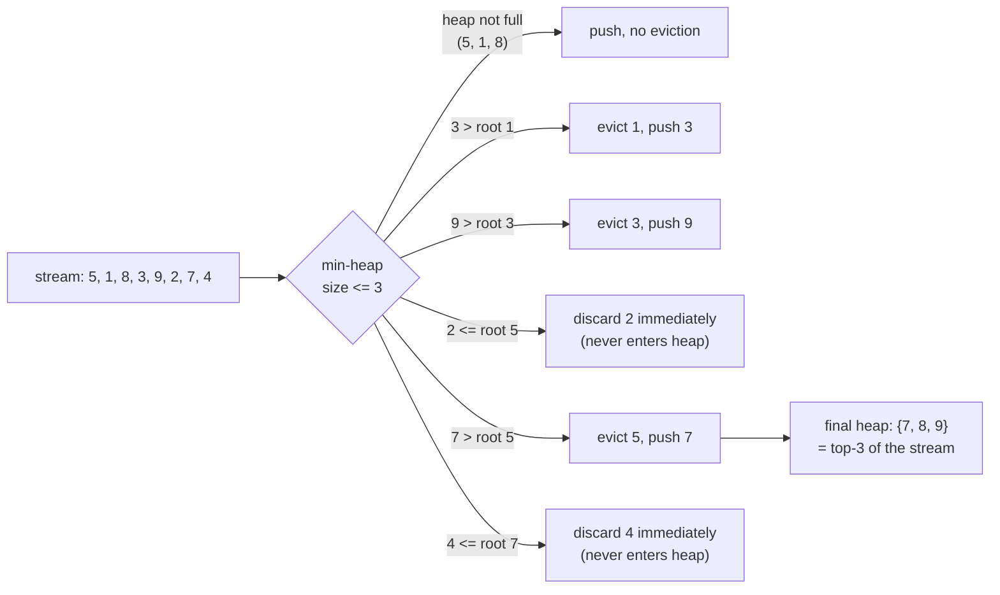

# Top-K & Streaming

"Find the k largest" looks like a sorting problem, and sorting solves it — but sorting also computes
and discards the relative order of everything that is *not* in the top k, which is wasted work the
moment k is much smaller than n. The other extreme, keeping only the running maximum, throws away too
much: it cannot answer "what is the 3rd largest so far" at all. The pattern here sits between the two,
sized to hold exactly the answer and nothing more.

The mechanism is a fixed-size heap, and the part that trips people up on first contact is which way it
points: finding the k **largest** values uses a **min**-heap, not a max-heap. The heap's root is only
ever compared against a brand-new candidate to decide "is this new item better than my current worst
survivor" — and the current worst survivor is the *minimum* of the k values kept so far. A min-heap
answers exactly that question in O(1), and evicts it in O(log k) if the newcomer wins. The inversion is
not a trick; it falls directly out of asking "what is my weakest kept item" rather than "what is my
strongest kept item."

The same fixed-size-window idea generalises past top-k. When the input is a stream too large to hold in
memory — or one whose length is not even known in advance — the working set has to be bounded by
something other than "read it all first, then decide." A size-k heap bounds it by value; reservoir
sampling, later on this page, bounds it by a different rule entirely: giving every item seen so far an
equal chance of being the one still held at the end.

## Core Concepts

| Term | Meaning |
|---|---|
| **Top-k largest** | The k greatest values in a collection, order among themselves usually unimportant |
| **Min-heap of size k** | Holds the k largest seen so far; its root is the smallest *of those k* — the next one evicted |
| **Quickselect** | Partition-based selection of the k-th order statistic without heap or full sort — see [Quickselect](../sorting/quickselect.md) |
| **Streaming / online** | Each item is seen once, in arrival order, and cannot be revisited without storing it |
| **Reservoir sampling** | Maintaining a uniform random sample of fixed size k from a stream of unknown or unbounded length |
| **Bounded-memory constraint** | A requirement, not a preference, that rules out algorithms needing O(n) extra storage regardless of their time complexity |

## Mechanism



Traced item by item, top-3 largest of `5, 1, 8, 3, 9, 2, 7, 4`, min-heap capped at size 3:

```text
item   action                                  heap after      discarded now
----   --------------------------------------  --------------  -------------
5      heap has room, push                     {5}             —
1      heap has room, push                     {1, 5}          —
8      heap has room, push (now full, k=3)     {1, 5, 8}       —
3      3 > root(1): evict 1, push 3            {3, 5, 8}       1 (evicted)
9      9 > root(3): evict 3, push 9            {5, 8, 9}       3 (evicted)
2      2 <= root(5): never enters the heap     {5, 8, 9}       2 (never entered)
7      7 > root(5): evict 5, push 7            {7, 8, 9}       5 (evicted)
4      4 <= root(7): never enters the heap     {7, 8, 9}       4 (never entered)

final heap: {7, 8, 9}  ==  the true top-3 of the stream  ✓
```

Every comparison is against the root alone — the heap never needs to know where a rejected item would
have ranked among the other k − 1 survivors, which is exactly why maintaining it costs O(log k) instead
of O(k).

<Tabs groupId="code-lang">
<TabItem value="python" label="Python">

```python showLineNumbers
import heapq

STREAM = [5, 1, 8, 3, 9, 2, 7, 4]


def top_k_largest(stream, k):
    """Min-heap of size k: the root is always the weakest of the k survivors."""
    heap = []
    for x in stream:
        if len(heap) < k:
            heapq.heappush(heap, x)
        elif x > heap[0]:              # only ever compares against the current worst kept item
            heapq.heapreplace(heap, x)  # pop-then-push in one O(log k) step
    return heap


result = top_k_largest(STREAM, 3)
assert sorted(result) == [7, 8, 9]
```

</TabItem>
<TabItem value="cpp" label="C++">

```cpp showLineNumbers
#include <cassert>
#include <queue>
#include <vector>

std::vector<int> top_k_largest(const std::vector<int>& stream, std::size_t k) {
    // std::priority_queue is a MAX-heap by default; std::greater<int> makes it a min-heap
    std::priority_queue<int, std::vector<int>, std::greater<int>> heap;
    for (int x : stream) {
        if (heap.size() < k) {
            heap.push(x);
        } else if (x > heap.top()) {
            heap.pop();
            heap.push(x);
        }
    }
    std::vector<int> out;
    while (!heap.empty()) { out.push_back(heap.top()); heap.pop(); }
    return out;
}
```

</TabItem>
</Tabs>

### Three ways to find the k largest, and when each wins

| Approach | Time | Extra space | Streams? |
|---|---|---|---|
| Sort everything, take the last k | O(n log n) worst | O(n) or O(1) in place | No — needs all n first |
| Min-heap of size k | O(n log k) worst | O(k) | Yes — one pass, O(k) memory |
| [Quickselect](../sorting/quickselect.md) for the k-th value, then filter | O(n) average, O(n^2) worst | O(1) extra (in-place partition) | No — needs random access and multiple passes over the same array |

The crossover is k against n. A full sort pays `O(n log n)` regardless of k; the heap pays
`O(n log k)`, which is cheaper whenever `k` is asymptotically smaller than `n` — and for the common
case of a small fixed k (top-10 results, top-100 leaderboard) the heap's per-item cost is `O(log k)`,
effectively constant. Quickselect is the fastest **average** case, `O(n)`, because each partition step
discards the side of the array that cannot contain the answer — see
[Quickselect](../sorting/quickselect.md) for the recurrence — but it needs the whole array addressable
and mutable in place, it does not preserve order among the k answers, and its worst case degrades to
`O(n^2)` on an adversarial pivot sequence, the same failure mode as quicksort. The heap is the only one
of the three that survives a stream it cannot rewind.

## Practical Usage

<Tabs groupId="code-lang">
<TabItem value="python" label="Python">

```python showLineNumbers
import heapq

# heapq.nlargest(n, iterable) — CPython's own note: "equivalent to sorted(iterable,
# reverse=True)[:n]" but implemented with a size-n heap when n is small relative to
# the input, which is exactly this pattern:
# https://docs.python.org/3/library/heapq.html#heapq.nlargest
assert heapq.nlargest(3, STREAM) == [9, 8, 7]

# a key function makes it rank objects, not just bare numbers
readings = [("sensor-a", 5), ("sensor-b", 9), ("sensor-c", 3)]
assert heapq.nlargest(1, readings, key=lambda r: r[1]) == [("sensor-b", 9)]
```

</TabItem>
<TabItem value="cpp" label="C++">

```cpp showLineNumbers
#include <algorithm>

// std::partial_sort_copy fills a destination range with the k largest/smallest
// from a source range, sorted — "as if by partial_sort" — in O(n log k)  [partial.sort.copy]
void top_k_via_partial_sort(const std::vector<int>& stream, std::vector<int>& out) {
    std::partial_sort_copy(stream.begin(), stream.end(), out.begin(), out.end(),
                            std::greater<int>());
}
```

</TabItem>
</Tabs>

Real call sites: top-N search results ranked by relevance score, "trending" leaderboards recomputed on
a rolling window, k-nearest-neighbour queries (a bounded max-heap of distances instead of a bounded
min-heap of values — same inversion, mirrored), and log-processing pipelines that must summarise a
firehose of events without buffering it.

### Reservoir sampling — bounded memory over an unknown-length stream

Top-k by a heap needs a comparable value to rank by. Reservoir sampling answers a different question —
"give me k items chosen uniformly at random from the whole stream" — when the stream's length is not
known ahead of time and cannot be stored to sample from afterward. Algorithm R keeps the first k items
outright, then for each later item at index `i` (0-based), replaces a uniformly random slot in the
reservoir with probability `k / (i + 1)`:

```python showLineNumbers
import random


def reservoir_sample(stream, k, rng):
    """Algorithm R (Vitter, 1985): each of the n items ends up in the sample with
    probability exactly k/n, using O(k) memory regardless of n."""
    reservoir = []
    for i, item in enumerate(stream):
        if i < k:
            reservoir.append(item)
        else:
            j = rng.randint(0, i)          # inclusive [0, i]
            if j < k:
                reservoir[j] = item
    return reservoir


rng = random.Random(0)
sample = reservoir_sample(range(1000), 5, rng)
assert len(sample) == 5
assert len(set(sample)) == 5               # Algorithm R never picks the same slot twice per step
```

Every item's final inclusion probability is `k / n` regardless of position in the stream — an early
item is initially certain to be in the reservoir but faces many chances to be evicted later; a late
item has only one chance to enter, at correspondingly higher odds, and the two effects exactly cancel.
The proof is an induction on `i`; see the reference below rather than re-deriving it here.

## Edge Cases & Pitfalls

- **Building a max-heap for top-k largest.** A max-heap answers "what is my strongest item" for O(1)
  peek, which is the wrong question for eviction — you need to compare a newcomer against the *current
  weakest survivor*, and finding the minimum of a max-heap is O(k), not O(1). This is the single most
  common bug in this pattern; see [Heaps & Priority Queues](../data-structures/heaps.md) for why a
  heap only gives O(1) access to the side it is built to prefer.
- **`heap[0]` peek without the size check.** Comparing against `heap[0]` before the heap has reached
  size k compares against the wrong thing — an empty or partially-filled heap has no "weakest of k"
  yet, so every item should be pushed unconditionally until the heap first reaches size k.
- **Reservoir sampling with `randint(0, i - 1)` instead of `randint(0, i)`.** Off-by-one in the random
  range silently biases the sample away from uniform — always inclusive of the current index `i`.
- **Ties at the eviction boundary.** `x > heap[0]` (strict) versus `x >= heap[0]` changes which of two
  equal-valued items survives when only one can. Neither is "more correct"; pick one and be consistent,
  and say so if determinism matters downstream.
- **Assuming quickselect works on a stream.** Quickselect needs the whole collection materialised and
  mutable for in-place partitioning; it is an in-memory, offline algorithm despite its O(n) average
  time looking attractive next to the heap's O(n log k).

## Comparisons

| | Min-heap top-k | Sort everything | [Quickselect](../sorting/quickselect.md) | Reservoir sampling |
|---|---|---|---|---|
| Answers | k largest, unordered among themselves | k largest, fully ordered, plus everything else's rank | The k-th order statistic (or a fixed top-k with post-filtering) | A uniform random k-subset |
| Time (worst) | O(n log k) | O(n log n) | O(n^2) | O(n) |
| Time (typical case named) | O(n log k) worst | O(n log n) worst | O(n) average | O(n) worst |
| Extra space | O(k) | O(1)–O(n) | O(1) extra | O(k) |
| Needs the full input up front | No | Yes | Yes | No |

## Recall

<Recall
  invariant="A min-heap of size k for top-k largest holds the k survivors seen so far, with its root always the weakest of those k — the only item a newcomer ever needs to beat."
  costs={[
    ["push/evict against a size-k heap (worst)", "O(log k)"],
    ["full stream of n items into a size-k heap (worst)", "O(n log k)"],
    ["sort then take top-k (worst)", "O(n log n)"],
    ["quickselect for the k-th value (average)", "O(n)"],
    ["quickselect for the k-th value (worst)", "O(n^2)"],
    ["reservoir sampling of k items, n unknown length (worst)", "O(n) time, O(k) space"],
  ]}
  reachFor="k is much smaller than n, or the input arrives as a stream you cannot rewind or fully hold in memory."
  trap="Reaching for a max-heap because the goal is the *largest* values — the heap direction is decided by which item you need to compare newcomers against for eviction, which is always the current weakest survivor."
/>

## References

- Cormen, Leiserson, Rivest & Stein, *Introduction to Algorithms*, 4th ed., Ch. 6 (heap operations)
  and §9.2 (the selection problem that quickselect solves) — the two structures this page's crossover
  argument is built from.
- Vitter, J. S. (1985), "Random Sampling with a Reservoir," *ACM Transactions on Mathematical
  Software* — Algorithm R and its uniform-probability proof.
- [`heapq.nlargest`](https://docs.python.org/3/library/heapq.html#heapq.nlargest) and
  [`heapq.heapreplace`](https://docs.python.org/3/library/heapq.html#heapq.heapreplace) — CPython
  docs; `nlargest`'s own note on when it beats `sorted()[:n]`.
- [`[partial.sort.copy]`](https://eel.is/c++draft/partial.sort.copy) — the C++ standard's guarantee for
  `std::partial_sort_copy`, O(n log k) in the destination range's length.

## Related Pages

- [Heaps & Priority Queues](../data-structures/heaps.md) — the structure behind every heap-based
  solution here, including why it gives O(1) access to only one end.
- [Quickselect](../sorting/quickselect.md) — the O(n)-average alternative when the input is fully in
  memory and only one order statistic is needed.
- [Probabilistic Data Structures](../data-structures/probabilistic-structures.md) — other structures
  that trade exactness for bounded memory over large or streaming inputs.
- [Randomized Algorithms & Sampling](../math-and-number-theory/randomized-algorithms-and-sampling.md)
  — the broader family reservoir sampling belongs to, and its proof techniques.
- [Recursion, Memoization & Tabulation](./recursion-memoization-tabulation.md) — a different kind of
  constraint (repeated subproblems, not bounded memory) driving a similarly disciplined choice of form.
