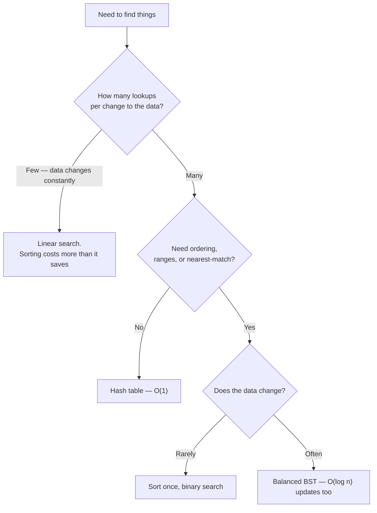

# Searching Algorithms — Overview

Every algorithm in this folder answers the same question — "is this value present, and where" — but
each one pays for the answer differently. Linear search pays nothing up front and $O(n)$ every time it
runs. Binary search pays $O(n \log n)$ once, up front, to sort the data, and $O(\log n)$ on every
lookup after that. A [hash table](../data-structures/hash-tables.md) pays $O(n)$ to build and $O(1)$
expected per lookup, at the cost of any ordering.

None of these is "the best search algorithm" in the abstract. The right choice is a question about
your **workload** — how many times you look something up before the data changes underneath you — not
a question about which algorithm is cleverest. This page works that trade-off out with actual
arithmetic, because "sorting is worth it if you search often enough" is true but useless until you know
what "often enough" means for your n.

## In This Section

- **[Linear Search](./linear-search.md)** — check each element. No preconditions, no preparation, and
  the only option when there is no ordering to exploit.
- **[Binary Search](./binary-search.md)** — halve the search space each step. Requires sorted, random-access
  data, and is notoriously easy to get subtly wrong at the boundaries.
- **[Binary Search on the Answer](./binary-search-on-answer.md)** — the same halving idea applied to a
  range of candidate answers instead of an array, for problems phrased as "find the smallest/largest
  value for which a condition holds."
- **[Exponential & Ternary Search](./exponential-and-ternary-search.md)** — exponential search for
  unbounded or streamed input where the size is not known in advance, and ternary search for finding an
  extremum of a unimodal function rather than a target value.

## The Options, Compared

| Approach | Preparation | Per lookup | Requires | Also gives you |
|---|---|---|---|---|
| [Linear search](./linear-search.md) | None | $O(n)$ | Nothing | Works on any sequence, any predicate |
| [Binary search](./binary-search.md) | $O(n \log n)$ sort | $O(\log n)$ | Sorted, random access | Range queries, nearest match, insertion point |
| [Hash table](../data-structures/hash-tables.md) | $O(n)$ build | $O(1)$ expected | Hashable keys | Nothing else — no ordering |
| [Balanced BST](../data-structures/balanced-trees.md) | $O(n \log n)$ build | $O(\log n)$ | Comparable keys | Ordering, ranges, and cheap updates |

## The Cost of the Precondition

Binary search's $O(\log n)$ lookup is not free — it is a rate you buy by paying an $O(n \log n)$
entrance fee to sort first. Whether that trade is worth it depends entirely on $q$, the number of
lookups you intend to run before the data changes again.

Compare the two totals directly, for $n$ elements and $q$ queries:

$$
\underbrace{q \cdot n}_{\text{repeated linear search}}
\quad\text{versus}\quad
\underbrace{n \log_2 n + q \log_2 n}_{\text{sort once, then binary search each time}}
$$

Sorting wins exactly when the second expression is smaller than the first. Solve for the break-even
point $q^{*}$:

$$
q \cdot n = n \log_2 n + q \log_2 n
\;\;\Longrightarrow\;\;
q (n - \log_2 n) = n \log_2 n
\;\;\Longrightarrow\;\;
q^{*} = \frac{n \log_2 n}{n - \log_2 n}
$$

For any $n$ large enough that $\log_2 n \ll n$ (true for essentially every $n$ worth searching), the
$-\log_2 n$ term in the denominator barely moves the answer, and $q^{*} \approx \log_2 n$. **The
break-even point is, to a very good approximation, one query per bit of the data's size** — a genuinely
small number of queries, which is why binary search's up-front cost so rarely dominates in practice.

<Figure src="/img/cs/algorithms/search-break-even.png"
        alt="Two lines against query count for n = 1000: a straight line for repeated linear search rising steeply, and a nearly flat line for sort-once-then-binary-search, crossing at roughly ten queries"
        caption="n = 1,000: repeated linear search (q·n) grows linearly in q; sort-once-then-binary-search (n log n + q log n) grows far more slowly. The two cross at q ≈ 10.1 — after ten queries, sorting has already paid for itself." />

:::warning[Do not sort inside a loop to enable a binary search]
This is a genuinely common performance bug. Sorting costs $O(n \log n)$ and a single binary search
saves at most $O(n) - O(\log n)$ over a linear scan, so re-sorting on every lookup is strictly worse
than never sorting at all — you pay the full entrance fee every time and use it once. Sort once outside
the loop, or reach for a structure that stays sorted incrementally
([balanced BST](../data-structures/balanced-trees.md)) if the data keeps changing.
:::

## Worked Example: n = 1,000

Plugging $n = 1{,}000$ into the exact break-even formula:

```text
log2(1000) ≈ 9.9658

q* = (1000 * 9.9658) / (1000 - 9.9658)
   = 9965.8 / 990.0342
   ≈ 10.066
```

So for a thousand elements, the eleventh query is where sorting-then-binary-searching becomes cheaper
in total than eleven separate linear scans — check the arithmetic directly:

```text
q = 10  linear: 10 * 1000        = 10,000
       sorted: 1000*9.9658 + 10*9.9658 = 9965.8 + 99.658  =  10,065.5   (sorted still costs more)

q = 11  linear: 11 * 1000        = 11,000
       sorted: 1000*9.9658 + 11*9.9658 = 9965.8 + 109.62  =  10,075.4   (sorted now wins)
```

Ten queries: linear search is still cheaper in total. Eleven queries: sorting has paid for itself. This
is also why "sort once, binary search $\log_2 n$ times" is the textbook justification for treating
$q \approx \log_2 n$ as the rule of thumb, and why it holds up almost regardless of $n$ — doubling $n$
to two million only moves the break-even point from about 10 to about 21.

## Deciding



## Recall

<Recall
  invariant="Every search method trades preparation cost for per-lookup cost; the right choice is set by q, the number of lookups you run before the data changes, not by which algorithm is cleverest."
  costs={[
    ["linear search, per lookup (worst)", "O(n)"],
    ["sort once, worst case", "O(n log n)"],
    ["binary search, per lookup (worst)", "O(log n)"],
    ["break-even query count", "q* ≈ log2 n"],
    ["hash table, per lookup (expected)", "O(1)"],
  ]}
  reachFor="Deciding, before writing any search code, whether the data is queried often enough (roughly log2 n times or more) to justify sorting it first."
  trap="Re-sorting inside a loop 'to enable binary search' pays the full O(n log n) entrance fee on every lookup — strictly worse than never sorting at all."
/>

## References

- Knuth, *The Art of Computer Programming*, Vol. 3, §6.1 (sequential search) and §6.2.1 (binary
  search) — the two baselines this page compares, with their exact comparison counts.
- Cormen, Leiserson, Rivest & Stein, *Introduction to Algorithms*, 4th ed., §12.1 — binary search
  trees as the incrementally-updatable alternative to sort-once-then-binary-search.
- Sedgewick & Wayne, *Algorithms*, 4th ed., §3.1 "Symbol Tables" — frames search structures by exactly
  this cost trade-off: preparation cost versus per-query cost versus update cost.

## Related Pages

- [Hash Tables](../data-structures/hash-tables.md) — the $O(1)$ option, and its conditions.
- [Balanced Trees](../data-structures/balanced-trees.md) — when the data keeps changing.
- [Sorting Algorithms](../sorting/intro.md) — the preparation step binary search depends on.
