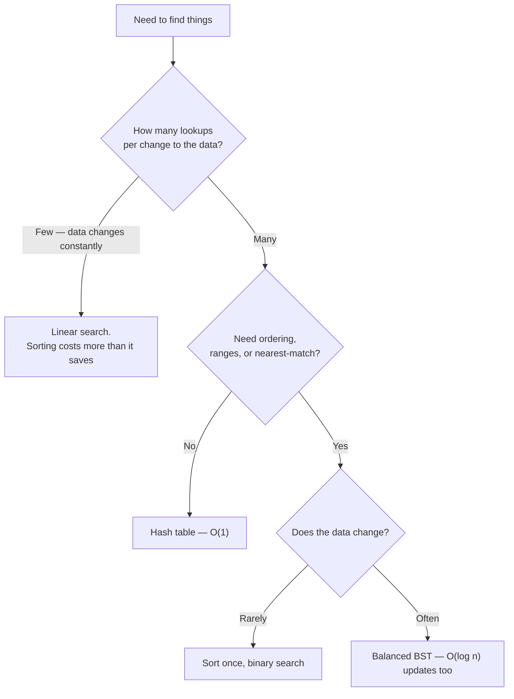

# Searching Algorithms — Overview

Searching looks trivial and hides the most useful trade-off in the field: **how much do you pay up
front to make later lookups cheap?** Linear search pays nothing and costs $O(n)$ every time. Binary
search costs $O(n \log n)$ to sort first, then $O(\log n)$ forever. A
[hash table](../data-structures/hash-tables.md) pays $O(n)$ to build and $O(1)$ per lookup.

Which is right depends entirely on the ratio of lookups to changes — a question about your workload,
not about the algorithms.

## In This Section

- **[Linear Search](./linear-search.md)** — check each element. No preconditions, no preparation.
- **[Binary Search](./binary-search.md)** — halve the space each step. Requires sorted data, and is
  notoriously easy to get subtly wrong.

## The Options, Compared

| Approach | Preparation | Per lookup | Requires | Also gives you |
|---|---|---|---|---|
| [Linear search](./linear-search.md) | None | $O(n)$ | Nothing | Works on any sequence, any predicate |
| [Binary search](./binary-search.md) | $O(n \log n)$ sort | $O(\log n)$ | Sorted, random access | Range queries, nearest match, insertion point |
| [Hash table](../data-structures/hash-tables.md) | $O(n)$ build | $O(1)$ expected | Hashable keys | Nothing else — no ordering |
| [Balanced BST](../data-structures/balanced-trees.md) | $O(n \log n)$ build | $O(\log n)$ | Comparable keys | Ordering, ranges, and cheap updates |

## Deciding

The break-even is worth internalising: sorting to enable binary search only pays off after roughly
$\log_2 n$ lookups. For a thousand elements that is about ten searches. Below that, scan.

:::warning[Do not sort inside a loop to enable a binary search]
This is a genuinely common performance bug: sorting costs $O(n \log n)$ and the binary search saves
$O(n)$ − $O(\log n)$ per lookup, so re-sorting per lookup is strictly worse than never sorting at all.
Sort once outside the loop, or use a hash table.
:::

## Related Pages

- [Hash Tables](../data-structures/hash-tables.md) — the $O(1)$ option, and its conditions.
- [Balanced Trees](../data-structures/balanced-trees.md) — when the data keeps changing.
- [Sorting Algorithms](../sorting/intro.md) — the preparation step binary search depends on.
