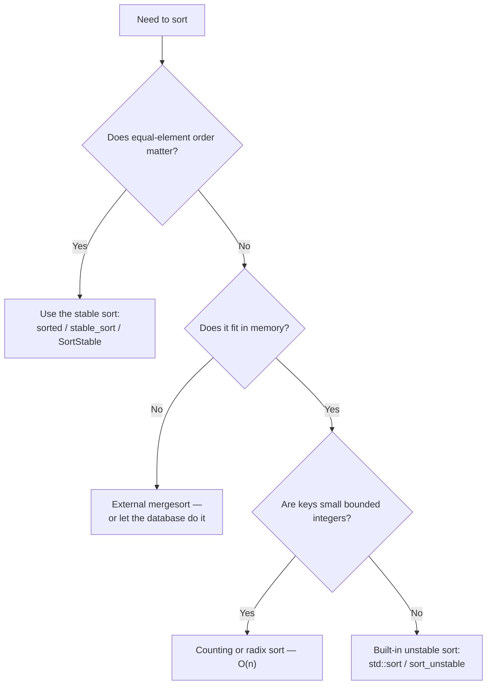

# Choosing a Sort

In almost every situation the correct answer is **call your language's built-in sort**. Those
implementations are hybrids refined over decades, and they beat hand-written sorts on nearly every
input. This page is about knowing what you are calling, and recognising the rare cases where the
default is wrong.

## What the standard libraries actually do

| Language | Function | Algorithm | Stable |
|---|---|---|---|
| Python | `sorted`, `list.sort` | **Timsort** | Yes |
| Java | `Arrays.sort` (objects), `Collections.sort` | Timsort | Yes |
| Java | `Arrays.sort` (primitives) | Dual-pivot quicksort | No |
| C++ | `std::sort` | **Introsort** | No |
| C++ | `std::stable_sort` | Mergesort (or in-place mergesort if memory is tight) | Yes |
| Rust | `sort` | Timsort-derived | Yes |
| Rust | `sort_unstable` | **pdqsort** (pattern-defeating quicksort) | No |
| Go | `slices.Sort` | pdqsort | No |
| Go | `slices.SortStable` | Insertion sort + symmerge | Yes |
| C | `qsort` | Implementation-defined; usually a quicksort hybrid | No |

Three designs cover almost all of that table.

### Timsort — adaptive mergesort

Invented by Tim Peters for Python in 2002, and since adopted by Java, Android, Rust and V8. The
premise is that **real data is rarely random**: it arrives partly ordered, appended to, or
concatenated from sorted pieces.

Timsort scans for existing sorted **runs**, extends short ones using
[insertion sort](./insertion-sort.md), and then merges runs under rules that keep the merge tree
balanced. On already-sorted input it finds one run and finishes in $O(n)$.

| Property | Value |
|---|---|
| Best case | **$O(n)$** — already sorted, or a handful of runs |
| Worst case | $O(n \log n)$ |
| Space | $O(n)$ |
| Stable | Yes |

What Timsort actually does, per its own design document
([CPython `listsort.txt`](https://github.com/python/cpython/blob/main/Objects/listsort.txt)):

1. **Run detection.** Scan forward to find the longest run that is already non-decreasing, or the
   longest that is strictly decreasing (which it then reverses in place — reversing a descending run
   preserves stability because it never needs to reorder equal elements past each other). A single
   left-to-right scan finds these runs in $O(n)$ total.
2. **Run extension.** A run shorter than `MIN_RUN` (computed from `n` so that `n / MIN_RUN` is close to
   a power of two, typically landing in 32–64) is extended up to that length using **binary insertion
   sort** — see [Insertion Sort's cutoff discussion](./insertion-sort.md) for why this trade is worth
   making at small sizes.
3. **Merging with a size-ratio invariant.** Runs are pushed onto a stack, and merged when the stack's
   top three runs' lengths violate an invariant (roughly, each run should be larger than the sum of the
   next two) that keeps the merges balanced and the total merge cost $O(n \log n)$ in the worst case,
   without needing to know all run lengths in advance.
4. **Galloping merge.** During an ordinary merge, if one run keeps "winning" many comparisons in a row
   (its elements keep being smaller than the other run's front), Timsort switches to **galloping
   mode**: instead of comparing one element at a time, it binary-searches for how many consecutive
   elements from the winning run can be bulk-copied at once. This is what makes Timsort fast — not just
   $O(n)$-adjacent — on inputs built from a few long sorted stretches, such as two already-sorted lists
   concatenated together, where a plain merge would still do $Θ(n)$ one-at-a-time comparisons but
   galloping collapses long stretches into $O(\log n)$ work each.

### Introsort — quicksort that cannot degrade

C++'s `std::sort`. Runs [quicksort](./quicksort.md), but:

- switches to [insertion sort](./insertion-sort.md) for ranges below ~16 elements — the same
  small-n cutoff argument as Timsort's `MIN_RUN` extension, applied to quicksort's base case instead
  of a merge's;
- switches to [heapsort](./heapsort.md) when recursion depth exceeds a budget of
  $2 \cdot \log_2 n$ partitions.

The depth limit is the entire mechanism: it caps how far quicksort is allowed to keep making bad,
unbalanced partitioning choices before the algorithm gives up and hands the remaining range to
heapsort's guaranteed $O(n \log n)$. This is why introsort's *worst case* is $O(n \log n)$ even though
plain quicksort's is $O(n^2)$ — the depth budget makes the bad case unreachable rather than merely
unlikely. [cppreference on `std::sort`](https://en.cppreference.com/w/cpp/algorithm/sort) documents
the standard's complexity requirement as $O(N \log N)$ comparisons — a requirement the C++ standard
places on the algorithm itself, which is exactly why an unguarded plain quicksort (worst case
$O(n^2)$) cannot legally implement `std::sort`; the depth-limited hybrid is what makes the guarantee
achievable. libstdc++'s actual source (`bits/stl_algo.h`) implements the depth budget as
`std::__lg(n) * 2` recursion levels before switching to a partial heapsort, matching the
$2 \log_2 n$ figure quoted above.

### pdqsort — pattern-defeating quicksort

Rust's `sort_unstable` and Go's `slices.Sort`. Introsort plus pattern detection: it recognises
already-sorted and reverse-sorted runs, uses three-way partitioning when duplicates are common, and
breaks up adversarial patterns by shuffling deterministically when partitions come out badly. The
result is $O(n)$ on several common shapes while keeping introsort's guarantees.

## How to Choose

| Situation | Use |
|---|---|
| Anything, by default | The built-in sort |
| Sorting by a secondary key after a primary | A **stable** sort |
| Hard real-time or adversarial input | [Heapsort](./heapsort.md) or introsort — bounded worst case |
| Data larger than RAM | External [mergesort](./mergesort.md) |
| Integer keys in a small known range | Counting sort — $O(n + k)$ |
| Fixed-width keys (integers, dates, strings) | Radix sort — $O(nw)$ |
| Fewer than ~16 elements | [Insertion sort](./insertion-sort.md) |
| Only need the top k | A [heap](../data-structures/heaps.md) — $O(n + k \log n)$ |
| Only need the median or k-th element | Quickselect — $O(n)$ average |

:::tip[Sort keys, not records]
When elements are large, sorting them directly copies a lot of bytes per move. Sort an array of
indices or pointers using the record as the comparison key, then permute once at the end. This is
also how you sort the same data by several different keys without duplicating it.

The related trick is the **decorate-sort-undecorate** pattern — Python's `key=` argument does exactly
this, computing each key once instead of on every comparison.
:::

## Edge Cases & Pitfalls

:::danger[An inconsistent comparator is undefined behaviour, not a wrong answer]
Comparison sorts require a **strict weak ordering**: if `a < b` then not `b < a`, comparison must be
transitive, and equivalence must be transitive too. Violating it — `return a.score >= b.score`
instead of `>`, or a comparator using a mutable field — does not merely produce a wrongly-ordered
list. In C++ it is undefined behaviour and routinely reads out of bounds; Java throws
`IllegalArgumentException: Comparison method violates its general contract!`, but only sometimes,
depending on input size.

Write `<`, never `<=`, in a comparator.
:::

- **Comparing floats with NaN breaks the ordering**, since every comparison with NaN is false. Filter
  or handle NaN explicitly.
- **Sorting a mostly-sorted list with an unstable sort still costs $O(n \log n)$** in introsort or
  pdqsort's non-detected cases. Timsort is the one that exploits it fully.
- **`sort()` mutates, `sorted()` copies** in Python. The same distinction is `sort` vs. `to_vec` then
  sort in Rust; picking the wrong one is a silent aliasing bug.
- **Do not write your own sort for production.** The cases you will get wrong — equal keys, depth
  limits, comparator contracts — are exactly the ones these implementations spent years on.

## Recall

<Recall
  invariant="Every production sort is a hybrid that picks the cheapest algorithm for the shape of data it currently has: insertion sort below a size cutoff, a fast general algorithm above it, and (for introsort and pdqsort) a guaranteed fallback when the fast algorithm's assumptions fail."
  costs={[
    ["Timsort, already-sorted input (best)", "O(n)"],
    ["Timsort (worst)", "O(n log n)"],
    ["introsort (worst, depth-budget guaranteed)", "O(n log n)"],
    ["pdqsort, several common patterns (best)", "O(n)"],
  ]}
  reachFor="Almost never — the entire point of this page is that the built-in sort already made this decision correctly. Reach for a specific algorithm only for the narrow cases in the table above (external data, minimal writes, top-k)."
  trap="Assuming an unstable sort is 'basically stable' on mostly-sorted data. Instability is a correctness property of the algorithm, not a property of the input — it shows up exactly when a secondary sort key exists, which nearly-sorted test data rarely has."
/>

## References

- Peters, T., [Timsort description](https://github.com/python/cpython/blob/main/Objects/listsort.txt) — the original design notes, and an unusually readable engineering document.
- Musser, D. (1997), ["Introspective Sorting and Selection Algorithms"](https://www.cs.rpi.edu/~musser/gp/introsort.ps) — introsort.
- Peters, O. (2021), [pdqsort](https://github.com/orlp/pdqsort) — the pattern-defeating quicksort implementation and its rationale.
- [cppreference — `std::sort`](https://en.cppreference.com/w/cpp/algorithm/sort) — the standard's complexity requirement that introsort exists to satisfy.

### Books & Videos

- Sedgewick & Wayne, *Algorithms*, 4th ed., §2.5 — "Sorting Applications", on choosing among sorts in practice.

## Related Pages

- [Sorting Algorithms — Overview](./intro.md) — the comparison table for all six algorithms.
- [Complexity & Analysis](../complexity/intro.md) — including why $O(n)$ sorts need assumptions about the keys.
- [Heaps & Priority Queues](../data-structures/heaps.md) — for the top-k and median cases above.
