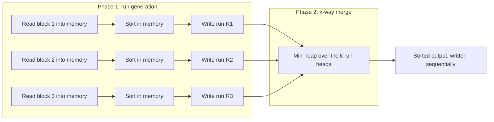

# External & Parallel Sorting

Every algorithm on the earlier pages of this folder assumes the whole array fits in memory, so any two
elements cost the same to compare regardless of where they sit. That assumption breaks the moment the
data is larger than RAM. A disk (spinning or SSD) is not a slower array — it is a device where
**sequential** access is fast and **random** access is dramatically slower, by a factor that dwarfs any
constant-factor difference between comparison sorts. Sorting big data is therefore not "run
[quicksort](./quicksort.md) but slower" — it is a different algorithm, chosen to minimize the number of
disk *passes* and to make every pass sequential, because the metric that matters is no longer the
comparison count at all.

The algorithm that does this is a variant of [mergesort](./mergesort.md): split the data into chunks
that fit in memory, sort each chunk in place (an internal sort, cheap and already covered), write each
sorted chunk back out as a **run**, then merge the runs. Mergesort's merge step is naturally sequential
— it only ever reads the next unread element of each run — which is exactly the access pattern a disk
rewards. The same run-generation-then-merge shape parallelizes across machines for the same underlying
reason: sequential ranges hand off cleanly between workers, while random access does not.

:::info[Prerequisites]
Requires [mergesort](./mergesort.md)'s merge step, extended here to more than two runs at once, and
benefits from [heaps](../data-structures/heaps.md) for the k-way merge's priority queue.
:::

## Core Concepts

| Term | Meaning |
|---|---|
| **Run** | A maximal sorted chunk of data, produced either by an internal sort of one memory-sized block or by replacement selection |
| **Run generation** | The first phase: read memory-sized chunks, sort each internally, write each out as one run |
| **k-way merge** | Merging `k` sorted runs at once by always taking the smallest of the `k` current heads, tracked with a min-heap |
| **Merge pass** | One full read-and-rewrite of all the data, halving (or `1/k`-ing) the number of runs remaining |
| **I/O cost model** | Counts disk block reads/writes, not comparisons — the number that actually predicts wall-clock time for out-of-memory data |
| **Replacement selection** | A run-generation technique using a heap of memory size that produces runs roughly twice the memory size on average, not exactly memory size |

## Mechanism

Two phases. First, **run generation**: read as much as fits in memory, sort it with any internal sort,
write it back out as one sorted run. Repeat until the input is consumed. Second, **merge**: repeatedly
merge sorted runs into fewer, larger sorted runs, until one run remains.



### Worked trace: 8 records, room for 3 in memory

```text
input = [5, 1, 8, 3, 9, 2, 7, 4]   (memory holds 3 records at a time)

-- run generation: read 3 at a time, sort internally, write as a run --
chunk 1: [5, 1, 8] -> sorted -> run R1 = [1, 5, 8]
chunk 2: [3, 9, 2] -> sorted -> run R2 = [2, 3, 9]
chunk 3: [7, 4]    -> sorted -> run R3 = [4, 7]        (final chunk, shorter)

-- 3-way merge: one head per run held in memory (3 slots), a min-heap picks the smallest --
heads  R1=1 R2=2 R3=4  -> pop 1 (R1)            output = [1]                R1 -> 5
heads  R1=5 R2=2 R3=4  -> pop 2 (R2)            output = [1,2]              R2 -> 3
heads  R1=5 R2=3 R3=4  -> pop 3 (R2)            output = [1,2,3]            R2 -> 9
heads  R1=5 R2=9 R3=4  -> pop 4 (R3)            output = [1,2,3,4]          R3 -> 7
heads  R1=5 R2=9 R3=7  -> pop 5 (R1)            output = [1,2,3,4,5]        R1 -> 8
heads  R1=8 R2=9 R3=7  -> pop 7 (R3)            output = [...,7]            R3 exhausted
heads  R1=8 R2=9       -> pop 8 (R1)            output = [...,8]            R1 exhausted
heads  R2=9            -> pop 9 (R2)            output = [1,2,3,4,5,7,8,9]  done

Three runs merged in a single pass because k (3-way) equals the number of runs produced.
```

Only 3 memory slots are ever occupied during the merge — one head value per run — regardless of how
long each run is, because a run is read strictly in order and never revisited. This is the property
that makes external mergesort correct with a fixed, small memory budget no matter how large the input
is: memory usage during the merge depends on the number of runs being merged at once, not on their
length.

<Tabs groupId="code-lang">
<TabItem value="python" label="Python">

```python showLineNumbers
import heapq


def run_generation(records, memory_size):
    """Splits records into memory_size-sized chunks, each sorted, as separate runs."""
    runs = []
    for i in range(0, len(records), memory_size):
        chunk = sorted(records[i:i + memory_size])
        runs.append(chunk)
    return runs


def k_way_merge(runs):
    """Merges any number of sorted runs using a min-heap of (value, run_index, position)."""
    heap = [(run[0], r, 0) for r, run in enumerate(runs) if run]
    heapq.heapify(heap)
    out = []
    while heap:
        value, r, i = heapq.heappop(heap)
        out.append(value)
        if i + 1 < len(runs[r]):
            heapq.heappush(heap, (runs[r][i + 1], r, i + 1))
    return out
```

</TabItem>
<TabItem value="cpp" label="C++">

```cpp showLineNumbers
#include <algorithm>
#include <cassert>
#include <queue>
#include <tuple>
#include <vector>

std::vector<std::vector<int>> run_generation(const std::vector<int>& records, std::size_t memory_size) {
    std::vector<std::vector<int>> runs;
    for (std::size_t i = 0; i < records.size(); i += memory_size) {
        std::size_t end = std::min(records.size(), i + memory_size);
        std::vector<int> chunk(records.begin() + i, records.begin() + end);
        std::sort(chunk.begin(), chunk.end());
        runs.push_back(std::move(chunk));
    }
    return runs;
}

std::vector<int> k_way_merge(const std::vector<std::vector<int>>& runs) {
    using Entry = std::tuple<int, int, int>;               // value, run index, position
    std::priority_queue<Entry, std::vector<Entry>, std::greater<>> heap;
    for (int r = 0; r < static_cast<int>(runs.size()); ++r) {
        if (!runs[r].empty()) heap.emplace(runs[r][0], r, 0);
    }
    std::vector<int> out;
    while (!heap.empty()) {
        auto [value, r, i] = heap.top();
        heap.pop();
        out.push_back(value);
        if (i + 1 < static_cast<int>(runs[r].size())) {
            heap.emplace(runs[r][i + 1], r, i + 1);
        }
    }
    return out;
}
```

</TabItem>
</Tabs>

<Tabs groupId="code-lang">
<TabItem value="python" label="Python">

```python showLineNumbers
# checked on the traced input: 8 records, room for 3 in memory
runs = run_generation([5, 1, 8, 3, 9, 2, 7, 4], memory_size=3)
assert runs == [[1, 5, 8], [2, 3, 9], [4, 7]]
assert k_way_merge(runs) == [1, 2, 3, 4, 5, 7, 8, 9]
```

</TabItem>
<TabItem value="cpp" label="C++">

```cpp showLineNumbers
int main() {
    auto runs = run_generation({5, 1, 8, 3, 9, 2, 7, 4}, 3);
    std::vector<std::vector<int>> expected = {{1, 5, 8}, {2, 3, 9}, {4, 7}};
    assert(runs == expected);
    assert((k_way_merge(runs) == std::vector<int>{1, 2, 3, 4, 5, 7, 8, 9}));
}
```

</TabItem>
</Tabs>

### The memory/passes arithmetic

With `M` records fitting in memory, run generation produces `⌈N / M⌉` initial runs from `N` total
records. A merge that combines `k` runs at once needs `k` read buffers plus one write buffer — so with
`M` memory slots available, the widest merge possible is `k = M − 1`. Reducing the number of runs from
`⌈N / M⌉` down to 1 by merging `k` at a time takes:

```text
passes = ⌈ log_k(N / M) ⌉
```

For the traced example, `N = 8`, `M = 3`, and `k = 3`-way merge was wide enough to consume all
`⌈8/3⌉ = 3` runs in a single pass. A larger dataset with the same memory needs more passes: with
`N = 1,000,000` and `M = 1,000` (so 1,000 initial runs) and a 10-way merge, `⌈log_10(1000)⌉ = 3` merge
passes finish it — each pass reading and writing the entire dataset sequentially exactly once, which is
why the pass count, not a comparison count, is what predicts wall-clock time on disk. This is the
standard external-sort analysis; see Sedgewick & Wayne 4th ed. §2.4's closing notes on multiway merges
and CLRS 4th ed. §8's problem on the external-memory model.

## Practical Usage

- **`ORDER BY` on a table larger than the buffer pool.** Database engines fall back to exactly this
  external merge sort when a sort operation exceeds its memory budget — visible in PostgreSQL's
  `EXPLAIN ANALYZE` as an "external merge Disk" sort method
  ([PostgreSQL docs, "Sort Methods"](https://www.postgresql.org/docs/current/using-explain.html)),
  distinguished from the in-memory "quicksort" method the same operator uses when the data fits.
- **`sort` on the command line.** GNU `sort` automatically switches to external merge sort for inputs
  larger than its memory buffer (`--buffer-size`), using temporary files as runs — this is the same
  algorithm traced above, running on real files instead of an in-memory list.
- **MapReduce / Spark shuffle sorts.** The "shuffle" phase of a distributed job is externally sorted
  data moving between machines: each mapper produces sorted, partitioned runs, and each reducer
  performs a k-way merge over the partitions routed to it — the parallel case below.

## Parallel merge and where it stops scaling

Run generation parallelizes almost for free: each memory-sized chunk is independent, so `P` machines
(or threads) each sort `N / P` records concurrently with zero coordination. The merge phase does not
parallelize as cleanly, because a k-way merge has one true bottleneck: at any instant, only the
globally smallest remaining head can be emitted next, and that decision serializes through one
data structure (the heap, or a single output stream).

The usual fix is to parallelize merging by **key range** rather than by run: partition the value space
into `P` disjoint ranges up front (a lightweight sample or a known domain split), route each record to
the partition its key falls into during run generation, and merge each partition independently and in
parallel — since ranges are disjoint, no partition's output needs to know about another's, and
concatenating the `P` sorted partitions in range order is free. This is exactly what a distributed
shuffle sort does, and it is where the scaling limit actually is: it needs the partition boundaries
chosen well enough to balance load, because one partition holding a disproportionate share of the keys
(a skewed key distribution) becomes the slowest worker and the whole sort waits on it. Beyond that,
adding more machines has a floor set by the sequential I/O bandwidth of whatever storage or network
every worker ultimately writes results through — parallel *compute* does not remove a shared *I/O*
bottleneck.

## Edge Cases & Pitfalls

- **Treating disk sort as "the same algorithm, just slower".** The optimization target changes from
  comparisons to sequential I/O passes; an internal sort with fewer comparisons but more random access
  (e.g. quicksort's partition scanning both ends of an out-of-memory array) can lose badly to a merge
  sort that touches memory in a strictly linear order.
- **Merging too few runs at a time.** A 2-way merge on 1,000 initial runs needs `⌈log_2(1000)⌉ = 10`
  passes; a 10-way merge on the same runs needs only `⌈log_10(1000)⌉ = 3`. Each pass rereads and
  rewrites the entire dataset, so the difference is 10 full sequential scans versus 3 — not a rounding
  error at scale.
- **Ignoring output-buffer accounting.** `k = M` (using every memory slot as an input buffer) leaves
  nowhere to build the merged output before writing it — the usable merge width is `M − 1`, not `M`.
- **Skewed partitioning in the parallel case.** Splitting the key space into equal-width ranges (rather
  than equal-*count* ranges, from a sample) assumes a uniform key distribution; a skewed real dataset
  then sends most records to one partition, and that partition's worker becomes the critical path no
  matter how many other workers finish early.

## Comparisons

| | I/O passes | Parallelizes | Notes |
|---|---|---|---|
| **External merge sort** | O(log_k(N/M)) | Run generation: yes, embarrassingly. Merge: needs key-range partitioning | The standard answer once data exceeds memory |
| In-memory quicksort/mergesort | n/a (fits in RAM) | Depends on implementation | Not applicable once `N` exceeds memory — the comparison it's often held against is a category error |
| Distributed shuffle sort (MapReduce/Spark) | Proportional to data volume moved across the network | Yes, by key-range partition | Network transfer, not disk seek, is usually the dominant cost here |
| Replacement selection (run generation variant) | Produces runs ~2× memory size on average | Same as standard run generation | Fewer, longer runs mean fewer merge passes at the cost of a more complex heap-based generation step |

## Recall

<Recall
  invariant="Once data exceeds memory, sequential access and random access stop costing the same — external sorting's whole design (sorted runs, then a k-way merge) exists to make every disk pass sequential, which is why the metric that matters becomes the pass count, not the comparison count."
  costs={[
    ["run generation over N records, memory M (worst)", "O(N log M) compute, O(N/M) sequential runs written"],
    ["merge passes to finish, k-way merge (worst)", "O(log_k(N/M))"],
    ["total I/O, all passes (worst)", "O(N) per pass × number of passes"],
    ["memory used during a k-way merge (worst)", "O(k), independent of run length"],
  ]}
  reachFor="A sort where the data does not fit in memory — a database ORDER BY over more rows than the buffer pool, a Unix `sort` on a multi-gigabyte file, or a distributed shuffle."
  trap="Widening the merge to use all M memory slots as input buffers, leaving none for the output buffer that must exist before anything can be written back out."
/>

## References

- Cormen, Leiserson, Rivest & Stein, *Introduction to Algorithms*, 4th ed., Ch. 8 problems on
  external-memory sorting — the disk I/O cost model and why pass count replaces comparison count.
- Sedgewick & Wayne, *Algorithms*, 4th ed., §2.4 "Priority Queues", closing notes on multiway merges
  and external sorting with a heap-based k-way merge.
- [PostgreSQL documentation, "Using EXPLAIN" — Sort Methods](https://www.postgresql.org/docs/current/using-explain.html)
  — the "external merge Disk" sort method shown in query plans once a sort exceeds `work_mem`.

## Related Pages

- [Mergesort](./mergesort.md) — the two-way merge this page generalizes to k runs and to disk-resident
  data.
- [Heaps](../data-structures/heaps.md) — the priority queue that makes a k-way merge O(log k) per
  emitted element instead of O(k).
- [Choosing a Sort](./choosing-a-sort.md) — why an in-memory sort is the right default until the data
  genuinely stops fitting in RAM.
- [Amortized Analysis](../complexity/amortized-analysis.md) — a different setting where "count the
  passes, not the individual operations" is also the right way to reason about total cost.
