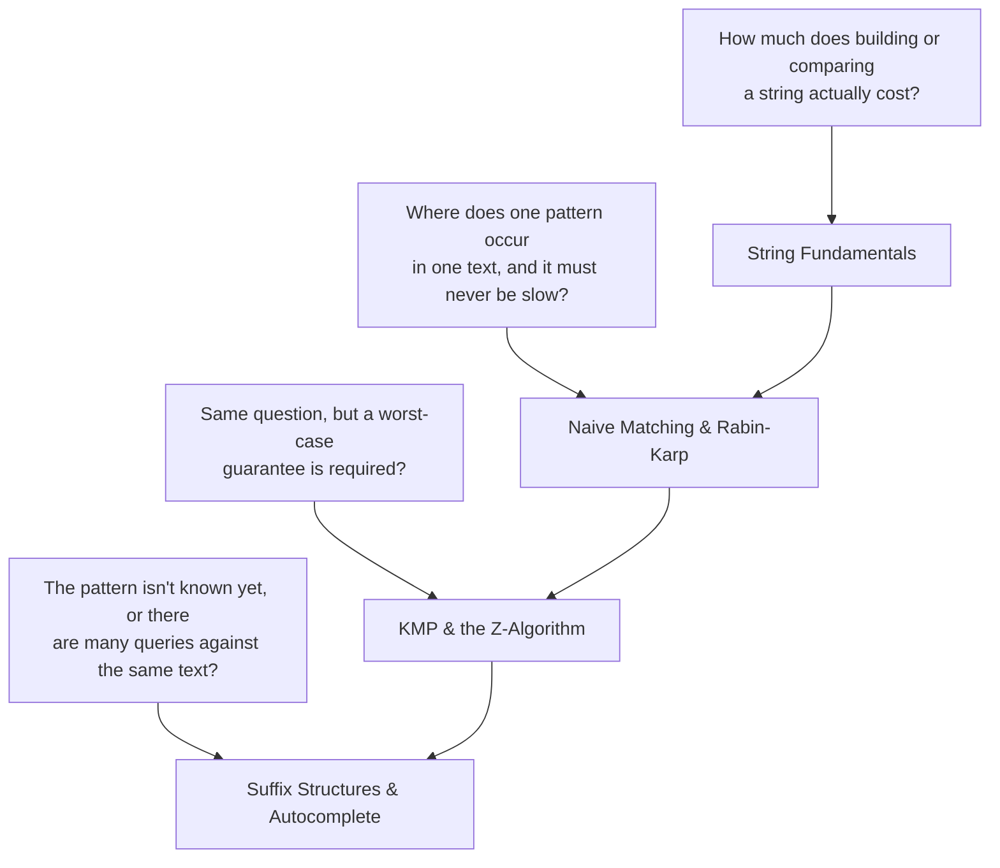

# Strings & Text

A string is an array — but three things about it break the assumptions the rest of this section
leans on. First, the "alphabet" is a parameter, not a constant: an array of 32-bit integers has an
effectively unbounded alphabet, but a DNA string has four symbols and an English one has roughly
26 to 100 depending on case and punctuation. Algorithms that build a table indexed by "the next
character" (Boyer-Moore's bad-character rule, a trie's child array) pay for that table in terms of
alphabet size Σ, and a small Σ makes some structures cheap that would be wasteful on `int`s. Second,
strings in most languages are **immutable** — Python's `str`, Java's `String`, C++'s
`std::string` is the odd one out here — so "modify a string" is really "build a new one", and how
you build it changes an algorithm's complexity by a full order. Third, and easy to forget:
comparing two strings is not O(1). Two `int`s compare in one machine instruction; two strings of
length m compare in **O(m)** in the worst case, because equality can only be ruled out by looking
at where they first differ, and that first difference might be the last character.

That last point is the one bug every language hides well enough to make people forget it. `s1 == s2`
*looks* like a single operation — it returns one boolean, it takes one line — but if `s1` and `s2`
share the first 999 characters of a 1,000-character string and differ only at the last, the runtime
compared 1,000 characters to say so. An algorithm that compares strings inside a loop without
accounting for this is not O(n) in the number of strings, it is O(n·m) in the number of strings
times their length — the same trap as calling `list.insert(0, x)` inside a loop and being surprised
the whole thing is quadratic. Every page in this folder is, in one way or another, about not
re-paying that O(m) cost more times than the problem requires.



Each arrow above is "read this page when you have this problem"; the chain along the bottom is also
the reading order, since each page assumes the cost model or the matcher the previous one built.

## Core Concepts

| Term | Meaning |
|---|---|
| **Alphabet (Σ)** | The set of distinct symbols a string can contain. A parameter to string algorithms the way `n` is a parameter to sorting |
| **Immutability** | The guarantee that an existing string value never changes in place; every "modification" produces a new string |
| **String builder** | A structure (a list of parts, a mutable buffer) that defers the final immutable string until all pieces are known, to avoid repeated full copies |
| **Comparison cost** | Two strings of length m compare in O(m) worst case — not O(1) — because equality requires ruling out every prefix match up to the first difference |
| **Pattern matching** | Finding where a short string (the pattern) occurs inside a long one (the text); the subject of two of this folder's five pages |

## Mechanism

The map above names the shape of each problem; the folder answers them in this order:

1. **[String Fundamentals](./string-fundamentals.md)** — before matching anything, the cost model:
   what immutability costs when building strings, what slicing costs, and why two strings that look
   identical on screen can fail `==`.
2. **[Naive Matching & Rabin-Karp](./naive-matching-and-rabin-karp.md)** — the O(nm) baseline matcher,
   the input that actually makes it slow, and the rolling-hash trick that gets expected-case linear
   time out of arithmetic instead of comparisons.
3. **[KMP & the Z-Algorithm](./kmp-and-z-algorithm.md)** — the same matching problem solved with a
   worst-case O(n + m) guarantee, by never re-reading a text character once it has been seen.
4. **[Suffix Structures & Autocomplete](./suffix-structures-and-autocomplete.md)** — when the pattern
   is not known in advance, or there are many of them: structures built once from the text, queried
   many times.

Trace input — comparing two 1,000-character strings that are identical everywhere except one index,
first with the difference at the very end, then with it at the very start:

```text
s1 = "a" * 999 + "b"     s2 = "a" * 999 + "c"      # differ only at index 999
compare(s1, s2):
  index 0:    'a' == 'a'   continue
  index 1:    'a' == 'a'   continue
  ...
  index 998:  'a' == 'a'   continue
  index 999:  'b' != 'c'   unequal -- stop
  characters examined: 1000   (the whole string, because everything before the last char matched)

s1 = "x" + "a" * 999      s2 = "y" + "a" * 999      # differ only at index 0
compare(s1, s2):
  index 0:    'x' != 'y'   unequal -- stop
  characters examined: 1      (the first comparison already disproves equality)
```

Same two 1,000-character strings, same `==` operator, a 1,000x difference in work — because string
comparison is not a fixed-cost operation, it is a **linear scan that stops early on the first
mismatch**. The worst case (last-character difference, or no difference at all — full equality)
still costs O(m); the best case (first-character difference) costs O(1). Both are real: hashing two
random passwords hits the worst case almost every failed attempt, since a wrong password rarely
shares a long common prefix with the right one by chance, but comparing sorted, near-duplicate log
lines can hit it on purpose.

## Practical Usage

- **CPython** implements `str.__eq__` as a length check first, then a byte-for-byte `memcmp`-style
  scan — see the `unicode_compare_eq` path in
  [CPython's `Objects/unicodeobject.c`](https://github.com/python/cpython/blob/main/Objects/unicodeobject.c),
  which returns `false` immediately on a length mismatch before comparing a single character.
- **C++** `std::string::operator==` is specified to behave as `compare() == 0`
  ([`[string.cmp]`](https://eel.is/c++draft/string.cmp)), and implementations universally
  short-circuit on length before scanning content — but the standard only requires the *result*,
  not the short-circuit, so do not rely on the constant-time length check being the only work done.
- **Hashing before comparing** (a hash table, a `set` of strings) turns repeated equality checks
  into one O(m) hash computation per string plus O(1) expected comparisons of hash values — the
  hash can be cached (Python interns and caches `str.__hash__` results) so it is computed once even
  across many lookups of the same string object.

## Edge Cases & Pitfalls

- **Treating string equality as O(1) inside a loop.** Deduplicating a list of strings with a nested
  `for` loop and `==` is not O(n) comparisons, it is O(n²·m) character comparisons — use a `set` or
  `dict` to pay the O(m) hashing cost once per string instead of once per pair.
- **Alphabet size ignored when choosing a structure.** A 256-entry child array per trie node is
  cheap for lowercase ASCII and wasteful for Unicode text, where the same array either needs a hash
  map per node or a much larger, mostly-empty array.
- **Assuming immutability means "no cost".** Immutable does not mean free — see
  [String Fundamentals](./string-fundamentals.md) for exactly what a naive concatenation loop costs
  and why.

## Comparisons

| | Alphabet dependence | Typical structure | Owning page |
|---|---|---|---|
| Building a string | None | Builder / list-then-join | String Fundamentals |
| Comparing / hashing | None (cost is length, not Σ) | Direct scan, or cached hash | String Fundamentals |
| One pattern, one text | Low (Σ affects table size, not the bound) | KMP / Rabin-Karp | Naive Matching & Rabin-Karp, KMP & Z-Algorithm |
| Many patterns, one text | Matters for the hash-set size | Rabin-Karp with a hash set | Naive Matching & Rabin-Karp |
| Many queries, one text | Matters for trie/automaton fanout | Suffix array / trie | Suffix Structures & Autocomplete |

Reading order matters here more than in most folders: Fundamentals sets the cost model that the
other three pages assume without re-deriving, and Naive Matching motivates KMP by showing exactly
where the naive approach wastes work.

## Recall

<Recall
  invariant="A string's alphabet size, its immutability, and its O(m) comparison cost are three parameters that shape every algorithm in this folder — none of them apply to a plain numeric array."
  costs={[
    ["string equality / comparison (worst)", "O(m)"],
    ["string equality (best, differs at index 0)", "O(1)"],
    ["hashing a string once (worst)", "O(m)"],
    ["repeated hash lookup, same string object (amortized, CPython caches the hash)", "O(1)"],
  ]}
  reachFor="Any problem where the input is text and the naive approach compares or rebuilds strings inside a loop without accounting for their length."
  trap="Treating `s1 == s2` as a constant-time operation the way `x == y` is for integers -- it is a linear scan that only sometimes stops early."
/>

## References

- Cormen, Leiserson, Rivest & Stein, *Introduction to Algorithms*, 4th ed., Ch. 32 — the string-matching
  chapter this folder's pattern-matching pages draw their bounds from.
- Sedgewick & Wayne, *Algorithms*, 4th ed., Ch. 5 "Strings" — alphabet-size-aware analysis of tries,
  substring search, and suffix structures, with measured comparisons on real text.
- D. Gusfield, *Algorithms on Strings, Trees, and Sequences*, 1997 — the standard reference for suffix
  arrays, suffix trees, and suffix automata covered in this folder's last page.

## Related Pages

- [String Fundamentals](./string-fundamentals.md) — the cost model (building, slicing, comparing) every other page here assumes.
- [KMP & the Z-Algorithm](./kmp-and-z-algorithm.md) — the worst-case-linear pattern matcher this folder builds up to.
- [Big-O Notation](../complexity/big-o-notation.md) — what "worst case" and "amortized" mean for the costs claimed on every page in this folder.
- [Arrays](../data-structures/arrays.md) — the contiguous layout a string shares with, and differs from, a plain array.
