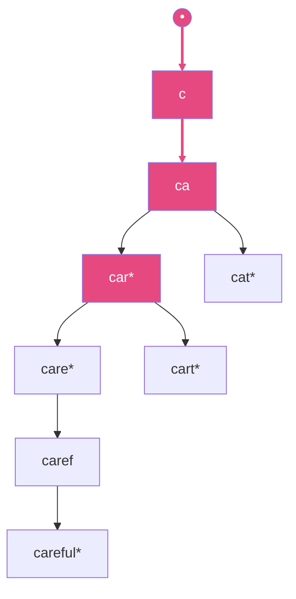

# Suffix Structures & Autocomplete

Every algorithm earlier in this folder answers one question: does this one pattern occur in this
one text? Real systems usually ask a different question — a search box, a DNA aligner, or a
"did you mean" feature needs to answer *many* pattern queries against the *same* text, and the
pattern is not known until the user types it. Re-running KMP or Rabin-Karp from scratch on every
keystroke throws away everything learned from the previous keystroke. The fix is to invest once,
building a structure from the text before any query arrives, and pay per query only for the work
that query itself requires — often proportional to the pattern's length, not the text's.

The **suffix array** is the simplest such structure: the starting indices of every suffix of the
text, sorted alphabetically. Once sorted, every occurrence of a pattern is a contiguous range in
that sorted order — reachable by two binary searches, O(m log n) instead of O(nm). The **LCP array**
(longest common prefix between adjacent suffixes in that sorted order) is the array's constant
companion, since it turns a great deal of information that looks like it needs re-scanning suffixes
into a single precomputed lookup.

:::info[Prerequisites]
[KMP & the Z-Algorithm](./kmp-and-z-algorithm.md) for the Z-array, which several suffix-array
construction algorithms use as a subroutine. [String Fundamentals](./string-fundamentals.md) for why
comparing two suffixes is not a free operation, which is exactly what makes sorting them non-trivial.
:::

## Core Concepts

| Term | Meaning |
|---|---|
| **Suffix array (SA)** | The starting indices of all n suffixes of a string, sorted so that `text[SA[i]:]` is alphabetically before `text[SA[i+1]:]` |
| **LCP array** | `LCP[i]` = length of the longest common prefix between `text[SA[i-1]:]` and `text[SA[i]:]`, the two adjacent suffixes in sorted order |
| **Suffix tree** | A compressed trie of every suffix, where each edge is labelled with a substring (not one character), built or searched in O(n) / O(m) |
| **Suffix automaton** | The smallest automaton accepting exactly the substrings of a string; O(n) states, one path per distinct substring |
| **Trie (prefix tree)** | A tree where each root-to-node path spells a prefix shared by every word passing through it |

## Mechanism

### The suffix array and LCP array of `banana`

Trace input — `banana` (n = 6). List every suffix by its starting index, then sort them
alphabetically:

```text
index   suffix
0       banana
1       anana
2       nana
3       ana
4       na
5       a
```

Sorted alphabetically (`a` < `an...` < `b` < `n...`, comparing character by character):

```text
rank   SA[rank]   suffix     LCP with previous suffix in this order
0      5          a          --  (no previous suffix)
1      3          ana        1   ("a" shared: a|na vs a|nana -- 1 char)
2      1          anana      3   ("ana" shared: ana|na vs ana| -- 3 chars, "ana" fully consumed)
3      0          banana     0   ("a..." vs "b..." -- differ at the first character)
4      4          na         0   ("banana" vs "na" -- differ at the first character)
5      2          nana       2   ("na" shared: na vs na|na -- 2 chars)

SA  = [5, 3, 1, 0, 4, 2]
LCP = [-, 1, 3, 0, 0, 2]
```

Two consecutive suffixes that share a long prefix (rank 1 and 2: `ana` and `anana`, LCP 3) sit next
to each other precisely because sorting puts every suffix starting with the pattern's characters
into one contiguous block — this is the whole mechanism a suffix array search relies on. Searching
for pattern `ana` is two binary searches over `SA` for the first and last rank whose suffix starts
with `ana`, landing on ranks 1–2 (indices 3 and 1) in O(m log n) comparisons, each comparison itself
O(m) in the worst case — O(m log n) total, not O(nm).

**Construction is not derived here.** Sorting suffixes with a generic comparison sort costs
O(n² log n) (each of the O(n log n) comparisons can itself cost O(n)). The standard non-naive
approaches are the doubling algorithm (sort by 2^k-character prefixes, doubling k each round) at
O(n log n) or O(n log² n) depending on the sort used per round, and linear-time algorithms —
DC3/Skew and SA-IS — at O(n). See Gusfield (1997) Ch. 7 and Manber & Myers (1993) for the doubling
construction, and Kärkkäinen, Sanders & Burkhardt (2006) for the linear-time DC3 algorithm; none of
the three are re-derived here.

<Tabs groupId="code-lang">
<TabItem value="python" label="Python">

```python showLineNumbers
def suffix_array(s):
    """O(n^2 log n): sorts suffixes with Python's default string comparison.
    Fine for teaching and for short strings; see the References for O(n log n) and O(n) builds."""
    return sorted(range(len(s)), key=lambda i: s[i:])


def lcp_array(s, sa):
    """LCP[i] = shared prefix length of the suffixes at SA[i-1] and SA[i]. O(n^2) worst case here
    since each comparison can itself cost O(n) -- see Kasai et al. (2001) for an O(n) version."""
    lcp = [0] * len(sa)
    for i in range(1, len(sa)):
        a, b = s[sa[i - 1]:], s[sa[i]:]
        k = 0
        while k < len(a) and k < len(b) and a[k] == b[k]:
            k += 1
        lcp[i] = k
    return lcp
```

</TabItem>
<TabItem value="cpp" label="C++">

```cpp showLineNumbers
#include <algorithm>
#include <cassert>
#include <numeric>
#include <string>
#include <vector>

std::vector<int> suffix_array(const std::string& s) {
    // O(n^2 log n): std::string::compare on suffixes, same complexity note as the Python version.
    std::vector<int> sa(s.size());
    std::iota(sa.begin(), sa.end(), 0);
    std::sort(sa.begin(), sa.end(), [&](int i, int j) { return s.substr(i) < s.substr(j); });
    return sa;
}

std::vector<int> lcp_array(const std::string& s, const std::vector<int>& sa) {
    std::vector<int> lcp(sa.size(), 0);
    for (std::size_t i = 1; i < sa.size(); ++i) {
        int k = 0;
        while (sa[i - 1] + k < static_cast<int>(s.size()) &&
               sa[i] + k < static_cast<int>(s.size()) &&
               s[sa[i - 1] + k] == s[sa[i] + k]) ++k;
        lcp[i] = k;
    }
    return lcp;
}
```

</TabItem>
</Tabs>

<Tabs groupId="code-lang">
<TabItem value="python" label="Python">

```python showLineNumbers
# checked against the hand-verified trace above
sa = suffix_array("banana")
assert sa == [5, 3, 1, 0, 4, 2]
assert lcp_array("banana", sa) == [0, 1, 3, 0, 0, 2]   # LCP[0] unused, set to 0 rather than left undefined
```

</TabItem>
<TabItem value="cpp" label="C++">

```cpp showLineNumbers
int main() {
    auto sa = suffix_array("banana");
    assert((sa == std::vector<int>{5, 3, 1, 0, 4, 2}));
    auto lcp = lcp_array("banana", sa);
    assert((lcp == std::vector<int>{0, 1, 3, 0, 0, 2}));
}
```

</TabItem>
</Tabs>

### What suffix trees and suffix automata add

A **suffix tree** compresses the suffix array's information into a tree whose edges are labelled by
substrings rather than single characters, so that every suffix corresponds to exactly one root-to-leaf
path — pattern search becomes a single O(m) walk down the tree instead of O(m log n) of binary search,
at the cost of a more complex O(n) construction (Ukkonen's algorithm) and a larger constant in memory.

A **suffix automaton** goes further: it is the smallest deterministic automaton whose accepted
language is exactly the set of substrings of the text, with O(n) states and O(n) transitions total
regardless of alphabet size. Where a suffix tree has one leaf per suffix, an automaton merges states
that have the same set of ending positions, which makes it the tool of choice for counting *distinct*
substrings or finding the longest common substring of two texts, since both reduce to a walk or a
state count on the automaton rather than an explicit tree traversal.

### Autocomplete, for real



A trie over `{car, care, careful, cart, cat}` (`*` marks a complete word). Typing `car` walks the
three highlighted edges once — O(m) in the length of what was typed — and every word in the subtree
below that node (`car`, `care`, `careful`, `cart`) is a completion candidate found by one traversal
of the remaining subtree, not by re-scanning the whole word list.

Production autocomplete is this idea plus one more stage: a **ranking pass** over the candidates the
trie (or, at larger scale, a finite-state transducer / FST, which compresses shared suffixes the way
a trie only compresses shared prefixes) returns. Popularity, recency, and personalization signals
are not encoded in the trie structure itself — the trie's job is to shrink "every string in the
corpus" down to "the handful that share this prefix" in O(m) time; a separate scoring step then
orders that handful for display. Conflating the two — trying to make the trie itself "smart" about
ranking — is the mistake that makes real autocomplete implementations hard to reason about.

## Practical Usage

- **`ripgrep`/`grep` and text editors** rarely build a suffix array for a one-shot search — the O(n)
  preprocessing only pays off across many queries against the same fixed text, which is why
  suffix structures show up in read-heavy indexes (bioinformatics reference genomes, full-text
  search backends) and not in a single `Ctrl+F`.
- **Bioinformatics** (read alignment against a reference genome) is the suffix array's home
  territory: the same several-billion-character reference is queried millions of times, so an O(n)
  or O(n log n) one-time build is amortized over the whole run.
- **Search-box autocomplete at scale** typically uses a trie or FST for the prefix-matching stage —
  see Lucene's
  [`AnalyzingSuggester`](https://lucene.apache.org/core/9_0_0/suggest/org/apache/lucene/search/suggest/analyzing/AnalyzingSuggester.html),
  built on a finite-state transducer — with ranking (click-through rate, recency, personalization)
  applied as a separate pass over the candidates the FST returns, exactly the two-stage split
  described above.

## Edge Cases & Pitfalls

- **Treating autocomplete as "just prefix matching".** A trie returns every word sharing a prefix in
  the order the trie happens to store them, which is not the order a user expects — shipping the
  raw trie output without a ranking pass produces technically-correct, practically-useless results.
- **Comparing suffixes with plain string comparison inside the sort.** The naive `sorted(..., key=
  lambda i: s[i:])` above is O(n² log n) precisely because each comparison can itself scan O(n)
  characters — fine for `banana`, a real bottleneck at genome scale, which is exactly what motivates
  the O(n log n) / O(n) constructions cited above.
- **Rebuilding the whole structure for one query.** The entire value proposition of this page's
  structures is amortizing a one-time build over many queries; using a suffix array to answer a
  single pattern-match query is strictly worse than the earlier pages' direct matchers.

## Comparisons

| | Build | Query (pattern length m) | Extra space | Best for |
|---|---|---|---|---|
| Suffix array + LCP | O(n log n) or O(n) | O(m log n) | O(n) | Many queries, memory-constrained |
| Suffix tree | O(n) (Ukkonen) | O(m) | O(n), larger constant | Many queries, query speed matters more than memory |
| Suffix automaton | O(n) | O(m) to check substring; distinct-substring counting is O(n) total | O(n) | Counting/enumerating distinct substrings, longest common substring |
| Trie / FST + ranking | O(total word length) | O(m) to reach the subtree, then ranking cost | O(total word length), FST much smaller | Autocomplete / prefix search over a fixed dictionary |

The suffix array is the right default when memory matters and O(log n) extra factor in queries is
acceptable; a suffix tree or automaton earns its larger footprint when queries are frequent enough
that shaving the log factor, or getting distinct-substring counts for free, pays for itself.

## Recall

<Recall
  invariant="Sorting all n suffixes of a text puts every suffix sharing a prefix into one contiguous block of the suffix array -- so a pattern search becomes two binary searches over that block instead of a fresh scan of the text."
  costs={[
    ["suffix array construction (doubling)", "O(n log n)"],
    ["suffix array construction (DC3 / SA-IS)", "O(n)"],
    ["pattern search via suffix array + LCP", "O(m log n)"],
    ["suffix tree construction (Ukkonen)", "O(n)"],
    ["pattern search via suffix tree", "O(m)"],
  ]}
  reachFor="Many pattern queries against one fixed text -- a search index, a genome reference, a dictionary of completions -- where a one-time build amortizes across every later query."
  trap="Shipping raw trie/FST prefix matches as the finished autocomplete result -- a ranking pass over the candidates is a separate, required stage, not an afterthought."
/>

## References

- D. Gusfield, *Algorithms on Strings, Trees, and Sequences*, 1997, Ch. 6–7 — suffix trees, suffix
  arrays, and their equivalence.
- U. Manber & G. Myers, "Suffix Arrays: A New Method for On-Line String Searches", *SIAM J.
  Computing* 22(5), 1993 — the original suffix array construction and O(m log n) search.
- J. Kärkkäinen, P. Sanders & S. Burkhardt, "Linear Work Suffix Array Construction", *J. ACM* 53(6),
  2006 — the DC3/Skew linear-time construction algorithm.
- T. Kasai et al., "Linear-Time Longest-Common-Prefix Computation in Suffix Arrays and Its
  Applications", CPM 2001 — the O(n) LCP array algorithm, versus the O(n²) worst case of the naive
  version shown here.
- Sedgewick & Wayne, *Algorithms*, 4th ed., §5.3 — suffix arrays applied to the longest repeated
  substring problem.

## Related Pages

- [String Fundamentals](./string-fundamentals.md) — the O(m) comparison cost that makes naive suffix sorting O(n^2 log n) in the first place.
- [KMP & the Z-Algorithm](./kmp-and-z-algorithm.md) — the Z-array subroutine several suffix-array construction algorithms build on.
- [Naive Matching & Rabin-Karp](./naive-matching-and-rabin-karp.md) — the single-query matchers this page's structures amortize past, once queries repeat.
- [Tries](../data-structures/tries.md) — the prefix-tree structure behind the autocomplete diagram above.
