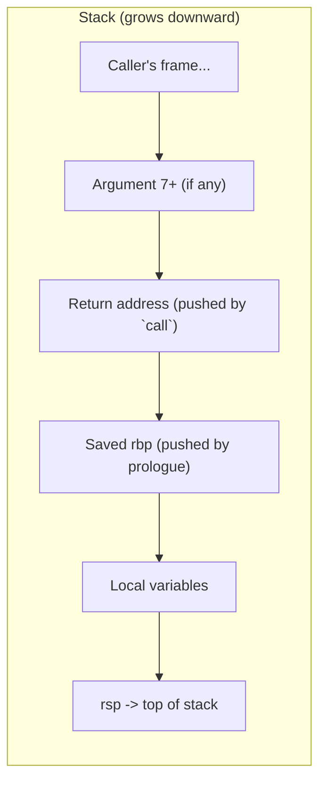

# Calling Conventions and the Stack

## Overview

When one function calls another, both sides need to agree on where the arguments go, where the
return value comes back, and which registers each side is allowed to clobber without asking. This
agreement — a **calling convention** — is exactly what makes it possible for code compiled by
different compilers (or written directly in assembly) to call each other correctly. On Linux and
macOS, x86-64 code follows the **System V AMD64 ABI**; this page walks through its argument-register
order and the stack-frame layout it implies, backed by real `gcc -S -O0` output.

## Core Concepts

| Term | Meaning |
|---|---|
| **Calling convention** | The rules for argument passing, return values, and register ownership between caller and callee. |
| **System V AMD64 ABI** | The calling convention used on Linux, macOS, and other Unix-like x86-64 systems. |
| **Caller-saved register** | A register the callee may freely overwrite; the caller must save its value first if it needs it after the call. |
| **Callee-saved register** | A register the callee must restore to its original value before returning if it uses it. |
| **Stack frame** | The region of the stack allocated to one function invocation: return address, saved registers, and locals. |
| **Prologue / epilogue** | The instructions at a function's start/end that set up and tear down its stack frame. |
| **Base pointer (`rbp`)** | A register conventionally used to hold a fixed reference point into the current stack frame, so locals can be addressed with constant offsets. |

## The System V AMD64 ABI

For integer/pointer arguments, the first six are passed in registers, in this order; any further
arguments go on the stack:

| Argument # | Register | Notes |
|---|---|---|
| 1 | `rdi` | |
| 2 | `rsi` | |
| 3 | `rdx` | |
| 4 | `rcx` | |
| 5 | `r8` | |
| 6 | `r9` | |
| 7+ | stack | pushed right-to-left before the `call` |

The integer return value comes back in `rax` (128-bit results split across `rax`:`rdx`).
Floating-point arguments/returns use `xmm0`-`xmm7` instead.

Registers are also split into two ownership classes:

| Caller-saved (a call may clobber these) | Callee-saved (a function must preserve these) |
|---|---|
| `rax`, `rcx`, `rdx`, `rsi`, `rdi`, `r8`-`r11` | `rbx`, `rbp`, `rsp`, `r12`-`r15` |

:::info Why `r10` and `r11` are caller-saved
The ABI deliberately leaves `r10`/`r11` caller-saved and unused for argument passing so that
trampoline/PLT (dynamic linking) stubs and syscall wrappers have scratch registers available without
having to spill anything.
:::

## Architecture / Mechanism: Stack Frame Anatomy



A typical (unoptimized) function prologue does three things: push the caller's base pointer to save
it, make `rbp` point at the current frame, and reserve space for locals by moving `rsp`. The epilogue
reverses this exactly before `ret`.

## Practical Usage: A Real Worked Example

```c
// add.c
int add(int a, int b, int c, int d, int e, int f, int g) {
    int sum = a + b + c + d + e + f + g;
    return sum;
}
```

Compiled with `gcc -S -O0 -fno-stack-protector -fno-asynchronous-unwind-tables -masm=intel add.c -o add.s`
(the extra flags trim unwind/stack-protector clutter so the frame logic is easy to read):

```text
add:
    endbr64
    push    rbp                     ; prologue: save caller's rbp
    mov     rbp, rsp                ; prologue: rbp now anchors this frame
    mov     DWORD PTR -20[rbp], edi ; spill arg 1 (a) from rdi to the stack
    mov     DWORD PTR -24[rbp], esi ; spill arg 2 (b) from rsi
    mov     DWORD PTR -28[rbp], edx ; spill arg 3 (c) from rdx
    mov     DWORD PTR -32[rbp], ecx ; spill arg 4 (d) from rcx
    mov     DWORD PTR -36[rbp], r8d ; spill arg 5 (e) from r8
    mov     DWORD PTR -40[rbp], r9d ; spill arg 6 (f) from r9
    mov     edx, DWORD PTR -20[rbp]
    mov     eax, DWORD PTR -24[rbp]
    add     edx, eax
    mov     eax, DWORD PTR -28[rbp]
    add     edx, eax
    mov     eax, DWORD PTR -32[rbp]
    add     edx, eax
    mov     eax, DWORD PTR -36[rbp]
    add     edx, eax
    mov     eax, DWORD PTR -40[rbp]
    add     edx, eax
    mov     eax, DWORD PTR 16[rbp]  ; arg 7 (g): read from the stack, above the return address
    add     eax, edx
    mov     DWORD PTR -4[rbp], eax  ; sum
    mov     eax, DWORD PTR -4[rbp] ; return value goes in eax (low 32 bits of rax)
    pop     rbp                     ; epilogue: restore caller's rbp
    ret                             ; pop return address into rip
```

Two things this real example makes concrete:

- The first six `int` arguments arrive in `edi`, `esi`, `edx`, `ecx`, `r8d`, `r9d` — exactly the
  System V order — and get **spilled** to the stack immediately because this is unoptimized (`-O0`)
  code that keeps every local addressable by a fixed `rbp` offset for easy debugging.
- The 7th argument (`g`) is read from `16[rbp]` — *above* the saved `rbp` (at offset 0) and the return
  address (at offset 8) — because it was passed on the stack, not in a register.

## Edge Cases & Pitfalls

:::warning Stack alignment
The System V ABI requires `rsp` to be 16-byte aligned at the point of a `call` instruction. Manually
written assembly that pushes an odd number of 8-byte values before calling a function that uses SSE
instructions (which often require 16-byte-aligned memory operands) can crash with an alignment fault
that only reproduces intermittently, depending on the caller's stack depth.
:::

:::danger Mismatched calling conventions are a silent ABI break
Calling a function compiled for the Microsoft x64 calling convention (Windows: `rcx`, `rdx`, `r8`,
`r9`) from code that assumes System V (`rdi`, `rsi`, `rdx`, `rcx`, ...) will read garbage arguments
with no compiler error — the mismatch is a link-time/runtime problem, not a type error. This is why
cross-platform C libraries must be recompiled per-platform rather than shared as raw binaries.
:::

- Forgetting to preserve a callee-saved register (`rbx`, `rbp`, `r12`-`r15`) in hand-written assembly
  silently corrupts the caller's state — often manifesting as a seemingly unrelated bug far later in
  the program.
- Variadic functions (`printf`-style) need the caller to additionally track how many integer/SSE
  registers were used, via `al`, for the callee to find all the arguments — see the ABI spec for
  details.

## Comparisons

| Aspect | System V AMD64 (Linux/macOS) | Microsoft x64 (Windows) |
|---|---|---|
| First 4 integer args | `rdi`, `rsi`, `rdx`, `rcx` | `rcx`, `rdx`, `r8`, `r9` |
| Args passed in registers | Up to 6 integer + 8 SSE | Up to 4 (shared integer/float slots) |
| Return value | `rax` (`rax:rdx` for 128-bit) | `rax` |
| Stack shadow space | None required | Caller must reserve 32 bytes ("shadow space") even for register args |
| Red zone | 128-byte scratch area below `rsp` a leaf function may use without adjusting `rsp` | Not available |

## References

- [System V Application Binary Interface, AMD64 Architecture Processor Supplement](https://refspecs.linuxbase.org/elf/x86_64-SysV-psABI.pdf) — the authoritative specification for the calling convention described here.
- Microsoft, [x64 calling convention](https://learn.microsoft.com/en-us/cpp/build/x64-calling-convention) — the Windows-side counterpart.
- [Application Binary Interface](../../programming/cpp/12-low-level-and-platform/01-abi.md) — the broader ABI concept (name mangling, object layout) this page's calling convention is one part of.

### Books & Videos

- Bryant & O'Hallaron, *Computer Systems: A Programmer's Perspective* — "Machine-Level Representation of Programs" is the standard teaching reference for exactly this material.
- Jonathan Bartlett, [*Programming from the Ground Up*](https://download-mirror.savannah.gnu.org/releases/pgubook/ProgrammingGroundUp-1-0-booksize.pdf) — a free, well-regarded introduction to x86 assembly and stack mechanics on Linux.

## Related Pages

- [x86-64 Registers and Instructions](./registers-and-instructions.md)
- [Reading Disassembly](./reading-disassembly.md)
- [Application Binary Interface (C++)](../../programming/cpp/12-low-level-and-platform/01-abi.md)
- [Assembly & Low-Level Programming — Overview](./intro.md)
