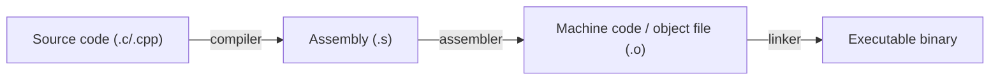

# Assembly & Low-Level Programming — Overview

## Overview

Assembly language is a human-readable, (mostly) one-to-one text representation of machine code — the
literal instructions an [ISA](../cpu-architecture/instruction-set-architecture.md) defines. Learning
to read it — not necessarily write large programs in it — is one of the highest-leverage skills for
understanding what your compiled code actually does: how function calls work, why undefined behavior
in C/C++ can do "anything," and what a debugger is actually stepping through.

## Core Concepts

| Term | Meaning |
|---|---|
| **Mnemonic** | The human-readable name for an instruction (`mov`, `add`, `jmp`) that assembles to a specific opcode. |
| **Register** | A named CPU storage location referenced directly in assembly (`rax`, `rbx` on x86-64; `x0`-`x30` on ARM64). |
| **Stack frame** | The region of the call stack allocated for one function invocation's local variables and return address. |
| **Calling convention** | The agreed-upon rules for how arguments are passed and results returned between caller and callee (which registers, what order, who cleans up the stack). |
| **Disassembly** | Converting compiled machine code back into assembly text for inspection — what tools like `objdump` and debuggers do. |

## From Source to Machine Code



```bash
# See the assembly your compiler generates for a C function
gcc -S -O2 -masm=intel example.c -o example.s

# Disassemble an already-compiled binary
objdump -d --no-show-raw-insn a.out
```

## In This Section

- **[x86-64 Registers and Instructions](./registers-and-instructions.md)** — the general-purpose
  registers, the historical `rax`/`eax`/`ax`/`al` sub-register naming, common instruction categories,
  and addressing modes.
- **[Calling Conventions & the Stack](./calling-conventions-and-the-stack.md)** — the System V AMD64
  ABI's argument-register order, stack-frame anatomy, and a real `gcc -S -O0` worked example.
- **[Reading Disassembly](./reading-disassembly.md)** — a hands-on walkthrough of compiling,
  disassembling with `objdump`, and recognizing loops, `if`/`else`, and function calls in real output.

## Why It Matters

- **[Instruction Set Architecture](../cpu-architecture/instruction-set-architecture.md)**: assembly is
  the concrete text syntax for the ISA concepts covered there.
- **[Operating Systems](../operating-systems/intro.md)**: system calls are, at the lowest level, a
  specific assembly instruction (e.g., `syscall` on x86-64) that transfers control to the kernel.
- **[ABI (C++)](../../programming/cpp/12-low-level-and-platform/01-abi.md)**: calling conventions are
  one piece of the broader binary-compatibility contract compiled C/C++ code relies on.
- Debugging a crash often means reading a stack trace and a few lines of disassembly around the
  faulting instruction — this is where that skill applies directly.

## Related Pages

- [x86-64 Registers and Instructions](./registers-and-instructions.md)
- [Calling Conventions & the Stack](./calling-conventions-and-the-stack.md)
- [Reading Disassembly](./reading-disassembly.md)
- [CPU & Processor Architecture](../cpu-architecture/intro.md)
- [Instruction Set Architecture](../cpu-architecture/instruction-set-architecture.md)
- [Operating Systems](../operating-systems/intro.md)
- [Application Binary Interface (C++)](../../programming/cpp/12-low-level-and-platform/01-abi.md)
