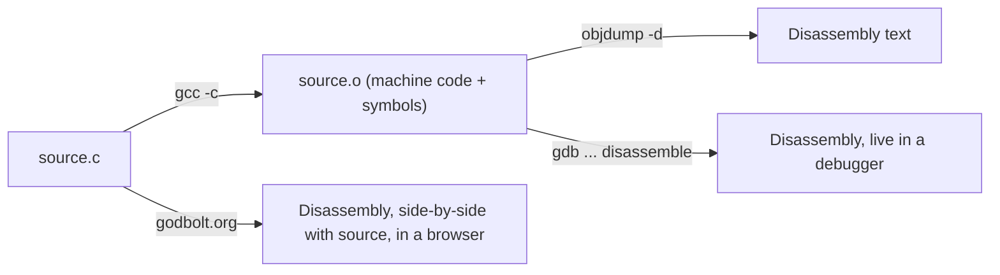

# Reading Disassembly

## Overview

Disassembly is the practical skill this whole section builds toward: given compiled machine code —
a binary, a core dump, or a debugger stopped mid-crash — recover and read the assembly instructions
well enough to understand what the code is actually doing. This page is a hands-on walkthrough:
compile real C, disassemble it with `objdump`, and learn to spot the recurring patterns (loops,
`if`/`else`, function calls) that every disassembly listing is built from.

## Core Concepts

| Term | Meaning |
|---|---|
| **Disassembler** | A tool that converts machine code back into (non-optimal, but readable) assembly text — e.g. `objdump -d`, `gdb`'s `disassemble`. |
| **Basic block** | A straight-line run of instructions with no jumps in or out except at the very start/end. |
| **Symbol** | A name (function, global variable) recorded in a binary's symbol table, letting a disassembler show `call add` instead of a bare address. |
| **Stripped binary** | A binary with its symbol table removed — disassembly still works, but functions/variables show only as raw addresses. |
| **Optimization level** | The `-O0`/`-O1`/`-O2`/`-O3` compiler flag controlling how aggressively source code is transformed — directly affects how recognizable the resulting disassembly is. |

## Architecture / Mechanism



A disassembler walks the machine code byte-by-byte, decodes each instruction (reversing the opcode
encoding described in [Instruction Set Architecture](../cpu-architecture/instruction-set-architecture.md)),
and prints the mnemonic form. It cannot recover names lost at compile time (local variable names,
comments) — only what the binary format's symbol table records, typically function and global names.

## Practical Usage

### Compiling and disassembling

```c
// max3.c
int max3(int a, int b, int c) {
    int m = a;
    if (b > m) {
        m = b;
    }
    if (c > m) {
        m = c;
    }
    return m;
}
```

```bash
gcc -O0 -fno-stack-protector -fno-asynchronous-unwind-tables -c max3.c -o max3.o
objdump -d -M intel --no-show-raw-insn max3.o
```

produces:

```text
0000000000000000 <max3>:
   0:	endbr64
   4:	push   rbp
   5:	mov    rbp,rsp
   8:	mov    DWORD PTR [rbp-0x14],edi
   b:	mov    DWORD PTR [rbp-0x18],esi
   e:	mov    DWORD PTR [rbp-0x1c],edx
  11:	mov    eax,DWORD PTR [rbp-0x14]
  14:	mov    DWORD PTR [rbp-0x4],eax
  17:	mov    eax,DWORD PTR [rbp-0x18]
  1a:	cmp    eax,DWORD PTR [rbp-0x4]
  1d:	jle    25 <max3+0x25>
  1f:	mov    eax,DWORD PTR [rbp-0x18]
  22:	mov    DWORD PTR [rbp-0x4],eax
  25:	mov    eax,DWORD PTR [rbp-0x1c]
  28:	cmp    eax,DWORD PTR [rbp-0x4]
  2b:	jle    33 <max3+0x33>
  2d:	mov    eax,DWORD PTR [rbp-0x1c]
  30:	mov    DWORD PTR [rbp-0x4],eax
  33:	mov    eax,DWORD PTR [rbp-0x4]
  36:	pop    rbp
  37:	ret
```

### Recognizing an `if`/`else` pattern

Each source `if (cond) { ... }` becomes: a `cmp`/`test` to set flags, a conditional jump that *skips
over* the "then" body when the condition is false, and a label the jump targets. Above,
`cmp eax, [rbp-0x4]; jle 25` is exactly `if (b > m)`: the compiler emits the *inverse* condition
(`jle`, jump if less-or-equal) to skip the body when `b > m` is false.

### Recognizing a loop

Compiling this function shows the pattern:

```c
int sum_array(int *arr, int n) {
    int total = 0;
    for (int i = 0; i < n; i++) {
        total += arr[i];
    }
    return total;
}
```

```text
   f:	mov    DWORD PTR [rbp-0x4],0x0      ; total = 0
  16:	mov    DWORD PTR [rbp-0x8],0x0      ; i = 0
  1d:	jmp    3c <sum_array+0x3c>          ; jump straight to the condition check
  1f:	mov    eax,DWORD PTR [rbp-0x8]
  22:	cdqe
  24:	lea    rdx,[rax*4+0x0]
  2c:	mov    rax,QWORD PTR [rbp-0x18]
  30:	add    rax,rdx
  33:	mov    eax,DWORD PTR [rax]          ; eax = arr[i]
  35:	add    DWORD PTR [rbp-0x4],eax      ; total += arr[i]
  38:	add    DWORD PTR [rbp-0x8],0x1      ; i++
  3c:	mov    eax,DWORD PTR [rbp-0x8]
  3f:	cmp    eax,DWORD PTR [rbp-0x1c]
  42:	jl     1f <sum_array+0x1f>          ; back-edge: loop while i < n
  44:	mov    eax,DWORD PTR [rbp-0x4]
```

The telltale loop signature: a **backward jump** (`jl 1f`, targeting an address *earlier* in the
listing) at the bottom of a block. The initial `jmp 3c` that jumps forward to the condition check
before the loop body even runs once is `gcc`'s standard `-O0` idiom for a `for`/`while` loop
(check-at-the-bottom, rather than duplicating the check before the loop too).

### Recognizing a function call

A `call` instruction followed, eventually, by code that reads `eax`/`rax` is a call whose return
value is used — e.g. `call add` then `mov ebx, eax`. Arguments are visible as `mov`s into `edi`,
`esi`, `edx`, etc. immediately before the `call`, per the
[System V calling convention](./calling-conventions-and-the-stack.md).

### Why `-O0` and `-O2` disassembly look completely different

The same `max3` function compiled with `gcc -O2 -c max3.c -o max3.o` and disassembled:

```text
0000000000000000 <max3>:
   0:	endbr64
   4:	cmp    esi,edx
   6:	mov    eax,edi
   8:	cmovl  esi,edx
   b:	cmp    esi,edi
   d:	cmovge eax,esi
  10:	ret
```

No stack frame, no `push rbp`/`pop rbp`, no `cmp`+conditional-`jmp` at all — the compiler proved the
whole function fits in registers and replaced both `if` statements with `cmovl`/`cmovge`
("conditional move"), avoiding branches entirely. This is the single most important thing to
internalize about reading real-world (optimized) disassembly:

| | `-O0` | `-O2`/`-O3` |
|---|---|---|
| Local variables | Spilled to the stack via `[rbp-N]` | Kept in registers whenever possible |
| Stack frame | Always present (`push rbp` / `mov rbp,rsp` / ... / `pop rbp`) | Often eliminated entirely for simple ("leaf") functions |
| Small `if`/`?:` | Compiled to `cmp` + conditional jump | Often compiled to branchless `cmov`/bitwise tricks |
| Small function calls | A real `call` | Frequently **inlined** — the callee's body appears directly, no `call` at all |
| Instruction count | Higher, very literal translation of the source | Lower, but much harder to map back to source line-by-line |

### Tools

- **`objdump -d`** — static disassembly of an object file or executable; add `-M intel` for
  Intel-syntax output (the default is AT&T syntax) and `--no-show-raw-insn` to hide raw opcode bytes.
- **`gdb`'s `disassemble`** — disassemble a *running* process's function, with the instruction the
  program is currently stopped at marked — invaluable when debugging a crash (`gdb ./a.out`, then
  `break main`, `run`, `disassemble`).
- **[Compiler Explorer](https://godbolt.org)** — a browser-based tool that shows compiler-generated
  disassembly side-by-side with the source, color-linked line by line, for dozens of compilers and
  optimization levels — the fastest way to experiment with the `-O0` vs `-O2` difference above without
  installing anything locally.

## Edge Cases & Pitfalls

:::warning Disassemblers can desynchronize on hand-crafted or obfuscated code
Because x86-64 instructions are variable-length, a disassembler that starts decoding one byte off from
the true instruction boundary (common in obfuscated malware or hand-written shellcode with embedded
data) will produce a stream of garbage instructions until it happens to resynchronize. Don't trust a
linear disassembly of untrusted binaries without also checking control-flow-based disassembly (what
tools like Ghidra or IDA do) or cross-referencing with a debugger's live execution.
:::

:::danger Stripped/optimized binaries don't map 1:1 back to source
Inlining, loop unrolling, and instruction reordering under `-O2`/`-O3` mean a single disassembled
instruction sequence may correspond to several different source lines interleaved, or to no single
line at all (e.g. a function inlined at three call sites). Don't assume the order of instructions in
a listing matches the order of statements in the original source.
:::

- Recursion and function pointers make `call`s harder to trace statically — the target address may
  only be known at runtime, and a static disassembler will only see `call rax` (or similar) rather
  than a symbol name.
- Without debug symbols (compiled without `-g`), a debugger like `gdb` can still disassemble
  perfectly well but won't be able to show source lines side-by-side or evaluate local variables by
  name.

## Comparisons

| Tool | Best for | Needs the binary running? |
|---|---|---|
| `objdump -d` | Quick, scriptable static disassembly of an object file or binary | No |
| `gdb disassemble` | Debugging a live/crashed process, inspecting register/memory state alongside instructions | Yes |
| Compiler Explorer (godbolt.org) | Fast experimentation across compilers/flags, learning, teaching | No (compiles in the browser/server-side) |
| Ghidra / IDA (not covered here) | Reverse-engineering large stripped binaries with control-flow-aware analysis and decompilation | No |

## References

- GNU Binutils, [`objdump` manual](https://sourceware.org/binutils/docs/binutils/objdump.html) — official reference for disassembly options.
- GDB documentation, [`disassemble` command](https://sourceware.org/gdb/current/onlinedocs/gdb/Machine-Code.html) — official reference.
- Matt Godbolt, [Compiler Explorer](https://godbolt.org) — the widely used online compiler/disassembly tool referenced above.

### Books & Videos

- Bryant & O'Hallaron, *Computer Systems: A Programmer's Perspective* — the "Machine-Level Representation of Programs" chapter walks through reading `gcc`-generated x86-64 disassembly in exactly this style.
- Jonathan Bartlett, [*Programming from the Ground Up*](https://download-mirror.savannah.gnu.org/releases/pgubook/ProgrammingGroundUp-1-0-booksize.pdf) — includes practical debugging/disassembly exercises with `gdb` on Linux.

## Related Pages

- [x86-64 Registers and Instructions](./registers-and-instructions.md)
- [Calling Conventions & the Stack](./calling-conventions-and-the-stack.md)
- [Assembly & Low-Level Programming — Overview](./intro.md)
- [Instruction Set Architecture](../cpu-architecture/instruction-set-architecture.md)
