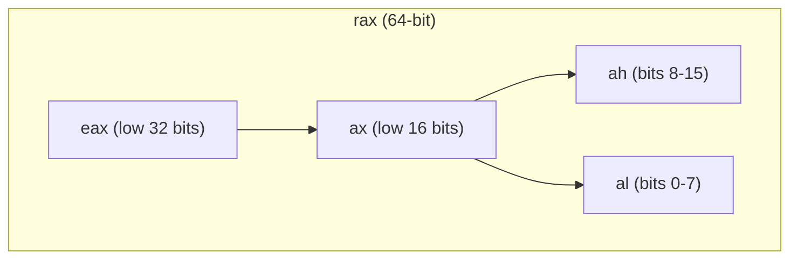

# x86-64 Registers and Instructions

## Overview

Every x86-64 instruction operates on a small set of named storage locations — **registers** — and/or
memory. Unlike a high-level language with an unlimited number of named variables, an x86-64 CPU
exposes only 16 general-purpose registers, plus a handful of special-purpose ones. Understanding their
names (and the historical sub-register naming that trips up almost everyone the first time) and the
handful of instruction categories that combine to express any program is the foundation for reading
any disassembly.

## Core Concepts

| Term | Meaning |
|---|---|
| **General-purpose register (GPR)** | One of 16 CPU-internal 64-bit storage slots (`rax`-`r15`) directly addressable by instructions. |
| **Sub-register** | A name referring to the low 8, 16, or 32 bits of a 64-bit register — not a separate register. |
| **Addressing mode** | How an operand's location is specified: immediate constant, register, plain memory address, or memory with a displacement/index. |
| **Flags register (`rflags`)** | Holds status bits (zero, sign, carry, overflow, ...) set by arithmetic/compare instructions and read by conditional jumps. |
| **Immediate** | A literal constant value encoded directly into the instruction, e.g. the `5` in `mov eax, 5`. |
| **Mnemonic** | The human-readable instruction name (`mov`, `add`, `jmp`) that assembles to a specific opcode. |

## The General-Purpose Registers

x86-64 has 16 general-purpose 64-bit registers: `rax`, `rbx`, `rcx`, `rdx`, `rsi`, `rdi`, `rbp`, `rsp`,
and `r8`-`r15`. The first eight carry names inherited from 16-bit and 32-bit x86 history; the last
eight were added when AMD extended x86 to 64 bits and are named uniformly.



### The historical sub-register naming (a common confusion point)

`eax`, `ax`, and `al` are **not separate registers** — they are all *views into the same physical
`rax` register*, just narrower slices of its low bits. This naming survives from the 8086 (16-bit
`ax`) through the 80386 (32-bit `eax`, "extended ax") to x86-64 (64-bit `rax`, "register ax"). Writing
to a narrower view leaves the rest of the register's upper bits either unchanged or zeroed, depending
on the width — a frequent source of subtle bugs and disassembly confusion:

- Writing a 32-bit sub-register (e.g. `mov eax, 1`) **zero-extends** and clears the upper 32 bits of
  the full 64-bit register — this is a special case baked into the ISA.
- Writing a 16-bit or 8-bit sub-register (e.g. `mov al, 1`) leaves the *rest* of the register's bits
  untouched — only those specific bits change.

| 64-bit | 32-bit | 16-bit | 8-bit (low) | Conventional role (System V) |
|---|---|---|---|---|
| `rax` | `eax` | `ax` | `al` | Return value / accumulator |
| `rbx` | `ebx` | `bx` | `bl` | Callee-saved, general purpose |
| `rcx` | `ecx` | `cx` | `cl` | 4th argument; loop counter (historically) |
| `rdx` | `edx` | `dx` | `dl` | 3rd argument |
| `rsi` | `esi` | `si` | `sil` | 2nd argument; source index (historically) |
| `rdi` | `edi` | `di` | `dil` | 1st argument; destination index (historically) |
| `rbp` | `ebp` | `bp` | `bpl` | Callee-saved; conventionally the stack-frame base pointer |
| `rsp` | `esp` | `sp` | `spl` | The stack pointer — always points at the top of the stack |
| `r8`-`r15` | `r8d`-`r15d` | `r8w`-`r15w` | `r8b`-`r15b` | 5th/6th arguments (`r8`, `r9`); rest general purpose |

:::info Why no `r8h`?
The `ah`/`bh`/`ch`/`dh` "high byte of the low 16 bits" names are a legacy quirk of the original four
registers only. `r8`-`r15` (and the newer `sil`/`dil`/`bpl`/`spl` byte names) never got equivalent
high-byte aliases, and mixing `ah`-style registers with any instruction using a REX prefix (needed to
address `r8`-`r15` or 64-bit operands) is disallowed by the encoding.
:::

## Instruction Categories

Nearly every x86-64 instruction falls into one of a few categories:

| Category | Examples | Purpose |
|---|---|---|
| **Data movement** | `mov`, `lea`, `push`, `pop` | Copy values between registers, memory, and the stack. |
| **Arithmetic / logic** | `add`, `sub`, `imul`, `idiv`, `and`, `or`, `xor`, `shl`, `shr` | Compute new values; update the flags register as a side effect. |
| **Comparison** | `cmp`, `test` | Compute a result *only* to set flags (result itself is discarded). |
| **Control flow** | `jmp`, `je`/`jz`, `jne`, `jl`, `jle`, `jg`, `jge`, `call`, `ret` | Unconditionally or conditionally change which instruction runs next. |

`cmp a, b` internally computes `a - b` and sets flags (zero, sign, carry, overflow) without storing the
result; a following conditional jump (e.g. `jle`, "jump if less-or-equal") reads those flags to decide
whether to branch. This flags-then-branch pattern is how every `if`, loop condition, and comparison
operator in a higher-level language ends up expressed in assembly — see
[Reading Disassembly](./reading-disassembly.md) for it in action.

## Addressing Modes

An instruction's operand can be specified several ways; x86-64's memory operands can combine a base
register, an index register, a scale factor, and a constant displacement in a single instruction:

```text
mov eax, 5                  ; immediate: a literal constant
mov eax, ebx                ; register: value lives in a register
mov eax, [rbx]              ; memory: address is the value in rbx
mov eax, [rbx + 8]          ; memory + displacement: address is rbx + 8
mov eax, [rbx + rcx*4 + 8]  ; base + index*scale + displacement (e.g. arr[i])
```

The last form is exactly how array indexing (`arr[i]`) compiles: `rbx` holds the array's base address,
`rcx` holds the index `i`, `4` is `sizeof(int)`, and `8` might be a fixed offset into a struct.

## Practical Usage

Compile a tiny C function and inspect the sub-register usage directly:

```c
// widen.c
unsigned long widen(unsigned int x) {
    return (unsigned long)x + 1;
}
```

```bash
gcc -S -O2 -masm=intel widen.c -o widen.s
```

Look for a `mov eax, edi` — writing the 32-bit `edi` sub-register as part of moving the incoming
argument, which the ISA guarantees zero-extends into the full 64-bit `rdi`/`rax` before the addition,
exactly the "writing a 32-bit sub-register clears the upper half" rule above.

## Edge Cases & Pitfalls

:::warning 8/16-bit sub-register writes don't clear the upper bits
Unlike 32-bit writes, `mov al, 0` only changes the lowest byte of `rax` — the other 56 bits keep
whatever garbage was there before. Code that reads `eax` or `rax` right after only setting `al`
without having first cleared or fully set the full register is a classic uninitialized-value bug.
:::

:::danger Don't confuse a sub-register with an independent variable
`eax` and `al` are the *same storage* as `rax`, just narrower views. Assembly beginners sometimes
assume `rax` and `eax` can hold two different live values at once — they cannot; writing one always
affects the other's bits.
:::

- Not every register is safe to clobber. By System V AMD64 ABI convention, some registers are
  caller-saved (may be destroyed by any call) and others are callee-saved (a called function must
  restore them before returning) — see
  [Calling Conventions & the Stack](./calling-conventions-and-the-stack.md) for the full breakdown.
- `rsp` should generally only be modified through `push`/`pop`/`call`/`ret` or deliberate, aligned
  arithmetic — an off-by-one adjustment corrupts the entire stack for the rest of the function.

## Comparisons

| Aspect | x86-64 (this page) | ARM64 (AArch64) |
|---|---|---|
| GPR count | 16 (`rax`-`r15`) | 31 (`x0`-`x30`) |
| Sub-register views | Yes — `rax`/`eax`/`ax`/`al` share storage | Yes — `x0`/`w0` share the low 32 bits, but only two widths |
| Memory-operand arithmetic | Instructions can read/modify memory directly (`add [rbx], 1`) | Load/store only — ALU ops never touch memory directly |
| Flags register | `rflags`, implicitly updated by many instructions | `NZCV`, updated only by instructions with an explicit `s` suffix (e.g. `adds`) |

## References

- Intel, [64 and IA-32 Architectures Software Developer's Manuals](https://www.intel.com/content/www/us/en/developer/articles/technical/intel-sdm.html) — the authoritative instruction and register reference.
- AMD, [AMD64 Architecture Programmer's Manual, Volume 1: Application Programming](https://www.amd.com/content/dam/amd/en/documents/processor-tech-docs/programmer-references/24592.pdf) — the AMD-side counterpart to the Intel SDM.
- OSDev Wiki, [CPU Registers x86-64](https://osdev.wiki/wiki/CPU_Registers_x86-64) — a concise, accurate register/sub-register reference.

### Books & Videos

- Randall Hyde, *The Art of Assembly Language* — a thorough, beginner-friendly treatment of x86 registers and instruction categories.
- Bryant & O'Hallaron, *Computer Systems: A Programmer's Perspective* — Chapter "Machine-Level Representation of Programs" covers x86-64 registers and instructions from a C programmer's perspective.

## Related Pages

- [Assembly & Low-Level Programming — Overview](./intro.md)
- [Calling Conventions & the Stack](./calling-conventions-and-the-stack.md)
- [Reading Disassembly](./reading-disassembly.md)
- [Instruction Set Architecture](../cpu-architecture/instruction-set-architecture.md)
