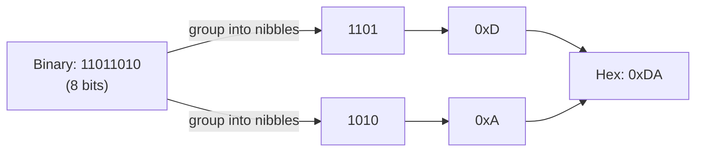

# Binary, Hex, and Bitwise Building Blocks

## Overview

Computers store everything as fixed-width sequences of bits (`0`/`1`). **Binary** is how the
hardware sees a value; **hexadecimal** is a compact, human-friendly way to *write* the same bits
because each hex digit maps to exactly 4 bits. This page assumes you already know place-value
arithmetic — it's a fast reference for the notation and the bitwise operators that later pages
(two's complement, floating point, bit-manipulation tricks) build on.

## Core Concepts

| Term | Meaning |
|---|---|
| **Bit** | A single binary digit, `0` or `1`. |
| **Nibble** | 4 bits — exactly one hexadecimal digit. |
| **Byte** | 8 bits — two hex digits (e.g., `0xFF` = `11111111`). |
| **Word** | The CPU's "natural" register width (32-bit or 64-bit on modern machines). |
| **Most/Least Significant Bit (MSB/LSB)** | The highest/lowest place-value bit in a value. |
| **Base prefix** | `0b` for binary, `0x` for hex literals in C/C++ and most languages. |

## Architecture / Mechanism: Why Hex Is "Compact Binary"

Because 16 = 2⁴, every group of 4 binary digits maps to exactly one hex digit — no remainder, no
rounding, unlike converting to decimal. That 1:1 grouping is the entire reason hex is used: it's
purely a compression of binary for human eyes, not a different number system the hardware uses.

```text
Binary:  1101 1010 0110 1111
Hex:       D    A    6    F
Decimal: 1101 1010 0110 1111 (binary) = 0xDA6F = 55919
```



One worked conversion, all three ways:

```text
0xDA6F  (hex)
= 13*16^3 + 10*16^2 + 6*16^1 + 15*16^0
= 53248 + 2560 + 96 + 15
= 55919  (decimal)

55919 in binary = 1101 1010 0110 1111  -> regroup into nibbles -> D A 6 F -> 0xDA6F ✓
```

## Practical Usage: Bitwise Operators as Building Blocks

Every bit-manipulation trick in this section is composed from six operators — see
[Bitwise Operators](../../programming/cpp/02-language-fundamentals/operators/bitwise.md) for the
full C++ reference. As a quick refresher:

```cpp showLineNumbers
uint8_t a = 0b1100;   // 12
uint8_t b = 0b1010;   // 10

a & b;   // 0b1000 (8)  — AND: 1 only if both bits are 1
a | b;   // 0b1110 (14) — OR:  1 if either bit is 1
a ^ b;   // 0b0110 (6)  — XOR: 1 if bits differ
~a;      // bitwise NOT, width-dependent
a << 2;  // 0b110000 (48) — shift left = multiply by 2^n
a >> 2;  // 0b0011 (3)    — shift right = divide by 2^n (careful with signed types)
```

Everything from "set this flag" to "count the 1 bits in this word" (see
[Bit Manipulation Techniques](./techniques.md)) is built from these six primitives.

## Edge Cases & Pitfalls

:::warning Hex literals don't announce their width
`0xFF` is 8 bits' worth of `1`s, but in C/C++ its *type* defaults to `int` unless you add a suffix
(`0xFFu`, `0xFFFFFFFFu` for a full 32-bit mask) — mixing widths silently sign-extends or truncates.
:::

- Binary literals (`0b1010`) are a C++14 extension to standard C++ (and common in other languages);
  don't assume every toolchain accepts them.
- Reading hex digit-by-digit right-to-left (low nibble first) is the opposite order humans read
  text in — a frequent source of off-by-one-nibble mistakes when hand-converting.

## Comparisons

| Representation | Digits for a byte | Human readability | Machine-native? |
|---|---|---|---|
| Binary | 8 (`11011010`) | Poor at a glance | Yes — this is what's stored |
| Hexadecimal | 2 (`0xDA`) | Good — compact, groups to nibbles | No, purely notational |
| Decimal | up to 3 (`218`) | Best for humans, worst for bit-level reasoning | No |

## References

- IEEE, [754-2019 — IEEE Standard for Floating-Point Arithmetic](https://ieeexplore.ieee.org/document/8766229) (used on later pages in this section).
- Wikipedia, [Hexadecimal](https://en.wikipedia.org/wiki/Hexadecimal) — for cross-checking positional notation.

### Books & Videos

- Ben Eater, [*8-bit CPU control logic* series](https://www.youtube.com/c/BenEater) — breadboard-level, visual treatment of binary/hex in a real digital circuit.

## Related Pages

- [Data Representation — Overview](./intro.md)
- [Integers & Two's Complement](./integers-and-twos-complement.md)
- [Bit Manipulation Techniques](./techniques.md)
- C++ operator reference: [Bitwise Operators](../../programming/cpp/02-language-fundamentals/operators/bitwise.md)
