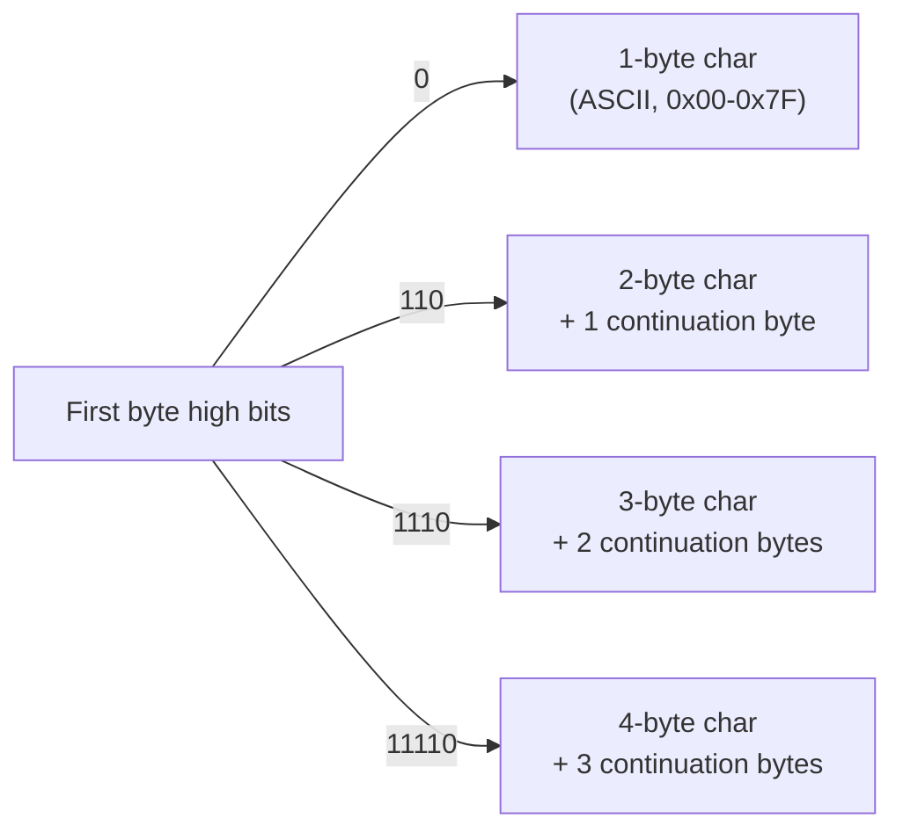

# Character Encoding

## Overview

Text is stored as bits too — a **character encoding** is the mapping between abstract characters
and the bytes that represent them. **ASCII** was the original, US-English-only 7-bit scheme;
**Unicode** replaced it with a single universal set of characters, but Unicode itself doesn't say
*how* to turn a character into bytes — that's the job of an **encoding** like UTF-8. Nearly every
"weird symbols in my text" bug (mojibake) comes from mismatching which encoding was used to write
bytes versus which encoding is used to read them back.

## Core Concepts

| Term | Meaning |
|---|---|
| **ASCII** | A 7-bit encoding for 128 characters (English letters, digits, punctuation, control codes). |
| **Code point** | A number assigned to an abstract character by the Unicode standard, written `U+XXXX` (e.g., `U+0041` = `A`). |
| **Encoding** | The rule for turning code points into bytes (UTF-8, UTF-16, UTF-32 are all encodings *of* Unicode). |
| **Code unit** | The fixed-size chunk an encoding operates in (1 byte for UTF-8, 2 bytes for UTF-16). |
| **Mojibake** | Garbled text produced by decoding bytes with the wrong encoding. |
| **BOM (Byte Order Mark)** | An optional leading marker (`U+FEFF`) that signals encoding/endianness — mostly a UTF-16 concern. |

## Architecture / Mechanism: UTF-8

UTF-8 encodes every Unicode code point (`U+0000` to `U+10FFFF`) in **1 to 4 bytes**, chosen so
that ASCII bytes (`0x00`-`0x7F`) are completely unchanged — this is why UTF-8 is backward
compatible with ASCII: any valid ASCII file is already valid UTF-8.

| Code point range | Bytes | Bit pattern |
|---|---|---|
| `U+0000`–`U+007F` | 1 | `0xxxxxxx` |
| `U+0080`–`U+07FF` | 2 | `110xxxxx 10xxxxxx` |
| `U+0800`–`U+FFFF` | 3 | `1110xxxx 10xxxxxx 10xxxxxx` |
| `U+10000`–`U+10FFFF` | 4 | `11110xxx 10xxxxxx 10xxxxxx 10xxxxxx` |

The leading bits of the first byte tell a decoder exactly how many bytes follow — no need to scan
from the start of the file to know where a character begins, and continuation bytes (`10xxxxxx`)
are unambiguous:



Worked example: encoding `é` (`U+00E9`, decimal 233) falls in the `U+0080`-`U+07FF` range, so it
needs 2 bytes:

```text
233 in binary: 11101001  (8 bits)
Split into 5 + 6 bits to fit the template 110xxxxx 10xxxxxx:
  00011 101001
Result: 11000011 10101001  =  0xC3 0xA9
```

## Practical Usage

```cpp showLineNumbers
#include <string>
#include <iostream>

std::string s = "café"; // UTF-8 source, encoded by the compiler as bytes
std::cout << s.size() << "\n";       // 5 — 'é' takes 2 bytes in UTF-8, not 1 "character"

// Iterating byte-by-byte (std::string::size()/operator[]) is byte iteration,
// NOT code-point iteration. Use a Unicode-aware library (ICU, utf8cpp, std::u8string
// helpers) if you need to count "characters" correctly.
```

## Edge Cases & Pitfalls

:::danger `.size()`/`.length()` counts bytes (or UTF-16 code units), not "characters"
`std::string::size()` in C++ (UTF-8 assumed) counts bytes; `.length` on a JavaScript string counts
UTF-16 code units. Both can disagree with the number of visible characters — especially for emoji,
which are often outside the Basic Multilingual Plane and need **2 UTF-16 code units** (a
"surrogate pair") or **4 UTF-8 bytes**.
:::

:::warning Mojibake: decoding with the wrong encoding
Opening a UTF-8 file as if it were Latin-1 (ISO-8859-1) turns each multi-byte UTF-8 sequence into
several garbled Latin-1 characters (the classic `café` → `café` bug). The fix is always to know
and declare the encoding explicitly — HTTP `Content-Type: charset=utf-8`, an XML/HTML `<meta
charset>` tag, or an explicit encoding parameter when opening a file — rather than guessing.
:::

- Not all byte sequences are valid UTF-8 (continuation bytes must follow the right lead byte) —
  malformed input must be explicitly handled (reject, replace with `U+FFFD`, etc.), not assumed
  away.
- A leading UTF-8 BOM (`EF BB BF`) is legal but often unwanted — some tools/parsers choke on it
  because it's not itself a printable character.

## Comparisons

| Encoding | Bytes per char | ASCII-compatible | Typical use |
|---|---|---|---|
| ASCII | 1 (7-bit) | N/A — its own base case | Legacy, protocol control bytes |
| UTF-8 | 1-4, variable | Yes — identical for `U+0000`-`U+007F` | Web, files, most modern systems (default almost everywhere) |
| UTF-16 | 2 or 4 (surrogate pairs) | No | Windows APIs, Java/JavaScript internal string storage |
| UTF-32 | 4, fixed | No | Simplicity of one code point = one unit; rarely used for storage (space-inefficient) |

## References

- Unicode Consortium, [The Unicode Standard](https://www.unicode.org/versions/latest/) — the official specification of code points and encodings.
- IETF, [RFC 3629 — UTF-8, a transformation format of ISO 10646](https://datatracker.ietf.org/doc/html/rfc3629) — the authoritative UTF-8 byte-pattern table used above.

### Books & Videos

- Computerphile, ["Characters, Symbols and the Unicode Miracle"](https://www.youtube.com/watch?v=MijmeoH9LT4) — Tom Scott's explanation of why Unicode/UTF-8 works the way it does.

## Related Pages

- [Binary, Hex, and Bitwise Building Blocks](./basics.md)
- [Integers & Two's Complement](./integers-and-twos-complement.md)
- [Bit Manipulation Techniques](./techniques.md)
