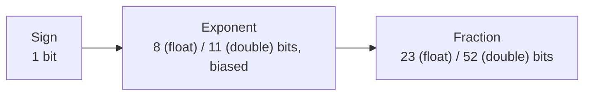

# Floating Point: IEEE 754

## Overview

Floating point is a way to represent a huge range of real numbers — from `1e-300` to `1e300` — in
a fixed number of bits, by storing a *sign*, an *exponent*, and a *fraction* (mantissa) instead of
every digit. Almost every language's `float`/`double` follows **IEEE 754**, a standard chosen
specifically so results are bit-for-bit reproducible across different hardware. The tradeoff: most
decimal fractions (like `0.1`) have no exact binary representation, which is the root cause of
nearly every "floating point is broken" bug report.

## Core Concepts

| Term | Meaning |
|---|---|
| **Sign bit** | 1 bit: `0` for positive, `1` for negative. |
| **Exponent** | Stored as a biased unsigned integer; determines the scale (power of 2). |
| **Mantissa (significand)** | The significant digits of the number, with an implicit leading `1` for normal values. |
| **Bias** | A constant subtracted from the stored exponent to get the true exponent (127 for single, 1023 for double). |
| **Subnormal (denormal)** | A tiny value close to zero, represented without the implicit leading `1`, trading precision for range. |
| **NaN** | "Not a Number" — result of an undefined operation like `0.0 / 0.0`. |

## Architecture / Mechanism

IEEE 754 binary32 (`float`) and binary64 (`double`) split their bits as follows:

```text
binary32 (32 bits total):
[S][   Exponent (8)   ][            Fraction (23)            ]
 31  30              23  22                                  0
 sign, bias=127

binary64 (64 bits total):
[S][    Exponent (11)    ][                  Fraction (52)                  ]
 63  62                 52  51                                              0
 sign, bias=1023
```



The value is reconstructed as:

```text
value = (-1)^sign × 1.fraction (binary) × 2^(exponent - bias)
```

Special cases use reserved exponent patterns:

| Exponent bits | Fraction | Meaning |
|---|---|---|
| All zero | Zero | ±0 |
| All zero | Non-zero | Subnormal: `(-1)^sign × 0.fraction × 2^(1-bias)` (no implicit leading 1) |
| All one | Zero | ±Infinity |
| All one | Non-zero | NaN |

### Why `0.1 + 0.2 != 0.3`

`0.1` in binary is an infinitely repeating fraction (`0.0001100110011...`), just like `1/3` is
`0.333...` in decimal. It gets rounded to the nearest representable `double`, so `0.1` and `0.2`
are each already slightly off before any addition happens — and the sum lands on a different
representable value than the rounded `0.3`.

## Practical Usage

```cpp showLineNumbers
#include <cstdio>
#include <cmath>

double a = 0.1 + 0.2;
printf("%.17f\n", a);              // 0.30000000000000004 — not exactly 0.3
printf("%s\n", (a == 0.3) ? "eq" : "not eq"); // "not eq"

// Correct way to compare floats: use a tolerance (epsilon), not ==
bool nearly_equal = std::fabs(a - 0.3) < 1e-9;

double nan_val = std::nan("");
bool is_nan = std::isnan(nan_val);         // true
bool nan_eq_itself = (nan_val == nan_val); // false — NaN is never equal to anything, even itself
```

## Edge Cases & Pitfalls

:::danger Never use floating point for money
Currency needs *exact* decimal arithmetic (cents must never silently drift). Floating point
rounding error compounds across many additions/multiplications. Use integer cents, a fixed-point
type, or a decimal type (`std::decimal` proposals, language-specific `Decimal`/`BigDecimal` types,
or database `DECIMAL`/`NUMERIC` columns) instead.
:::

:::warning NaN breaks normal comparison logic
`NaN != NaN` is true, so `std::sort` and set/map ordering can misbehave if NaNs sneak into
comparisons — always check `std::isnan()` before comparing or sorting untrusted floating-point
data.
:::

- `==` on floating-point results of independent computations is almost always the wrong tool —
  rounding differences from a different instruction order (even mathematically equivalent code)
  can change the last bit.
- Subnormals preserve "gradual underflow" near zero but are often computed much slower in
  hardware; some codebases explicitly flush them to zero for performance.

## Comparisons

| Format | Total bits | Exponent bits | Fraction bits | Approx. decimal digits |
|---|---|---|---|---|
| binary32 (`float`) | 32 | 8 (bias 127) | 23 | ~7 |
| binary64 (`double`) | 64 | 11 (bias 1023) | 52 | ~15-17 |
| Fixed-point / integer cents | n (any) | — | — | Exact, no rounding error |

## References

- IEEE, [754-2019 — IEEE Standard for Floating-Point Arithmetic](https://ieeexplore.ieee.org/document/8766229) — the authoritative spec.
- Wikipedia, [Single-precision floating-point format](https://en.wikipedia.org/wiki/Single-precision_floating-point_format) and [Double-precision floating-point format](https://en.wikipedia.org/wiki/Double-precision_floating-point_format) — cross-checked bit layouts above.

### Books & Videos

- Randal E. Bryant & David R. O'Hallaron, *Computer Systems: A Programmer's Perspective* — Chapter 2 covers IEEE 754 in detail alongside integer representation.
- Computerphile, ["Floating Point Numbers"](https://www.youtube.com/watch?v=PZRI1IfStY0) — a short, accessible explanation of why `0.1 + 0.2 != 0.3`.

## Related Pages

- [Integers & Two's Complement](./integers-and-twos-complement.md)
- [Binary, Hex, and Bitwise Building Blocks](./basics.md)
- [Character Encoding](./character-encoding.md)
