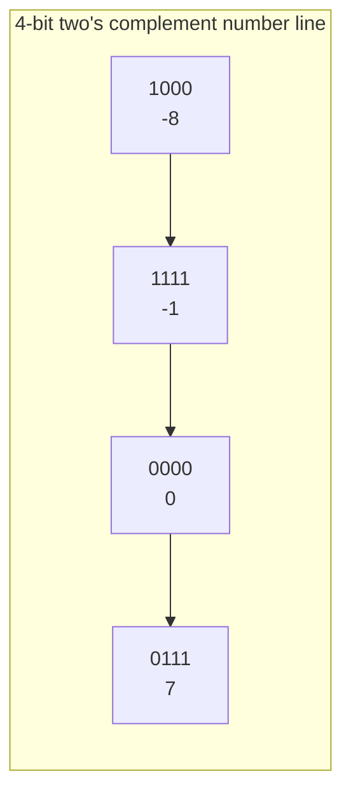

# Integers & Two's Complement

## Overview

A fixed-width integer has a fixed number of bits, so it can only represent a finite range of
values — and once you allow negative numbers, you need a rule for *which* bit patterns mean
"negative" and *how* arithmetic on them behaves. Nearly every CPU and language today uses
**two's complement**, not because it's the most obvious scheme, but because it makes addition,
subtraction, and hardware design simpler than the alternatives.

## Core Concepts

| Term | Meaning |
|---|---|
| **Fixed-width integer** | An integer stored in a fixed number of bits (8/16/32/64), wrapping instead of growing arbitrarily. |
| **Sign-magnitude** | Represent sign with one dedicated bit, magnitude with the rest — intuitive, but arithmetically awkward. |
| **One's complement** | Negate a number by flipping every bit — has two representations of zero. |
| **Two's complement** | Negate a number by flipping every bit and adding 1 — one representation of zero, addition "just works." |
| **Overflow** | The true mathematical result doesn't fit in the available bits. |
| **Sign extension** | Replicating the sign bit when widening a signed value to a larger type. |

## Architecture / Mechanism

In an *n*-bit two's complement integer, the most significant bit has a **negative** place value
instead of a special "sign flag." For a 4-bit example:

```text
Bit pattern   Unsigned value   Two's complement (signed) value
0000              0                          0
0111              7                          7
1000              8                         -8   <- MSB place value is -8, not +8
1111             15                         -1
```



Negating a value is: flip all bits, then add 1 (`-x = ~x + 1`). This single rule is why two's
complement won out over the alternatives:

| Scheme | Zero representations | Addition/subtraction hardware |
|---|---|---|
| Sign-magnitude | Two (`+0`, `-0`) | Needs separate logic to handle the sign bit |
| One's complement | Two (`+0`, `-0`) | Needs an "end-around carry" fixup after addition |
| **Two's complement** | **One** | Same adder circuit works for signed and unsigned — no special-casing |

Because the hardware needs no extra logic to add/subtract signed values, two's complement became
the near-universal standard (formally required by C++20 — earlier C/C++ standards permitted
sign-magnitude and one's complement but no mainstream compiler used them).

## Practical Usage

```cpp showLineNumbers
#include <cstdint>
#include <limits>

int8_t x = std::numeric_limits<int8_t>::max(); // 127 = 0b01111111
x = x + 1;                                     // wraps to -128 = 0b10000000 (UB for signed int in C++!)

uint8_t u = 255;                                // 0b11111111
u = u + 1;                                      // defined: wraps to 0 (unsigned overflow is modular)

// Negation via ~x + 1
int8_t five = 5;
int8_t neg_five = static_cast<int8_t>(~five + 1); // -5
```

## Edge Cases & Pitfalls

:::danger Signed integer overflow is undefined behavior in C/C++
Unlike unsigned overflow (which wraps predictably, modulo 2ⁿ), **signed** integer overflow is
undefined behavior. Compilers are allowed to assume it never happens — and optimize accordingly —
so `x + 1 < x` as an "overflow check" can be silently deleted by the optimizer. Use
`std::numeric_limits`, checked-arithmetic builtins (`__builtin_add_overflow`), or wider types
instead of relying on wraparound.
:::

:::warning Signed/unsigned comparison is a classic footgun
When a signed and an unsigned integer of the same width are compared, the signed value is
implicitly converted to unsigned first — a negative number becomes a huge positive one:

```cpp showLineNumbers
int a = -1;
unsigned b = 0;
if (a < b) { /* unreachable! */ }   // -1 is converted to UINT_MAX, so a < b is false
```

This bug is infamous in loop conditions like `for (int i = size() - 1; i >= 0; ...)` where
`size()` returns an unsigned type — subtracting past zero wraps to a huge number instead of going
negative.
:::

- Narrowing casts (e.g., `int64_t` to `int32_t`) silently truncate — the compiler will not warn by
  default in C, and only sometimes in C++ (with `-Wconversion`/`-Wnarrowing`).
- Right shift of a negative signed integer is implementation-defined behavior before C++20
  (arithmetic shift on virtually every real compiler, but not standard-guaranteed until C++20
  mandated two's complement + arithmetic right shift for signed types).

## Comparisons

| Scheme | Range for n bits | Used by |
|---|---|---|
| Unsigned | `0` to `2ⁿ-1` | Sizes, counts, bitmasks |
| Two's complement (signed) | `-2ⁿ⁻¹` to `2ⁿ⁻¹-1` | Virtually all modern integer arithmetic |
| Sign-magnitude | `-(2ⁿ⁻¹-1)` to `2ⁿ⁻¹-1` | Historical machines; IEEE-754's *sign bit* (see [Floating Point](./floating-point.md)) |
| One's complement | `-(2ⁿ⁻¹-1)` to `2ⁿ⁻¹-1` | Historical machines (e.g., early CDC, UNIVAC) |

## References

- ISO/IEC, [C++20 (N4860 §6.8.1)](https://www.open-std.org/jtc1/sc22/wg21/docs/papers/2020/n4860.pdf) — mandates two's complement for signed integers.
- Wikipedia, [Two's complement](https://en.wikipedia.org/wiki/Two%27s_complement) — cross-checked for range/negation rules above.

### Books & Videos

- Randal E. Bryant & David R. O'Hallaron, *Computer Systems: A Programmer's Perspective* — Chapter 2, "Representing and Manipulating Information," covers two's complement and overflow in depth.
- Ben Eater, ["Two's complement: Negative numbers in binary"](https://www.youtube.com/watch?v=4qH4unVtJkE) — visual comparison of sign-magnitude, one's complement, and two's complement.

## Related Pages

- [Binary, Hex, and Bitwise Building Blocks](./basics.md)
- [Floating Point](./floating-point.md)
- [Bit Manipulation Techniques](./techniques.md)
- C++ signedness reference: [Signedness](../../programming/cpp/03-types-and-values/signedness.md)
