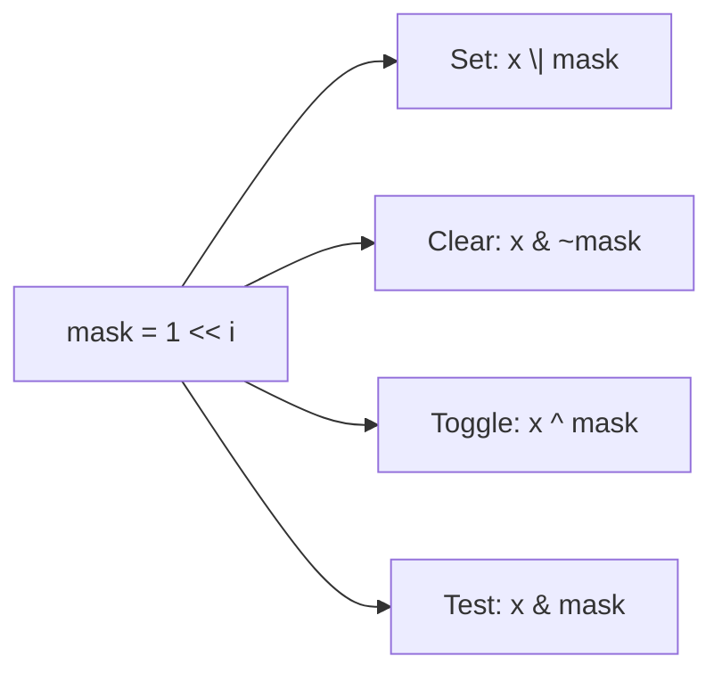

# Bit Manipulation Techniques

## Overview

Bit-manipulation techniques are small, well-known patterns for testing, setting, and transforming
individual bits directly — no allocation, usually no branching, a handful of CPU cycles. They show
up everywhere real systems care about speed or compact storage: flag/permission sets, bitmasks in
network protocols, bloom filters, and competitive-programming algorithms.

## Core Concepts

| Term | Meaning |
|---|---|
| **Mask** | A bit pattern used with `&`/`\|`/`^` to select or modify specific bits. |
| **Set a bit** | Force a bit to `1` without touching the others. |
| **Clear a bit** | Force a bit to `0` without touching the others. |
| **Toggle a bit** | Flip a bit's current value. |
| **Test a bit** | Check whether a specific bit is `1` or `0`. |
| **Popcount** | The number of `1` bits in a value (a.k.a. Hamming weight). |

## Architecture / Mechanism

All four core operations follow the same shape: build a mask with a single `1` at position `i`
(`1u << i`), then combine it with the value using the right operator.



| Operation | Expression | Why it works |
|---|---|---|
| Set bit `i` | `x \| (1u << i)` | OR with a `1` forces that bit to `1`; other bits OR with `0` are unchanged |
| Clear bit `i` | `x & ~(1u << i)` | AND with a `0` forces that bit to `0`; other bits AND with `1` are unchanged |
| Toggle bit `i` | `x ^ (1u << i)` | XOR with `1` flips; XOR with `0` leaves other bits unchanged |
| Test bit `i` | `(x >> i) & 1u` or `x & (1u << i)` | Isolates bit `i`; non-zero means it was set |

## Practical Usage

```cpp showLineNumbers
#include <cstdint>
#include <bit>      // C++20: std::popcount, std::has_single_bit

uint32_t x = 0b0110'1000;

// Set / clear / toggle / test bit 2
uint32_t set    = x | (1u << 2);
uint32_t clear  = x & ~(1u << 2);
uint32_t toggle = x ^ (1u << 2);
bool is_set     = (x >> 2) & 1u;

// Power-of-two check: exactly one bit set (and non-zero)
bool is_pow2 = x != 0 && (x & (x - 1)) == 0;
// C++20: std::has_single_bit(x)

// Isolate the lowest set bit
uint32_t lowest_bit = x & (-x);        // two's complement trick
// (x & -x) works because -x = ~x + 1: everything below the lowest 1
// becomes 0, and the borrow chain cancels above it.

// Count set bits (popcount)
int count = __builtin_popcount(x);     // GCC/Clang builtin
// C++20: std::popcount(x)
```

### Bitmasks for flags (the classic use case)

```cpp showLineNumbers
enum Perm : unsigned { Read = 1u << 0, Write = 1u << 1, Exec = 1u << 2 };

unsigned p = Read | Write;   // combine flags
p |= Exec;                   // add a flag
p &= ~Write;                 // remove a flag
bool can_exec = p & Exec;     // test a flag
```

Real systems lean on this: Unix file permission bits, HTTP/TCP header flags, and **bloom
filters** (a probabilistic set membership structure that's fundamentally a big bit array with
several hash-selected bits set per element) all use bitmask operations as their core primitive.

## Edge Cases & Pitfalls

:::warning XOR-swap: a clever trick you should not use
```cpp
a ^= b;
b ^= a;
a ^= b;
```
This swaps `a` and `b` without a temporary variable — but it silently corrupts data if `a` and `b`
alias the *same* memory location (`a ^= b` zeroes it out on the first line). It's also typically
*slower* than `std::swap` on modern hardware, which already avoids a temporary via register
renaming. Treat this as a historical curiosity, not production code.
:::

:::danger Shifting by the full width (or more) is undefined behavior
`1u << 32` on a 32-bit type is undefined behavior in C/C++, not `0`. Always check that the shift
amount is strictly less than the type's bit width, especially when the shift amount is
computed/user-controlled.
:::

- `x & (x - 1)` clears the lowest set bit — a related trick often confused with the "isolate
  lowest set bit" (`x & -x`) trick above; mixing them up is an easy off-by-one-bit bug.
- Prefer `std::bitset` and `<bit>` (`std::popcount`, `std::has_single_bit`, `std::rotl`/`std::rotr`)
  over hand-rolled tricks when available — they're just as fast (often compiled to the same single
  instruction, e.g., `POPCNT`) and far more readable. See
  [Bitwise Operators](../../programming/cpp/02-language-fundamentals/operators/bitwise.md).

## Comparisons

| Approach | Readability | Portability | When to use |
|---|---|---|---|
| Hand-rolled bit tricks (`x & -x`, XOR-swap) | Low — needs comments | High (plain integer ops) | Hot loops, embedded, competitive programming |
| `std::bitset` / `<bit>` (C++20) | High | High (standard library) | Default choice in modern C++ |
| Compiler builtins (`__builtin_popcount`) | Medium | Compiler-specific | When `<bit>` isn't available and you know your compiler |

## References

- Henry S. Warren Jr., *Hacker's Delight* — the canonical reference for these and dozens more bit tricks (isolating bits, counting, parity, rotations).
- cppreference, [`<bit>`](https://en.cppreference.com/w/cpp/header/bit) — standard-library bit-manipulation utilities in C++20.

### Books & Videos

- Henry S. Warren Jr., *Hacker's Delight*, 2nd ed. — see above; the definitive source for this page's tricks.

## Related Pages

- [Binary, Hex, and Bitwise Building Blocks](./basics.md)
- [Integers & Two's Complement](./integers-and-twos-complement.md)
- C++ operator reference: [Bitwise Operators](../../programming/cpp/02-language-fundamentals/operators/bitwise.md)
