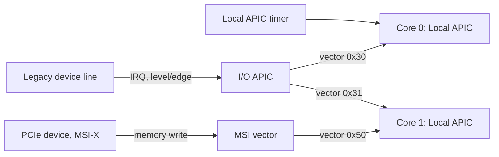

# Interrupt Controllers

The hardware between a device asserting a line and a CPU taking an interrupt: PIC, APIC, MSI, and Arm's GIC.

A CPU core has one, maybe two, physical interrupt input pins. A real machine has hundreds of
things that need to signal it — a keyboard, a timer, a dozen NVMe queues, a NIC with a queue per
core. Something has to sit between those two numbers: aggregate many sources onto few inputs,
identify which source fired, decide priority when several fire at once, and route the interrupt to
a chosen CPU. That something is the **interrupt controller**, and the history of interrupt
controllers on x86 in particular — PIC, then APIC, then MSI, then x2APIC — is a direct record of
machines acquiring more cores and more devices than the previous design could address.

## What a controller must provide

Every controller on this page is a different answer to the same four jobs:

- **Aggregate** many interrupt sources onto the few physical inputs a CPU core actually has.
- **Identify** the source, so the CPU (or its handler) knows what to service without polling every
  device to find out.
- **Mask and prioritize**, so a lower-priority interrupt doesn't preempt one already being handled,
  and so a specific source can be disabled without disabling interrupts generally.
- **Route**, deciding which CPU, out of possibly many, takes a given interrupt.

## The 8259 PIC, and why it is history

The **Intel 8259** Programmable Interrupt Controller is two chips cascaded together, giving
fifteen usable interrupt lines (of sixteen; one is consumed by the cascade itself), edge-triggered,
delivering to exactly one CPU. It was the entire interrupt architecture of the original IBM PC and
it does not scale to a multiprocessor machine at all — it has no concept of "which CPU," because
there was only ever one.

It earns a section here anyway because its vocabulary never left: **IRQ 0** for the timer, **IRQ
1** for the keyboard, and the IRQ numbering generally, are 8259 numbers that still leak into
modern documentation, BIOS setup screens, and `/proc/interrupts` output long after the physical
chips are gone. A real 8259 (or, more precisely, logic emulating one) is also still present and
active during early boot, before the OS switches the machine into APIC mode — legacy mode is a
real boot-time state, not a historical footnote.

## APIC: local and I/O

The split that actually enables multiprocessor interrupt handling is the **Advanced Programmable
Interrupt Controller**, and it comes in two parts:

- A **local APIC (LAPIC)**, one per core, handles that core's timer interrupt, receives
  inter-processor interrupts, and is the final delivery point for every interrupt that core takes
  — regardless of where the interrupt originated.
- An **I/O APIC**, one or a few per system, sits on the board rather than inside a core. It
  receives device interrupt lines and, through a **redirection table**, decides for each line which
  local APIC (which core) to deliver it to, at what vector, and with what trigger mode.

This split — a per-core delivery endpoint plus a shared, board-level routing table — is exactly
what makes it possible to steer a given device's interrupts to a chosen core, or to spread them
across several. Under the 8259 that question didn't even have an answer to steer.

## Inter-processor interrupts

An **inter-processor interrupt (IPI)** is one core interrupting another directly, through its
local APIC, with no device involved at all. It is not a peripheral mechanism; it is how a
multiprocessor kernel gets a *different* core's attention synchronously. Three uses that show up
constantly once the Linux pages start naming them: **TLB shootdown** (telling other cores their
cached translations for a page are now stale), **rescheduling** a specific remote core (waking it
to reconsider what it's running), and halting every other core on a panic. The local APIC that
delivers device interrupts is the same hardware that delivers these.

## MSI and MSI-X

**Message Signaled Interrupts** change the model entirely: instead of asserting a physical line,
the device performs an ordinary **memory write** — a specific data value to a specific address —
and the interrupt controller recognizes that write and turns it into an interrupt, at a vector
chosen when the device was configured. **MSI-X** is the same idea with a larger, more flexible
table of these write-triggered vectors per device.

Several consequences follow directly from "it's a memory write" that don't follow from a physical
line at all:

- **No sharing** — there is no line for two devices to contend over, so there's no shared-IRQ
  ambiguity to resolve in the handler.
- **No line-count limit** — a device can have as many MSI-X vectors as its table allows, not as
  many as there happen to be spare physical pins.
- **Ordering with respect to the device's own DMA writes** matters and is architecturally
  guaranteed: the interrupt-triggering write must not overtake the device's earlier data writes to
  memory, or the CPU could take the interrupt before the data it's about to read is actually there.
- **Thousands of vectors are achievable**, which is precisely what makes **one interrupt vector per
  NIC queue, per core** a real, common configuration rather than an aspiration.

## x2APIC, briefly

The original APIC ID space is 8 bits — 256 possible APIC IDs — which became an actual limit once
server parts started exceeding 255 logical CPUs. **x2APIC** widens the ID space and switches
access from memory-mapped I/O to **MSRs** (model-specific registers), which is both faster to
access and what makes the wider ID space practical to wire up. It is largely APIC with the ceiling
raised, not a new architecture.

## Arm's GIC

The **Generic Interrupt Controller (GIC)** is Arm's answer to the same four jobs, and it is
architected as a single specified controller rather than accumulated in layers the way x86-64's
PIC-then-APIC-then-MSI history was. Its pieces:

- The **distributor**, shared across the system, which receives shared interrupts and decides
  routing.
- A **redistributor** per core, the GIC's analogue of a local APIC — the per-core delivery point.
- The **CPU interface**, through which a core actually takes an interrupt from its redistributor.

And three kinds of source, distinguished by scope: **SPIs** (Shared Peripheral Interrupts, from
devices, routable to any core), **PPIs** (Private Peripheral Interrupts, per-core devices like a
core-local timer), and **SGIs** (Software Generated Interrupts, the GIC's IPI equivalent).

The honest contrast: x86-64 has PIC, APIC, and MSI because each was added on top of what existed
before as the platform's needs grew. The GIC is a single architecture specification that Arm
implementers build to directly, with no legacy layer beneath it to keep working. Both solve the
same four jobs; they arrived at the answer by very different routes. This is the arm64 contrast
folder 10 links to.

## Level versus edge, and why it matters

A **level-triggered** interrupt line stays asserted for as long as the device's condition holds —
the handler must explicitly tell the device to deassert it (acknowledge the condition) or the line
simply stays high and the CPU keeps re-entering the handler, which is exactly what an **interrupt
storm** looks like when a driver bug forgets the acknowledgment. An **edge-triggered** interrupt
fires on a transition rather than a level, which avoids the storm failure mode but has the opposite
one: an edge that occurs while the line is masked can be missed entirely, with no level left behind
to notice later. Both failure modes show up in real driver bugs, which is the only reason this
section exists rather than being a one-line definition.

*Three ways an interrupt reaches a core, and the only thing the core actually sees: a vector
number.*

## Comparison

| | Source identified by | How many sources | Target CPU chosen by | Sharing possible |
|---|---|---|---|---|
| PIC (8259) | Fixed line (IRQ 0–15) | 15 usable | Fixed — one CPU only | Yes, and ambiguous |
| I/O APIC | Redirection-table entry | Per board, tens of lines | Redirection-table entry, per line | Yes, if configured to |
| MSI / MSI-X | Memory address + data value | Thousands (MSI-X table size) | Address/data value written by config | No — each vector is exclusive |
| GIC | SPI/PPI/SGI ID | Implementation-defined, large | Distributor routing (SPIs), fixed (PPIs) | No |

## Where this goes next

- [I/O and Interrupts](./io-and-interrupts.md) — the polling/IRQ/DMA framing this controller
  hardware sits underneath.
- [Exceptions, Traps, and Interrupts](../cpu-architecture/exceptions-traps-and-interrupts.md) — what
  the CPU itself does once a vector actually arrives.
- [`../../linux/10-interrupts-time-and-deferred-work/how-an-interrupt-reaches-the-kernel.md`](../../linux/10-interrupts-time-and-deferred-work/how-an-interrupt-reaches-the-kernel.md) —
  the software side of the same path.

## References

- Intel SDM Vol. 3A, ch. 12 "Advanced Programmable Interrupt Controller" — the authority on local
  APIC, I/O APIC redirection entries, and IPI delivery modes.
- Intel 82093AA I/O APIC datasheet — short, concrete, and the clearest statement of what a
  redirection table entry contains.
- PCI Express Base Specification, the MSI/MSI-X capability chapters — the definitive account of
  interrupt-as-a-memory-write, including the ordering rules relative to DMA.
- Arm Generic Interrupt Controller Architecture Specification (GICv3/v4) —
  [`https://developer.arm.com/documentation/ihi0069/latest/`](https://developer.arm.com/documentation/ihi0069/latest/).
  The arm64 side, and the reason arm64 documentation uses SPI/PPI/SGI vocabulary.
