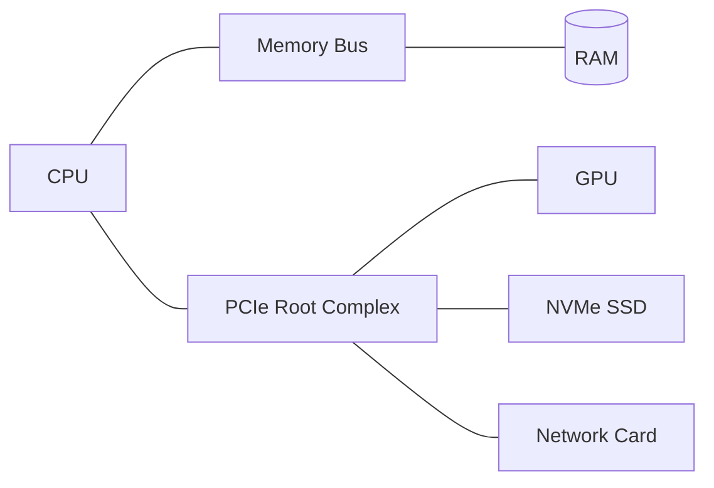

# Buses & I/O — Overview

## Overview

A CPU, RAM, storage, and peripherals are separate physical chips — a **bus** is the shared electrical
pathway (wires + protocol) that lets them exchange data. This section covers how components talk to
each other and how the CPU is notified when I/O completes, without having to constantly ask "are you
done yet?"

## Core Concepts

| Term | Meaning |
|---|---|
| **Bus** | A shared communication pathway, historically split into address lines (which byte), data lines (the value), and control lines (read/write, timing). |
| **PCIe (PCI Express)** | The dominant modern point-to-point bus for high-speed peripherals (GPUs, NVMe SSDs, network cards), organized in "lanes" that scale bandwidth. |
| **DMA (Direct Memory Access)** | A mechanism letting a peripheral read/write RAM directly, without the CPU copying every byte — frees the CPU to do other work during large transfers. |
| **Interrupt** | A signal a device sends to the CPU to say "I need attention now," causing the CPU to pause its current work and run an interrupt handler. |
| **Polling** | The alternative to interrupts: the CPU repeatedly checks a device's status register in a loop — simple, but wastes CPU cycles. |

## Architecture / Mechanism

Modern systems have largely moved from a single shared bus (which only one device can use at a time)
to point-to-point links like PCIe, where each device gets its own dedicated lanes to a central "root
complex" — much higher aggregate bandwidth, at the cost of more complex topology.

## In This Section

- [System Interconnects](./system-interconnects.md) — bus fundamentals in more depth, the shift from
  shared parallel buses to point-to-point serial links, and PCIe topology, lanes, and generations.
- [I/O & Interrupts](./io-and-interrupts.md) — polling vs. interrupt-driven I/O side by side, how the
  interrupt controller routes IRQs, and DMA's role in high-throughput storage and networking.
- [Serial Buses — I2C, SPI & UART](./serial-buses-i2c-spi-uart.md) — the three workhorse chip-to-chip
  protocols found on nearly every circuit board, and when to use each.
- [USB](./usb.md) — host-centric topology, endpoints and transfer types, USB speed classes, and how
  USB-C relates (or doesn't) to USB the protocol.

## Why It Matters

- **[Storage](../storage/intro.md)**: NVMe's speed advantage over SATA comes directly from being a
  native PCIe device rather than being bridged through a legacy bus protocol.
- **[Operating Systems](../operating-systems/intro.md)**: interrupt handling is how the OS learns that
  a disk read finished or a network packet arrived, without busy-waiting.

## Related Pages

- [System Interconnects](./system-interconnects.md)
- [I/O & Interrupts](./io-and-interrupts.md)
- [Serial Buses — I2C, SPI & UART](./serial-buses-i2c-spi-uart.md)
- [USB](./usb.md)
- [Storage: HDD, SSD & NVMe](../storage/intro.md)
- [Operating Systems](../operating-systems/intro.md)
