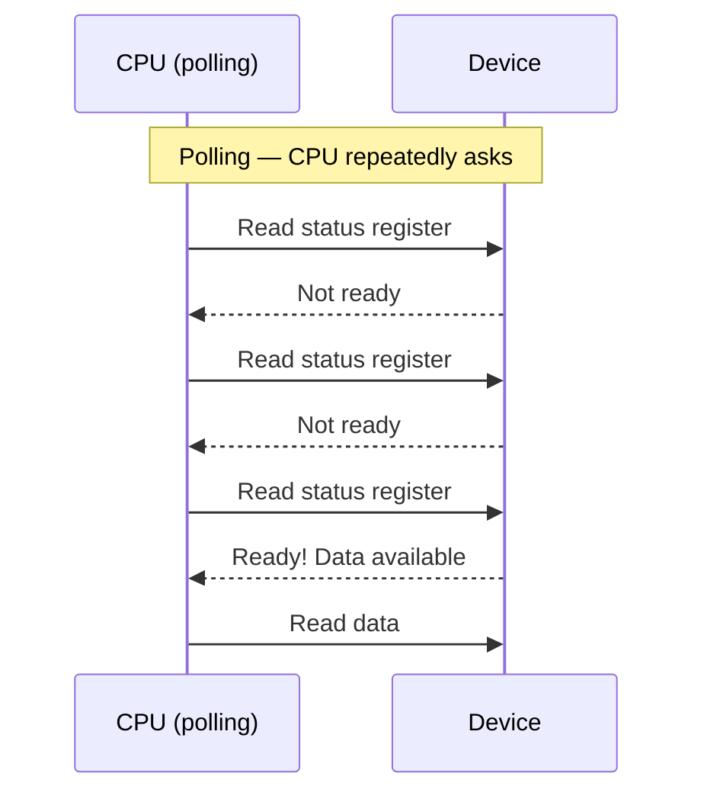
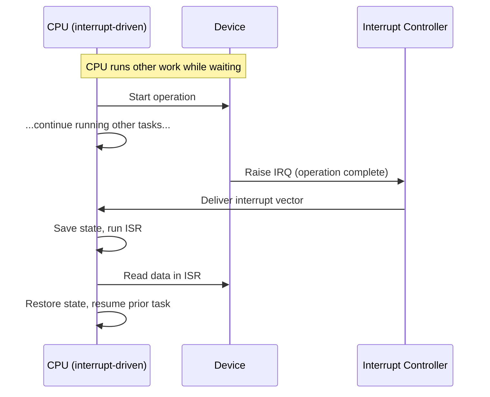
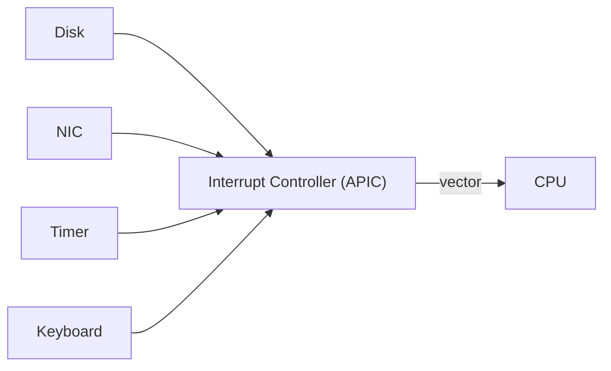
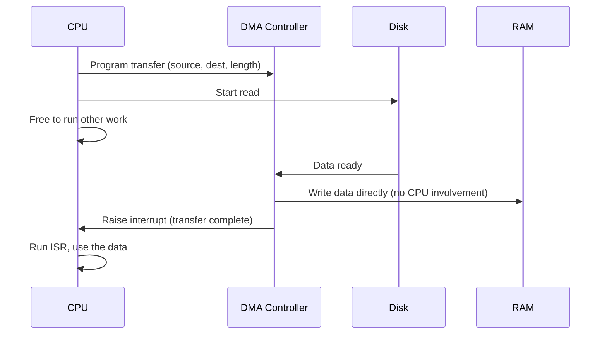

# I/O & Interrupts — Polling, IRQs & DMA

## Overview

Peripherals are slow compared to a CPU: a disk read can take milliseconds, which is millions of CPU
cycles. The [overview page](./intro.md) briefly contrasted polling and interrupts; this page works
through both mechanisms in detail, how the interrupt controller routes device signals to the CPU, and
how **DMA** lets a device move data in and out of RAM without the CPU copying every byte by hand.

## Core Concepts

| Term | Meaning |
|---|---|
| **Polling** | The CPU repeatedly reads a device's status register in a loop, asking "are you done yet?" |
| **Interrupt (IRQ)** | A hardware signal a device raises to tell the CPU it needs attention, asynchronously to whatever the CPU is doing. |
| **Interrupt controller** | Hardware (e.g., APIC on x86) that receives IRQ lines from multiple devices, prioritizes them, and delivers a vector to the CPU. |
| **Interrupt handler (ISR)** | The short piece of OS code that runs when an interrupt fires, to service the device. |
| **DMA controller** | Hardware that can move blocks of data between a device and RAM directly, without the CPU executing a load/store per byte. |
| **Cache coherence (I/O context)** | The problem of keeping CPU caches consistent with RAM contents that DMA changed behind the CPU's back. |

## Architecture / Mechanism

### Polling vs. interrupt-driven I/O

Polling wastes CPU cycles spinning in a loop, but it has no context-switch overhead and can be the
*right* choice when the wait is expected to be extremely short (a few cycles) — a full
interrupt round-trip has real latency. Interrupt-driven I/O lets the CPU do useful work while waiting,
which is why it's the default model for anything slower than a few cycles: disks, network cards,
keyboards, timers.

### Interrupt controller and IRQ lines

Each device that can interrupt is wired (physically, or via a message-signaled mechanism like
PCIe's MSI/MSI-X) to an **interrupt controller** rather than directly to the CPU. The controller's
job:

1. Accept IRQ signals from many devices.
2. Apply priority/masking rules (some interrupts can be temporarily disabled).
3. Translate the winning IRQ into a **vector** — an index the CPU uses to look up which handler to run.
4. Signal the CPU core to trap into that handler.

Modern x86 systems use MSI/MSI-X for PCIe devices: instead of a dedicated physical wire per device,
the device writes a small message to a special memory address, which the interrupt controller
interprets as "fire vector N." This scales far better than one physical pin per device.

### DMA in depth

Without DMA, moving data from a disk controller into RAM means the CPU executes a load from the
device's data port and a store into RAM, one word at a time — for a multi-megabyte transfer, that's
millions of instructions doing nothing but copying.

The CPU's only involvement is setting up the transfer and handling one interrupt at the end — the
bulk data movement happens entirely between the device and RAM over the bus, freeing the CPU
completely during the transfer itself.

## Practical Usage

This is why an OS can issue a large disk read and have the requesting thread block (be descheduled)
while the transfer happens: the CPU isn't spending any cycles copying bytes during that time, so it's
free to run other threads. When the DMA-driven transfer finishes and the interrupt fires, the OS
scheduler wakes the waiting thread. This overlap of I/O and computation is the foundation of
asynchronous I/O and is why a busy server can service thousands of concurrent slow I/O operations
using only a handful of CPU cores.

## Edge Cases & Pitfalls

:::danger DMA and cache coherence
A DMA write lands directly in RAM — it does not go through the CPU's caches. If the CPU has a stale
copy of that memory region cached, it can read old data after a DMA transfer completes unless the
system either invalidates the relevant cache lines or uses cache-coherent DMA hardware (common on
modern platforms, but not universal, especially in embedded/real-time systems). This is a classic
source of "the data is wrong but only sometimes" bugs in low-level driver code.
:::

:::warning Interrupt storms
A misbehaving or extremely high-throughput device can raise interrupts faster than the CPU can
service them, spending all available CPU time in interrupt handlers and starving normal work. Modern
NIC drivers mitigate this with **interrupt coalescing** (batch several completions into one interrupt)
or by switching to polling under heavy load (e.g., Linux's NAPI).
:::

- Polling in a tight loop for something that takes milliseconds (like disk I/O) is almost always the
  wrong tradeoff — it burns an entire CPU core doing nothing useful.
- Not every device supports DMA; simple, low-bandwidth devices (some UARTs, older peripherals) still
  rely on interrupt-per-byte or even polled I/O, because the DMA controller setup overhead isn't worth
  it for tiny transfers.

## Comparisons

| Mechanism | CPU cost while waiting | Latency to notice completion | Best for |
|---|---|---|---|
| Polling | High (spins continuously) | Near-zero | Very short waits, simple/embedded devices |
| Interrupt-driven (no DMA) | Low, but one interrupt + copy loop per unit of data | Interrupt latency | Byte/small-packet devices (classic UART) |
| Interrupt-driven + DMA | Near-zero during transfer | Interrupt latency, once, at the end | Bulk transfers: disk, network, GPU |

## References

- Intel, [Intel 64 and IA-32 Architectures Software Developer's Manual, Volume 3A](https://www.intel.com/content/www/us/en/developer/articles/technical/intel-sdm.html) — APIC and interrupt delivery.
- PCI-SIG, [PCI Express Base Specification](https://pcisig.com/specifications) — MSI/MSI-X interrupt signaling.

### Books & Videos

- Patterson & Hennessy, *Computer Organization and Design* — I/O, interrupts, and DMA fundamentals.

## Related Pages

- [Buses & I/O — Overview](./intro.md)
- [System Interconnects](./system-interconnects.md)
- [Operating Systems](../operating-systems/intro.md)
- [Storage: HDD, SSD & NVMe](../storage/intro.md)
