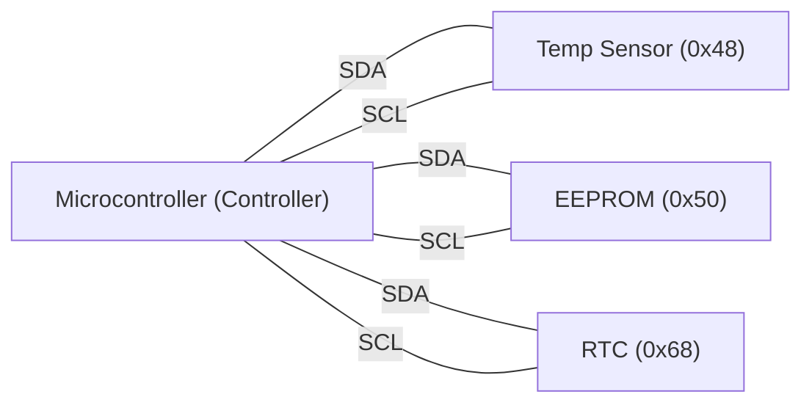
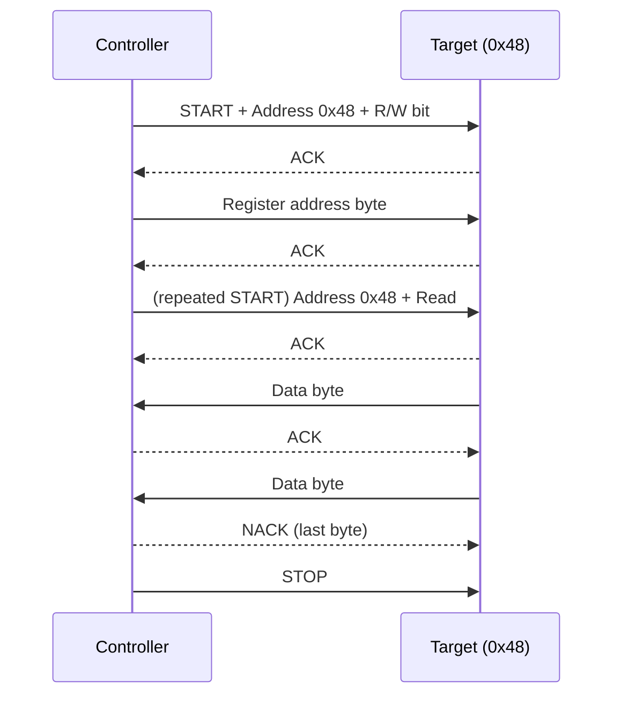
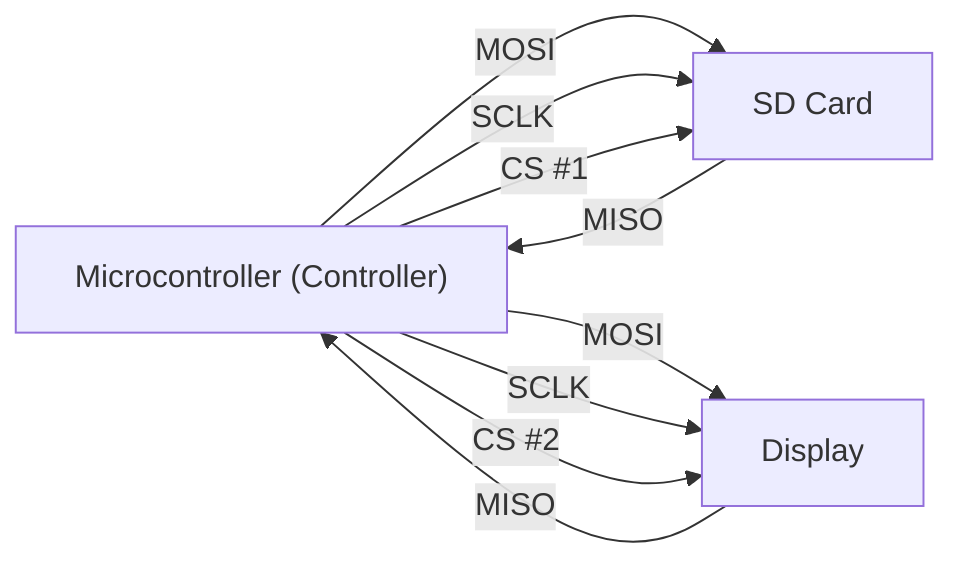
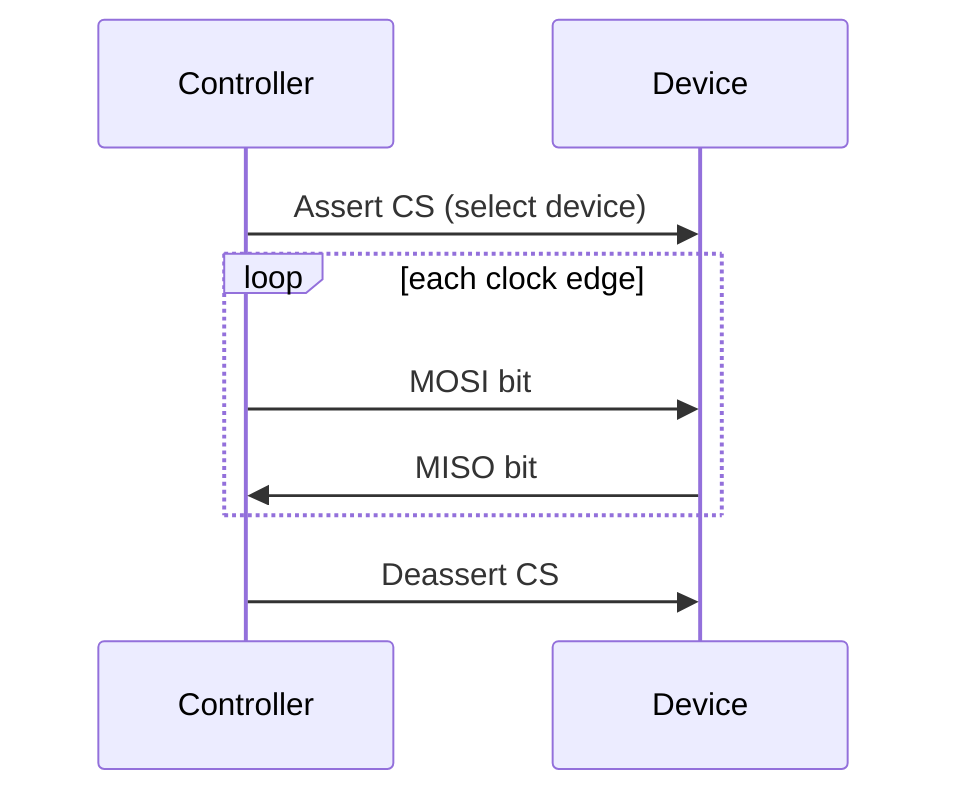
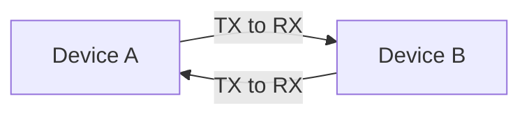
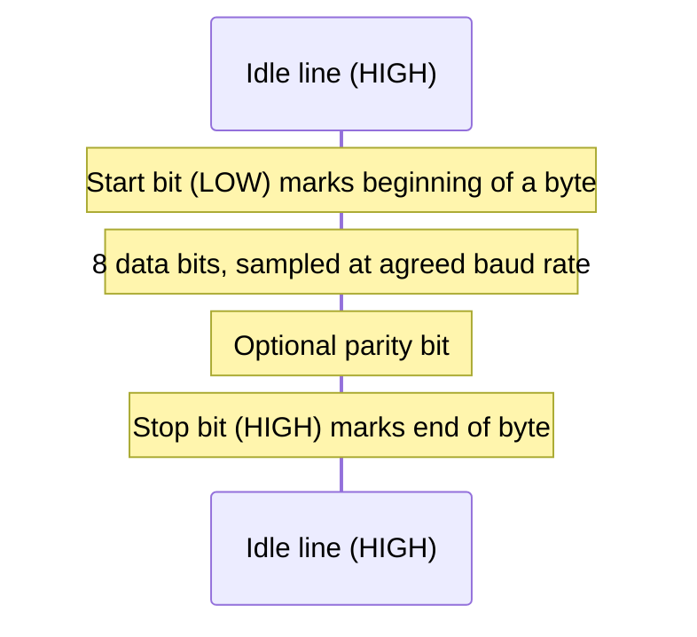

# Serial Buses — I2C, SPI & UART

## Overview

Below the level of PCIe and USB, most chip-to-chip communication on a circuit board — a sensor
talking to a microcontroller, an EEPROM storing settings, a display taking pixel data — happens over
one of three much simpler serial buses: **I2C**, **SPI**, and **UART**. Each makes a different
tradeoff between pin count, speed, and topology, and picking the right one (or reading a datasheet
that assumes you know the difference) is a routine embedded-systems and hardware-interfacing task.

## Core Concepts

| Term | Meaning |
|---|---|
| **I2C (Inter-Integrated Circuit)** | Two-wire, multi-master/multi-slave synchronous serial bus using addressing to reach a specific device. |
| **SPI (Serial Peripheral Interface)** | Four-wire, full-duplex synchronous serial bus using a dedicated chip-select line per device instead of addressing. |
| **UART (Universal Asynchronous Receiver/Transmitter)** | Asynchronous, point-to-point serial communication with no shared clock — timing is inferred from a fixed baud rate. |
| **Open-drain** | An output stage that can only pull a line low or let it float; a pull-up resistor is required to bring it high — I2C's SDA/SCL work this way. |
| **Chip select (CS/SS)** | A dedicated line an SPI controller drives to pick which single device is "listening" on the shared data lines. |
| **Baud rate** | The agreed-upon bit rate for UART communication; both ends must be configured to the same value since there's no shared clock line. |
| **ACK/NACK** | I2C's per-byte acknowledgment bit: the receiver pulls SDA low (ACK) to confirm receipt, or leaves it high (NACK). |

## Architecture / Mechanism

### I2C — two wires, addressed, multi-master

I2C uses exactly two shared lines — **SDA** (data) and **SCL** (clock) — no matter how many devices
are on the bus. Both lines are **open-drain**, pulled high by resistors; any device can pull either
line low, which is what makes multi-master arbitration and clock stretching possible without
electrical conflicts. Every transaction starts with the controller sending a 7-bit (or, less
commonly, 10-bit) address to select which device should respond; that device ACKs its own address and
ignores traffic addressed to anyone else.

**Clock stretching**: a slow slave device can hold SCL low itself to pause the controller mid-transfer
until it's ready — the open-drain wiring makes this a natural extension of the same electrical
mechanism used for arbitration.

### SPI — four wires, full-duplex, chip-select

SPI has no addressing scheme at all. Instead, the controller wires a separate **chip-select** line to
each device and asserts exactly one at a time — whichever device sees its CS line active is the one
listening/responding. Data moves on two separate lines, **MOSI** (controller-out) and **MISO**
(controller-in), driven by a shared clock (**SCLK**), so a full read and write can happen
simultaneously (**full-duplex**) — something I2C's single shared data line can't do.

:::info SPI is a de facto standard, not a formal spec
Unlike I2C (formally specified by NXP/Philips) or USB (formally specified by USB-IF), **SPI has no
single official specification**. It originated as a Motorola feature on early-1980s microcontrollers,
described in a Motorola application note, and became a de facto industry convention. This is why SPI
implementations vary in details like clock polarity/phase modes (CPOL/CPHA — "SPI mode 0-3"), word
size, and whether multiple chip-selects or daisy-chaining are supported — always check the specific
device's datasheet.
:::

### UART — asynchronous, no shared clock

UART connects exactly two devices, one wire each direction (plus ground) — no shared clock line at
all. Instead, both ends are configured with the same **baud rate** in advance, and the receiver
recovers timing from **start** and **stop** bits framing each byte:

Because there's no shared clock, both sides must agree on baud rate, data bits, parity, and stop bits
out of band (a common convention is written as, e.g., "9600 8N1"). This is the classic serial port /
`/dev/ttyUSB0` style interface still used for console access to routers, microcontroller debug output,
and GPS modules.

## Practical Usage

A typical embedded PCB mixes all three: a **UART** for a debug console, **I2C** for a handful of
low-speed sensors (temperature, accelerometer, RTC) where pin count matters more than speed, and
**SPI** for anything needing real throughput — an SD card, a TFT display, or an external flash chip.
Reading a sensor's datasheet, the "Interfaces" section will name one of these three (or occasionally
both I2C and SPI as configurable options on the same chip).

## Edge Cases & Pitfalls

:::warning I2C address collisions
Two devices of the same model on one I2C bus (e.g., two identical sensors) often ship with the same
fixed 7-bit address, causing a collision. Many parts expose one or two address-select pins to work
around this; if not, an I2C multiplexer chip is the usual fix.
:::

:::danger Don't mix voltage levels without translation
I2C and SPI signal levels depend entirely on the pull-up/supply voltage each device expects (commonly
3.3 V or 5 V). Wiring a 5V device's SDA/SCL directly to a 3.3V-only microcontroller can exceed the
input tolerance of the 3.3V part — use a level shifter, don't assume compatibility.
:::

- SPI's lack of acknowledgment means the controller has no built-in way to know if a device actually
  received data correctly — error checking, if any, must be built into the higher-level protocol.
- UART has no flow control by default; if the receiver can't keep up, bytes are simply lost unless
  hardware flow control (RTS/CTS) or a higher-level protocol handles it.
- I2C's open-drain design limits both speed and bus length — long wires or many devices add
  capacitance, which is why speed modes specify a maximum bus capacitance alongside a clock rate.

## Comparisons

| Aspect | I2C | SPI | UART |
|---|---|---|---|
| Pin count | 2 (SDA, SCL) + ground | 4+ (MOSI, MISO, SCLK, + 1 CS per device) | 2 (TX, RX) + ground |
| Clock | Shared (SCL) | Shared (SCLK) | None — fixed baud rate agreed in advance |
| Duplex | Half-duplex (one data line) | Full-duplex | Full-duplex (separate TX/RX wires) |
| Addressing | Yes — 7/10-bit device address on the bus | No — one dedicated chip-select line per device | No — point-to-point only |
| Typical speed | Up to 100 kbit/s (Standard) - 3.4 Mbit/s (High-speed) | Often tens of MHz, device-dependent (no fixed ceiling) | Typically 9.6 kbit/s - a few Mbit/s |
| Topology | Multi-master, multi-slave, one shared bus | One controller, multiple targets via separate CS lines | Strictly point-to-point (two devices) |
| Standardization | Formal spec (NXP/Philips UM10204) | De facto standard, no formal spec (Motorola-originated) | Loosely standardized (framing conventions, not electrical) |
| Typical use | Low-speed sensors, EEPROMs, RTCs on a PCB | SD cards, displays, flash chips — anything needing throughput | Debug consoles, GPS modules, simple point-to-point links |

## References

- NXP Semiconductors, [UM10204: I2C-bus specification and user manual](https://www.nxp.com/docs/en/user-guide/UM10204.pdf) — the authoritative I2C reference; defines Standard-mode (100 kbit/s), Fast-mode (400 kbit/s), Fast-mode Plus (1 Mbit/s), and High-speed mode (3.4 Mbit/s).
- Motorola / NXP, *AN991: Using the Serial Peripheral Interface to Communicate Between Multiple Microcomputers* — the closest thing to an "official" SPI reference document.
- The Linux Kernel documentation, [Overview of Linux kernel SPI support](https://www.kernel.org/doc/html/latest/spi/spi-summary.html) — explicitly notes SPI's lack of a formal standard.

### Books & Videos

- Ben Eater, [SPI: The serial peripheral interface](https://www.youtube.com/watch?v=MCi7dCBhVpQ) (YouTube) — hands-on logic-analyzer walkthrough of SPI signaling.
- Ben Eater, [The RS-232 protocol](https://www.youtube.com/watch?v=AHYNxpqKqwo) (YouTube) — asynchronous serial framing (start/stop bits, baud rate) demonstrated with a breadboard UART.

## Related Pages

- [Buses & I/O — Overview](./intro.md)
- [System Interconnects](./system-interconnects.md)
- [USB](./usb.md)
- [Assembly & Low-Level Programming](../assembly/intro.md)
