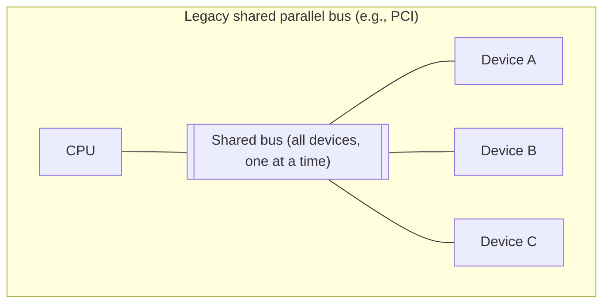
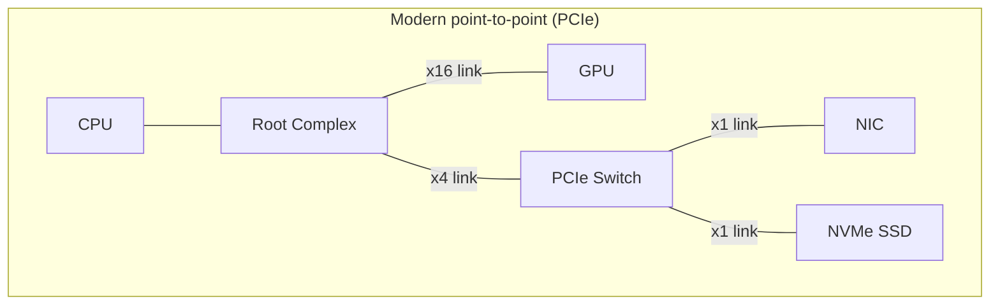
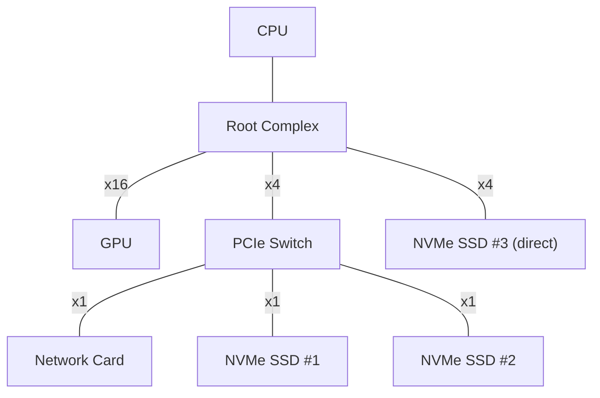

# System Interconnects — Buses, Topology & PCIe

## Overview

Every wire diagram of a computer hides the same question: how do the CPU, RAM, and peripherals
actually exchange bits? The [overview page](./intro.md) introduced the **bus** as a shared pathway
with address, data, and control lines. This page goes deeper: how buses evolved from a single shared
wire that every device fought over, to the point-to-point serial links (chiefly **PCIe**) that
dominate modern systems, and how PCIe's lane-based topology lets bandwidth scale cleanly with the
number of physical wires.

## Core Concepts

| Term | Meaning |
|---|---|
| **Address lines** | Wires that carry *which* memory location or device register is being accessed. |
| **Data lines** | Wires that carry the actual value being read or written. |
| **Control lines** | Wires that carry timing/handshake signals: read vs. write, clock, ready/busy. |
| **Multidrop bus** | A single shared set of wires connecting many devices; only one can transmit at a time. |
| **Point-to-point link** | A dedicated wire pair (or set of pairs) between exactly two endpoints — no sharing, no arbitration. |
| **Lane** | One PCIe point-to-point link: one differential pair for transmit, one for receive. |
| **Root complex** | The chipset/CPU-integrated block that connects the CPU and memory to the PCIe fabric. |
| **Switch** | A PCIe device that fans a link out to multiple downstream endpoints, like a network switch. |
| **Endpoint** | A leaf PCIe device — a GPU, NVMe SSD, network card, etc. |

## Architecture / Mechanism

### From shared bus to point-to-point

Early buses (ISA, then PCI) were **shared and parallel**: many devices sat on the same set of wires,
and an arbitration protocol decided whose turn it was to talk. Adding devices or raising clock speed
both made electrical timing (signal skew across many parallel wires) harder to manage, which capped
how fast a shared parallel bus could realistically go.

The **front-side bus (FSB)** era (roughly the Pentium through early Core 2 generations) connected the
CPU to a "northbridge" chipset over one such shared, parallel, clocked bus, with the northbridge then
fanning out to RAM and a southbridge for I/O. Both CPU-to-memory and CPU-to-chipset traffic contended
for the same electrical path.

Modern systems replaced this with **point-to-point serial links**: each device gets its own
dedicated pair of wires straight to a hub (a root complex or switch), so there's no contention and no
shared electrical bus to tune for worst-case skew. Memory access moved onto its own dedicated
point-to-point channels (integrated memory controllers), and peripheral I/O consolidated onto
**PCI Express (PCIe)**.

### PCIe topology

A PCIe **link** between any two points is made of one or more **lanes**, each an independent
transmit/receive differential pair. A "x16 slot" (used by most GPUs) has 16 lanes running in
parallel; an M.2 NVMe SSD typically uses a x4 link. Switches let a root complex's limited lane budget
fan out to more endpoints than it has direct lanes for, at the cost of those endpoints sharing the
switch's upstream bandwidth.

### Lanes and generations

Bandwidth scales two ways: by adding **lanes** to a link (x1, x4, x8, x16), and by moving to a newer,
faster **generation**. Each PCIe generation roughly doubles the raw transfer rate per lane while
staying backward compatible:

| Generation | Line rate | Encoding overhead | Approx. per-lane bandwidth (x1, one direction) |
|---|---|---|---|
| PCIe 1.0 | 2.5 GT/s | 8b/10b | ~250 MB/s |
| PCIe 2.0 | 5 GT/s | 8b/10b | ~500 MB/s |
| PCIe 3.0 | 8 GT/s | 128b/130b | ~985 MB/s |
| PCIe 4.0 | 16 GT/s | 128b/130b | ~1.97 GB/s |
| PCIe 5.0 | 32 GT/s | 128b/130b | ~3.94 GB/s |
| PCIe 6.0 | 64 GT/s | PAM4 signaling + FLIT encoding | ~7.5-7.9 GB/s |

:::info GT/s vs. bytes/s
"Transfers per second" (GT/s) is the raw signaling rate. Actual usable bandwidth is lower because
some bits are spent on line-code overhead (8b/10b wastes 20%; 128b/130b wastes under 2%) — this is
why PCIe 3.0's per-lane bandwidth is more than double PCIe 2.0's despite the line rate only going from
5 to 8 GT/s.
:::

A x16 link on PCIe 4.0 gives roughly 16x the x1 figure (~31.5 GB/s one direction) — this is why a
high-end GPU wants as many lanes as the platform can spare, while an SSD is perfectly happy with x4.

## Practical Usage

When you check `lspci -vv` (Linux) or Device Manager's link details (Windows), you'll see something
like `LnkSta: Speed 8GT/s, Width x4` — that's telling you the *negotiated* generation and lane count,
which can be lower than a device's maximum if the slot, motherboard, or shared lane budget limits it.
Motherboards often advertise more M.2/PCIe slots than the CPU has lanes for; populating all of them
can silently downgrade one slot's link width.

## Edge Cases & Pitfalls

:::warning Lane bifurcation and shared lane budgets
A CPU or chipset has a fixed total lane count. Plugging a GPU into a x16 slot and an NVMe drive into
an M.2 slot on the same platform can force the platform to split ("bifurcate") a shared set of lanes,
silently dropping the GPU to x8 or an SSD to a slower link. Check the motherboard manual's lane
allocation diagram before assuming every slot runs at its labeled maximum simultaneously.
:::

- A link always negotiates down to the **lowest common capability** of both ends — a PCIe 5.0 SSD in
  a PCIe 3.0 slot runs at PCIe 3.0 speeds, not a blend of the two.
- Cable/trace length and signal integrity get *harder*, not easier, at each new generation — PCIe 5.0
  and 6.0 impose tighter constraints on motherboard trace routing than PCIe 3.0 did.

## Comparisons

| Aspect | Shared parallel bus (legacy PCI/FSB) | Point-to-point serial (PCIe) |
|---|---|---|
| Topology | All devices share one electrical bus | Dedicated link per device, fanned out via root complex/switches |
| Contention | Only one device transmits at a time | Every link is independent; no contention between devices |
| Scaling bandwidth | Widen the bus (more parallel wires) — hits signal-skew limits | Add lanes, or move to a faster generation |
| Clock | Single shared clock domain | Per-link clock recovery (embedded in serial signaling) |

## References

- PCI-SIG, [PCI Express Specifications](https://pcisig.com/specifications) — the official PCIe standards body.
- Intel, [An Introduction to the PCI Express Architecture](https://www.intel.com/) — accessible overview of root complex/switch/endpoint topology.

### Books & Videos

- Don Anderson & Tom Shanley, *PCI Express System Architecture* — the classic in-depth treatment of PCIe topology and protocol layers.

## Related Pages

- [Buses & I/O — Overview](./intro.md)
- [I/O & Interrupts](./io-and-interrupts.md)
- [Storage: HDD, SSD & NVMe](../storage/intro.md)
- [Memory Hierarchy & RAM](../memory-hierarchy/intro.md)
