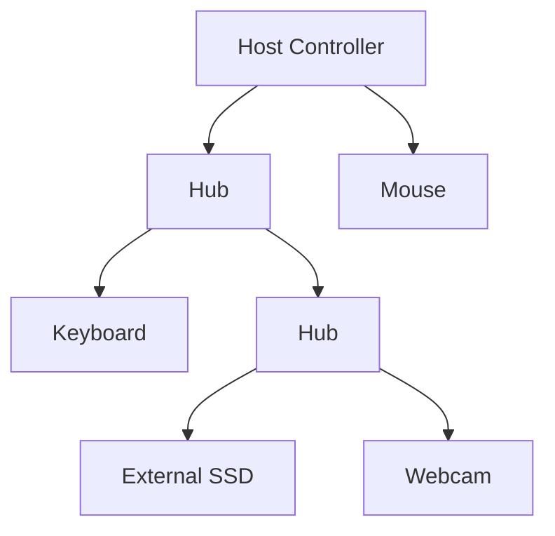
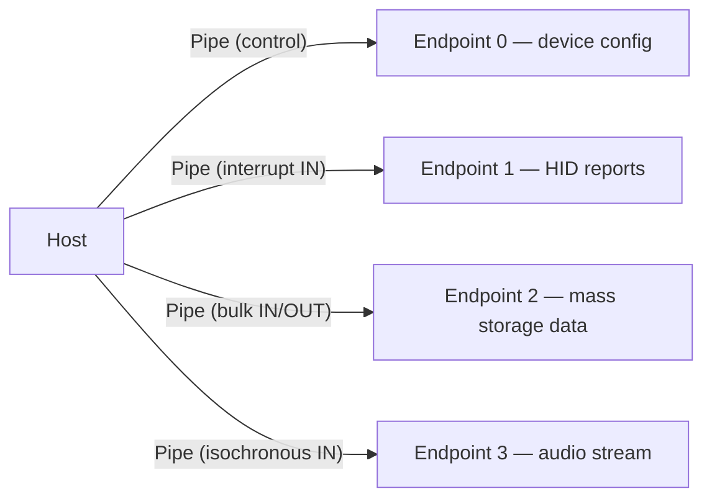
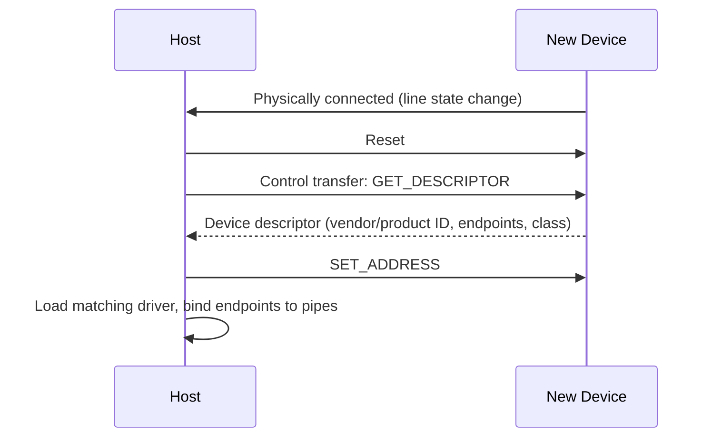

# USB — Architecture, Transfer Types & Speeds

## Overview

USB (Universal Serial Bus) is the dominant peripheral connection standard for everything from mice
and keyboards to external SSDs and displays. Unlike I2C or SPI, USB is **host-centric**: exactly one
host controller manages a USB bus, devices never talk to each other directly, and every exchange is
initiated by the host. USB also bundles several genuinely distinct things — a connector shape, an
electrical/protocol standard, a family of speed classes, and (separately) a power-delivery
negotiation protocol — that are easy to conflate but worth pulling apart.

## Core Concepts

| Term | Meaning |
|---|---|
| **Host controller** | The single entity (built into the PC/SoC) that schedules and initiates all transfers on a USB bus. |
| **Hub** | A device that fans one upstream USB port out to multiple downstream ports, forming a tree. |
| **Tiered-star topology** | USB's overall shape: a host at the root, hubs as branch points, devices as leaves — never a direct device-to-device link. |
| **Endpoint** | A logical, unidirectional data source/sink inside a device (e.g., "endpoint 1 IN" for a mouse's movement reports). |
| **Pipe** | The logical connection the host maintains to a specific endpoint, carrying one of the four transfer types. |
| **Transfer type** | One of control, bulk, interrupt, or isochronous — each with different timing/reliability guarantees. |
| **USB-C** | A physical connector/cable standard — independent of which USB protocol version or speed is running over it. |
| **USB Power Delivery (USB-PD)** | A separate negotiation protocol for how much voltage/current a USB-C link supplies, layered on top of the connector. |

## Architecture / Mechanism

### Host-centric, tiered-star topology

Every USB bus has exactly one host controller at the root of the tree. Hubs (which may be built into
a monitor, laptop dock, or a standalone USB hub) extend the tree; devices are always leaves. A mouse
and a keyboard plugged into the same hub cannot talk to each other directly — all traffic, even
between two devices on the same hub, is scheduled and routed through the host.

### Endpoints, pipes, and the four transfer types

| Transfer type | Guarantee | Typical use |
|---|---|---|
| **Control** | Reliable, used for setup/configuration commands | Device enumeration, standard requests (every device has a control endpoint 0) |
| **Bulk** | Reliable (retried), no timing guarantee — gets whatever bandwidth is left over | Mass storage, file transfers, printers |
| **Interrupt** | Reliable, guaranteed minimum polling interval, small packets | Keyboards, mice, other low-latency/low-volume HIDs |
| **Isochronous** | Guaranteed bandwidth and timing, but **no retries** — dropped data stays dropped | Audio and video streaming, where a late-but-correct packet is worse than a small glitch |

The host controller polls/schedules every pipe according to its transfer type; isochronous and
interrupt transfers get a reserved slice of each frame so that time-sensitive traffic isn't starved by
a big bulk transfer competing for bandwidth.

### Enumeration (brief)

## Practical Usage

USB versions and their marketed speed names have changed naming schemes multiple times; the
signaling rate is the fact that actually matters for "will this be fast enough":

| Signaling name | Introduced in | Signaling rate |
|---|---|---|
| Low-Speed | USB 1.0 | 1.5 Mbit/s |
| Full-Speed | USB 1.0/1.1 | 12 Mbit/s |
| High-Speed | USB 2.0 | 480 Mbit/s |
| SuperSpeed (USB 5Gbps) | USB 3.0 | 5 Gbit/s |
| SuperSpeed+ (USB 10Gbps) | USB 3.1 | 10 Gbit/s |
| USB 20Gbps (two-lane) | USB 3.2 | 20 Gbit/s |
| USB4 40Gbps | USB4 (v1.0) | 40 Gbit/s |
| USB4 80Gbps | USB4 v2.0 | 80 Gbit/s |

:::info Marketing names change, signaling rates don't
The USB-IF has renamed the same underlying signaling rates more than once (e.g., "SuperSpeed+" became
"USB 3.2 Gen 2x1" became the current plain-language "USB 10Gbps"). When comparing devices, look for the
**Gbps figure**, not the version number — "USB 3.2" alone is ambiguous between 5, 10, and 20 Gbit/s
depending on which "Gen" a specific product implements.
:::

## Edge Cases & Pitfalls

:::danger USB-C is a connector, not a speed or protocol guarantee
A USB-C **port** or **cable** tells you nothing on its own about what speed, power, or even which
protocol it carries. USB-C is a connector/cable mechanical standard that different things get
tunneled through: USB 2.0 High-Speed, USB4, DisplayPort Alt Mode, Thunderbolt, and USB-PD can all use
the identical-looking USB-C plug. A USB-C cable rated only for USB 2.0 speeds and low power will
bottleneck or fail to charge a device that needs USB4 speeds or high-wattage Power Delivery, with no
visual way to tell the cables apart.
:::

:::warning Isochronous transfers can silently drop data
Because isochronous transfers are not retried, a busy or marginal USB link can drop audio/video
samples rather than stall — this shows up as audible glitches or dropped video frames rather than an
error message, which can be confusing to debug.
:::

- A USB hub's downstream bandwidth is shared among all connected devices — plugging several
  high-bandwidth devices into the same hub can bottleneck all of them even if each device individually
  supports a faster speed.
- **USB Power Delivery (USB-PD)** is a separate negotiation protocol layered on the USB-C connector's
  extra pins: source and sink negotiate a voltage/current contract (well beyond the original 5V USB
  power). A device can be electrically connected without either end successfully negotiating the
  power profile it expected, resulting in slow charging.

## Comparisons

| Transfer type | Retried on error? | Bandwidth guarantee | Example device |
|---|---|---|---|
| Control | Yes | N/A (setup traffic) | Every device (enumeration) |
| Bulk | Yes | No — best effort | External hard drive |
| Interrupt | Yes | Guaranteed minimum polling rate | Keyboard, mouse |
| Isochronous | No | Guaranteed bandwidth/timing | Webcam, USB audio interface |

## References

- USB Implementers Forum (USB-IF), [USB Specifications](https://www.usb.org/documents) — official USB 2.0, USB 3.2, and USB4 specifications.
- USB-IF, [USB Data Performance Language Usage Guidelines](https://www.usb.org/sites/default/files/usb_data_performance_language_usage_guidelines_jan_2024_0.pdf) — current marketing-name-to-Gbps mapping.
- USB-IF, [USB Power Delivery Specification](https://www.usb.org/document-library/usb-power-delivery) — official USB-PD reference.

### Books & Videos

- Jan Axelson, *USB Complete: The Developer's Guide* — the standard developer-level reference covering transfer types, enumeration, and electrical/mechanical details.

## Related Pages

- [Buses & I/O — Overview](./intro.md)
- [System Interconnects](./system-interconnects.md)
- [Serial Buses — I2C, SPI & UART](./serial-buses-i2c-spi-uart.md)
- [Storage: HDD, SSD & NVMe](../storage/intro.md)
