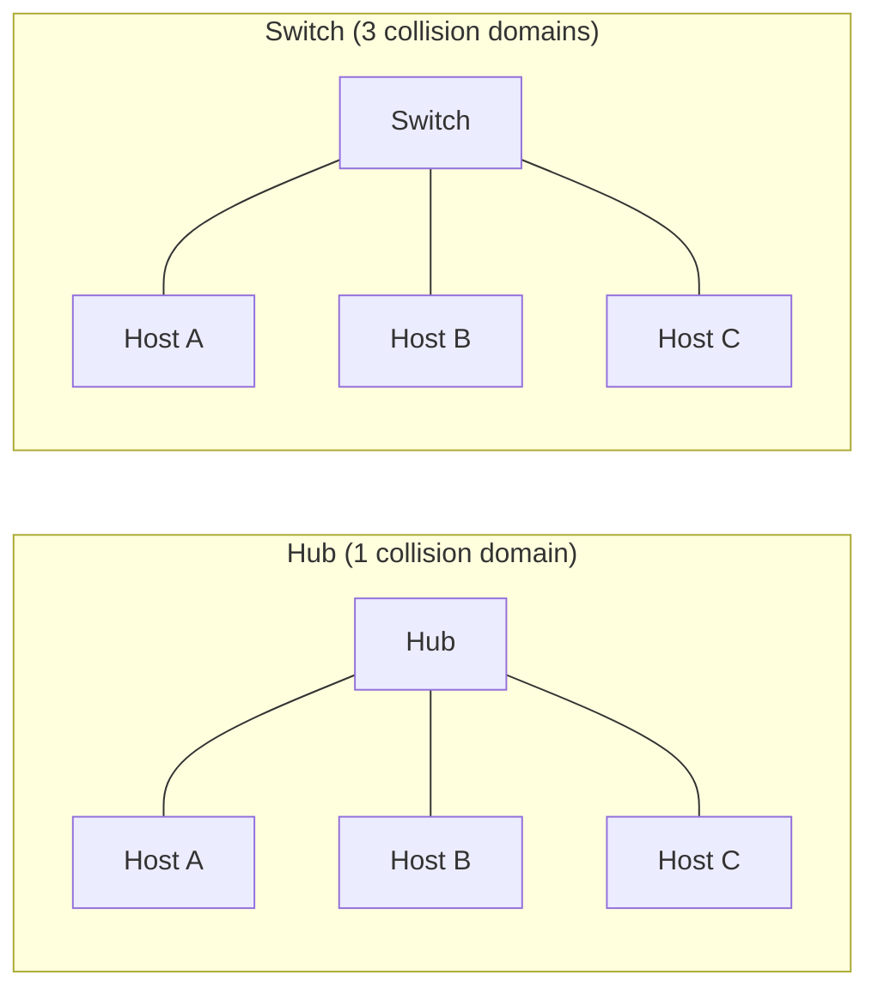
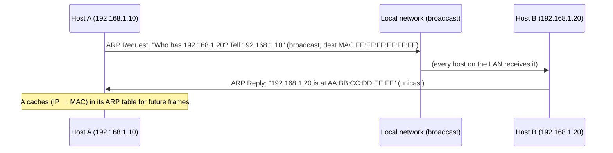

# The Data Link Layer

## Overview

The data link layer is responsible for moving frames between devices on the *same* local network
segment — the "last hop" addressing problem, solved before a packet ever needs to think about
routing across the wider Internet. On virtually every modern wired or Wi-Fi LAN, this layer means
**Ethernet** framing and addressing, whether or not there's an actual Ethernet cable involved.

## Core Concepts

| Term | Meaning |
|---|---|
| **Frame** | The data-link-layer PDU: a header (source/destination MAC, type) + payload + trailer (checksum). |
| **MAC address** | A 48-bit address burned into (or configured on) a network interface, unique on the local network. |
| **OUI (Organizationally Unique Identifier)** | The first 24 bits of a MAC address, assigned by the IEEE to the manufacturer (e.g., all of Apple's interfaces share a set of OUIs). |
| **Collision domain** | A set of devices where two simultaneous transmissions can collide — everything on one old-style hub, or one half-duplex segment. |
| **Broadcast domain** | A set of devices that all receive a broadcast frame — everything on one switch (or set of switches) without a router between them. |
| **ARP (Address Resolution Protocol)** | The protocol that resolves "what MAC address does this IP address belong to?" on a local network. |

## Architecture / Mechanism

### MAC Address Structure

A MAC address is 48 bits, conventionally written as six colon-separated hex bytes:

```text
3C:22:FB:12:34:56
└──OUI (24 bits)─┘ └device-specific (24 bits)┘
   assigned to        assigned by the
   the vendor by       vendor to a
   the IEEE            specific interface
```

### Hubs vs. Switches

An old-style **hub** is a dumb physical-layer repeater: every bit it receives on one port is echoed
to *every other port*, and all connected devices share one collision domain — only one can
successfully transmit at a time, and simultaneous transmissions collide. A **switch** operates at the
data link layer: it learns which MAC address lives behind which port (by watching source addresses of
incoming frames) and forwards each frame only out the port the destination actually lives on. Each
switch port is its own collision domain, and (with full-duplex links) collisions are effectively
eliminated on modern switched networks.



### ARP: Resolving an IP Address to a MAC Address

Before Host A can send an Ethernet frame to Host B on the same LAN, it needs B's MAC address — it
only knows B's IP address. ARP solves this with a broadcast request and a unicast reply:



Every host keeps an **ARP cache** (a table of recently resolved IP→MAC mappings) so it doesn't have
to broadcast a request for every single packet.

## Practical Usage

Inspecting your own machine's ARP cache and MAC address:

```bash
# View the local ARP cache (Linux/macOS)
$ ip neigh
192.168.1.1 dev eth0 lladdr aa:bb:cc:00:11:22 REACHABLE
192.168.1.20 dev eth0 lladdr 3c:22:fb:12:34:56 STALE

# View your own interface's MAC address
$ ip link show eth0
2: eth0: <BROADCAST,MULTICAST,UP,LOWER_UP> mtu 1500 qdisc noqueue state UP
    link/ether 00:1a:2b:3c:4d:5e brd ff:ff:ff:ff:ff:ff
```

`REACHABLE` means the entry was recently confirmed; `STALE` means it's cached but not recently
verified — the kernel will re-ARP before using it if it's expired.

## Edge Cases & Pitfalls

:::warning ARP has no authentication
Any device on a LAN can reply to an ARP request (or send unsolicited ARP replies) claiming to own an
IP address it doesn't. This is the basis of **ARP spoofing/poisoning**, used in man-in-the-middle
attacks on local networks — a major reason switched, isolated VLANs and features like **Dynamic ARP
Inspection** exist on managed switches.
:::

- MAC addresses are only meaningful *within* a single broadcast domain/LAN — they never appear in
  routing decisions once a packet crosses a router onto another network.
- "Locally administered" MAC addresses (set in software, e.g. for MAC randomization on phones/laptops
  joining Wi-Fi) don't map to a real IEEE OUI — you can tell by checking the second-least-significant
  bit of the first byte.
- A switch with a full **MAC address table** (CAM table) falls back to flooding frames to every port
  for unknown destinations — functionally acting like a hub for that traffic until it learns the
  mapping.

## Comparisons

| Device | OSI Layer | Forwards based on | Collision domains created |
|---|---|---|---|
| Hub | Physical (1) | Nothing — repeats everything | 1 (shared) |
| Switch | Data Link (2) | MAC address (learned dynamically) | 1 per port |
| Router | Network (3) | IP address / routing table | 1 per interface, and separates broadcast domains too |

## References

- IEEE 802.3, *Ethernet* — the standard defining Ethernet framing.
- IETF, [RFC 826](https://www.rfc-editor.org/rfc/rfc826.html) — *An Ethernet Address Resolution
  Protocol* (ARP), the original specification.
- IEEE, [Guidelines for 48-Bit Global Identifier (OUI) usage](https://standards.ieee.org/products-programs/regauth/) — how OUIs are assigned.

### Books & Videos

- Kurose & Ross, *Computer Networking: A Top-Down Approach* — link-layer chapter covers Ethernet,
  switching, and ARP in detail.
- W. Richard Stevens, *TCP/IP Illustrated, Volume 1* — classic packet-level walkthroughs, including ARP.

## Related Pages

- [Computer Networks — Overview](./intro.md)
- [OSI & TCP/IP Models](./osi-and-tcp-ip-models.md)
- [Network Layer & Routing](./network-layer-and-routing.md)
