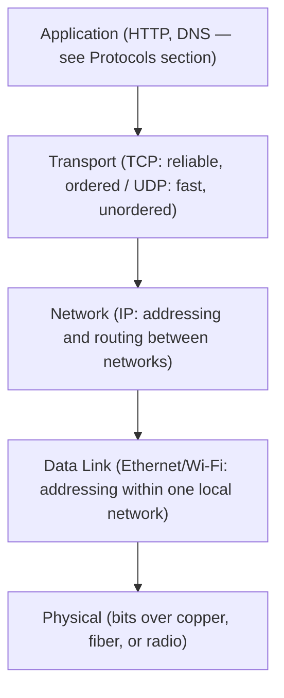

# Computer Networks — Overview

## Overview

A computer network lets independent machines exchange data despite being built by different vendors,
running different software, and connected over physically different media (copper, fiber, radio).
This works because networking is **layered**: each layer solves one problem (framing bits on a wire,
addressing a machine, ensuring reliable delivery) and exposes a simple interface to the layer above,
independent of how the layers below are implemented.

## Core Concepts

| Term | Meaning |
|---|---|
| **Protocol** | An agreed-upon set of rules for formatting and exchanging messages between two systems. |
| **Packet** | A unit of data with header (addressing/control info) and payload, as sent over a network. |
| **OSI model** | A 7-layer conceptual reference model for network functions (Physical, Data Link, Network, Transport, Session, Presentation, Application). |
| **TCP/IP model** | The 4-layer model that actually describes the modern Internet (Link, Internet, Transport, Application) — what OSI is usually taught alongside. |
| **IP address** | A numeric address identifying a machine on a network at the Network layer. |
| **Port** | A number identifying a specific application/service on a machine at the Transport layer. |

## Architecture / Mechanism

Each layer wraps the layer above's data in its own header before handing it down — a web request
becomes an HTTP message, wrapped in a TCP segment, wrapped in an IP packet, wrapped in an Ethernet
frame, before it ever becomes electrical signals on a wire.

## In This Section

- **[OSI & TCP/IP Models](./osi-and-tcp-ip-models.md)** — both layering models side by side, why
  TCP/IP won out in practice, and how encapsulation wraps data as it moves down the stack.
- **[Data Link Layer](./data-link-layer.md)** — Ethernet framing, MAC addresses, switches vs. hubs,
  and ARP.
- **[Network Layer & Routing](./network-layer-and-routing.md)** — IP addressing, subnetting/CIDR,
  what routers do, and why NAT exists.
- **[Transport Layer: TCP & UDP](./transport-layer-tcp-udp.md)** — the three-way handshake,
  reliability, flow control vs. congestion control, and when UDP is the right choice.

## Why It Matters

- **[Application Protocols](../protocols/intro.md)** (HTTP, DNS, TLS) are all built *on top of* the
  transport/network layers described here — you can't reason about "why is this API slow" without
  the layer underneath it.
- **[Operating Systems](../operating-systems/intro.md)**: sockets are the OS abstraction that exposes
  this entire network stack to applications.

## Related Pages

- [Application Protocols](../protocols/intro.md)
- [Operating Systems](../operating-systems/intro.md)
