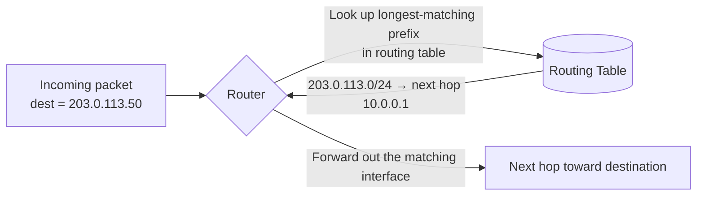

# The Network Layer and Routing

## Overview

The network layer's job is addressing and forwarding *across* different networks — the piece that
lets a packet leave your home LAN, cross however many intermediate networks, and arrive at a server
on the other side of the world. On the Internet, this layer means the **Internet Protocol (IP)**,
in its IPv4 and (increasingly) IPv6 forms, plus the routers that forward packets hop by hop based on
destination IP address.

## Core Concepts

| Term | Meaning |
|---|---|
| **IP address** | A numeric address identifying a network interface: 32 bits for IPv4, 128 bits for IPv6. |
| **Subnet** | A logical subdivision of an IP network — a contiguous block of addresses that share a common prefix. |
| **CIDR notation** | `address/prefix-length` (e.g., `192.168.1.0/24`) — the modern way to express a subnet's size without a separate subnet mask. |
| **Routing table** | A list of (destination network → next hop) entries a router (or host) uses to decide where to forward a packet. |
| **Default gateway** | The next hop a host sends a packet to when the destination isn't on its local subnet. |
| **NAT (Network Address Translation)** | Rewriting source/destination addresses in transit, most commonly to let many private IPs share one public IP. |

## Architecture / Mechanism

### IPv4 Addressing

An IPv4 address is 32 bits, written as four dotted decimal octets: `192.168.1.10`. With only ~4.3
billion possible addresses and far more than that many devices on the Internet, IPv4 address
exhaustion is the reason both **NAT** and **IPv6** exist.

### IPv6 (Briefly)

**IPv6** uses 128-bit addresses, written as eight groups of hex digits (e.g.,
`2001:0db8:85a3:0000:0000:8a2e:0370:7334`, often abbreviated `2001:db8:85a3::8a2e:370:7334`). Its
address space is large enough that NAT is no longer *necessary* for address conservation (though it's
still sometimes used for other reasons). Global IPv6 adoption has grown steadily but IPv4 (usually
behind NAT) still dominates most networks as of the mid-2020s.

### Subnetting and CIDR

A subnet mask (or CIDR prefix length) splits an IP address into a **network portion** and a **host
portion**. `/24` means the first 24 bits identify the network; the remaining 8 bits identify hosts
within it.

**Worked example: `192.168.1.0/24`**

```text
192.168.1.0/24
├─ Network bits:  192.168.1   (24 bits — fixed for every host on this subnet)
├─ Host bits:     .0-.255     (8 bits → 256 addresses)
├─ Network address:    192.168.1.0    (all host bits = 0, not assignable to a device)
├─ Broadcast address:  192.168.1.255  (all host bits = 1, not assignable to a device)
└─ Usable host range:  192.168.1.1 – 192.168.1.254   (254 usable addresses)
```

If you instead needed only 4 usable addresses (say, a point-to-point link plus a couple of hosts),
you'd use a smaller block like `192.168.1.0/30` (2 host bits → 4 addresses, 2 usable after
network/broadcast are reserved) — CIDR lets you size a subnet to actual need instead of only ever
handing out fixed class-based blocks (the old, now-obsolete Class A/B/C system).

### What a Router Does



A router receives a packet, strips the data-link framing, looks at the destination IP address, and
consults its routing table to find the **most specific matching route** (longest prefix match). It
then forwards the packet out the appropriate interface toward the next hop — repeating hop by hop
until the packet reaches a router directly attached to the destination's subnet.

### NAT

**Network Address Translation** rewrites the source IP (and port) of outgoing packets from a private
address (e.g., `192.168.1.10`) to a router's single public IP, tracking the mapping so return traffic
can be translated back. It exists primarily because IPv4's address space is far smaller than the
number of devices that need to reach the Internet — an entire home or office network can share one
public IPv4 address. A side effect is that NAT also hides internal topology and provides a mild,
incidental security benefit (unsolicited inbound connections have no mapping to follow), though it is
not a substitute for a firewall.

## Practical Usage

Tracing the route packets take, and inspecting local routing/addressing:

```bash
$ traceroute example.com
traceroute to example.com (93.184.216.34), 30 hops max, 60 byte packets
 1  192.168.1.1 (192.168.1.1)  1.203 ms  1.150 ms  1.102 ms
 2  10.20.0.1 (10.20.0.1)  8.421 ms  8.390 ms  8.355 ms
 3  203.0.113.1 (203.0.113.1)  12.004 ms  11.980 ms  11.955 ms
 ...
 9  93.184.216.34 (93.184.216.34)  84.221 ms  83.998 ms  84.150 ms

$ ip route
default via 192.168.1.1 dev eth0
192.168.1.0/24 dev eth0 proto kernel scope link src 192.168.1.10
```

Each `traceroute` line is one router hop — the first is almost always your default gateway. `ip
route` shows the local routing table: anything on `192.168.1.0/24` is reached directly; everything
else goes to the `default` route via the gateway at `192.168.1.1`.

## Edge Cases & Pitfalls

:::warning Subnet math errors are a top cause of "can't reach this host" bugs
Getting the prefix length wrong (e.g., configuring `/24` when you meant `/25`) silently splits or
merges subnets in ways that cause some hosts to be unreachable directly and require routing through
a gateway they weren't expecting to need. Always double check host count math: a `/N` prefix leaves
`32 - N` host bits, i.e. `2^(32-N)` addresses, minus 2 for network/broadcast in most cases.
:::

- Private address ranges (`10.0.0.0/8`, `172.16.0.0/12`, `192.168.0.0/16` per
  [RFC 1918](https://www.rfc-editor.org/rfc/rfc1918.html)) are never routed on the public Internet —
  they only make sense behind NAT.
- Double NAT (e.g., an ISP-provided modem/router *and* your own router both doing NAT) can break
  protocols that embed IP addresses in application data or require inbound connections, and often
  needs manual port-forwarding configuration on both devices.
- IPv6 doesn't use broadcast at all (it uses multicast/anycast instead), which changes some
  assumptions carried over from IPv4-only thinking, including how ARP-equivalent neighbor discovery works.

## Comparisons

| Aspect | IPv4 | IPv6 |
|---|---|---|
| Address size | 32 bits (~4.3 billion addresses) | 128 bits (effectively unlimited for foreseeable use) |
| Notation | Dotted decimal (`192.168.1.10`) | Colon-separated hex (`2001:db8::1`) |
| NAT | Widely used to cope with address scarcity | Not required for address conservation |
| Broadcast | Supported | Removed in favor of multicast |

## References

- IETF, [RFC 791](https://www.rfc-editor.org/rfc/rfc791.html) — *Internet Protocol* (IPv4).
- IETF, [RFC 8200](https://www.rfc-editor.org/rfc/rfc8200.html) — *Internet Protocol, Version 6 (IPv6)
  Specification*.
- IETF, [RFC 4632](https://www.rfc-editor.org/rfc/rfc4632.html) — *Classless Inter-domain Routing
  (CIDR): The Internet Address Assignment and Aggregation Plan*.
- IETF, [RFC 1918](https://www.rfc-editor.org/rfc/rfc1918.html) — *Address Allocation for Private
  Internets*.

### Books & Videos

- Kurose & Ross, *Computer Networking: A Top-Down Approach* — network-layer chapter covers routing
  algorithms and addressing in depth.
- W. Richard Stevens, *TCP/IP Illustrated, Volume 1* — deep, packet-level treatment of IP and routing.

## Related Pages

- [Computer Networks — Overview](./intro.md)
- [Data Link Layer](./data-link-layer.md)
- [Transport Layer: TCP & UDP](./transport-layer-tcp-udp.md)
- [DNS](../protocols/dns.md) — resolves names to the IP addresses this layer routes on.
