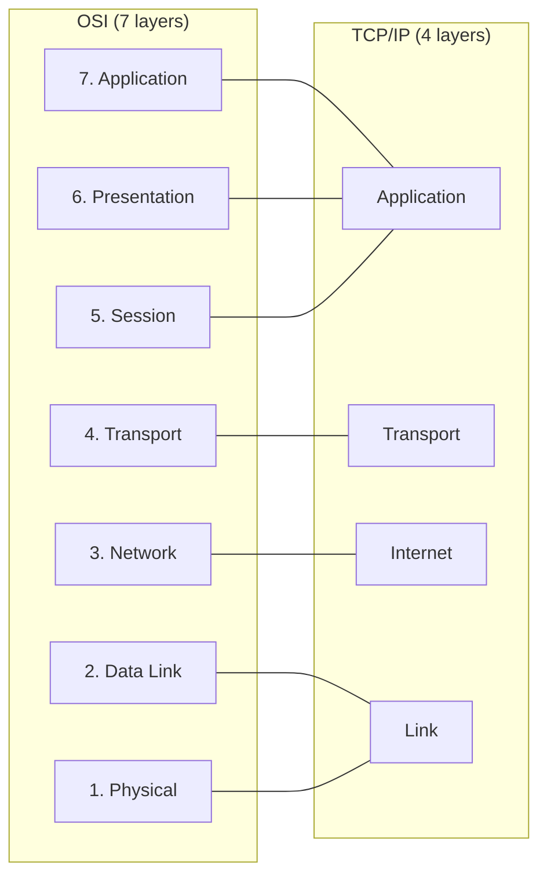
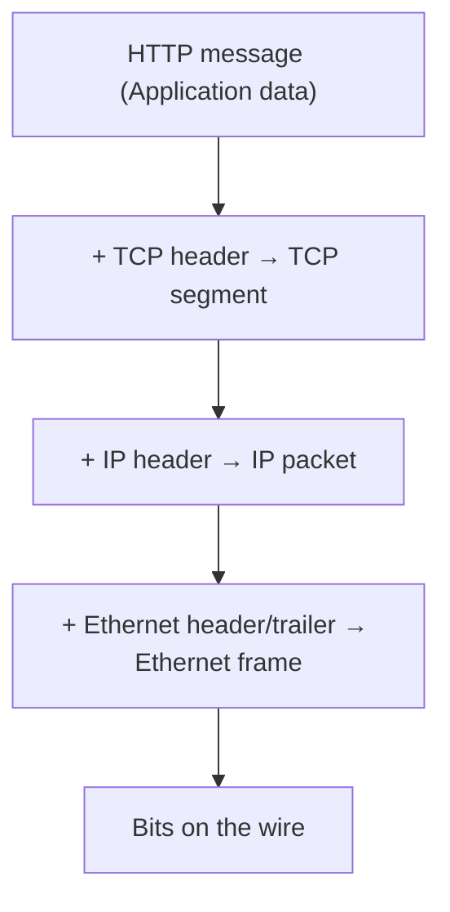

# The OSI and TCP/IP Models

## Overview

Two competing layer models are used to describe networking: the **OSI model** (7 layers, designed by
committee in the late 1970s/80s as a vendor-neutral standard) and the **TCP/IP model** (4-5 layers,
which grew organically out of the actual protocols that run the Internet). OSI is what almost every
textbook and certification exam teaches; TCP/IP is what the real Internet actually runs. Understanding
both — and how they map onto each other — is what lets you translate between "the way this is taught"
and "the way this actually works in a packet capture."

## Core Concepts

| Term | Meaning |
|---|---|
| **Layer** | A self-contained set of responsibilities that exposes a simple interface to the layer above it, hiding how the layers below are implemented. |
| **Encapsulation** | Each layer wraps the data handed down from the layer above in its own header (and sometimes trailer) before passing it to the layer below. |
| **PDU (Protocol Data Unit)** | The name for a chunk of data at a given layer — *segment* (transport), *packet* (network), *frame* (data link). |
| **De-encapsulation** | The reverse process at the receiving end: each layer strips its own header and hands the remainder up to the layer above. |
| **Peer layer** | The equivalent layer on the other end of a connection — conceptually, layer *N* on the sender "talks to" layer *N* on the receiver, even though the bits actually travel down and back up through every layer. |

## Architecture / Mechanism: Mapping the Two Models

| OSI Layer | OSI Name | TCP/IP Layer | Example protocols |
|---|---|---|---|
| 7 | Application | Application | HTTP, DNS, TLS, SMTP |
| 6 | Presentation | Application | (data formatting/encryption — folded into Application in practice) |
| 5 | Session | Application | (connection/session management — also folded into Application) |
| 4 | Transport | Transport | TCP, UDP |
| 3 | Network | Internet | IP, ICMP |
| 2 | Data Link | Link (Network Access) | Ethernet, Wi-Fi (802.11), ARP |
| 1 | Physical | Link (Network Access) | Copper, fiber, radio |



:::info Why TCP/IP "won" despite OSI being taught more
OSI's protocols (X.25, CLNP, etc.) were designed top-down by committee before much real-world
deployment experience existed, and the full stack was heavyweight to implement. TCP/IP grew
bottom-up from working code on ARPANET/the early Internet — "rough consensus and running code."
By the time OSI's protocols were production-ready, TCP/IP already had a critical mass of running
networks and simply never got displaced. OSI's *model* survived as a teaching and troubleshooting
tool even though its *protocols* mostly didn't.
:::

### Encapsulation, Step by Step



Each header carries exactly the information that layer's peer needs: the TCP header carries port
numbers and sequence numbers, the IP header carries source/destination IP addresses, and the Ethernet
frame carries source/destination MAC addresses. A router only needs to look as deep as the IP header
to forward a packet; a switch only needs to look as deep as the Ethernet header.

## Practical Usage: Seeing the Layers in a Packet Capture

Running `tcpdump` or Wireshark on a `curl http://example.com` request shows the encapsulation directly.
A one-line summary from `tcpdump -i eth0 -n port 80`:

```text
14:32:01.123456 IP 192.168.1.10.54321 > 93.184.216.34.80: Flags [S], seq 123456789, win 64240, length 0
```

Reading this against the model:

- `IP 192.168.1.10.54321 > 93.184.216.34.80` — the **Internet layer** (IP addresses) and **Transport
  layer** (port `54321` → port `80`) information, both visible because `tcpdump` decodes headers for you.
- `Flags [S]` — a TCP SYN flag, part of the [three-way handshake](./transport-layer-tcp-udp.md).
- The Ethernet header (source/destination MAC) is layer 2 and is normally hidden by `tcpdump`'s default
  output, but is present in every frame — add `-e` to see it.

## Edge Cases & Pitfalls

:::warning "Which layer is this?" doesn't always have a clean answer
Real protocols don't always respect the model cleanly. TLS is often drawn "between" transport and
application, but functions more like a session/presentation-layer concern (OSI layers 5-6) wrapped
around application data. QUIC (used by HTTP/3) implements transport-layer reliability *and*
built-in encryption in a single UDP-based protocol, blurring the transport/security boundary further.
Treat the model as a mental map, not a strict specification every protocol obeys.
:::

- A common exam mistake: assuming a switch operates at layer 3. Switches forward on MAC addresses
  (layer 2); routers forward on IP addresses (layer 3). See
  [Data Link Layer](./data-link-layer.md) and [Network Layer & Routing](./network-layer-and-routing.md).
- The "TCP/IP model" is sometimes drawn with 4 layers and sometimes with 5 (splitting Link into
  Physical + Data Link) — there's no single canonical source, unlike OSI's fixed 7 layers from
  ISO/IEC 7498-1.

## Comparisons

| Aspect | OSI Model | TCP/IP Model |
|---|---|---|
| Layers | 7 | 4 (sometimes drawn as 5) |
| Origin | ISO committee standard (top-down design) | Grew from working ARPANET/Internet protocols (bottom-up) |
| Real-world protocol stack | Rarely implemented in full | This *is* the real Internet |
| Primary use today | Teaching, troubleshooting vocabulary ("layer 2 issue", "layer 7 firewall") | Actual specification of how the Internet works |

## References

- ISO/IEC 7498-1, *Information technology — Open Systems Interconnection — Basic Reference Model*
  — the formal OSI model standard.
- IETF, [RFC 1122](https://www.rfc-editor.org/rfc/rfc1122.html) — *Requirements for Internet Hosts —
  Communication Layers*, one of the closest things to an official description of the Internet/TCP-IP
  layering.
- Kurose & Ross, *Computer Networking: A Top-Down Approach* — structures its entire narrative around
  the layered model, starting from the application layer down.

### Books & Videos

- Kurose & Ross, *Computer Networking: A Top-Down Approach* — the standard modern textbook; Chapter 1
  covers protocol layering and encapsulation in depth.
- Ilya Grigorik, [*High Performance Browser Networking*](https://hpbn.co/) (free online) — Part I
  covers the transport-layer building blocks referenced throughout this section.

## Related Pages

- [Computer Networks — Overview](./intro.md)
- [Data Link Layer](./data-link-layer.md)
- [Network Layer & Routing](./network-layer-and-routing.md)
- [Transport Layer: TCP & UDP](./transport-layer-tcp-udp.md)
