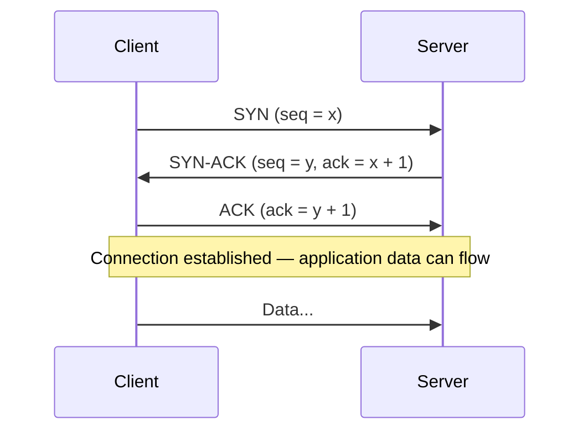
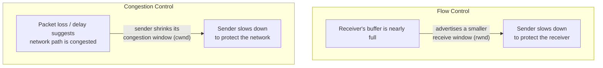

# The Transport Layer: TCP and UDP

## Overview

The transport layer is where "get some bytes from A to B" becomes either a reliable, ordered
**stream** (TCP) or a fast, minimal, unordered **datagram** service (UDP). Almost everything you do
online rides on one of these two protocols, and the choice between them is a genuine engineering
tradeoff, not just a historical accident — reliability and ordering guarantees cost latency and
overhead that some applications can't afford.

## Core Concepts

| Term | Meaning |
|---|---|
| **Port** | A 16-bit number identifying a specific application/service on a host, alongside its IP address. |
| **Segment** | TCP's PDU: a header (ports, sequence/ack numbers, flags, window size) plus a chunk of stream data. |
| **Sequence number** | A per-byte counter TCP uses to detect loss, reordering, and duplication. |
| **ACK (acknowledgment)** | A signal from the receiver confirming which sequence numbers it has successfully received. |
| **Flow control** | The *receiver* telling the sender "don't send more than I can currently buffer" — protects the receiver. |
| **Congestion control** | The *sender* (and network) inferring how much the *network path* can currently carry without overload — protects the network. |

## Architecture / Mechanism: The TCP Three-Way Handshake

Before exchanging any application data, TCP establishes a connection so both sides agree on starting
sequence numbers:



Each side proposes an **initial sequence number** (ISN); the SYN-ACK both acknowledges the client's
ISN and proposes the server's own. After the final ACK, both sides have confirmed they can send *and*
receive, and the connection moves to the `ESTABLISHED` state.

### Reliability Mechanisms

TCP guarantees ordered, complete delivery (or an error if that's impossible) using:

- **Sequence numbers** on every byte, so the receiver can detect gaps and reorder out-of-order segments.
- **Acknowledgments**, telling the sender which data has arrived.
- **Retransmission**, triggered either by a timeout (no ACK received in time) or by **duplicate ACKs**
  signaling the receiver got data *past* a gap (fast retransmit).
- **Checksums**, detecting corrupted segments so they're treated as if lost.

### Flow Control vs. Congestion Control

These solve two genuinely different problems and are easy to conflate:



- **Flow control** protects a *slow receiver* from being overwhelmed — it's purely between the two
  endpoints, communicated via the TCP header's window size field.
- **Congestion control** protects the *shared network* from being overwhelmed by *all* the traffic
  crossing it — algorithms like slow start and congestion avoidance (originally Tahoe/Reno, now more
  commonly Cubic or BBR) let the sender infer available capacity from signals like loss and latency,
  since no router tells TCP directly how congested it is.

The actual send rate is limited by `min(cwnd, rwnd)` — whichever constraint is currently tighter.

### UDP's Simplicity

UDP has no handshake, no sequence numbers, no retransmission, and no congestion control built in —
just a header with source/destination port, length, and a checksum, wrapped around whatever payload
the application provides. Delivery, ordering, and loss recovery (if needed at all) are the
application's problem, not the transport's.

## Practical Usage

Inspecting active connections and their state:

```bash
$ ss -tan | head -5
State       Recv-Q Send-Q  Local Address:Port     Peer Address:Port
ESTAB       0      0       192.168.1.10:54321      93.184.216.34:443
LISTEN      0      128     0.0.0.0:22               0.0.0.0:*
TIME-WAIT   0      0       192.168.1.10:54444      93.184.216.34:80
```

`ESTAB` connections have completed the three-way handshake; `TIME-WAIT` is a connection that's been
closed but is held briefly so any delayed duplicate segments from the old connection can't be
mistaken for a new one.

Capturing a real handshake with `tcpdump`:

```bash
$ sudo tcpdump -i any -n 'tcp port 443 and host 93.184.216.34'
14:01:00.001 IP 192.168.1.10.54321 > 93.184.216.34.443: Flags [S], seq 100, win 64240
14:01:00.045 IP 93.184.216.34.443 > 192.168.1.10.54321: Flags [S.], seq 5000, ack 101, win 65160
14:01:00.046 IP 192.168.1.10.54321 > 93.184.216.34.443: Flags [.], ack 5001, win 64240
```

`[S]` = SYN, `[S.]` = SYN-ACK (SYN + ACK flags), `[.]` = ACK — exactly the three messages of the
handshake, visible on the wire.

## Edge Cases & Pitfalls

:::danger UDP gives you no delivery guarantee at all
If you build a protocol on UDP, loss, reordering, and duplication are all things *your application*
must handle if it cares about them — there is no free retransmission. This is by design: DNS
retransmits at the application level with simple timeouts, while QUIC (HTTP/3's transport) builds a
full reliability and congestion-control layer *on top of* UDP precisely because it needs TCP-like
guarantees without TCP's specific head-of-line-blocking behavior.
:::

- **Head-of-line blocking**: because TCP delivers strictly in order, one lost segment stalls delivery
  of all data behind it to the application, even if that later data already arrived — a major
  motivation for QUIC/HTTP/3 moving away from TCP.
- A half-open connection (e.g., a client crashes mid-handshake) can leave a server holding
  resources — `SYN flood` attacks deliberately exploit this by never completing handshakes.
- Congestion control behavior varies by OS/kernel (Cubic is Linux's long-time default; BBR is
  increasingly used) — the "same" TCP connection can behave differently depending on which algorithm
  either endpoint runs.

## Comparisons

| Aspect | TCP | UDP |
|---|---|---|
| Connection setup | Three-way handshake required | None — send immediately |
| Ordering | Guaranteed | Not guaranteed |
| Reliability | Retransmits lost data | None built in |
| Congestion/flow control | Built in | None built in |
| Overhead | Higher (headers, ACKs, state) | Minimal |
| Typical uses | Web (HTTP/1.1, HTTP/2), email, file transfer | DNS, video/voice calls, online gaming, QUIC/HTTP/3 |

## References

- IETF, [RFC 9293](https://www.rfc-editor.org/rfc/rfc9293.html) — *Transmission Control Protocol
  (TCP)*, the current consolidated TCP specification (obsoletes the original RFC 793).
- IETF, [RFC 768](https://www.rfc-editor.org/rfc/rfc768.html) — *User Datagram Protocol*.
- IETF, [RFC 5681](https://www.rfc-editor.org/rfc/rfc5681.html) — *TCP Congestion Control*.

### Books & Videos

- Kurose & Ross, *Computer Networking: A Top-Down Approach* — the transport-layer chapter is the
  standard modern treatment of TCP reliability and congestion control.
- W. Richard Stevens, *TCP/IP Illustrated, Volume 1* — the classic byte-level walkthrough of the TCP
  handshake, retransmission, and window mechanics.
- Ilya Grigorik, [*High Performance Browser Networking*](https://hpbn.co/) (free online) — Part I,
  "Primer on Latency and Bandwidth" and the TCP/UDP chapters, from a web-performance angle.

## Related Pages

- [Computer Networks — Overview](./intro.md)
- [Network Layer & Routing](./network-layer-and-routing.md)
- [OSI & TCP/IP Models](./osi-and-tcp-ip-models.md)
- [HTTP & HTTPS](../protocols/http-and-https.md) — HTTP/1.1 and HTTP/2 run over TCP; HTTP/3 runs over UDP-based QUIC.
- [DNS](../protocols/dns.md) — primarily UDP-based.
