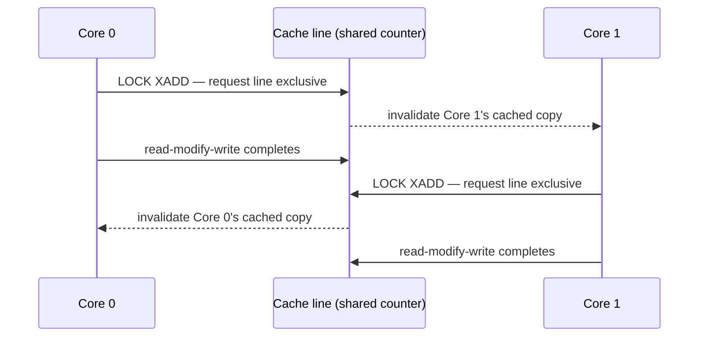

# Atomic Operations in Hardware

Compare-and-swap, load-linked/store-conditional, and what an atomic instruction costs in cache-line ownership.

The problem, in one sentence: a read-modify-write — read a counter, add one, write it back — is
three separate operations, and between any two of them another core is free to act on the same
memory. An **atomic instruction** is the hardware's promise that no other core can observe the
state in between: the read, the modify, and the write happen as one indivisible unit as far as
every other observer is concerned. The whole cost of that promise, as you'll see below, is paid in
cache-line ownership, not in extra ALU work.

## What "atomic" actually means here

Three properties get conflated constantly, and keeping them separate is the single most useful
thing this page can do:

- **Atomicity** — indivisibility with respect to *other observers*. No other core can see a
  partially-completed read-modify-write.
- **Interruptibility** — atomicity says nothing about interrupts on the *executing* core. An
  atomic instruction can still be interrupted after it completes (it already committed) — the
  guarantee is about other cores' view of memory, not about this core's control flow.
- **Ordering** — atomicity says nothing about *when* the effect becomes visible relative to
  other, unrelated memory operations around it. An atomic operation can be atomic and still be
  reordered with a neighboring plain load or store, unless it also carries ordering semantics (see
  below).

Conflating atomicity with ordering is the most common misunderstanding of this material: "it's
atomic" answers "can another core see it half-done," not "will other cores see it at the right
time relative to everything else I did."

## Two families: CAS and LL/SC

Two different hardware designs deliver the same atomic read-modify-write guarantee.

x86-64 offers **compare-and-swap** as a single instruction: `LOCK CMPXCHG` reads a location,
compares it against an expected value, and — if they match — writes a new value, all as one
indivisible unit. If they don't match, the instruction reports failure and the caller decides what
to do next (usually: reread and retry).

arm64 (and RISC-V, and older POWER) instead offers **load-linked/store-conditional (LL/SC)**: a
load-linked (`LDXR`) reads a value and arms an *exclusive monitor* on that address; a matching
store-conditional (`STXR`) writes only if the monitor is still armed — i.e., nothing else touched
that line since the load-linked. If something did, the store-conditional fails and reports so, and
software loops back to the load-linked.

| | x86-64 CAS (`LOCK CMPXCHG`) | arm64 LL/SC (`LDXR`/`STXR`) |
|---|---|---|
| How failure is reported | Instruction returns/flags the current value; caller compares | `STXR` returns a status code (0 = succeeded) |
| Spurious failure possible | No — fails only on a genuine value mismatch | **Yes** — an `STXR` can fail even with no real conflict (e.g., an intervening exception, or a cache-line eviction) |
| Loop required | Only if the compare fails (a real conflict) | Always structured as a loop, because of spurious failure |
| ABA problem | CAS compares by *value* — a value that returned to its original state after an intervening change looks identical, so ABA still applies | Not vulnerable in the same way — the exclusive monitor is invalidated by *any* write to the line, even one that restores the original value, so a spurious `STXR` failure actually catches some ABA-shaped cases that CAS would miss |

## The `LOCK` prefix, and what it costs

A common misconception is that `LOCK`-prefixed instructions lock the entire memory bus. On modern
x86-64, that is not the general case: the core instead acquires the target cache line in the
*exclusive* coherence state and holds it for the duration of the read-modify-write, using the same
coherence protocol that already keeps caches consistent. The cost of a locked instruction is
therefore a **coherence transaction** — asking for, and holding, exclusive ownership of one line —
and it scales with how many other cores currently want that same line, not with anything about the
instruction's own execution time.

The exception is a **split lock**: an atomic operation whose operand straddles two cache lines.
Because the coherence protocol has no way to atomically own two lines at once, the processor falls
back to an actual bus lock for the duration — and that costs orders of magnitude more than the
ordinary single-line case, and stalls every other core's memory traffic while it holds the bus.
Naturally-aligned atomics never split a line; the split-lock case is specifically what happens when
an atomic's address is not aligned to its own size.

## Contention is a cache-line problem, not an instruction problem

The number that actually decides a locking design is not "how expensive is `LOCK CMPXCHG`" in the
abstract — it's *how many cores want this line right now*. As orders of magnitude, not
measurements:

- An atomic on a line the core already owns exclusively: roughly the cost of an ordinary ALU
  operation, tens of cycles at most.
- A contended atomic, line bouncing between cores on the same socket: on the order of tens to
  low hundreds of cycles.
- A contended atomic bouncing across sockets: hundreds of cycles — a cross-socket coherence
  transaction is far more expensive than an on-socket one.

This is the entire reason a single global counter or a single global spinlock scales badly: every
increment forces the cache line to change owner, and the cost is the ownership transfer, not the
increment itself.

*One shared counter, two cores: the cost is the cache line changing owner, not the instruction.*

## The instruction family

| Operation | What it does | Returns old value? |
|---|---|---|
| Exchange (`XCHG`) | Unconditionally swaps a new value in | Yes |
| Fetch-and-add (`XADD`) | Adds a value, stores the sum | Yes (the pre-add value) |
| Compare-and-swap (`CMPXCHG`) | Writes only if current value matches an expected value | Yes (the value actually observed — tells you whether it matched) |
| Test-and-set | Sets a bit/flag, reports whether it was already set | Effectively yes — the prior bit state |
| Double-width CAS (`CMPXCHG16B` / `CMPXCHG8B`) | Compares-and-swaps two adjacent machine words atomically | Yes |

Whether an operation reports the old value matters more than it looks: an API built on
fetch-and-add can compute "how many were here before me," which is exactly what a reference count
or a ticket lock needs, while a plain increment-only primitive cannot answer that question at all.
This distinction propagates directly into the software atomics API built on top of these
instructions.

## Atomics carry ordering only if you ask

Most architectures expose several ordering variants of the *same* logical operation: relaxed (no
ordering guarantee beyond atomicity itself), acquire, release, and sequentially consistent. This is
where atomicity and ordering — kept separate above — meet back up: you choose how much ordering an
atomic buys you, and a relaxed atomic buys none at all beyond "nobody sees it half-done."

x86-64 is the outlier: its `LOCK`-prefixed instructions are unconditionally **full memory
barriers** — no locked instruction is reordered with any load or store around it, and all locked
instructions are themselves totally ordered across every core. That's *why* x86-only code so
often gets away with never thinking about ordering variants at all: on x86-64 there effectively
is only one variant, the strongest one, and you get it whether you asked for it or not. Ported to
an architecture with genuinely relaxed atomics, the same code needs to say what it meant.

## ABA, briefly

Compare-and-swap checks a *value*, not a *history*. A location can be `A`, change to `B`, and
change back to `A` — and a CAS that only compares against `A` cannot tell that anything happened
in between, even though whatever `A` represented (a freed-and-reused node, say) may now mean
something entirely different. This is the **ABA problem**, and it is the standard failure mode of
naive lock-free stacks and queues built directly on CAS.

The two standard mitigations: attach a **tag counter** to the value (compare on `{value, counter}`
as a double-width CAS, so a counter that only ever increases makes the third state distinguishable
from the first), or **defer reclamation** so that a value can never actually be reused while
another thread might still be mid-CAS against it. The second is the harder and more general
answer, and it's the one the kernel leans on — hand-off to the RCU material in the Linux section
for how.

## Where this goes next

- [Cache Coherence and MESI](../memory-hierarchy/cache-coherence-and-mesi.md) — the protocol the
  cache-line ping-pong above actually runs on.
- [Memory Ordering and Consistency](./memory-ordering-and-consistency.md) — the ordering half of
  this story.
- [`../../linux/09-concurrency-and-locking/atomics-and-refcounts.md`](../../linux/09-concurrency-and-locking/atomics-and-refcounts.md) —
  how Linux builds its atomic API and reference counts on top of these instructions.

## References

- Intel SDM Vol. 3A, ch. 8.1 "Locked Atomic Operations" — the authority on what `LOCK` guarantees
  and on which instructions are implicitly locked.
- Arm Architecture Reference Manual, "Synchronization and semaphores" — `LDXR`/`STXR` and the
  exclusive monitor, i.e. what a store-conditional actually checks.
- Herlihy, *"Wait-Free Synchronization"*, TOPLAS 1991 — why compare-and-swap is universal and
  test-and-set is not; the theory behind the instruction menu.
- Paul McKenney, *Is Parallel Programming Hard, And, If So, What Can You Do About It?*, ch. 3 —
  [`https://mirrors.edge.kernel.org/pub/linux/kernel/people/paulmck/perfbook/perfbook.html`](https://mirrors.edge.kernel.org/pub/linux/kernel/people/paulmck/perfbook/perfbook.html).
  Free, and the best available account of what these operations cost on real hardware.
