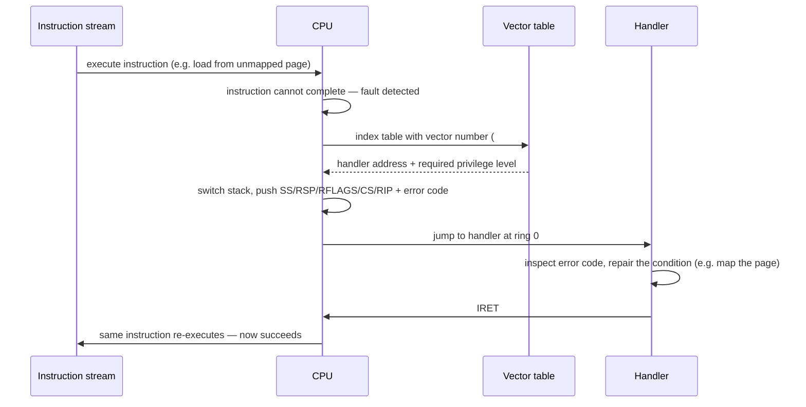

# Exceptions, Traps, and Interrupts

A CPU executing a stream of instructions needs a way to stop doing that and run something else.
There are only two reasons that ever happens: the instruction it is currently executing cannot
complete, or the world outside the CPU wants attention. Those two reasons behave completely
differently — one is a property of the instruction stream itself, the other has nothing to do with
it and can happen at any point — and conflating them is the source of most confusion about how
kernels handle control transfers. [Privilege Levels and Protection](./privilege-levels-and-protection.md)
covers *what* a ring-3 → ring-0 crossing can reach; this page covers the three specific mechanisms
that trigger one and the vocabulary for talking about them precisely.

## The taxonomy

| Kind | Synchronous? | Re-executable? | Source | x86-64 example |
|---|---|---|---|---|
| **Fault** | Synchronous | Yes — the faulting instruction re-executes after the handler returns | The instruction itself, detected before it completes | Page fault (`#PF`), general-protection fault (`#GP`) |
| **Trap** | Synchronous | No — the *next* instruction runs after the handler | The instruction itself, detected as it completes | Breakpoint (`#BP` / `INT3`), syscall via `INT 0x80` |
| **Abort** | Synchronous | No, and usually fatal — the machine's state may not be recoverable | The instruction, or the machine, in a way too severe to characterize precisely | Machine-check exception (`#MC`), double fault (`#DF`) |
| **Interrupt** | Asynchronous | N/A — unrelated to the currently executing instruction | External hardware | Device IRQ (timer, disk, NIC) |
| **NMI** | Asynchronous | N/A | External hardware, but unmaskable | Non-maskable interrupt (watchdog, hardware error reporting) |

Intel's own manuals group faults, traps, and aborts under one umbrella term, "exceptions," precisely
because all three are synchronous — triggered by, and attributed to, a specific instruction. An
interrupt is not: it can land between any two instructions, and the CPU does not ask whether the
instruction it just finished had anything to do with it. That's the real dividing line, and it's why
the opening framing — "the current instruction can't proceed" versus "something external wants
attention" — maps directly onto "exception" versus "interrupt." NMI is an interrupt in every
practical sense (asynchronous, external) but gets its own row because it defeats the one thing that
normally makes interrupts governable: it cannot be masked (see below).

The fault/trap distinction inside "exception" is entirely about *when* the vector fires relative to
the instruction that caused it. A fault is raised *before* the instruction retires — the CPU detects
the problem while trying to execute it, backs out, and hands control to the handler with `RIP`
pointing at the instruction that failed. A trap is raised *after* the instruction retires — `INT3`
executes successfully (it's a valid one-byte opcode), and only then does control transfer to the
handler, with `RIP` already pointing past it. This is not a minor bookkeeping detail; it is the entire
reason a page fault can be *repaired*.

## What "precise" means, and why it matters

Modern x86-64 and arm64 cores execute out of order: instructions issue, execute, and complete in
whatever sequence the execution units and their dependencies allow, not the program order the compiler
wrote. Despite that, when an exception fires, the CPU is contractually obligated to present
**architectural state as if every instruction before the faulting one had completed, in order, and
none after it had started** — regardless of what the out-of-order machinery actually did internally.
This is a *precise exception*. Achieving it on a superscalar, out-of-order core is expensive: the CPU
has to track which in-flight instructions are still "before" the fault in program order, complete or
discard them accordingly, and only then commit to the architecturally visible state the handler sees.
Older or simpler designs (and some early RISC pipelines) shipped *imprecise* exceptions, where the
saved state didn't cleanly correspond to any single point in the program — and every general-purpose
CPU you'll encounter today pays the cost to avoid that.

The payoff for that cost is what makes an entire class of kernel mechanism possible: if the hardware
guarantees the machine looks exactly as it did the instant before the faulting instruction ran, a
fault handler can inspect the problem, *fix it*, and simply let that same instruction run again — and
because nothing before it is disturbed and nothing after it has started, re-running it is
indistinguishable from it having succeeded the first time. This is the entire mechanism behind demand
paging: a load or store to a page that isn't resident raises `#PF`, the kernel maps in a physical
page, and `IRET` re-executes the faulting instruction, which now succeeds because the page is there.
Neither the compiler nor the running program is ever aware a fault happened. Without precise exceptions
this trick doesn't work — the handler would have no reliable way to know exactly which instruction to
retry or what state to retry it in.

## Vectoring: how the CPU finds the handler

Every fault, trap, abort, interrupt, and NMI is identified by a small integer, the **vector number**,
which the CPU uses to index a table of handler addresses rather than searching or asking software
where to go. On x86-64 that table is the **Interrupt Descriptor Table (IDT)**: up to 256 entries,
located in memory by the **`IDTR`** register (loaded only by the privileged `LIDT` instruction — see
[Privilege Levels and Protection](./privilege-levels-and-protection.md) on why that matters). Vectors
0–31 are architecturally reserved for CPU-defined exceptions (0 = `#DE` divide error, 13 = `#GP`,
14 = `#PF`, and so on); 32 and above are available for externally-generated interrupts, which is why
Linux and other kernels remap the legacy PIC/APIC IRQ lines up into that range.

On an exception or interrupt, the CPU does, in hardware, in order:

1. Determines the vector number (fixed for a CPU-defined exception; delivered by the interrupt
   controller for an external interrupt).
2. Indexes the IDT with it to get a gate descriptor — the handler's code segment and entry point,
   and the privilege level required to reach it.
3. If the transfer crosses privilege levels (ring 3 → ring 0, the common case), switches to the
   kernel stack for the current privilege level (found via the Task State Segment) and pushes the
   hardware exception frame described below onto it.
4. Loads `CS:RIP` from the gate descriptor and begins executing the handler at ring 0.

The handler address comes entirely out of a table that only privileged code could have populated.
That is what makes the boundary hold: user code chooses *that* a trap happens (executing `INT3`,
faulting on a bad access) but never chooses *where* it lands.

## What gets pushed, and by whom

When the CPU transfers control, it pushes a fixed-format frame onto the (possibly newly switched-to)
stack before the handler's first instruction runs. On x86-64 that hardware-pushed frame is: `SS`,
`RSP`, `RFLAGS`, `CS`, `RIP` — always, in that order — and, for a defined subset of vectors (`#GP`,
`#PF`, `#DF`, and several others), an **error code** just below `RIP`, giving the handler machine-
readable detail about *why* (for `#PF`, whether the access was a read or write, present or not-present,
user or supervisor). Vectors that don't define an error code push none; the handler's entry stub has
to know, per vector, whether one is present, because the hardware gives no runtime tag for it.

Everything past that fixed frame is software's problem. The general-purpose registers, SSE/AVX state,
segment selectors beyond `CS`/`SS` — none of it is hardware-saved on exception entry. Every kernel's
low-level entry stub (Linux's per-vector assembly trampolines, for instance) has to save that context
onto the stack itself, by hand, before calling into any C handler that might clobber it, and restore
it symmetrically just before `IRET`. `IRET` itself pops exactly the fields the hardware pushed and
resumes execution at the saved `CS:RIP` — which, for a fault, is the instruction that faulted, and for
a trap, is the instruction after the one that trapped.

## Masking

`RFLAGS.IF` (the interrupt flag) is a single bit that gates whether the CPU accepts external, maskable
interrupts at all; `CLI` clears it and `STI` sets it. While `IF` is clear, the CPU does not vector to
maskable interrupt sources — it does not drop them either. A pending interrupt is held by the interrupt
controller and delivered the moment `IF` is set again (or immediately, if it's already pending when
`STI` executes). This is why kernels bracket short critical sections with `CLI`/`STI`: not to make an
interrupt disappear, but to guarantee it can't interleave with code that isn't safe to preempt, at the
cost of it being *delayed*, never lost.

Two categories are deliberately outside `IF`'s control. **NMI** — the row that got its own line in the
taxonomy above — exists specifically for conditions a kernel must never be able to accidentally defer:
watchdog timeouts, certain hardware error reports. And CPU-detected exceptions (faults, traps, aborts)
aren't "masked" by `IF` in the first place; `IF` only gates the asynchronous, externally-generated
class. A `#GP` fires the instant the offending instruction is attempted regardless of `IF`'s state,
because deferring it would mean letting an invalid instruction's effects stand.

## arm64

:::note
arm64's exception model is organized differently from x86-64's flat, 256-entry vector table. Instead
of one vector per specific exception, the vector table (pointed to by `VBAR_ELn`) has a small, fixed
number of entries — indexed by **exception category** (synchronous, IRQ, FIQ, SError) crossed with
**origin** (same exception level or lower, and which stack pointer was in use). A synchronous
exception taken at EL1 from EL0 lands at one fixed offset regardless of whether it was a page fault, an
undefined instruction, or a system call (`SVC`) — the handler then reads the **`ESR_ELn`** (Exception
Syndrome Register) to find out which one it actually was and why, rather than that distinction being
baked into which vector slot fired. Interrupt *sources* work the same way one level further out: the
CPU vectors generically to the IRQ or FIQ entry, and the handler queries the **GIC** (Generic Interrupt
Controller) to find out which specific peripheral is asserting. It's the same underlying idea as
x86-64's IDT — a small table of privileged-code-controlled entry points that user code can trigger but
not redirect — organized around category-then-syndrome instead of one slot per cause.
:::

## The fault path, end to end

*A fault, from the instruction that could not complete to the instruction re-executing successfully.*

---

[The Life of a Page Fault](../../linux/02-guided-traces/the-life-of-a-page-fault.md) walks this exact
path through real Linux kernel code — the fault this page describes in the abstract, traced from
`#PF` to a repaired page table. [Hardware the Kernel Assumes](../../linux/00-overview/hardware-the-kernel-assumes.md)
covers what else the kernel takes for granted about the hardware it runs on.

## References

- Intel, *Intel 64 and IA-32 Architectures Software Developer's Manual*, Vol. 3A, Chapter 6,
  "Interrupt and Exception Handling" — the authority for the IDT, the hardware-pushed frame, and the
  fault/trap/abort classification of every vector.
  [intel.com](https://www.intel.com/content/www/us/en/developer/articles/technical/intel-sdm.html)
- Arm, [Armv8-A Architecture Reference Manual](https://developer.arm.com/documentation/ddi0487/latest)
  — see "Exception model" for `VBAR_ELn`, `ESR_ELn`, and how arm64's vectoring differs from x86-64's.
- OSDev Wiki, [Exceptions](https://wiki.osdev.org/Exceptions) — a per-vector quick reference (number,
  mnemonic, whether it pushes an error code, fault vs. trap vs. abort).
