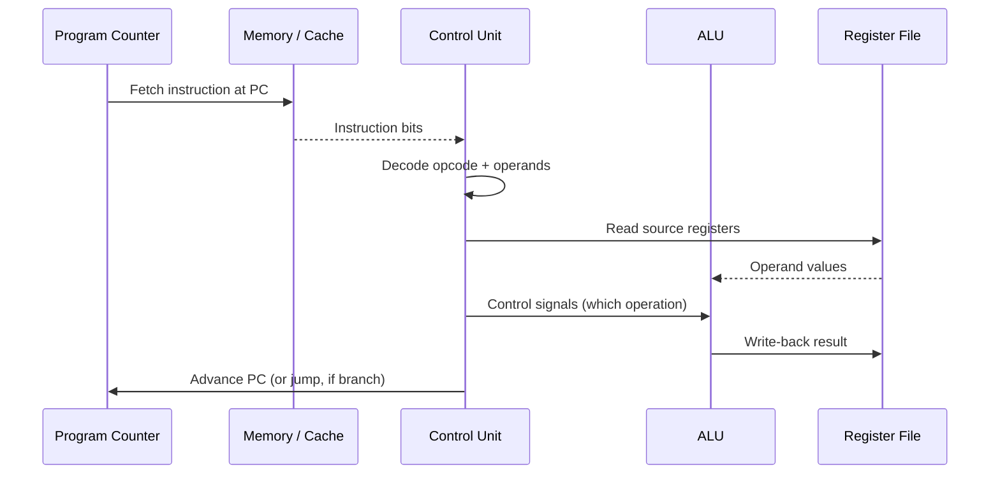

# The Fetch-Decode-Execute Cycle

## Overview

Every instruction a CPU runs goes through the same basic loop: fetch it from memory, decode what it
means, execute it, and store the result. This cycle, repeated billions of times per second, is the
entire mechanism by which a stored-program computer "runs" software. Everything in later pages
(pipelining, out-of-order execution) is an optimization of this same basic loop.

## Core Concepts

| Stage | What happens |
|---|---|
| **Fetch** | Read the instruction at the address in the Program Counter (PC) from memory/cache into the CPU. |
| **Decode** | Determine the operation and operands by interpreting the instruction's bit encoding. |
| **Execute** | Perform the operation (ALU computation, memory access, or control-flow change). |
| **Write-back** | Store the result in a register (or memory), and advance the PC to the next instruction. |

## Architecture / Mechanism

Each of the four stages above corresponds to real hardware doing real work in a fixed slice of the
CPU's clock cycle. A "non-pipelined" CPU completes all four stages for one instruction before
starting the next — simple to reason about, but wasteful, because most of the hardware sits idle
during any given stage. [Pipelining](./pipelining.md) fixes exactly this.

## Practical Usage: Tracing an Instruction

For the instruction `add rax, rbx` on x86-64:

1. **Fetch** — CPU reads the byte sequence `48 01 D8` from the address the PC points to.
2. **Decode** — Control unit determines: opcode = ADD, source = `rbx`, destination = `rax`.
3. **Execute** — ALU computes `rax + rbx`.
4. **Write-back** — Result is stored back into `rax`; PC increments to the next instruction's address.

A **branch** instruction (e.g., `jmp`, `je`) changes step 4: instead of PC+1, the PC is set to the
branch target address. This single fact — that branches change what "next instruction" means — is
the root cause of most of the complexity in [pipelining](./pipelining.md) and
[branch prediction](./superscalar-and-out-of-order-execution.md).

## Edge Cases & Pitfalls

- **Interrupts and exceptions** insert themselves between cycles: after completing an instruction,
  the CPU checks for pending interrupts (timer, I/O device, page fault) and may jump to an interrupt
  handler instead of continuing the current program — this is how an [operating system](../operating-systems/intro.md)
  regains control of the CPU.
- A naive one-instruction-at-a-time cycle is easy to reason about but leaves most of the CPU idle at
  any instant — real chips overlap stages of consecutive instructions (see [Pipelining](./pipelining.md)).

## References

- Patterson & Hennessy, *Computer Organization and Design* — canonical treatment of the instruction
  cycle and its hardware implementation.

### Books & Videos

- **[nand2tetris.org](https://www.nand2tetris.org/)**, Project 5 ("Computer Architecture") — builds a
  working fetch-execute CPU from logic gates, making every stage in the diagram above something you
  implement yourself rather than take on faith.

## Related Pages

- [CPU & Processor Architecture — Overview](./intro.md)
- [Instruction Set Architecture](./instruction-set-architecture.md)
- [Pipelining](./pipelining.md)
