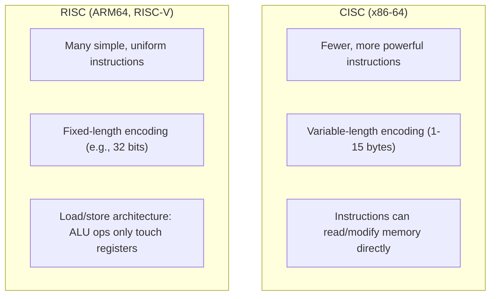

# Instruction Set Architecture (ISA)

## Overview

An **Instruction Set Architecture** is the set of instructions a CPU can execute, plus the rules for
how they're encoded as bits, what registers exist, and how memory is addressed. It's a *contract*:
software compiled for an ISA will run correctly on any chip implementing that ISA, no matter how
different the internal microarchitecture is. x86-64, ARM64 (AArch64), and RISC-V are the three ISAs
you'll encounter most often today.

## Core Concepts

| Term | Meaning |
|---|---|
| **Opcode** | The part of an instruction's encoding that identifies *which* operation to perform. |
| **Operand** | A value an instruction acts on — a register, a memory address, or a literal constant. |
| **Addressing mode** | How an instruction specifies where an operand lives (register, immediate, memory, memory+offset...). |
| **Register file** | The set of named, fixed-size storage slots the ISA exposes (e.g., x86-64 has 16 general-purpose 64-bit registers). |
| **Machine code** | The raw binary encoding of instructions — what the CPU actually fetches and decodes. |
| **Assembly language** | A human-readable, near 1:1 text representation of machine code (see [Assembly](../assembly/intro.md)). |

## CISC vs. RISC



| Aspect | CISC (x86-64) | RISC (ARM64 / RISC-V) |
|---|---|---|
| Instruction count | Large, with complex addressing modes | Small, orthogonal instruction set |
| Encoding | Variable length | Fixed length (simpler to decode) |
| Memory access | Many instructions can touch memory directly | Only explicit `load`/`store` instructions touch memory |
| Typical use | Desktops, servers (x86-64) | Mobile, embedded, and increasingly servers/desktops (Apple Silicon, AWS Graviton) |
| Design tradeoff | Denser code, more complex decode hardware | Simpler decode, relies on the compiler to schedule instructions well |

:::info The distinction has blurred
Modern x86-64 chips decode CISC instructions into simpler internal **micro-ops** (µops) and execute
those with a RISC-like pipeline internally. The CISC/RISC label today says more about the *external*
instruction encoding than about the actual execution hardware.
:::

## Practical Usage: Reading an Instruction

An x86-64 instruction like `add rax, rbx` (add register `rbx` into register `rax`) is encoded
roughly as:

```text
48 01 D8
│  │  └─ ModRM byte: encodes operands (rax, rbx) and addressing mode
│  └──── Opcode: 01 = ADD, operand direction register→register/memory
└─────── REX prefix: 48 = 64-bit operand size
```

The CPU's decode stage reverses this: split the byte stream into prefix, opcode, and operand-encoding
fields, then figure out which registers and which operation are involved. This is one reason
variable-length CISC decoding is more complex than fixed-length RISC decoding — the decoder doesn't
know how many bytes the *next* instruction will need until it has decoded the current one.

## Edge Cases & Pitfalls

:::warning ISA extensions fragment the landscape
Not every x86-64 CPU supports every instruction. Extensions like AVX-512 (wide vector math) or AES-NI
(hardware AES) must be feature-detected at runtime (`CPUID` on x86) before use, or the program will
crash with an illegal-instruction fault on older/different hardware.
:::

- **Endianness** is part of the ISA contract: x86-64 and ARM64 are little-endian by default (least
  significant byte first in memory), which matters when reading raw memory dumps or writing
  cross-platform binary formats.
- Cross-compiling for a different ISA (e.g., building ARM64 binaries on an x86-64 machine) fails at
  the *instruction encoding* level if you accidentally link against a library built for the wrong ISA.

## Comparisons

| ISA | Bit width | Typical domain | Licensing |
|---|---|---|---|
| x86-64 | 64-bit | Desktops, servers, gaming | Proprietary (Intel/AMD) |
| ARM64 (AArch64) | 64-bit | Mobile, Apple Silicon, AWS Graviton | Licensed IP (Arm Holdings) |
| RISC-V | 32/64/128-bit | Embedded, academia, growing server interest | Open, royalty-free |

## References

- Arm, [Armv8-A Architecture Reference Manual](https://developer.arm.com/documentation/ddi0487/latest) — official ISA reference.
- RISC-V International, [RISC-V ISA Specifications](https://riscv.org/technical/specifications/) — official, freely available spec.
- Intel, [64 and IA-32 Architectures Software Developer's Manuals](https://www.intel.com/content/www/us/en/developer/articles/technical/intel-sdm.html).

### Books & Videos

- David Patterson & Andrew Waterman, *The RISC-V Reader* — a short, approachable book contrasting
  RISC-V's design decisions against x86 and ARM.
- [Compiler Explorer](https://godbolt.org/) — paste C/C++/Rust code and see the exact x86-64, ARM64,
  or RISC-V instructions it compiles to, side by side.

## Related Pages

- [CPU & Processor Architecture — Overview](./intro.md)
- [Fetch-Decode-Execute Cycle](./fetch-decode-execute-cycle.md)
- [Assembly & Low-Level Programming](../assembly/intro.md)
