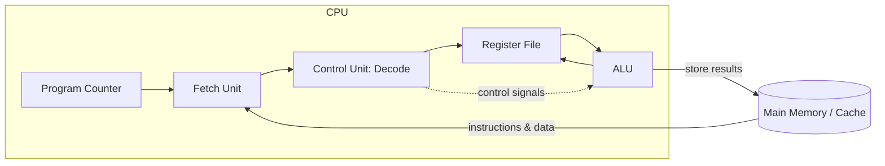

# CPU & Processor Architecture — Overview

## Overview

The CPU (Central Processing Unit) is the component that actually *executes* a program: it repeatedly
reads an instruction from memory, figures out what it means, and carries it out. Everything else in
a computer — RAM, storage, the network card — exists to feed the CPU with instructions and data, or
to receive the results. Understanding the CPU's internal structure explains *why* code has the
performance characteristics it does: why branches can be expensive, why cache-friendly code is
faster, and why "more cores" doesn't automatically mean "faster program."

## Core Concepts

| Component | Role |
|---|---|
| **ALU** (Arithmetic Logic Unit) | Performs arithmetic (add, subtract, multiply) and logic (AND, OR, shift) operations on register values. |
| **Control Unit (CU)** | Decodes instructions and generates the control signals that drive every other component — the "conductor." |
| **Registers** | A handful of very small, very fast storage locations inside the CPU (tens to a few hundred bytes total) used to hold operands and results. |
| **Program Counter (PC)** | A register holding the memory address of the *next* instruction to fetch. |
| **Clock** | A signal that ticks at a fixed frequency (e.g., 3.5 GHz); each tick advances the CPU's internal state machine by one step. |
| **Instruction Set Architecture (ISA)** | The vocabulary of operations the CPU understands, and how they're encoded as bits — the contract between hardware and software. |
| **Microarchitecture** | *How* a specific chip implements an ISA internally (pipeline depth, cache sizes, branch predictor design). Two CPUs can share an ISA (e.g., x86-64) but have very different microarchitectures and performance. |

:::info ISA vs. microarchitecture
This distinction matters: the ISA is the stable interface (your compiled binary works on any x86-64
chip); the microarchitecture is the implementation detail that changes every chip generation and is
where most performance engineering happens. See [Instruction Set Architecture](./instruction-set-architecture.md).
:::

## Architecture / Mechanism

At the highest level, a CPU is a loop: **fetch** the instruction the PC points to, **decode** it to
figure out which operation and which registers/memory it touches, **execute** it (usually in the
ALU), and **write back** the result. This is the fetch-decode-execute cycle, detailed in its own
page.

## In This Section

1. **[Instruction Set Architecture](./instruction-set-architecture.md)** — the CPU's vocabulary: CISC vs. RISC, x86 vs. ARM vs. RISC-V.
2. **[Fetch-Decode-Execute Cycle](./fetch-decode-execute-cycle.md)** — the basic instruction loop, step by step.
3. **[Pipelining](./pipelining.md)** — overlapping instructions to increase throughput, and the hazards that get in the way.
4. **[Superscalar & Out-of-Order Execution](./superscalar-and-out-of-order-execution.md)** — modern CPUs execute far more than "one instruction at a time."
5. **[Multicore & Parallelism](./multicore-and-parallelism.md)** — why chips stopped getting faster per-core and started adding cores instead.

## Edge Cases & Pitfalls

- **Clock speed is not performance.** Instructions-per-cycle (IPC) and the number of cores matter as
  much as clock frequency; a 3 GHz chip can easily outperform a 4 GHz chip with a shallower pipeline
  or weaker branch predictor.
- **"CPU-bound" is a category, not a diagnosis.** A CPU-bound program might be bound by ALU
  throughput, by branch mispredictions, or by waiting on cache/memory — each has a different fix.

## References

- Patterson & Hennessy, *Computer Organization and Design* — the standard undergraduate textbook for
  this entire section; each subtopic page also cites more specialized sources.
- Hennessy & Patterson, *Computer Architecture: A Quantitative Approach* — the graduate-level,
  industry-standard reference once you're past the fundamentals.

### Books & Videos

- **Matt Godbolt's Computerphile series**, e.g. [CPU Pipeline](https://www.youtube.com/watch?v=BVNx3wtJ9vs)
  and [How Branch Prediction Works in CPUs](https://www.youtube.com/watch?v=nczJ58WvtYo) — short,
  accurate video explanations from the creator of Compiler Explorer (godbolt.org).
- Matt Godbolt's [Compiler Explorer](https://godbolt.org/) — not a video/book, but the fastest way to
  see how source code maps to real machine instructions on real ISAs; used throughout the
  [Assembly](../assembly/intro.md) section.

## Related Pages

- [How Computers Work — Overview](../overview/intro.md)
- [Memory Hierarchy & RAM](../memory-hierarchy/intro.md) — what happens when the CPU needs data it doesn't have in registers.
- [Assembly & Low-Level Programming](../assembly/intro.md) — the concrete syntax programmers use to talk to an ISA.
