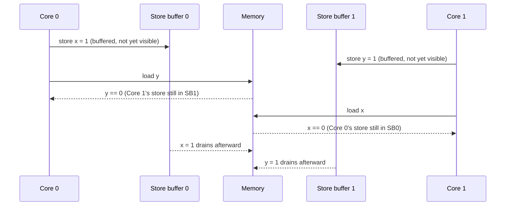

# Memory Ordering and Consistency

Why a multiprocessor does not execute your loads and stores in the order you wrote them, and what a fence actually buys.

Here is the uncomfortable fact: the order in which your loads and stores become visible to
another core is not the order you wrote them, and nothing is broken. Compilers reorder because
nothing in the C abstract machine forbids it — as far as the language is concerned, two
independent statements may execute in either order, or be fused into one. CPUs reorder because a
store buffer is the difference between a fast core and a slow one: a core that had to wait for
every store to reach memory before issuing the next instruction would be leaving most of its
performance on the table. A **memory model** is the contract that tells you exactly how much of
this reordering you have to tolerate, and exactly what you can rely on regardless.

## Sequential consistency, and why nobody ships it

The model programmers assume by default is **sequential consistency (SC)**, defined by Lamport:
the result of any execution is as if the operations of all the processors were executed in some
sequential order, and the operations of each individual processor appear in this sequence in the
order specified by its program. In other words: interleave the instruction streams of every core
however you like, but never reorder instructions *within* one core's stream, and every core must
agree on the same interleaving.

It is a clean model to reason about, and essentially nobody's hardware implements it strictly.
Enforcing it would mean a store cannot retire until every other core has observed it, which
forfeits the store buffer, forfeits speculative loads, and forfeits most of the reordering that
makes a modern out-of-order core fast. Real hardware ships a *weaker* model and documents exactly
where it deviates from SC — which is the rest of this page.

## The store buffer, which causes almost everything

A store does not go straight to memory. It retires into a small per-core **store buffer**, the
core immediately moves on to later instructions, and the value becomes visible to other cores
only later, once the buffer entry drains and the core acquires the cache line for writing. This
one piece of hardware is responsible for the large majority of "surprising" reorderings you will
ever encounter.

The canonical illustration — the store-buffer litmus test — uses two cores and two independent
memory locations, `x` and `y`, both initially zero:

| Core 0 | Core 1 |
|---|---|
| `x = 1` | `y = 1` |
| `r1 = y` | `r2 = x` |

Intuitively you might expect at least one of `r1 == 1` or `r2 == 1` — surely one store happens
"first." But `r1 == 0 && r2 == 0` is an observed, architecturally permitted outcome on x86-64.
This is not a race in the informal sense: every access here is to a single aligned word, so there
is no partial-write tearing, no undefined bit pattern, nothing "corrupted." Both cores simply read
memory before the other core's store has left its own store buffer.

*Both cores read zero, and no rule was broken: each store is still in its own core's store
buffer when the other core's load executes.*

## x86-TSO

x86-64's memory model is usually called **TSO** (total store order), and its guarantees are
narrow and specific — this is Intel's own statement of them, not a simplification:

1. Loads are not reordered with other loads.
2. Stores are not reordered with other stores.
3. Stores are not reordered with older loads.
4. **Loads may be reordered with older stores to a different location** — but not with an older
   store to the *same* location.

That fourth rule is the only relaxation TSO permits, and it is exactly the store-buffer scenario
above: `x = 1; r1 = y` lets the load of `y` execute (from memory) while the store to `x` is still
sitting in the buffer, because `x` and `y` are different locations. Every other pairing —
load/load, store/store, and store-after-load — stays in program order. This is why x86-64 is
described as a *strong* model: almost everything you'd naively expect from sequential consistency
holds, with one narrow, well-understood exception. It's also why incorrect lock-free code — code
that should have needed a fence and didn't get one — so often "works" on x86-64 and then breaks
the moment it runs on hardware with a weaker model.

## Weak models, and arm64

Under a **weak** memory model, the default assumption inverts: almost any pair of memory
operations may be reordered unless something explicitly forbids it — a data dependency between
them, or an explicit barrier instruction. arm64 is the model most people encounter this on. It
additionally gives you **load-acquire** and **store-release** as single instructions —
`LDAR`/`STLR` — rather than requiring a separate load or store plus a general-purpose fence. That
matters for cost as well as ergonomics: acquire/release semantics are attached to the memory
access itself instead of stalling the pipeline with a standalone barrier.

This is precisely why code that has run correctly on x86-64 for a decade can fail the first time
it's ported to an ARM server: it was relying on TSO's implicit ordering — a plain store where a
release was needed, a plain load where an acquire was needed — and TSO was quietly providing the
ordering the code never asked for. On a weak model, nothing is provided implicitly.

## Fences, and the four things they order

| Fence | Orders | x86-64 instruction | arm64 instruction |
|---|---|---|---|
| Full fence | All loads and stores before vs. after | `MFENCE` | `DMB ISH` |
| Store-store | Stores before vs. stores after | `SFENCE` | `DMB ISHST` |
| Load-load | Loads before vs. loads after | `LFENCE`\* | `DMB ISHLD` |
| Acquire / release | Everything before a release vs. everything after the matching acquire | *(implicit — plain `MOV` suffices under TSO)* | `LDAR` / `STLR` |

\* `LFENCE` on x86-64 is documented as a speculation barrier as much as an ordering one; it does
not order against stores.

Notice the gap in the x86-64 column: because TSO already forbids load/load, store/store, and
store-after-load reordering, most of these fences compile to **nothing** on x86-64 — a plain load
or store already has the ordering a fence would add. That is exactly why portable code still has
to write the fence (or the acquire/release annotation): on x86-64 it costs nothing, and on arm64
it's the only thing standing between correct code and the reordering weak models actually permit.

## Acquire and release, which is what you usually want

Full fences are a blunt instrument. The pattern nearly all lock-free and lock-based code actually
needs is **acquire/release**: a thread that writes some data and then performs a **release**
store to a flag makes every write before that release visible to any thread that subsequently
performs an **acquire** load of the same flag and sees the new value. Nothing about memory
*outside* that one publish/subscribe pair needs to be ordered — which is precisely why
acquire/release is cheaper than a full fence: it constrains only the operations on one side of the
release and one side of the matching acquire, not everything in the program.

This is the mental model behind mutex unlock/lock (unlock is a release, lock is an acquire),
behind publishing a pointer to a newly constructed object, and behind almost every lock-free
queue or reference count you'll encounter later in this section.

## The compiler is the other half

A hardware fence stops the *CPU* from reordering memory operations around it. It does nothing
about the *compiler*, which reorders, merges, and even invents memory accesses as part of
perfectly ordinary optimization — and is entitled to, because none of those transformations are
observable within the sequential semantics of a single thread. Hoisting a loop-invariant load out
of a loop, coalescing two adjacent stores into one wider store, or speculatively loading a value
early are all legal transformations on an ordinary variable, because the compiler has no reason to
believe another thread is watching it.

That is exactly why every real system needs a "this access is genuinely shared, do not
transform it" annotation — `volatile` (weaker than it sounds, and not a substitute for atomics),
a language-level atomic type, or a compiler barrier — in addition to the CPU-level fence. The
fence without the annotation, or the annotation without the fence, is not enough.

## Data races are undefined, and that is a stronger statement than it sounds

Under C11/C++11, a **data race** — two threads accessing the same non-atomic memory location
without synchronization, at least one of them a write — is not "you might read an old value" or
"the result is implementation-defined." It is **undefined behaviour**, in the same category as
signed integer overflow or dereferencing a null pointer. The standard permits the compiler to
*assume a data race never happens*, which licenses transformations that can produce results with
no relationship to any interleaving of the source program at all.

This is why the fix for a suspected race is to make the access an atomic (or otherwise
synchronized), never to "just retry" or add a delay: a retry loop around undefined behaviour is
still undefined behaviour, executed more than once.

## x86-64 (TSO) vs. arm64 (weak) vs. sequential consistency

| Reordering | Sequential consistency | x86-64 (TSO) | arm64 (weak) |
|---|---|---|---|
| Load → Load | Guaranteed (in order) | Guaranteed (in order) | Reorderable |
| Store → Store | Guaranteed (in order) | Guaranteed (in order) | Reorderable |
| Store → Load (later load, older store, same core, different address) | Guaranteed (in order) | **Reorderable** — the one TSO relaxation | Reorderable |
| Load → Store | Guaranteed (in order) | Guaranteed (in order) | Reorderable |

## Where this goes next

- [Atomic Operations in Hardware](./atomic-operations-in-hardware.md) — the instructions that make
  ordering enforceable, not just observable.
- [Cache Coherence and MESI](../memory-hierarchy/cache-coherence-and-mesi.md) — the mechanism
  underneath: how a line actually changes ownership between cores.
- [`../../linux/09-concurrency-and-locking/memory-ordering-and-barriers.md`](../../linux/09-concurrency-and-locking/memory-ordering-and-barriers.md) —
  what Linux builds on top of this hardware model.

## References

- Sewell, Sarkar, Owens, Nardelli, Myreen, *"x86-TSO: A Rigorous and Usable Programmer's Model for
  x86 Multiprocessors"*, CACM 2010 —
  [`https://www.cl.cam.ac.uk/~pes20/weakmemory/cacm.pdf`](https://www.cl.cam.ac.uk/~pes20/weakmemory/cacm.pdf).
  The paper that replaced vendor prose with a model you can actually reason with; read it for the
  litmus tests.
- Intel® 64 Architecture Memory Ordering White Paper (the basis for SDM Vol. 3A, ch. 8,
  "Memory Ordering") — the vendor's own numbered list of guarantees, including the litmus-test
  examples this page's tables are drawn from.
- Arm Architecture Reference Manual, "The Arm memory model" — the contrasting weak model, and the
  acquire/release instructions that make it workable.
- Preshing, *"Memory Barriers Are Like Source Control Operations"* —
  [`https://preshing.com/20120710/memory-barriers-are-like-source-control-operations/`](https://preshing.com/20120710/memory-barriers-are-like-source-control-operations/).
  The clearest intuition pump available for the four barrier types; a blog, and correct.
